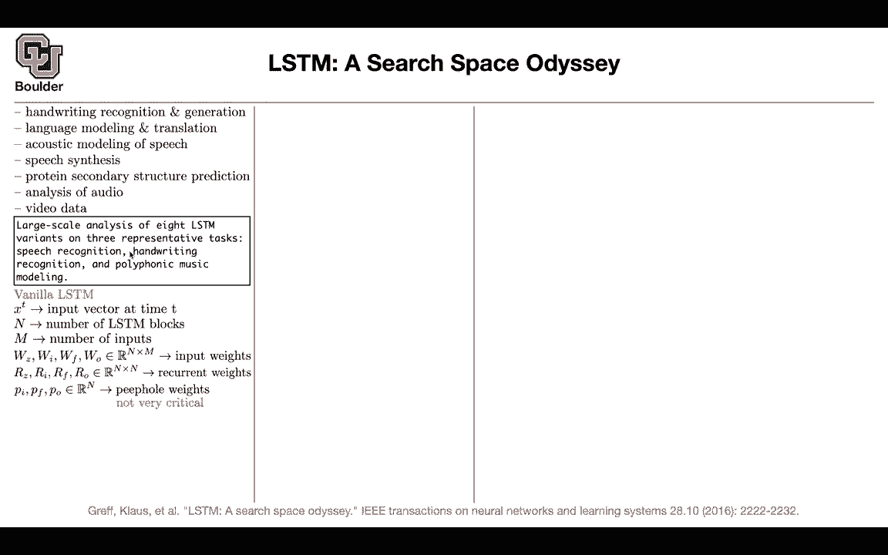
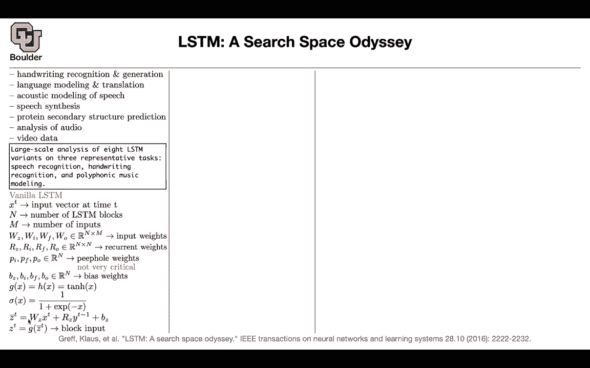

# P167：L75.2- 长短时记忆 - ShowMeAI - BV1Dg411F71G

Let's move on， I promised that I'm going to give you a detailed study of LSDMs when we go to speech and now I'm holding the promise this is a systematic study of LSDMs because at that time there were a lot of different versions of LSDNs we saw only one the one that was the consensus but there were a lot of versions and people wanted to compare them together we know that LSDMs have applications for handwriting recognitions and generations it has applications for language modeling and translation we saw that we saw applications in acoustic modeling speech synthesis which was the previous paper it can have applications in any other data that has sequential nature like protein secondary structure prediction for audio and video care they're useful or at least they used to be useful。

This paper is going to do a large scale analysis of eight different major variants of LSTNs on three representative tasks one of them is speech recognition the other one is handwriting recognition and the other one is polyphonic music modeling let's remember the type of LSDNs that we are using so far you have your input vector at time T this is the size of your LSTN blocks。

 these are the hidden size the hidden size is n and let's say M is the vector size for x so this is your input size then you're gonna to have a bunch of weights。

 ZFO and they're going to have the correct size so if they're going to take you from your input size which is n to your hidden size which is n and then you' are going to have some transition weights or recurrent weights that are n by n these are operating on your hidden space。

You're going to have some peopleholes previously these were the diagonal matrices。

 you can think of them as vectors and the name is people weight after the analysis is done after this large scale analysis in this paper。

 it's going to be shown that this is actually not very critical， you can remove them， the biases。

We are gonna to have two functions our activation function is1 h。

 we are gonna to have sigmoid for our gates， this is gonna be the input at time t you take XD。

 you take Yt minus1 whatever that is already output it and then it's going to give you z bar and then you can activate it by G push it through an a linearity for your input gate this is gonna to be a formula。

 you're gonna push it through a sigmoid to make that from0 to1 you're going have a for gate and then you're going to create your memory cell。

 your inputting some portions of yourzt then new information that just arrive and Ct minus1 is the previous memory and this is how much of it you're forgetting or actually how much of it you're keeping and for the output gate we are going to push it through a sigmoid and then you're going to output your it's the output of your block there is an H youre activate。

Going on and you're going to multiply by the output okay after these analysis is done。

 we said that peoplehole weights are not going to be very critical this for get gate is very critical you cannot get rid of it it's very important and this age function here the activation and the memory still is also very important you cannot get rid of it if you get rid of it your performance is going to drop but whether the eight variance。

 what could happen you could have no input gate just set IT to be one so just set this value to be one。

No forge gate， you're setting the4ge gate to be one basically you're remembering everything from the past。

 no output gate， you're setting OT to be1 no input activation function basically don't push your linear operations through a nonlinearity this H here no output activation function if you couple your input and forge gate basically set your FT to be1 minus IT FT to be1 minus I and this is exactly the GRU setup up gated recurrent units no people just get rid of your peoples just get rid of be set on to be zero。

Or another alternative this is very expensive is to not only condition on XT the output of your the previous unit recurrent unit the memory cell the bias and these IT that you just computed the input gate for get gate and then the output gate and then you are doing the same thing for all of these this is the full gate recurrence so your recurrence not only depends on Xt and y t minus1 is going to depend on everything else as well okay perfect so let's see the studies so you're gonna run a lot of experiments comparing these setups what are those experiments you're gonna three types of data timid is for speech recognition I am online is for handwriting recognition and JSP corea for polyfic music modeling let's try to see what's happening you are doing 200 trials per each。

These models per each of these datasets so it's a lot of trials and each one is going to take some time to converge on your GPUs so it's a lot of trials that you're doing it's going be two times three 200 times three times eight it's a lot of trials and now let's look at the statistics the performance the ones that you see on top is that you are gonna to keep all of the trials even the ones that didn't converge or the ones that converge etc on the bottom figure you' are keeping only the 10% most performance ones and how do you check your performance you're going to check it on the validation data so these are the best 10 models。

 the best 10% models these are all of the models that you trained and now we are looking at the test performance these are the results for the test performance。

What are these boxes， these boxes that you see here。

 these are the 25th and 75th percentile of the performances of all of your models。

 these whiskrs here are the ranges of your data are the ranges of your classification performance for instance。

 from all of those models， the red dot here is the mean and the dash line is the medium。

These thick blue boxes， they mean that these are significantly the performance。

 these numbers that you see significantly different from the baseline and the baseline is this V here。

 the Vana Esian。So these are significantly different so it means that these numbers are significant these gray histograms that you see they are the average number of parameters for instance this guy here has a lot of parameters FGR and you can see it has a lot of parameters okay so far so good and after this analysis you're going to see that FT is critical you cannot get rid of it FT was NFG and NFGs here and this is significantly worse than the performance that you're going to get rid of vanilla the performance of this coupled input and4 decades gate this is for GRs。

This is CFG is very similar to LSDNs and we saw it in multiple other papers that there is no significant difference between LSDMs and GRUs and they also have relatively the same number of parameters maybe the best performing ones have a little bit less parameters but and then this age H correspond to noOAF let's look at it let's find it here this guy here and you can see that this is very critical your performance is going to drop significantly and these are in terms of error rates so the lower is better。

Not only you see it on teammate you are going to see it on other dataset sets as well and these are your dataset sets teammate is for framewise classification you are classifying your audio as 61 phonemes or phones I am online line is the handwriting database What is your data like you're going have4D vector that is evolving in time these are delta X and delta Y these are the change in the pen position T is the time since the beginning of the stroke so you are putting your pen on a paper and then this is the beginning of the stroke and then the fourth dimension is just an indicator telling us when you lifted your pen so that's how the data is constructed and JSB coral is a collection of 3824 part harmonized corals by Any questions How is it that the number of parameters is different from the top row to the bottom row is each of these one？

Each of these 200 trials like a different different architecture。

 different number of hidden mis or something like that Yes so the other thing there are a lot of experiments that are going on what should be the size of your LSDM unit what should be the a lot of experimentation how deep should it be should you stack them should you not stack them got it and then the other ones are different initializations I mean these are random initialization so they're going to give you different results so you do a lot of trials you keep all of them on the first row of this figure and then you keep only 10% of the best ones here for comparison thank you yeah sure any other questions so now you know what is important in an LSDM and now you know why we were sticking to this setup when we were doing languages when？

We were doing video when we were doing speech。Why this setup why only two variants survive。

 which was GRU and the Van Eestian and we know that this activation here is crucial this for gate is crucial and the peoplehole you can actually get rid of them they are not that important Okay perfect that's the story of LsdNs。

