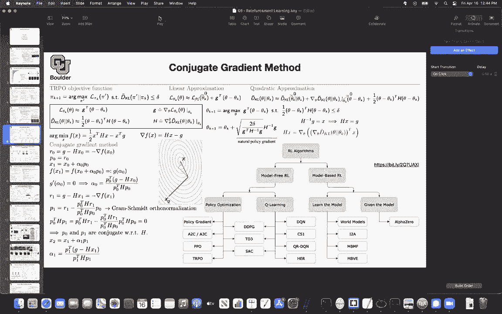
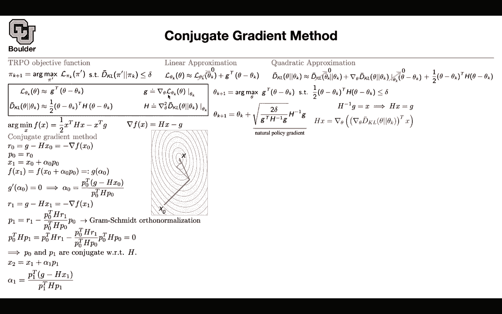

# P179：L80.1- 共轭梯度法 - ShowMeAI - BV1Dg411F71G

Let's get it started， so it's a while now that we are doing reinforcement learning just to get an idea of the big picture of what we are doing。

 we started with Q learning and in particular deep Q learning which was based on the Bellman equation and then it would turn a simple actually a reinforcement learning problem into a simple regression problem using the Bellllman equation。

And then we continued with deep Q learning。 That was another algorithm。

 And the cool thing about deep Q learning is that you can have experience replay so you can build a data set and。

😊，Keep adding to that dataset on the fly and that's why they are more sample efficient but then we said can we use the same beman equation type of ideas and apply them to continuous control here we needed to seek help from a deterterministic policy and it was very similar to an adversarial framework where the Q function was helping us train mu and the mu function was helping us train Q back and forth the same way that a discriminator is going to help generator generate images and the other way around so it's going to be an iterative process going back and forth between those two neural networks so we have two neural networks and in that sense they are similar to adversarial type of training and then we moved more away from the Q learning and we moved towards policy optimization last session and the last session。

We covered this paper， we covered this topic and then one of you asked me about if I can go into more details of the linear approximation to the objective and the quadratic approximation to the constraint of a trans region policy optimization algorithm and I guess it's actually a good idea to do so so let's try to do that before we continue and let's cover conjugate gradient method and why do we need it so let's remember and let's recall our TrRPO objective function which is you are trying to maximize with respect to a policy of an objective function and this objective function is basically a local approximation to the expected cost of policy pi prime what you are writing it in terms of its advantage overtaking policy by K but then there is another additional。

Constraint in TrRPO and the constraint is that the policies that you're looking for。

 you want them to be in the neighborhood of the old policy。 So you start with an old policy。

 you have an objective function that you want to maximize but you don't want to deviate too much from the policy that you are currently at the one that you just found So what we are going to do。

 we are going to use Tayloror expansion Taylor series expansion to the first order for this objective here。

 the parameters of pi prime， let's call them theta the parameters of pi K are theta K。

 So you're optimizing over the parameters of pi prime， which are your theta。

 So you can rewrite or reformulate your objective in terms of the parameters in the parameter space and then you can do a local lab linear and this is basically a Tayloror series expansion。

 This is the derivative of L with respect to the parameters of。

Theta evaluated at theta K so that's what your G is and this term is just zero because the advantage of a policy over itself is zero。

 so that term is going to drop and then you're going to do a quadratic a approximationation to your kl divergence term This is going to be quadratic again Taylor there is expansion these term here is zero the kl divergence of a distribution and itself is zero。

 So there is not much distance between the two and then this other term is a little bit more it's not that intuitive why this should be0。

 but as you write down the definition of kl divergence the first derivative of the kl divergence evaluated that theta k is going to end up being zero as well so that one I'm going to leave on as as an exercise so these two terms are zero and here you're going to get the hatian linear quadratic axiation linear to the objective and quadratic to the constraint。

So far so good Now let's rewrite stuff。 this term here。

 we are just going approximate what that linear term that we just found。

 the kl divergence is this other term that we came up it up there G is the gradient of your loss evaluated that theta K and remember you're optimizing over theta all of these terms are known G is known theta k is known H is known and H is just the hesian So you are taking the derivative twice Okay so far so good Now let's rewrite this objective in terms of thetas and using this approximation that's what you're going to get you are trying to find theta K plus theta k plus1 but solving this optimization problem is not that hard you can actually write down your courageish contacter conditions basically multiply this by a lambda with it inside your write down your laggrian take your derivatives with respect to theta and then。

Find theta K plus1 so that one is at all is not at all hard it's a convex optimization problem and then that's going to give you this solution you're going to get the inverse of H times your gradient and then you're taking a step in that direction so it is very similar to stochastic gradient descent or gradient is the type of algorithms but now youre taking your steps in a direction that depends on your hesian so this is second order it depends on second order derivatives so the gradient is going come in the hesian is going come in and this is going to be your learn and grade which is actually you can find it analytically because the problem is very simple okay that's going to give you theta K plus one but you have a problem you don't want to compute H let alone finding its inverse why don't you want to compute H because these are parameters and in your parameter space these are high。

Dimmensional stuff you have a lot of parameters， orders of millions or trillions。

 if you only if you have a function that is taking you from your high dimensional space。

 which is the space of your parameters to the real numbers it's okay you can find the gradient very efficiently you can do back propagation but then if your function like the gradient itself that is taking you from a high dimensional space to another high dimensional space then you need to run a for loop on all of your parameters to give you the hesia so you don't want to do that you don't want to construct this matrix and at the same time。

 this matrix， even if you construct it it's going to be the size of your parameters and inverting that is a nightmare and you don't want to do that as well so what's the trick you're gonna call h inverse G to be some x So h inverse G is some X and then all you need to do is solve a linear system and find X now you can try to e。

u8 hx and that's going to be efficient Y because you can first compute your gradients and finding gradient is efficient。

 This is gonna to give you a vector and you take that vector transpose it multiply it by your x this is going to give you a scalar now taking the derivative of a scalar valued function is again easy you can do back propagation so you can make this guy really efficient Comput the forward fashion and all you need to do is the forward pass Why is that this is where the conjugate gradient method is going come rather than solving this system Hx being equal to G。

 you can write down an n minimization problem So the solution to this minimization problem is going be the exact solution to this linear system and actually you can see that if you take the derivative and try to set it to zero。

 that's exactly that equation up there hx minus。I your residual so the gradient of f is your residual and at the optimum value the gradient has to be0。

 so that's why solving this problem is equivalent to solving that problem and now you can do optimization trying to find X One option that you have is gradient decentscent or another option is can't you get gradient which is going to be faster。

 it's going to converge in the deiterations that it's going to take to converge is's going to be the size of this h maximum let's see if you are supposed to do gradient descent what would you do you would compute a gradient of this function at some initial guess for your solution and actually that's exactly your residual So it's going to be G minus H of x0 and then if you are supposed to do gradient descent you would set p0 to be r0 and I'm going to tell you why you need a new variable Yes they are equal now but they're going to become unequal when。

To the next step and then you can take a gradient， you can take a step in the direction of your r0 or p0。

 The cool thing is that you can actually find alpha0 analytically because the problem is simple how you take your x1 you plug it inside your function and then that's going give you a new function in terms of alpha 0 now you take a derivative of this new function set it to0 and that's going to give you a step size and this is because the problem is simple it's quitedra you can find your alpha0。

 you plug it here and then you can do a step in the direction of your gradient or in the opposite of the in the opposite direction of your gradient but then in the next step again you're gonna to take your x1 you're going to take a derivative of your function evaluated it at x1 that's going to give you a direction and if you are doing gradient decentscent。

 you would just descendscent in that direction but it turns out that you can act。

marter we can create p1 that is orthogonal to p0 and the way that youre going to find it is using Grmish mean so you're now orthogonalizing r0 and r1 and that's going to give you p1 and p0 p0 is the same as r0 but p1 is going to change it's a smarter direction to step into。

Why are they orthogonal just to see it intuitively let's take p0 transpose h and multiply it by this equation on top so it's going to be p0 transpose H R1 that's this term here you're just copying and pasting and then p0 transpose Hp0 this term is going cancel with that term this term is going to cancel that term and that's going to become0 so they are orthogonal and theyre actually they are called conjugate with respect to H and this is where the name is coming in it's coming from the p0 and p1 being conjugate so that's your next step or the next direction and then you take a step in that direction the direction of p1 the cool thing is that you can actually find alpha1 your step size this is the optimal step size and then you keep repeating this pattern then you go and compute your p2 which has to be orthogonal to both p0 and p1 and that we know how to do gramish myth orthogon。

izationSo you just subtractrack some other terms visually speaking if you are doing gradient decentscent。

 this would happen it would take your algorithm1，2，3，4。

5 steps to converge if you do con't you get gradient method it's going to take two steps to converge because our H in this space is two dimensional so it's going to take you a maximum of two steps there is a theorem that's going to prove that Okay now we know what we are doing linear approximation approximation Qua approximation approximation and can't you get gradient is everything clear we say we know if we're doing a hessian matrix because it's computationally expensive or yes so how do we do this if we can evaluate H so we can evaluate our residual So H we are you are not computing H at all So youre not computing your Haian what you're doing is evaluating it on a vector。

We can get the action of Hs of Hx we can't get we don't have to write down H by itself Yes so you don't have to write down H by itself you just know it's action on a vector。

Got it thank you and that's because you don't want to write a for loop on the output of something high dimensionional of a function that is high dimensional in the output space basically that's one of the reasons actually the main reason that people have to stick to first order optimization schemes like gradient gradient descent is because you cannot compute Hasian but this is a smart way of actually finding its value finding its action sorry sorry yess go ahead it seems like the a momentum methods or like the the other volume type methods try to maybe emulate this behavior that conjugate gradient Yes pause but you never compute your Hasian your second order derivativetic。

Because it's computationally expensive， it's unlike the first order derivatives。

 that's why you usually write down a last function which takes you from a high dimensional space to one dimension output space scalar valued functions。

 we are really without taking their derivatives okay， any other questions。

