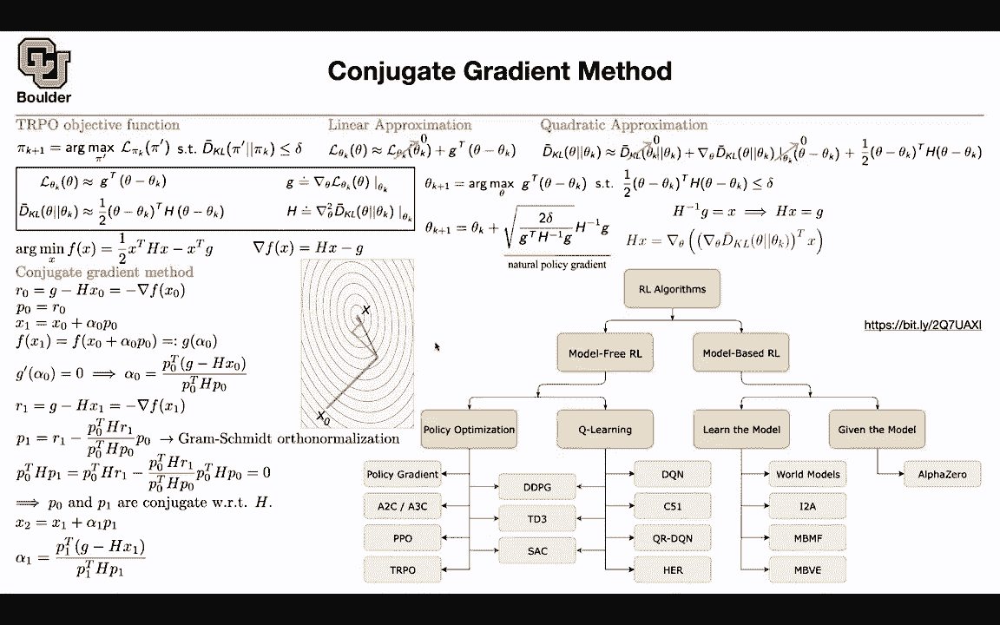
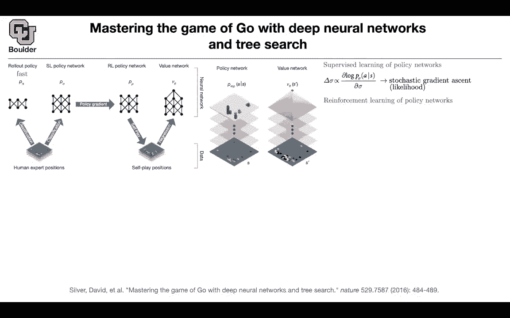
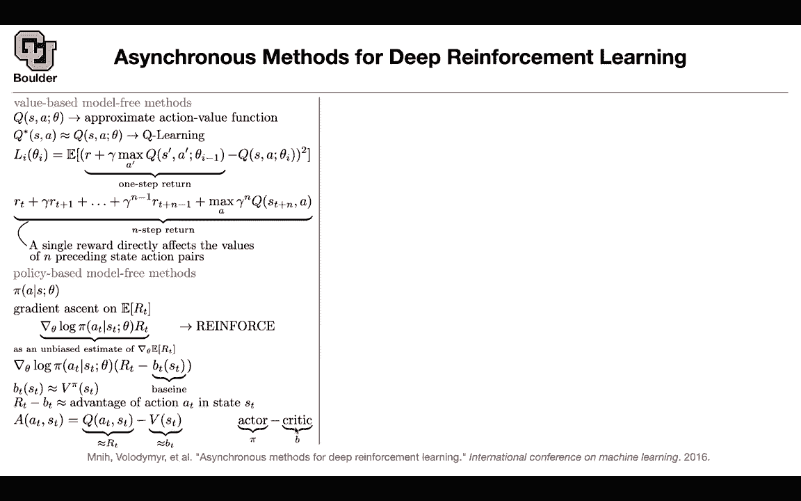
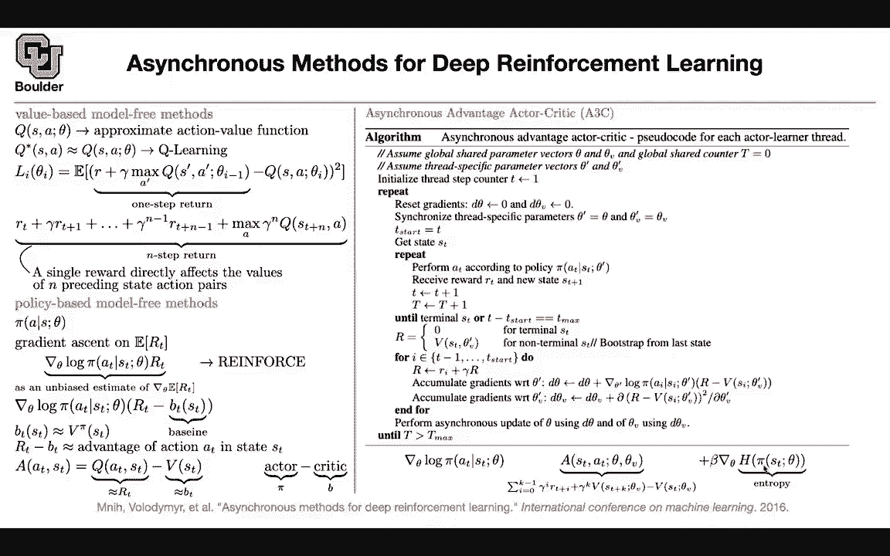

# P181：L80.3- A3C算法 - ShowMeAI - BV1Dg411F71G

Let's move on this paper recovered so I'm not going go into the details anymore。

 but this is an overview of what we covered last session and this was the policy gradient so you were doing reinforce let's move to asynchronous methods for deep reinforcement learning what is the idea you are still going to do policy gradient but the idea here is rather than having a single agent interacting with the environment waiting for it to die or win the game or lose the game we are going spawn multiple agents to interact with the environment in paril and then opt over a shared set of policy let's see a quick recap of we just saw you can have value-based model free methods or policy-based model free methods for valuebased model free you have a Q function that you are approximating by。

network that's going to be called Q learning or deep Q learning we use the beman equation to turn a reinforcement learning problem into a supervised learning problem The whole objective is learning this queue and then we had one step return into the future and this is coming from the beman equation but we saw an example last session that the reward could be very sparse actually you can get your reward at the end of the game so you have to wait for a long time before you see any rewards you can expand on these formula and this one step return and make it multistep or N step return Why is it helpful Because if you receive a reward it's having an effect on N preceding state action pairs so every single reward that you receive is going to correspond to multiple state action pairs so it's giving you more feedback that's one modification for policy base。

free methods， you model your policy， you say that I'm going to put a neural network on my policy and then your objective function is no more coming from the beman equation it's coming from maximizing your expected reward or minimizing your expected cost expected future cost or future reward a simple version was reinforce algorithm and basically what you're doing is coming up with an estimate of the gradient of your objective but then because this expectation is we respect your policy you have to do that trick that the derivative of a function is the function itself times the derivative of the log of the function and this is where the log is coming in and the expected value you' are dropping it because you are doing Monte cargo so this is an unbiased estimate of your gradient but then we said this has a high variance to reduce the variance you're going to subtract a baseline how good is your return compared to a baseline this is still。

Go be an unbiased estimate of the gradient of your objective。

 but it has less variance compared to using Rt only for the baseline。

 it could be any function that doesn't depend on your actions。

 so you can put any function here that doesn't depend on your actions It can depend on state but it shouldn't depend on your actions So for instance you can use your value and this term here has a a。

 It's called advantage of action A in a state S compared to the average actions So that's your advantage The return we know that you can approximate it by your Q network and this is the actual definition of the advantage that we saw last time and v is just your Bt。

 The framework that we are going to cover today is called actor critic So you have an actor which is based on your policy So you're going to act based on your policy and then your B or your value is going。

ize those actions The idea was that you can spawn multiple actors in your environment and let them interact in parallel with your environment and let them asynchronously update their policy actually a shared policy so you're going to have a global shared set of parameters Theta theta v Theta your or for your actor。

 your policy theta v or your for your value and then you don't want to go forever you want your algorithm to stop at some point and let's say a t maxax so you're going to set capital T to be a counter and then you start from zero and then you're going to have each thread on your computer is going to be an actor it's going to be an agent and each one they're going to have their own parameters for their policy and for their value and then each one of those thread is going to have their own respective step counter they're going。

Laving your environment for a while and then die or win or lose and collect rewards or get punished so they're going to learn on their own initially you set their gradient to be zero they are going to inherit from the shared policy and the shared value so you're just going to inherit some parameters from your the global environment and initially t is1 so t start is going to be one。

 you get the state at the start and then you're going to leaving that environment for a while you're going to take actions based on this policy you're going to receive rewards go to the next step and then increase your counter either you are in the terminate terminal state or you have been living in that environment for too long and then we are going to kill you kill that threat If it is a terminal state。

 there is nothing going to happen in the future nor rewards not nothing so that's going to be a return of zero。

Otherwise， this is where you're going to call your value to have an estimate for the type of rewards that you're going to collect if you were to follow this policy so that's just an estimate for what's going to happen in the future if this is a nonterminal state and then you're going go backwards this might be a little bit confusing but this is exactly the math that you see here so what you're computing is this guy this term here but you're computing it backward your first compute R and then youre multiplied by a gamma and then add the previous guy and then you keep iterating and you go backward you compute this term backward the next step this guy is going to become gamma squared gamma R I plus R minus1 and then you compute your R you're going to use R in two fashions this is your labels you're going to use them to update your value which is very similar to what you're doing here。

Your loss function and you're doing minus squared error so that your minus squared error and then the other guy is coming from this term here the reinforce algorithm it's going to be R minus the baseline the gradient of your log of the policy each one is going to do their own job as soon as the reeration is done they're going to update the shared parameters asynchously and then either move the next step or die or something is going to happen to them to that threat so in you're learning in power and collecting a lot of data a little bit more details about this R what you're writing here is basically nothing but the advantage and the advantage you're computing it by V of ST which is this term here and that R is going to end up being the summation of your returns plus an estimate of the future which is coming from the future what's going to happen if you don't actually simulate。

St what's going to happen in the future That's this term you can actually add another entropy term for your agent to explore more and this is just the policy the policy is going to be conditioned on this state and it's going to give you a probability distribution on your actions and then you want your actions to be as diverse as possible So what i'm going to ask you to do as homework is watch these three videos to actually see what type of problems you are solving using this framework Okay any questions。

