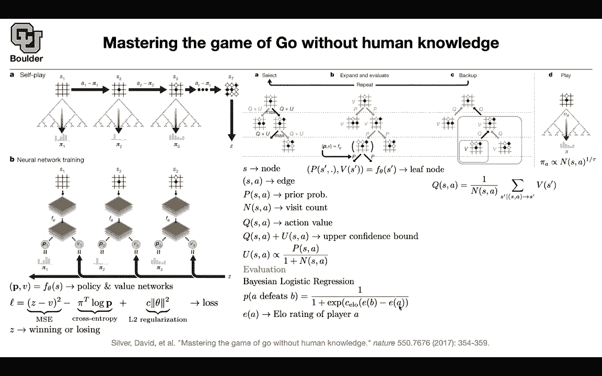
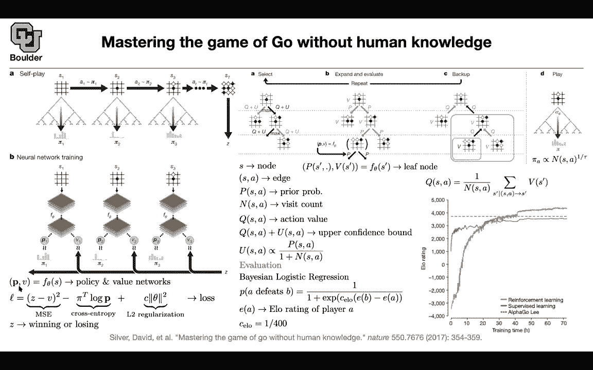

# P186：L82.1- AlphaGo Zero - ShowMeAI - BV1Dg411F71G

We can start， but before we continue to the next topic I want you guys to remember this equality because we are going to use that in the next paper so the idea here is that you can actually supervise your neuraln network or your policy and we can use that that observation to try to solve the game of go without human intervention so without any any type of imitation learning only through selfplay but what is the observation and why are we able to do this so we covered this we went through a paper that was trying to learn and solve the game of go but that paper was using human intervention。

So it was first learning to mimic the behavior of the human and then it would do some transfer learning and then the next step was selfplay and through selfplay and the algorithm which was a policy which was a policy optimization algorithm we were updating the parameters of that neural network we were learning our policy but what was data at that time through selfplay you would do some selfplay Monte Carlo research and then in the end the only data that you would keep was Z did you win the game did you lose the game and we were using this feedback to reinforce whatever that we learned so the actions that gave us higher probability of winning we were reinforcing them and the ones that were leading to us losing the game and we were down weighting those types of actions so the only data that you were using was Z。

So the observation of this paper is that you can actually use whatever computations that you make throughout the game and keep them and then use that to supervise your policy and we're going to see how so there is going to be not only you're going to use Z you're going to use pi1 pi2 pi3 and I'm going to tell you what those are but as soon as you know them the rest of it is you have a neural network that is taking your state as an input and it's outputting probabilities over actions and a value。

 a value of this estate which is an approximation for how likely you are to win the game if you are in this state so your Z you can use it to supervise these value and these pis that I just mentioned that you are coming up with them through selfplay they're going to help you supervise your P so pi is going to supervise P。

Z is going give you information on Vs your values So let's see you have a single neural network with multiple outputs that these where your neural network is that takes as input the state the image of the board it's parameterized and it's giving you a value function it's a scalar valued function and this one is vector valued so p is a function of S v is a function of s your state and you want to learn this and as I mentioned you're going to use z to supervise your v's through a mean squared error and then you're going to do a cross entropy loss for these distribution and the other distribution over actions and then you regularize your neural network through way dK or L2 regularization so the loss is very simple the only thing that we don't know is how do you come up with these pis and we know that Z you're going to use it for super to supervise V we play the game and then。

we either lost or won the game and then z is either a plus one or a negative one when it comes to the game of go。

But what are these pis and how do we come up with them it's exactly the same as before So this we covered it's our Montecolo tree search and it has three steps selection expansion and evaluation and then back up and thenre repeating that process and then this play is going give us the pis so I'm going to tell you what that is S is your note in that tree pairs of S and a or your edges state an action and for each edge you're going to keep track of these values you're going to keep track of the prior probability which I guess you know it's going to come from our neural network the prior is going to come from our neural network so we're going to see that there is some visitation count you keep the count of how many times while you are thinking you visit it where you consider this route or you consider this edge you're gonna to have an action value and I'm going to tell you what that is。

We want our agent to balance the tradeoff between exploitation。

 basically maximizing its action values and exploration and your exploration you're going encourage exploration through the visitation count the more you visit an edge。

 the higher this term is going to be and the lower your U is going to be so you're less encouraging those types of actions but the lower end the higher is going to be U and therefore you're going to explore more Now what is this next step How do you come up with your prior This is where you're going to evaluate your neuron network at this leaf node so you're currently at this state and then you want to know what is the benefit of going left。

 what is the benefit of going right and that's going to give you that one you're going to be able to read it from your neural network because your neuraln network is going to give you a vector this is the first entry of your。

vector the second entry or if you have multiple options。

 you're going to have more than two options here and then you also put your value here。

 you're going to put the value of this state， the prediction from your neural network over there on your nodes so on your edges you are putting your prior and on your nodes you're using your value network okay so far so good we know what is P we know what is U what is Q So let's say you're now at this state and let's call that state prime and neural network is going to give us a v of S prime and then any other edge that led to this state like this edge and the other edge we are going to increase their value by the value of this node So this notation here means all of S primes such that S and a is going to lead to S prime so you're going to take that S prime and add add its value to all of these Qs。

For all of those edges and the other ones are going to remain the same so they're not going to change that's our Q which youre going to use to do your multicollar research but in the end what is this over here when you want to play it when you want to play the game this are all for thinking and let's say you have a budget of I don't know10 minutes or one minute to think so you're considering all of your options and you're visiting your edges your visitation count is actually going to be able to give you your labels because you're going to take your actions based on the visitation count but if you power it to the power one that's going be the exact visitation counts but because you want to encourage a little bit of exploration you try to smooth out that distribution by a temperature so these visitation counts are going to give you a probability distribution this is unnormalized that's why this is relative in size to the number of visitations。

Now we are good to go These pies are going give you the labels that you need to train your neural network and your Z you play your game to the end and you either win or lose and that's going to give you your Z that you can use to supervise B and the rest of it is very simple It's just a gradient and decent okay in terms of evaluation how do you know how do you score your player and how do you score them against human This is a Bayesian framework it's Bayian logistic regression you're gonna to model the probability of player A defeating player B by this is sort of like a logistic function this is basically your sigmoid function E of a is the elo rating of player A So that's a scalar that you're associating to player A this is another scalar and another number that you're associating to player B C eo is a constant one over 400 and then your task is to estimate this to。

Given data on the number of times that A defeated B B defeated A A defeated C， etc。

 you're going to be able to come up with this scores and that's exactly what you're going to track the supervised learning approach is's going to get you somewherember by mimicking the behavior of a human iss going to get you to slightly below the e score of 4000 Alpha go Li is the previous paper which was a combination of supervised learning and reinforcement learning and this new method the more you let train is going to be able to surpass both of those methods Any questions So the state counts or the M which is visiting the visitation count Are we allowing for or like in these tree diagrams they're not necessarily going to be trees can get to the same state through multiple ways like a game started off in two different ways and ended up at a certain state Yes but you're going there is。

Sequential nature cure game so it might be the same state which I'm not sure that's going to happen but even if you do you're going to treat them as different Okay so you would to the same state and then when you when you do this backup stage it would affect both of the paths that led you to that current boards day exactly yes what you're saying is that at this node and maybe another note down here the board looks the same but then you're going to use the same backup to evaluate both of them any other questions so the difference to the previous paper is that previously we were throwing away these useful information that we were collecting while playing the game these are the visitation counts so the idea if this paper is don't throw them away you can actually use them to supervise your policy and we saw a similar idea in the previous paper where we were actually supervising our policy so there are two。

To solve the same problem one was Monc research and the other one is your policy and they can help each other one of them is helping you come up with these prior probabilities。

 so your neural network is helping you expand your tree expand your tree and then you're helping your neural network back by these visitation counts。

Okay， so the my question， I guess， was the it seems like there's going to be。

s say the board is 30 by 30 so that's 900 different states。

 but isn't a state considering all of like the binary options for each of those locations either having a red or a white or a black it seems like this like this P the policy has to be gigantic to consider all the possible states of the board and then all the possible options for all the possible states of the board Yes。

 but the way that you're going treat that the way that you're going to encode your state is going you're going to treat it as an image and you're going to push it through a convolution and we have no problem with high dimensionional stuff when it comes to images okay smart yeah that was a good question and it matters how you model your state we're going to treat that as an image and push it through and neural network a bunch of convolutions any other questions Okay perfect。

