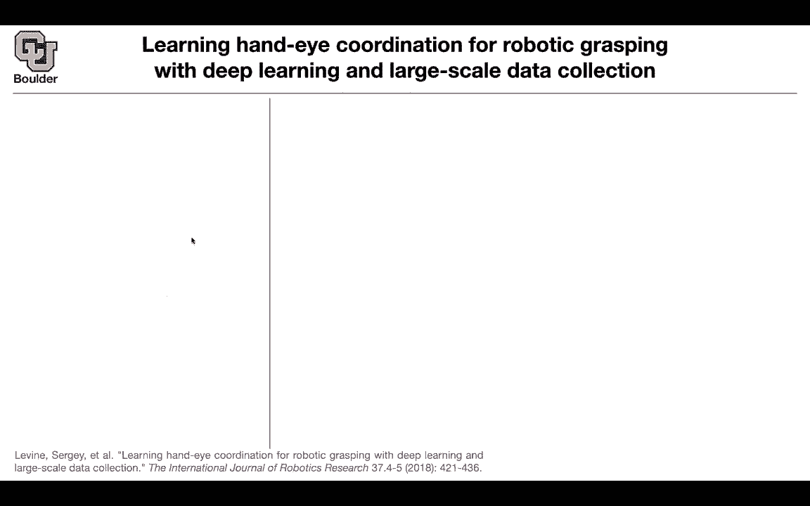
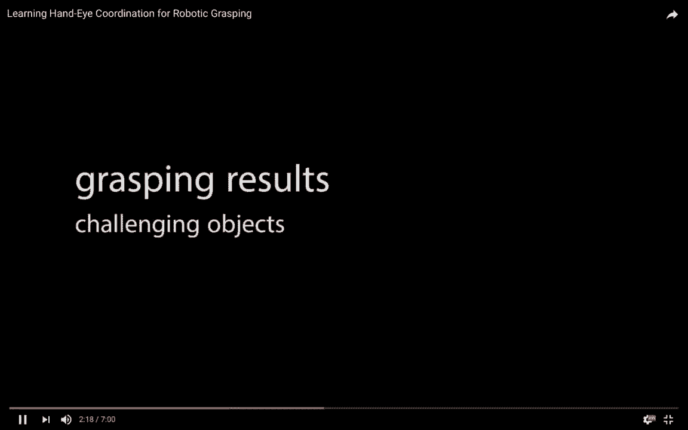
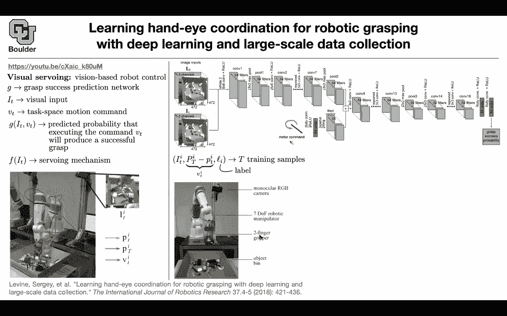

# P190：L83.2- Visual Serving - ShowMeAI - BV1Dg411F71G

So now let's make things more realistic and go outside of the simulated environments and games to actual robots so what you're going to do is go in the real environment of your robots you're going to have 14 robots at any given time and they're collecting 8000 grasps so or grasp attempts。

 sometimes they are successful， sometimes they fail and these are based on non deep learning policy so they're just trying and failing and sometimes succeeding it's not totally random it's based on a policy but that policy is not deep learning and they're going to keep collecting stuff so these are the attempts sometimes they are successful sometimes they fail but they're doing it in real environment they're collecting data and then when it comes to testing this is the task you pick up an item you put it in the box next to it you pick another item。

You keep doing that and you keep counting the number of successes and sometimes these is still gonna fail but you can see that this is getting feedback from the environment and this is another type of a policy。

 this is open loop so it's not getting any feedback from the environment So it's not adapting itself based on the visual observations then some cool things happen。

 for instance， complicated objects， it's gonna to think about it。

 find the correct location grab it and then small objects。

 small objects around it So these are complicated and you can see that it's adjusting itself Even when you have an object in the hand of some person。

 some complex object， thinking about it， how to grab this in an effective way。

 etc and you can watch the rest of the video on yourself What are we doing what is the task it is visual servoing So it is visionbased robot control the data that you are collecting where on this function the grasp success。

Prediction network so you have a neural network that is predicting how successful is going to be that graph you can think of this as your Q function as your state value。

 These are your observations， the visual inputs and you have some task space motion commands so these are the commands that are going to get translated into move from this point in the space to the other point in the space and then you have this G which is the predicted probability that if you execute this command your grasp is going to be successful that's your G but in the end what you want is a policy so you want your server mechanism given an observation take an action and when I mention it's going to move it it's going to move from one space to the other space from one point in the space to the other point in the space this is the final point actually so you' are not going from time T to time t plus one you're going go from time T to the final time。

Say how likely is it that I'm going to succeed there is a camera being mounted here that's what the robot is seeing the environment is very cluttered。

 there's a lot of stuff in that box and then it's moving it's R and trying to attempt grasping and V is in direct relationship with this V here this is in terms of torques and forces etc。

 but this V is I guess easier for us to understand this is the vector that is going to help you move from dislocation this space to the next point。

Where it's going to be the neural network your neuraln network is going to take your input the input image so this image red green blue at this time at the same time it needed to know where it started so I zero is going to help it a lot the initial location at the initial time you cancatenate stuff you do a bunch of convolutions here are where the motor commands are going to come in you tie them so that they have the same dimension as what is coming out of your convolutions you add them up you do a couple of more convolutions fully connected fully connected and then a probability comes out so it's a single number how successful am I going to be if I make this move given this state if I make this move how successful am I going be and then you just train it and the data that you just saw how we collect okay they keep collecting data that your image that's the adjustment that you need to。

Whi you can translate it into motor commands， So it's not a big deal and then you have some labels。

 successful full attempt， unsuccessful attempt， successful unsuccess。

 and then you train this basically a training your G that's where your neural network is So that supervised learning There is nothing special about it It's just a lot of data being collected in the physical world but you are interested in this F。

 you servoying mechanism and then the setup is you have some red green blue camera mounted up there。

 you have seven degrees of freedom， you have two finger griper down here and then you have your object being for this servoying mechanism we know that you can get your policy by maximizing your value and that's exactly what is gonna happen here As soon as you maximize you find V star that's gonna to give you F somebody gives you an image you have your pretrained network G and from G you want to compute your。

And it boils down to finding VS star the optimal value for maximizing G and you're going to use you don't want to do gradient descent because that's going to be slow。

 you want something faster to optim G and then you're going to use CM What is that that cross entropy method for optimizing it's gradient free。

 how does it proceed， it's very simple the algorithm， it's an optimization algorithm gradient free。

 you sample 64 vectors from a normal distribution and these are v's that you're sampling。

 you look at the corresponding Gs， so basically you take V here。

 you know the corresponding image you push it through your neural network。

 you read off your G and then you choose the best ones。

 the top six values So the top six vectors that gave you the best values and then you feed a Gaussian to these M vectors a Gaussian distribution Basically you're adjusting your mean and variance so。

Your mean andvaris are no more0 and1。 theyre going to be adjusted based on these data and then you sample 64 from this Gaussian that you just fitted and then you keep repeating that a couple of times and then you report the best one So you're optimizing your G but it's not game over yet How do you come up with F you compare it you compare this v star with doing no action so just staying still and don't moving you compare that and then that's going to give you a baseline so this is your baseline and you're comparing this action to the baseline if that action is going give you a high probability of success it means that if no motion is giving you a high probability of success already just don't do anything close your gripper and pick up your item So you're comparing it to doing nothing if doing nothing is not at all beneficial you just reset your environment。

 What do you do you take this。You put it in the initial location and then you move。

 you execute your action Otherwise if none of those happens。

 you just execute your action the cool thing is that the collected data and this robot and the same servoying mechanism that you come up with here is gonna to generalize to new robots and new types of camera being mounted and then the robot arm being totally different etc So it's a very simple framework you just do supervised learning you learn your G and then you optimize your G to find V star and then that's going to give you your servoing mechanism that's going to give you your policy Any questions So there's no adaptation of the value network G No that one is trained once and for all but the adaptation and you saw the hand was adjusting itself it was getting feedback it's because of this if else statement。

So if the chances of just closing the griper and then picking up the item is very low it's going to adjust itself so it's going to keep getting feedback from the environment yeah so is it looks like there isn't this walks with different robots for a fixed G is mostly because of that threshold that G must be really bit certain that it's going to walk because of this if else's statement yes so this is really smart what it's happening here yeah and the other cool thing is that you are not required to adjust your cameras usually the locations of these cameras they have to be。

AtTed they have to be in the correct location you need to know the exact coordinates for your camera for your arm for wear and tear because as they were collecting data this is a physical environment so theres going to be a lot of wear and tear going on on the fingertips so the method is robust to those perturbations so yeah it's one thing to work with simulated data it's another thing to work with real data and this data is actually available you can play around with it if you want。

