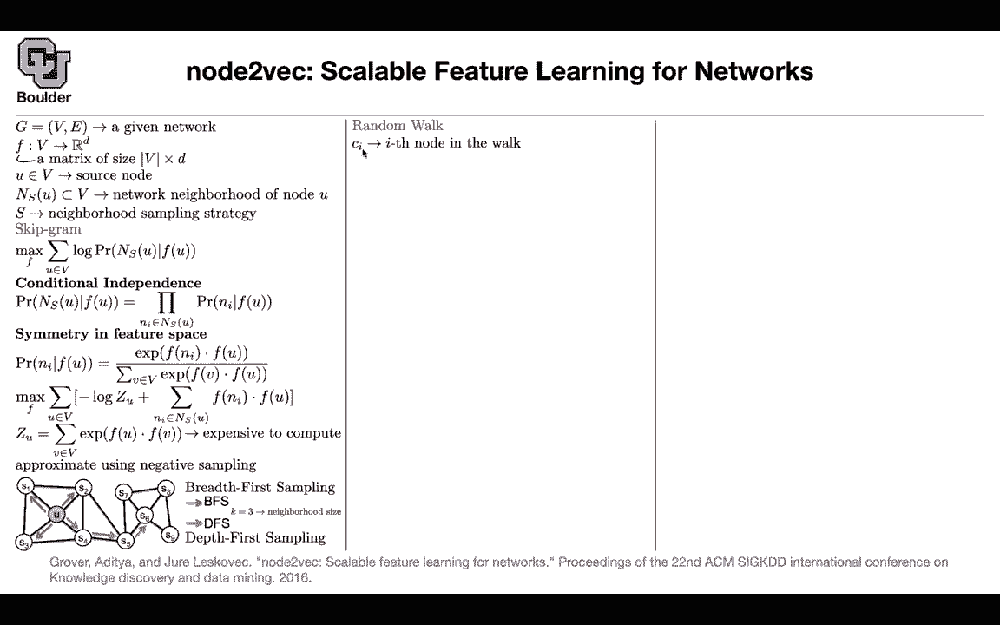

# P194：L84.3- Node2Vec介绍 - ShowMeAI - BV1Dg411F71G

The third one is also very similar， you want to turn your nodes to vectors。

 somebody gives you a graph， you want to come up with your matrix， you have your source node。

 and there is a neighborhood around that node based on your edges。

And based on your sampling a strategy， so this paper is all about the random block or sampling a strategy Yes we know about the skipgram model。

 the skipgram model is going to model the probability of this neighborhood the neighborhood of that node based on its representation then you're gonna to make a bunch of assumptions like conditional independence which says that the elements of that neighbor or the members of that neighborhood are independent from each other as soon as you know the representation for you there is some symmetry in feature space assumptions also that you have the same representation as the input and the output so you're applying the same function on your Ns on your neighbors and on yourself so under these two assumptions you can write down your objective function this term down here after taking the log is going to give you negative log of Z so that's your Z is the term the denominator。

And the numerator because this product after taking the log is going to turn into a summation is going to give you a summation over the neighbors in the neighborhood we know that this is expensive to compute that's why we are going use negative sampling you show it some positive example some negative examples and then you keep training them so there is no surprises there we covered one random walk and that random walk was depth first so you would just sample next and sample the next one。

 the next one you can do breadth first which is going to give you another type of sampling strategy or you can have something in between or you can have we can try to have control over these two have something in between and that's the idea of this paper so it's about your random walk so let's go into a more details this is the I node in your walk first node second node third node the first node is going to be your you then。

You want to know what is the probability of you going to the node X。

 given that previously in your watch， you were at node V。

 if there is no connection between v and x that's easy you shouldn't go there you set it to be0 Otherwise if there is a connection you need to associate some probability and then normalize it so this is your normalization constant so that these outputs add up to1 so that it actually gives you a probability but what is this pi of Vx it's the transition probability between V and X。

 how do you set it maybe one idea is to look at the edge weights。

 but what if the edge weights are1 how would you set that So this an example is for illustration purposes let's say in your watch you just transition from T to V So this is what the step that you took you transition from T to V now you're at V and your evaluation should I go back。

Should I go to x1， should I go to x2 should I go to x3 Yes。

 you are gonna multiply it by the weight on your graph on your edges and then the other one is you can play around and parametermetize your alpha by two hyperparameters P and Q and these are the exact hyperparameters that are going help you control do you want to do depth first or bread first or something in between let's see why what is T D Tx。

 what is your decision whether you basing your decision on let's say this is the shortest path between two notes T and X so what is the shortest path between T and T it's zero what is the shortest path between T and x1 so it's one there is one h here the shortest path between T and x2 is212 the shortest path between t and x3 is212 and based on those numbers you are choose。

Your your probabilities one of them is one over P， the other one is one。

 the other one is one over  Q but let's study these hyperparameter If p is bigger than  Q and p is bigger than1 what's going to happen1 over p is going be less than one1 over p is going to be less than one over  Q So one over p is less than this number it's also less than one over  Q it means that you are associating a lower probability of going back in the other way what happens if p is less than  Q and p is less than1 So one over p is going to be bigger than11 over p is going to be bigger than one over  Q So this is gonna be the largest number It means that you are associating a higher probability of going backwards so it can associateso a name to that hyperparameter this hyperparameter is a return parametermeter as you change it you are going to either make it more likely or less likely to go back How about  Q if  Q is bigger。

One， these numbers are gonna be smaller than one， so you're gonna stay close if it's less than one。

 you're gonna explore more so you can associate in and out and name to Q it's in out parameter So if Q is bigger than one you're gonna stay local because the probability of this guy is going be small so you're going to stay local where you are if it's bigger than if it's less than one this number is going be bigger than one so youre gonna explore you're going go out and based on these two hyperparameter P and Q。

 you can approximately interpolate between breadth first search and depth first search so you can play around with those two numbers based on your dataset and somebody might say okay after I do my training what if I want to classify my edges rather than classify my node what features are you gonna associate to edges and you have multiple options you can average out the。

For this node and the other node， you can do a hmark product between the features of those two nodes。

 giving you that edge， you can do weighted L1 or weighted L2 and you can read the paper which one is better and that depends on your dataset again。

But intuitively let's study Q， we study two cases， one was Q bigger than one。

 one was Q less than one， and let's apply it on the novel let me a app on the data coming from that you have 77 nodes and these many edges in that graph you can set Q to be two p to be1 you find the representations for your nodes as soon as you have vectors associated for each node you can compute distances L2 distances and as soon as you have distances on your data you can do clustering。

 you can cluster your data into K clusters1，2，3， four，5。

 six clusters and then you can play around you can actually draw it you can associate different colors to your clusters and see what Q is doing you Q is two you are staying local so you're discovering local neighborhoods so this is a local neighborhood。

That's another local neighborhood， another local neighborhood here here and here。

 if you set Q to be 0。5。You're going to discover nodes that have similar functionality like the yellow nodes are actually your leaf nodes they have they are like leafs in your graph these blue ones are transitions from yellows to reds reds have a lot of connections so this is the structural role of your nodes for instance some of the people on social media are leaders and then at the same time you might have local clusters of people talking to each other。

