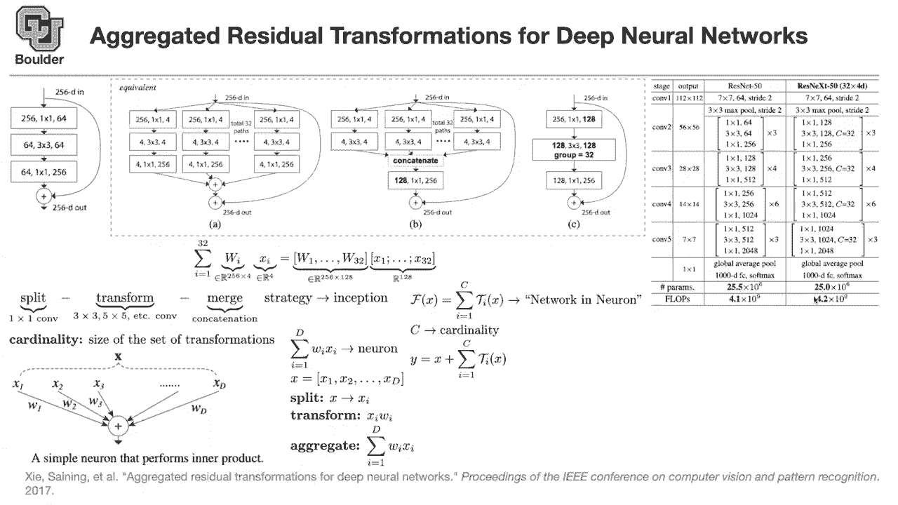

# P20：L10.1- ResNeXt - ShowMeAI - BV1Dg411F71G

so what did we do last session we，learned about，resnets we learned how to make them more，efficient。

and go even deeper by arranging batch no，value weight，properly and having no non-linearity on。

linear or linear operations，on the main branch on the shortcut，branch。

and then we learned about wide residual，networks，so far everybody wanted to go deeper。

these papers said wait a minute maybe we。

can go，even wider and actually get more，efficiency，maybe there is no need to go 1001，wider。

and less deep rather than having，deep，but make things four times wider and the，next contribution。

in the literature over res nets is what，is called res next，this this term you're gonna hear a lot。

and that's basically，this paper it says aggregated residual，transformation for deep neural networks。

let's see what the idea is the plot on，the left，is a bottleneck block。

in a residual network so let's say a 256，dimensional，basically that's the number of your，channels。

feed 256 dimensional feature map，goes in then you do a one by one，convolution。

you project a dimension down from 256 to，64。 now this three by three convolution，is now cheaper。

because you are doing it from a lower，dimension to another lower dimension。

and then you blow up the dimension you，go back to 256 and then you add your。

input to your output and then you，continue，that's what we learned about in the。

resnet paper now we want to go even，make things even more efficient by，excessively using。

one by one convolutions what you can do，is you can break down，the first matrix to be from 256。

it's a one by one convolution and it's，going to give you，them，32 paths i'm going to tell you why 32。

pretty shortly but for now you have 32，paths like that so you're breaking down，your matrix。

then you take the outcome and you do a，four by four matrix multiplication and。

then you have a convolution，three by three so four by four matrices，are really cheap。

to compute and now we are breaking down，our problem，then you have 32 of those four by four。

matrix matrix multiplications so these，are going to be really fast。

and you have 32 of them the outcome，is gonna be a four dimensional thing，which you can blow out。

the dimension to be 256 by a，one by one convolution you can do the，same thing for。

all of your 32 paths now you can add，them up，what you can do is now you take the。

input add it back to the，resulting operations that you had here，and that's going to be the output。

so this one is much more efficient，compared to a，regular residual block you have this。

you have fewer flops basically，floating point up operations and。

32 is chosen such that these two blocks，have the same number of parameters。

because you want to be fair，when you're comparing them so they have。

similar number of parameters and that's，why they choose，32 but this one is much more faster。

because now you're doing small matrices，it's，for the dimension of the。

matrices that you're using here is 4 by，256 which is much better than 64，256。

 so that's one change whatever that，i'm gonna，show you to the right of this plot is。

just equivalent formulations，and i'm going to tell you why they are。

equivalent the first operations are the，same you're just breaking down your，matrix。

this operation is the same as you have，over here，now you can make a slight change rather。

than doing multiplication，right now you can concatenate all of，these。

that's going to give you a matrix that，is，1 28 which is basically 32 times 4。

that's 128 dimensional and you have this，many outputs，so you first concatenate them and then。

you multiply by a matrix like this，what is happening is you take the，channel wise。

you take the output of these operations，and then you concatenate them。

and that's going to give you 32，times 4 which is 128，channels after this concatenation，operation。

now you can do a one by one convolution，and then，continue with your residual network i'm。

gonna tell you，i'm gonna go into more details of why，this is the case why this one and。

why a and b are equivalent for now let's，just take my word for its face value。

now see let's see what happens from b to，c why they are equivalent，what you can do is you take these。

matrices，and then you can concatenate them，together that's going to give you 256。

by 128 matrices and then the operation，that you see here，those 32 is just a group convolution。

so that's just the definition of a group，convolution from here。

to here we are just using a definition，and can somebody tell me，where we saw group convolutions the。

first place that we saw it，maybe i didn't use the word but we saw，it somewhere，we saw it actually。

in the first paper that we considered，the image net paper so this is just a。

group convolution this is one group，this is another group basically that's a。

group convolution each of these，operations that you're seeing，is a group convolution they were doing。

it because，at that time their gpus were not so，powerful so they had to break their。

network into two groups，but now we are just doing it for，efficiency so we saw。

group convolutions before and that's，just a definition，going from b to c is just a definition。

professor sorry if i missed this but，where did the 32 come from。

where d2 is you want this network this，block of the network，to have the same or similar it's not。

going to be exactly the same，or a similar number of parameters to the，resnet。

okay cool this number could be anything，but then if you go into details of the，to have。

then you're going to see that the number，of parameters of this block is。

equivalent to the number of parameters，of the other block，i see 32 is coming from that it could be。

anywhere，but yeah now the question is how do you，go from a to b，why are they equivalents let's make。

things simple，and let's just look at matrix vector，multiplications。

you have a bunch of vectors actually you，have 32 of them，after this operation that are gonna be。

four dimensional，so x i's are gonna be four dimensional w，i's，in in panel a are 256。

by four dimensional stuff matrices，so it's 256 by four and you're。

multiplying it by a vector that's in r4，and the addition here you're just adding，adding them all。

up so that's what you're doing here，panel b，you're just taking everything the output，of。

these convolutions and you're，concatenating them you have 32 of them。

each one of them is four dimensional so，you get a vector in，r 128 after the concatenation。

the rest of it is just multiplying it by，a matrix which you are blocking it which。

you are breaking it this way，so that's gonna be your entire matrix。

which is this one by one convolution，sitting here，so that's a big matrix being multiplied。

by a big vector，this is the summation of a bunch of，small matrices being multiplied by small。

vectors so the outcomes are equal so a，and b are equivalent it is clear do you，have any questions。

so a and b are equivalent because of，this equality，b and c are equivalent because of a。

definition of group convolutions，so that's just the definition so res，next is gonna use。

group convolutions so where else，did we see this behavior when we were。

splitting and then transforming and，merging，this is called split transform merge，strategy。

we saw it in first in google net，inception，exactly so that's where we saw it you，first split。

then you do a transformation it was，either three by three，five by five seven by seven pulling。

whatever，you do some transformation and then you，merge them，using concatenation so this strategy is。

familiar we saw it before we actually，cite even earlier than that，so you asked me about what is。

cardinality cardinality is，this 32 number the one that we chose to，be 32。

this is the size of the set of，transformations that we are doing。

it's basically the number the total path，that you have，but that's just a definition of，use。

so now what parameters do we have we，have the filter size，is a hyper parameter we have the depth。

of our neural network，could be a hyperparameter the width of，it could be a hyper parameter is。

basically the number of channels，and now cardinality the number of group。

convolutions that you're going to use，is another hyperparameter that you can，play around with。

but we saw the idea of split transform，and merge，even in the essence of neural networks。

even in a simple neural neuron you have，an output you have an input x。

which is a vector with entries x 1 x 2 x，3 up until x d，so it's d dimensional you do a dot，product。

of that d dimensional vector by your，weights，and the dot product has the addition。

inside it implicitly and then you get a，neuron out，even there you have the idea of split。

transformer merging，let's see how that's a neuron we just，saw。

it's inner product of two vectors that's，our x，d dimensional we first split it you take。

x and then you split it according to its，coordinates，that's going to give you x1 up until xt。

that's the idea of split，transform you do a linear transformation。

you multiply it by a weight and then you，merge or aggregate which is the，summation。

that's why the idea of resnet you can，think of it as a network in neuron what。

are your networks your networks are，these smaller paths，and you have 32 of them you first split。

you take x you split it and then you，transform it，this could be a non-linear or linear。

transformation and then you aggregate，and c again is your cardinality and then，we are adding a。

residual connection by just copying and，adding，our input and let's take a look at the。

actual structure，of res next this is resnet，this we saw before so i want to remember。

these structures in some of the future，papers we are going to say we are going，to use the features。

coming out of con 5。 so，it's a good idea to remember that，resnet50 or even resonant 101。

have con 5 or conv 4，we are going to use that terminology 32，is chosen。

such that resnet 50 and res next，50 have the same number of parameters so，they have。

almost the same number of parameters，this one is 25。5，million this one is 25 million and they。

have similar。

flaps also but then the difference，is that res next is training much better。

it's training faster and it's giving you，a，error，this is resonant 50 and resin x50 being，compared。

and these are resnet and resnext 101，this one has one or one layers any，questions。

the change that you are making is，replacing these bottleneck layers，with group convolutions so your。

convolutions are now gonna be，group convolutions and you have 32 of，them is everything clear。

any questions before i move to the next。