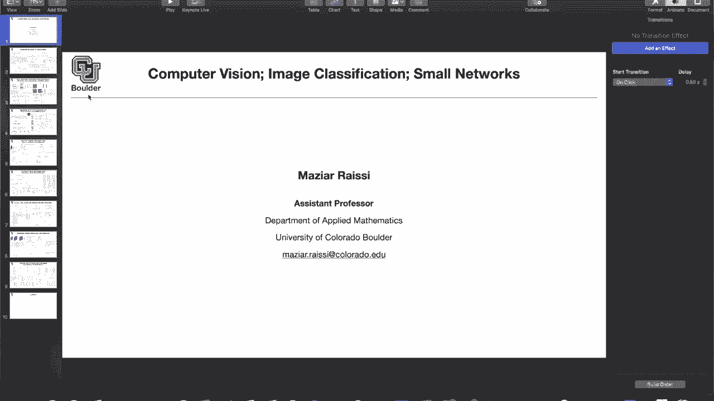
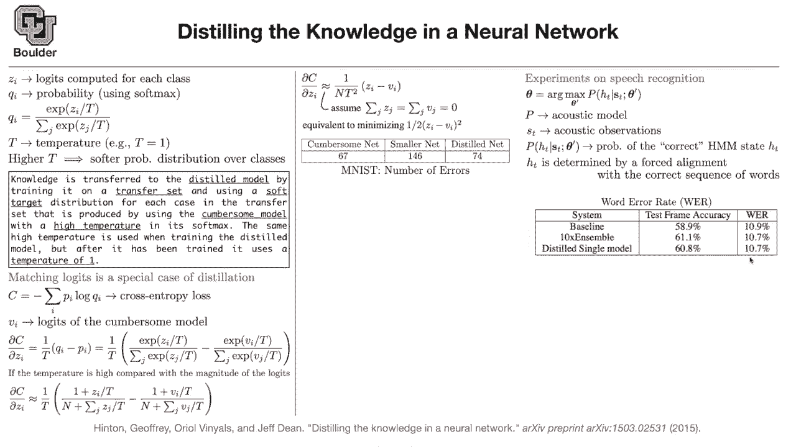

# P27：L14.2- 知识蒸馏 - ShowMeAI - BV1Dg411F71G

so let's get started with the first set，of ideas，the idea is that you have a large neural，network。

or you can actually have an ensemble of，neural networks，giving you a very high accuracy you。

train them，and during training you can take as much，time and resources as you want。

now you want to take that knowledge that，your，giant neural network or your ensemble of。

neural networks，acquired through training and this still，it's different from transferring，knowledge。

now you're distilling the knowledge in a，smaller neural network。

so let's see how we can do it a little，bit of notation，so let zi denote your logits。

compute it for each class basically，these are your scores，for the class for each class and i is。

denoting the class number，so these are your logits they are a，number between negative infinity to。

positive infinity，these are your scores and then we know，how to convert them。

into probabilities we convert them into，probabilities，using soft max but then we are now going。

to introduce a new parameter，and that's called temperature in our，soft max so if t，t。

is called temperature if you increase t，basically if you increase the，a。

softer probability distribution over，your classes，and by softer what do i mean can。

somebody answer like，more uniform exactly so it's gonna be，more uniform。

so as you increase the temperature your，probabilities are gonna be more closer，to uniform。

because these numbers are gonna converge，to one，these numbers are gonna converge to 1。

this summation over all of your labels，is going to be the number of labels that。

you have so qi is going to be 1 over n，and what happens if t is 0 you're going，to end up with。

one class other than dividing by zero，let let it be very close to zero a very，small number。

if you try to do that one of your，classes is gonna dominate，it's gonna be a delta dirac function and。

temperature one is what we actually use，in practice but what are we gonna do。

with that we have a giant network，know，one month one year to train that network。

on a very large data set，of course you cannot use that large，model in deployment，keep。

generating data from that large model so，these are going to be artificial data。

these are not real data，so you can generate a lot of data from，that network the giant one。

now we're gonna train the smaller，network and the data generated by that，giant model so this is how。

knowledge distillation works the smaller，model，we are gonna call it a distilled model。

and the knowledge is being transferred，from，the giant network to the distilled，network。

from the giant model you generate some，transfer set this is going to be the，data generated by。

the giant network then we need to train，it and we are going to train it。

with a soft target distribution，basically with a larger t，with a larger temperature why do we do。

that because these are not real data，these are artificial data so we don't，want to trust。

the large network too much because，whatever the network is doing。

it's not real data so you increase the，temperature you increase the temperature。

generate your transfer data your，transfer set，you do your training you train the，distilled model。

with the same temperature that you use，to generate the data，once you are done training your。

distilled model，when you want to do actual prediction，and put it in production。

you set the temperature to be one so，that's how you distill the knowledge。

from a giant network to a smaller，network any questions so far。

what does generating a set of data from，a model even mean in this context do you。

start with like an indicator function，and then back back propagate and see，of。

the like like when we were doing，derivatives and back propagation。

and no once a network is trained what's，gonna happen，if you input an image you're gonna get。

output the probability of the classes so，we are gonna feeding images。

the input is gonna be still coming from，your training data，or a subset of your training data which。

you can call transfer set，but the labels are not the true labels，network。

which are just probabilities the，probability of this image being a cat，being a dog being a car etc。

you have 1000 classes let's say but then，to get that those probabilities to get，those labels。

you are going to use your soft target，which are basically coming from your。

model with a higher temperature does，that answer your question。

what is so it's fair to say that we are，just smoothing or blurring the discrete，labels。

on all of the original transfer data or，doing，you set the temperature high blur blur。

out the labels and then give them to a，new model，and that somehow speeds up or。

accelerates the rate at which they learn，the correct，labels again so now you have some data，set。

generated by your giant network you take，that data set，they were generated by a particular，five。

or one hundred okay now you train，your smaller network with the same。

temperature once the training is done，use in your production when you're，actually testing。

your smaller network you set the，temperature to be one，again so here is the process you train a。

very large network，with temperature being equal to one once，trained you generate some。

artificial data with a higher，temperature let's say 100。 you，train your smaller network on this。

artificial data，with the same temperature 100 and then，go back。

in your prediction to temperature being，equal to one is everything clear，transfer。

data not the arc max of the output we，are just trying to train a smaller model。

to have the same soft max with，temperature output vector as，the large one that's a great question so。

what we are，doing is not taking the arc max，of the output when it comes to，artificial data。

you're still gonna keep the，probabilities you don't turn them to。

actual labels i think it's going to get，more clear if i show you the math。

so the whole vector yes the whole vector，is fed into，the small network as a new label exactly。

and this is really powerful，because it's not only a one hot vector。

that is being passed throughout the，training it's actually the entire，probability distribution。

if an example has a low score of，being uh has a low probability of being。

a cat still there is some information，even if the true label，is a dark but then there is a small。

probability that's a cat there is some，information there，that we are transferring to the。

distilled model something the large，network learned，and now we are transferring that to a。

distilled model，so the message is that the distilled，model is even learning from the mistakes。

of the large model，may ask one more question because what，you just said um kind of really。

what i was thinking uh i was going to，ask if the advantage of this is。

that it's faster to train a model when，your labels are not，one-hot vectors but then maybe what you。

said actually answered my question is，that by blurring，the labels you're kind of using the。

information of like an intersection of，a bunch of different labels to inform，yourself even better。

like it's it's a little bit cats a，little bit dog it's a little bit human。

exactly so yes you're right and then，like the the amalgamation of that，information helps you to。

figure out that it's a cat faster than，okay that's that's interesting。

yeah and that's the role of the，temperature and the temperature helps us。

uh more in doing that you could set the，temperature to be one。

while transferring but then with putting，a temperature to be higher。

you're encouraging the lower probability，ones to contribute，to the learning process of the distilled。

model it seems that if you，you would obviously then just erase all，the information if you made the。

temperature too high，though yes so there's a trade-off if the。

temperature is too high there is nothing，to learn from，if it's too low you're back to putting。

your one-hot vectors in your，cross-entropy，so a number like 105，something like that is gonna help us。

more and i know that some of you are，interested in adversarial attacks on，neural networks。

we are gonna go to that actually，distillation，is a way of protecting and making our。

networks more robust，towards adversarial attacks there are，some papers on that we will discuss them。

so it's an important topic that's why，i'm including it here because we are，going to need it later on。

as well actually there is another，interpretation，of knowledge distillation and it turns，out that。

if you try to match your logic it's a，special case of knowledge distillation。

forget about qs and ps your，probabilities，you can focus on z's the logics，themselves。

put a regression loss on that，that could be a way that you're，distilling the knowledge from one。

network to the other one，and it's actually a special case of，distillation so it's another way of。

looking at the same topic，let's see why and while i go through the。

math it's going to become more clear，what distillation is actually doing so。

this is how we are going to train our，network，previously qi is the predictions。

that are coming out of the distilled，model so qis are coming from，the smaller network pis if we were。

training the smaller model，from data what would pis be can somebody，answer。

zero or one zero or once exactly so，these are gonna be，one hot vectors so only one of these。

terms would contribute，to your loss but now these pis，are coming from the prediction of a。

larger model，which has its own logics so these are，never zero。

they could be close to zero but they are，never zero and we are going to amplify，that effect，that。

we avoid these guys to be zero that's，the role of the temperature。

is that clear okay perfect that's our，cross-entropy loss，model，the smaller network you can have some。

logics of the，cumbersome model and basically pis are，coming from vis。

in the same way that q i's are coming，from z i's so q i is a function of z。

i p i is a function of v i using the，same exact，soft max with a temperature of let's，assume it's 100。

now let's take the derivative of your，loss function with respect to zi。

so this is an exercise for you the，derivative of c with respect to z。

i i'm not going to go into details but，it's going to be 1 over t，prove。

but once you do that you get one over t，and now we are，replacing q i with the soft max and if。

you remember we were setting the，temperature to be the same，when we were doing training so that's。

coming from q i，this is coming from p i now we're going，to do an approximation。

if t is big so let's assume that the，temperature，is high what you can do is write down。

the taylor expansion，for exponential what is that going to，give you it's going to give you 1。

plus z i over t plus some higher order，terms，but because you assume t is high you can，ignore those。

higher order terms so that's just，exponential taylor expansion。

you do the same thing for the other term，you do it for this term as well，you get 1 plus z i over ti。

but then there is a summation over your，ones the summation over a bunch of ones，is going to give you。

n and that's what you're going to end up，with so let's try to simplify this。

formula to simplify that we are going to，make an assumption，so far the only mistake that we were。

making was that t，is high very high for the taylor，expansion to work。

another assumption that we are going to，do is that the mean，of the logits is zero and that's not a。

bad assumption，because you can always normalize your，data to have mean zero。

and if you remember during batch，normalization this is what you are，actually trying to achieve。

so you can normalize your data so that，the logits，have mean zero if they are zero this。

term is zero that term is zero，one and one here cancel you get one over，t squared。

and then z i minus v i，and one over n is just coming from here，and n。

is the number of classes for instance in，in imagenet that's 1000。

and t is our temperature you get the，same objective function，if this is your loss that's your。

regression loss so with knowledge，distillation，are sort of approximately trying to。

match the logics the logics，of the distilled model are gonna，try to be as close as possible to the。

logics of the cumbersome model，so is the math clear this is just to，give you more intuition of。

what knowledge distillation is doing any，questions，okay perfect so what's the final。

result then your cumbersome model on the，mist data set，is making 67 errors if you train your。

smaller network，from scratch that a smaller network is，gonna，make 146 errors if you train。

your smaller network by knowledge，distillation，your network is going to make much fewer，errors。

compared to training from scratch of，course it's not going to be as good as，the commercial model。

because it's a smaller network to begin，with it has less parameters it's faster。

but then it's much better than training，it from scratch，and there is another catch during，training i。

said you're gonna train it on the，transfer set，which is generated by the giant model，that's true。

but then you are adding another part of，another part you lost coming from the。

real data so this distilled net you are，also training it on the。

real labels and real data so it's just，the addition of two，loss functions is there a particular，the。

distilled net in the cumbersome net the，only thing that you need to know。

is that it's much smaller okay and the，other thing that you need to know is。

that it's the same network as the，smaller one，but it's trained differently and，everything is coming。

from the fact that you are even learning，from the ones，that the cumbersome model thinks that。

they don't have much probability of，happening，yes it's a cat with a higher probability。

with a high probability，but then there are some chances that it，could be a dock。

so you're also learning from that part，of the prediction，and the fact that these pis are not all。

zeros except for one，does that make sense so now if you are，reviewing this paper you might say okay。

you applied it on mnist，is this is your framework general enough，can you apply it on。

other data sets on other data sets as，well as on，on a totally different field maybe。

speech recognition，so the paper did actually that they did，some experiments on。

speech recognition i'm not gonna go，through speech recognition。

right now it's just to tell you that yes，the method knowledge distillation is，general enough。

to be applied to different fields we can，apply to speech recognition as well。

we are god we are going to go through，speech recognition later on in this，course or。

in the follow-up course but let's see，what happens in a speech recognition。

this is the objective that you want to，maximize，with some parameters p is your acoustic，model。

s t is your acoustic observations，and you want to know the probability of。

the correct hidden markov model，for that particular state state hd and，hd are。

just your texts that you are in your，training you are trying to，align this page to text using some。

forced alignment methods this is the，table if you didn't understand what's，going on there。

it's okay because we are going to cover，speech recognition later on。

for now the big picture is that there is，a speech as an input，the output is the text so you're。

converting a speech to text and then you，can compare the methods，errors。

your method is committing per word so，you can have，your baseline model that's making this。

many errors you can，have an ensemble of 10 models that's the，error rate and you can distill the。

knowledge in these 10，ensembles into a single simpler model，and that's the number of errors that。

it's making so the take-home message，from this part of the slide。

is that the knowledge distillation is，general you can apply it on different，fields。

and data sets for those of you who want，leave，and for those of you who have questions，ask，learn。

anything about learning capacity for，example，for a given network of depth d what is，the theoretical。

so，these are great questions and these are，theoretical questions。

if you look at the title of this course，it says apply deep learning so for us，it's more important to。

take a look at the applications does，that answer your question，and there are some papers if you are。

interested i can send them to you and，then you can see，why neural networks are universal，of。

theoretical analysis i will cover some，of that，but not a lot of it just enough to help。

