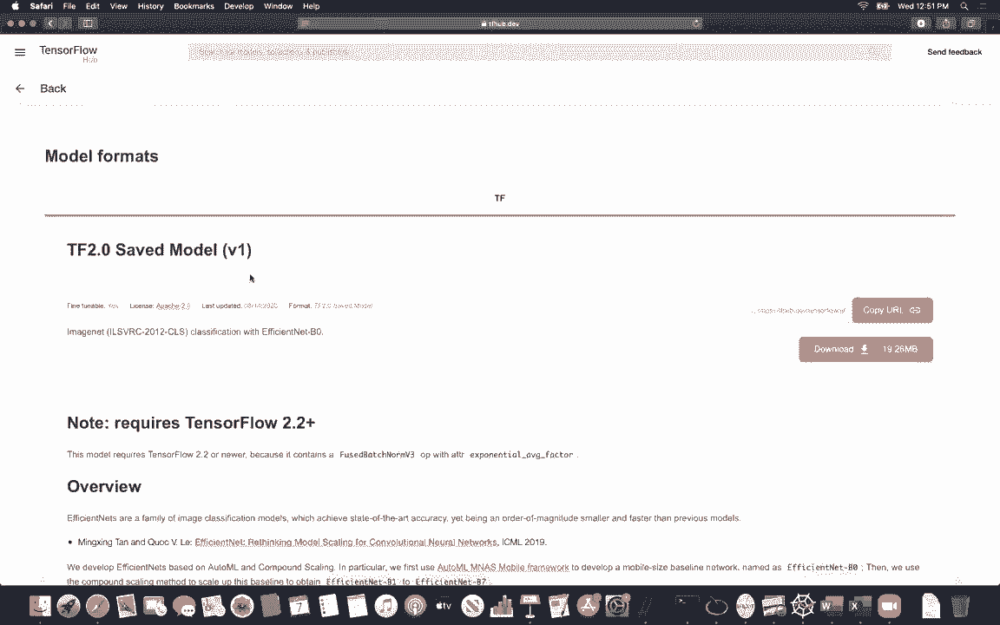
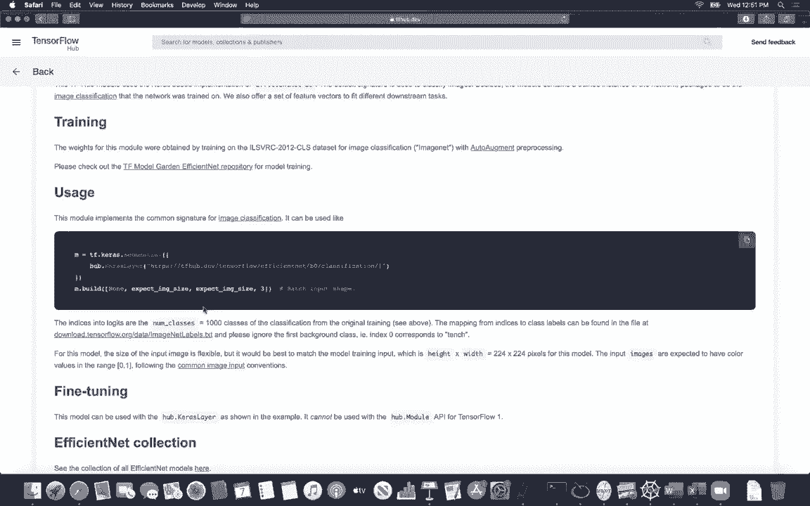
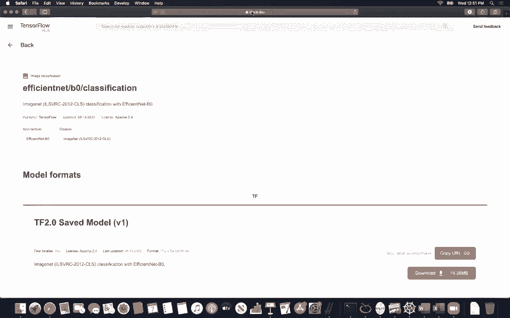
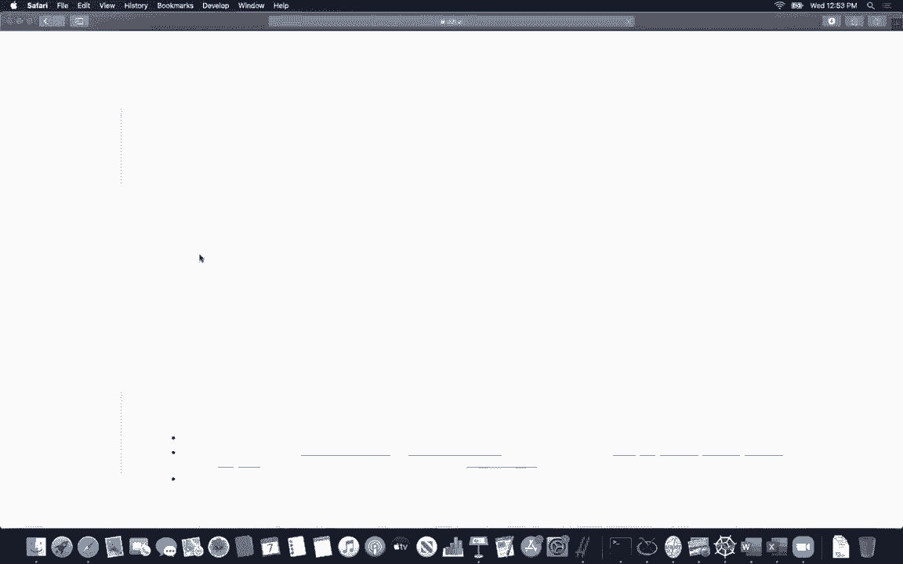
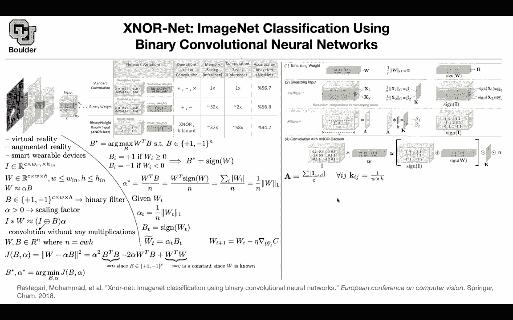

# P33：L18.1- XNOR网络 [续] - ShowMeAI - BV1Dg411F71G

any questions about last session any，questions in general，yeah i had a question um i really liked。

the the spatial transformers paper that，was sort of like a form of，you know learned attention i was。

for，anything similar or if you could point，to some like papers that are like，similar ideas。

i think uh when we do uh，object detection we are gonna see some，more examples there。

at least one more paper but yeah，definitely，will say，thanks sweet and any other questions。

in general i was gonna ask if um，if if you had any like code examples。

that would go along with the slides not，necessarily everyone。

but just any that you have they would be，helpful not to review during class but，to。

run and go through on our own most of，these papers are really amazing。

so they are sharing their codes and，instance，squeeze net and tensorflow and then。

the corresponding code is gonna show up，somebody has written the code。

okay thanks but yeah if you go through，that and i know that one of you did that。

and i really liked it one of you was，going through，the implementation of weight，initializations。

in pi torch because usually these are，hidden you usually say，okay i want to add the convolution with。

this activation，and then behind the scenes things are，being taken care of they are going to。

initialize it correctly for you，but that's going to be great if you can。

go through the code because this is a，great learning experience，going through the code of others and。

most of these papers that i'm covering，you can download the code for free。

and play around with it i mean this，community are amazing，they cite it each other perfectly they。

use each other's codes，and that's why their field is exploding，because nobody is hiding，that。

to go through the codes and i strongly，encourage looking at the data as well。

the type of data that these people used，so far it was mostly imagenet。

but then when we go to object detection，and segmentation and i don't know。

visual question answering etc then the，type of data is gonna。

change usually the size of data is going，to become smaller and then you have to，limit that。

but the data are going to become，different so it's a great experience。

going through the data and the codes of，others does that answer your question。

yes thanks unless you're right kevin，some of them have their code already，including tf。keras。

and there is also tensorflow hub there，is also，pytorch they have a hub also。

and uh mxnet also has a very good，i can pull it up actually if you look at，mxnet。

for computer vision gluon，they have a model zoo and they have very，good。

documentation i think if you go to model。

zoo yes you can have classification，and then most of the models that we，covered so far。

like resnet res next res nest，mobile net vdg squeeze net squeeze net，we covered it last session。

you can take a look at the details here，and they have nice tutorials。

some of you are going through the，tutorials of pytorch and tensorflow。

and yes zurich is right tensorflow hub。

is also very good，you can download the data sets you can，download the codes。

etc from other people okay so use that，opportunity i mean，for me it's more important to show you。

what's behind the scenes，what is behind the methods most of these，you can easily implement them。

does that sound good you have tutorials，you can go through they have models。

for images for instance you have，efficient net，and the code is here and you have。

different types of efficient maps。

you can get a saved model or you can，actually，train it from scratch this is as easy as。

this you get your，tf。grass sequential and and then you say，i want，net。

and it's going to give you that does，that sound good oh theodore is saying，what was the first side。

that was mxnet this is a collaboration，from a big zoo of companies。

these are sponsoring and they have some，employees actually，contributing to the code like intel。

nvidia。

acer etc that's why i'm keeping your，hands open，because there is a lot of things that。

i'm not gonna have time，to teach you that's why i'm giving you，guys the opportunity to explore。

just learn as much as you can not only，from me but from the。

from the world from the internet and，mxnet is actually。

where you have this textbook that i'm，recommending for this course。

okay this textbook is also very good and，i know that some of you are going，through it。

this is great it's a compliment to what。

we do in class，any other questions there is also，pytorch they have very good。

tutorials etc they also have a model，see all of these models are already。

implemented for you we can go ahead and，take a look at the，details of how they are implementing it。

and just try to look for，what we covered in class yeah this is。

how you explore，any other questions okay then let's move，on we'll。

explore that we said we have an image，it has c channels it has a width and a，height。

we have a bunch of kernels，our weights with kernel size w，times h it has the same number of。

channels as your input，we said we want to approximate w，by alpha times b where b is binary and。

then we said we want alpha to be，positive，because we are capturing the。

positiveness and negativeness in b，gonna need，only addition and subtraction so i have。

a question for you，in general so the memory saving，weights，but then it went from 30 to 30 to 32。

when we binarize the input why is that，why didn't it change why didn't we save。

more it's just a question to see whether，you know the big picture because we're，not saving the。

input like the the weights are the main，model，like the input is just like a per，forward pass。

basis kind of thing exactly so what you，are saving are the weights。

and biases so you are not saving your，inputs you can binarize it on the fly。

an image comes in and then you binarized，whenever necessary，and you don't need to save that okay。

great now we said we want，our rates and biases to be flattened，in python you're just gonna say dot。

flatten then it's gonna turn a tensor，into a long，vector of dimension c w。

and h now our problem becomes minimizing，the distance between w and alpha b。

if you expand that term out you get，alpha squared b，transpose b minus 2 alpha w transpose b。

plus w transpose w we know that our，binary matrix is gonna have either a。

value of positive one or negative one，if you multiply two negatives it's to，give you a positive。

and if you multiply to positives it's，going to give you a positive。

so the entries here are always ones and，then you are doing the summation because，of the。

inner product here so you're doing a，summation over，n ones so that's going to give you n。

and this term is just constant because，our problem this minimization problem。

is a function of b and alpha it's not a，function of w，we are assuming that w is no so let's。

try to minimize，and find beta star and alpha star，minimizing this。

objective is equivalent to maximizing if，you are trying to find，term。

because of this negative sign and alpha，is positive so it's equivalent to，maximizing this term。

the rest of it is either a constant or n，which is also a constant and because we。

are not optimizing yet，for alpha that term is also a constant，it's equivalent to maximizing this。

and the answer to that problem is very，simple whenever，w is positive enforce it make。

beta to be positive if w is negative，make the product of beta and w to be，positive it means set。

eta to be negative then overall you're，adding a bunch of positive numbers and。

that's going to give you the maximum，and that's going to give you v star。

which is simply the sign of w，any questions up until this point so up。

until this point we covered task session，now we want to find alpha if you want to。

find alpha you just take the derivative，of this objective function。

with respect to alpha it's going to give，you 2 alpha，n minus 2 alpha minus 2，alpha。

you set that to be equal to 0 and then，you solve for alpha that's going to give，you w transpose b。

divided by n and that's what you see，here from above，we know what is the optimal b we plug。

that inside this term，that's the sine of w and because of this。

transpose you're doing an inner product，and that's going to give you the，summation。

and whenever you multiply a number by，its sign，you're going to get the absolute value。

of that term if w is positive，the sign is going to be positive，therefore the absolute value is。

just wi if w is negative the sign is，negative，you multiply them together that's going。

to give you the positive term，so it's always the absolute value and，what is that that's just the。

l1 norm that's just the definition of l1，norm so far so good，now what we are going to do is how are。

we going to train this，that's the question a mini batch comes，in we are gonna keep。

a copy of w throughout the training，but our forward pass is gonna go through。

this term alpha and b rather than using，w，so let's see some details at iteration t。

you took some minibatch and you got some，wt that's what you're starting with。

during training that's iteration t of，your optimization，beta，because we know how to find the optimal。

ones this is our alpha，coming from this formula and b is just，the sine of w。

t so these we can compute and from this，approximation here，we can define w t tilde。

which is going to be alpha t times bt，and，we should note that w is not equal to。

w t tilde w t tilde is approximating，w it's not exact but then how are we，going to back propagate。

we can take the derivative of our loss，with respect to this term。

that's going to give you the derivative，of your loss with respect to that there。

the approximate one you take a step，in the direction of your gradient that's。

going to be great and decent and，that's how you update w for the next，iteration。

so you always keep a copy of w during，back propagation，but for forward propagation we are。

always going through this route，we are always using wt tilde so we are。

always going through this route，or that route is that clear okay perfect。

so we covered binary weight how are we，gonna binarize the input。

you do exactly the same exercise it's，going to be exactly the same。

math that's going to go through and，that's going to help you binarize your，input。

and then you are going to have a scaling，factor let's call it beta that's all。

so it's the same math but then there is，a minor catch，when it comes to implementation to make。

it efficient，for binarizing weights we know how to do，it we can compute alpha and beta。

for binarizing the inputs sorry that's b，we know how to compute alpha and b for。

binarizing the inputs，we are gonna do convolutions you take a，small window。

of your input and then from that you're，gonna compute，beta1 corresponding to x1 window。

for x2 window you're gonna compute beta2，and you're gonna put it in a matrix k，but then。

as you can see there is some redundancy，in your computations here。

you need to compute this norm for this，window，and the other window and they have some。

overlap so you're doing redundant，computations here，is that clear the problem so there is a。

slight catch here，that there is some redundancy going on，it，you compute a because in the end what do。

you need，you need the l1 norm of your input you，need the l1 norm and that's the。

definition of the l1 or，this is summation of the absolute value，so we are going to do this summation。

of our input and we are doing uh，channels，your，of your input over the channel so the。

summation here is over，the channel it means that you're going。

to take an input and collapse it into a，matrix a，it's one intermediate step that's going。

to give you a，but to get the norm what what else do we，need what is the size of this input。

it has c channels and the size is，w times h so that's a small window。

and we know that in our l1 norm we are，gonna need to divide by，c times w times h。

that's the total number of elements that，you're going to have。

so you're going to define k i j which is，exactly what we need it's 1 over w。

times h and the rest of it is just a，simple convolution，you take that matrix which is always a。

constant，one over w times h and then you slide it，over your a，and we know that convolutions can be。

implemented very efficiently，and that's going to give you b1 and b2，rest of。

it is clear now we are going to，approximate，i convolve v w by the sine of i。

convolved with the sine of w a hadamard，product with your k matrix that we just，created。

in an efficient way times alpha so k is，going to contain，betas coming from binarizing our input。

alpha is coming from binarizing our，weights，and the sine of these two matrices are。

here so is everything clear，just to be clear the um the k matrix has，a whole。

all each entry is one specific number，beta，which comes from the convolution of just，the um。

input that you've called x1 or x2 but，there's there's a whole bunch of them。

it's not just the first and the second，yes there is a whole bunch of them。

okay it's just the last duration of the，overlap，between two windows but then you're。

gonna need to do it for every single，window over there so it's it's k is just，as big as the standard。

output after doing convolution exactly，so k，is gonna have a size of w in times h。

that's how many betas you're going to，have yeah the size of your inputs。

got it thank you any other questions，okay perfect，i want everything to be clear before。

moving on okay then，now there is a slight catch also where，do you want to put your pulling。

if you have a binarized input like this，input，ones and negative ones and let's say you。

want to do max pulling，on a window of two by two the max is，most of the time。

it's going to be one and you're losing a，lot of information so if you want to do。

the pulling right after the activation，we are in trouble，or right after the patch norm when。

things are binarized，that's a typical cnn but then a block of，of，furniture for you to lose as little。

information as possible，you do your batch norm you do your，binary activation。

and by binary activation we mean this，this operation that you see here that's，the binary activation。

and then binary convolution is this，operation here，so that's the operation that we're going。

to do in this box，binary activation is the operation that，you do there。

and then you do the pulling right after，not，binarized what goes inside the pooling。

is not a bunch of ones and，negative ones there are some real，numbers。

also there there is alpha and betas that，way you are not going to lose。

that much information you're still，you're losing information，if you see the accuracy is dropping but。

it's not crazy，compared to the computational saving，that you're gonna get。

and why is it faster because exnor，operations are what actually the，hardware does。

it's the basic operation in the hardware，okay how much do we save，team。

from one gigabyte of a model you're，gonna go to 16 megabytes，from 100 to 1。5 ingressnettes。

and from 475 to 7。4，so that depends on the network that you，have how much speed up are you gonna get。

the more，computationally expensive your，convolutions are and the more you're，gonna save。

so the bigger the number of channels the，more you're gonna save。

and the bigger your filter size the more，you're gonna save okay so these are，intuitive figures。

any questions before i move on to the，next topic is，that uh is sort of the loss and accuracy。

from this process constant，for these two metrics for this number of，channels and filter size。

or will the accuracy decrease more，or something that's a great question so。

definitely it's not going to be constant，because there is a training process。

going on and things are going to be，random so i cannot give you a definite，answer。

that it's always this much accuracy that，you're losing，you could be losing more or less okay so。

