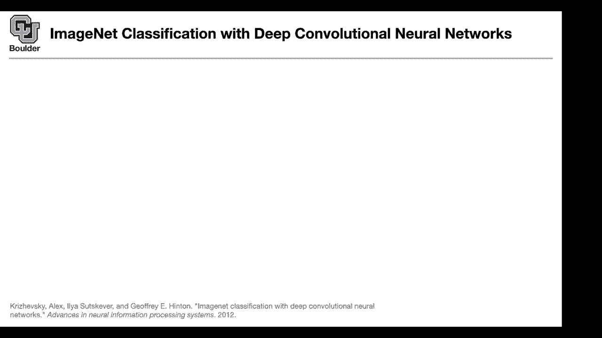
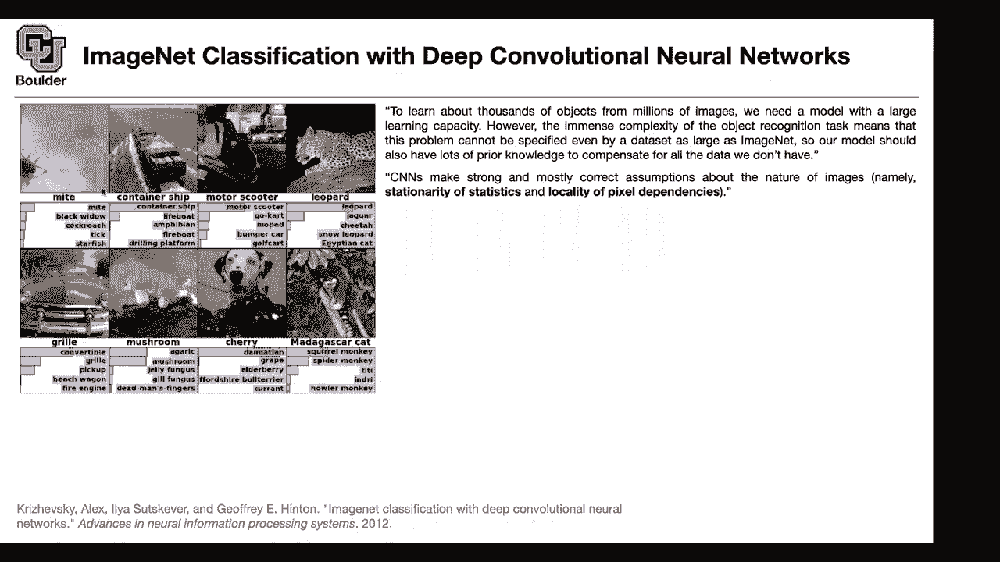
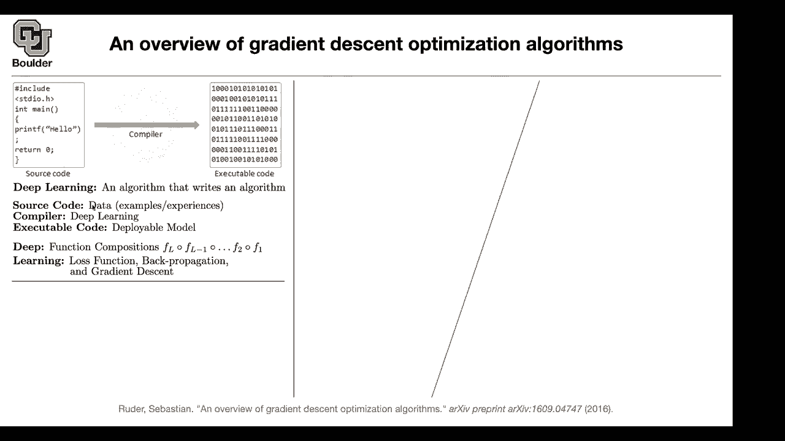

# P4：L2.2- AlexNet - ShowMeAI - BV1Dg411F71G

let's start with the paper，that started the modern field，so deep learning throughout the history。

came with various names，uh i think the last time was in 1985。

people were working on neural networks a，lot，but then the feel died because。

at that time they didn't have the，necessary computational power。

because these deep neural networks are，not cheap to train they are not cheap to。

so the field died except for a handful，of people，one of them was jeffrey hinton uh。

the other one was lacoon doing，convolutional neural networks，but then the field revived with this。

paper，and it changed its name totally to deep，neural networks。

and we're gonna see why，what is the application that we are，going to start with and we are going to。

stick with it for a while，so somebody gives us an image let's say。

and the algorithm should tell us is it a，might，or no and there are like 1000 classes。

and these predictions these are the，predictions of the model，it's gonna say with this probability。

that's a might，with this probability that's a，black widow cockroach thick。

or starfish with these probabilities and，the red is actually the underlying truth。

and the type of classes that you're，going to see are，mite container ship motor scooter。

lower part and so on，and you want to write an algorithm that，i bet some of you。

have tried to use google scholar，at some point and then you saw a window，popping up。

saying that prove to me that you're a，human，and the question that they're gonna ask，is，[Music]。

traffic lights in the images that you，so what does it mean to test whether，you're a human。

they give you a classification algorithm，computers are really good at solving，algorithmic。

stuff like you're really good at solving，pdes，but they're not capable they were not。

capable of solving easy stuff，easy for human for a human it's really，easy to。

tell apart a lower part than a motor，scooter，but for a computer it's not。

so we're gonna start with this，and i'm gonna have a quote from that，paper。

it's actually from jeffrey hinton，it says to learn about thousands of，objects。

from millions of images that data set，that you're seeing is imagenet dataset。

it has millions of images，and there are thousands of objects there，are actually 1000 objects。

it continues with saying we need a model，with a large learning capacity。

that makes sense because you have，millions of images you need a model to，be able to memorize it。

memorize your data however，the immense complexity of the object。

recognition task means that this problem，cannot be specified，so our model should have，for。

the key word here is the prior knowledge，that i want to emphasize。

deep learning works but it doesn't work，by random，it's not like you throw added millions。

so you have to be very smart about the，prior，convolutional neural networks they make。

strong and mostly correct assumptions，about the nature of images what are the，properties of an。

image for instance，the statistics are stationary，so maybe you have a filter here and the。

same filter you can apply to，all the neighborhoods that you might see。

this pixel is gonna depend more on this，point，compared to a point that is really far。

so cnns are making mostly correct。

and first of all what is an image，an image is a tensor and tensor is a，generalization。

so a tensor is gonna be 224，by 224 that's the，width of your image that's the height of，the image。

but then it has three channels red green，blue and when you combine those channels。

that's going to give you，the color that you see here so that's。

it's actually a probability distribution，over 1000 objects，and the objects are mite container ship。

motor scooter and you name it，under 1000 of them you want to put the。

probability distribution on that，that's why the summation of your，probabilities has to be one。

and the probabilities are always bigger，than zero bigger than or equal。

so an image goes in a probability comes，out，that with with this probability that's a。

might with this probability that's a，that's the input to the algorithm that's，the output。

what happens in the middle，is a bunch of convolutions and max，pullings。

so what is the convolution you have a，kernel，that's 11 by 11 let's say so you put a。

so the dimension of your care now is，going to be 11 by 11 by 3，and you just multiply this care now。

by that window of your image，point wise then you summation it，you do a summation on that and that's。

going to give you a number，so that's just the inner product of this，filter，that part of the image。

and then you keep doing that you keep，sliding this window，on your image and that's gonna fill out。

one slice，then you're gonna have 48 basically 47，other filters，so what does this mean your filter is。

going to be 11，by 11 by 3 by 48，that's your filter and that's going to，help you fill out。

this box here that's going to give you，another tensor，the top convolutions we're going to go，back。

to that later，now you want to keep shrinking，your images you don't want to keep。

working with 224 by 224，images all the time you try to keep，shrinking。

and the way that you do it is by max，pulling for instance or average pulling。

or you name it the paper is using max，pooling，then you're gonna have another，convolution and so on。

up until the end you end up with a dense，which is basically you are flattening。

whatever that you're left with you're，flattening this cube，and then the rest of it is just linear。

combinations and，so at that time they had to divide their，neural network into two components。

because at that time the gpus were not，powerful enough，yet this was the first paper in deep，learning。

so they used two gpus one of them is，responsible for this part of the。

neural network the other one is，responsible for the other part，so they divide it into。

two parts these are independent，and at some points these two gpus are，going to communicate。

this is one part that they're，communicating and this is the other part。

so it's gonna help them increase the，capacity of their，neural network why is that important。

because they wanted to have a large，i think it's easier if you start with，one by one convolutions。

to help you understand what is actually，the input to a one by one convolution is。

x is gonna be h by w，by c that is the height that's the width，that's the number of channels。

for instance here it's 224，by 224 by 3 224，224 by 3。 the output is gonna be 224，just。

point wise basically pixel wise you，in r3 so it's three dimensional。

so it's a pixel but everything here has，a dimension the dimension of that pixel。

now you can have a bunch of weights，that's gonna take you from dimension 3。

to dimension 48 and this is just vector，multiplication，and the output is going to be another，pixel。

so this is one by one convolution，and this is actually the dense stuff，that you see here。

these are all you can think of them as，one by one convolutions。

one by one convolution is sometimes also，how do you generalize this into。

let's say three by three if i tell you，how to generalize it to three by three。

then you know how to generalize it to，any kernel size that you like okay bye k。

and sorry for the abuse of notation here，this w stands for weights that's double，that w is for。

width of the image，but that's okay that's not a，bad mistake to make，so now we want to know。

what is the output of our three by three，convolution，add a pixel point。

you take a window let's say it's，a window of three by three here it's 11。

it means that each one of these is a，pixel and what is going to be the，dimension。

the dimension is going to be on rc，is，in our c for instance is three。

dimensional or 48 dimensional or 128，you can do the same thing you can。

multiply it by a vector by a matrix to，change the dimension，from c to f for instance from 48。

to 128 you can just multiply it by a，matrix，but then you have to do it nine times。

because you have nine pixels，around a single pixel the one on the，left the one on the right the one。

immediately on top of it the one，below it the one to the left，top corner right left corner and so on。

you get the idea there are nine of them，all of them are vectors and you have，these many。

matrices nine matrices for one by one，convolution you had only one matrix。

here you have nine matrices and that's，gonna give you a three by three，convolution。

and that's the main operation that's，helping you jump，what is the loss function here what are。

the parameters first，the parameters are these weights and，biases the biases i'm removing。

and those are going to constitute your，thetas，and the loss function what are you what。

are what do we want to do，we want to maximize the likelihood of，form，there is an image of a mite。

and the corresponding label little i n，and capital i，n capital i n is an image n is。

nth data point i n is its label，which is a value from one to one，and then you want to maximize that。

or you want to maximize the log of that，probability，in machine learning we would like to。

minimize that's why you multiply by a，negative sign，the cool thing is that if you increase。

one of these pi's，the rest of them have to go down，because this summation has to be a one。

that's your last function，how do you train it using the methods，that we just went through。

and in the end their method，beat all the other previous methods。

that were not using neural networks and，by large margin，so before deep learning people were，doing a。

a，features，and most of their time would be spent on，featurizing，featuring。

on its own feature rising on its own and，it's beating the hell。

can you explain that table just a little，more like what is，what do those numbers represent and what。

is top one and top five，that's a good question uh，the model is going to predict five，outputs。

as you can see here the five most，probable ones，for instance for this image is，predicting might。

black widow cockroach teak and starfish，if the actual image，is appearing here。

that's gonna give you a positive case，it means that your algorithm did it，right。

if might doesn't happen here in the，predictions that's a negative，point for the algorithm。

so the algorithm is failing so might，is now appearing in the predictions of。

the model in the five top，in the top five ones so it's a success，even here that's a success。

and this is a failure cherry is not，appearing in the，so the algorithm you're gonna share show。

it a bunch of test planes，test images you know the ground truth，and then you can count the number of。

times that the algorithm was successful，versus the number of times that it。

and this is just a top five accuracy，the number of times that the algorithm。

the algorithm was successful，divided by the number of times that you，actually tested your algorithm。

the number of test data seems like that，table's a failure rate，if you said the cnn method is doing。

better yes，wouldn't we want a higher number yes so，sorry this is the error rate。

you're right so this is the number of，times，that the algorithm is making an error，out of 100 cases。

so 17 times cherry，was not one of the predictions of the，algorithm。

and top one is a tougher metric compared，to top five，we just look at the top。

one prediction for instance this is a，failure case，the algorithm is predicting the。

underlying truth is mushroom，the algorithm is telling us that's an，agaric。

and that's a failed case that's why this，number is bigger than the other。

so these are the failed cases top one，i think we are one minute over time for。

those of you who want to live you're，more than welcome to leave。

and for those of you have questions i，will be around for a while。

i have a number of questions so um in，this architecture，picture it looks like there so，there's 48 um。

what do you call them convolutional，fields，to go from the original images to that。

first layer where it's 55 by，55 by 48 so there's there's 48 different，filters there。

exactly and then the next time around，when you do the max pooling are you，maximizing。

um all of the five dimensions，in like the original width height and。

then leaving those 48 dimensions alone，so are you collapsing a five by five，down to one pixel。

or are you collapsing a five by five by，48，block down to one pixel so。

you are gonna keep actually this five by，five，and then it's gonna do it uh uh。

per filter so this one at the end of the，max pooling you're gonna have still 48，dimensions。

okay but then what the max pooling does，is gonna turn that into 27 by 27。

because every five by five window，is gonna collapse into one，that reduce the dimension by a lot more。

that's gonna reduce，the height and width of the dimensions，if if you're taking every wouldn't it be。

11 by 11，because you could have eleven such，windows that，were five by five no so that depends on，the。

stride so okay so，you're allowing for overlap exactly，and then would it reduce the dimension，the。

boundaries you run out of room and so，no matter what it's gonna reduce the，dimension。

it is that's called padding，that's a good point so these are all the，delicate points。

when it comes to convolutions，when you're at the boundary you might，either decide to pad or not pad。

or pad differently with a bunch of zeros，or no that's how you deal with boundary。

if you want to reduce a dimension reduce，the，pixels then uh you have to stride。

by more than one so it has to be a，okay so then we we've done convolution。

once and pooling once to get to where，your cursor is right now where it's 55，by 55 by 48。

and then up getting to the next one over，it applied another how filter is there。

i'm i just have a hard time imagining，this like this um，this depth dimension we went from 3 to，48。

and then up to 128 for the the depth of，this，yeah so what would be the next operation。

so there is one max pooling，the dimension is going to be a still 48，but then from 48 to 128。

and that's gonna be five by five，convolution，got it with um would it be。

how many filters there 128 filters，exactly so there are gonna be 128，filters，so c is denoting 48。

f is denoting 128，and then they keep changing from one，and then that s down in this formula。

with the double sum，s is that stride length value what's the，stride exactly。

that's why you're gonna reduce the，number of pixels，if your stride is bigger than one got it。

then the number of pixels is going to，shrink，yeah i understood and then like the。

the padding or non-padding is why，there's a little bit of weirdness with。

like 55 going to 27 to 13 and so on okay，that helps a lot exactly so the way that。

you deal with boundary conditions is，important，this seems extremely hard to do with。

general pictures on the internet where，you don't know the，dimensions coming in because it seems。

like this architecture someone had to，think about it a whole lot，about the exact strides and when to。

stride by one or two or three or four，and padding and whatnot and if you gave，me an arbitrary。

yeah if you look at it it's a 2012 paper，and people have made a lot of progress。

actually the convolution operation，doesn't depend on the pixels okay，so they are actually to get it。

independent from，uh the image size，but you couldn't necessarily take。

this exact network and pass in anything，right，so you need to change your run network，structure。

that's correct which sounds expensive，are there ways，then like what's the best way then of um。

classifying a general image on the，internet where，it's going to be 1 or 10 megapixels。

that one we have the whole semester in，front of us，so we're going to have different types。

of neural networks this one is going to，be called alexnet，why because the first author is alex。

so it's an alex net we're gonna see，different versions of neural networks。

as we go along fair enough i could，imagine that you could just do some kind，of averaging。

right off the bat to get the dimensions，you could even go the other way you can。

upscale a small image and make，a bigger image yeah yes so that's called。

deconvolution we're gonna see that and，each one has its own applications。

for this case you have an image，and the output is a bunch of numbers，1000 numbers。

so whatever that you do the input should，be an image，whatever that you're doing between。

probably matters，but the end，it has to be 1 000 numbers，i've seen this before though where you。

can have the output be just a single，scaler，and then you are trying to。

get that scalar closest to a zero or a，one or a two，or up through like 999。 does that work。

that approach is useful when you want to，maybe there are two things in your image。

maybe there is a mite，then they probably the probabilities，shouldn't add to one。

that approach is useful when you have，multiple stuff，in your images got it got it but here。

there is only one ground truth it's a，mite it's a container ship，there is one dominant well。

the cherry example seems a little uh a，yes so the data is very important。

okay deep learning is going to depend on，yeah that was going to be my question is，how do you。

you may not have enough time to sink，into，qualifying your data set so。

how do you keep how do you find images，like the the cherry example or。

make sure there aren't any other，pathological imagery in your。

data set like the i don't know the motor，scooter，stands out to me because it that seems。

like a case where it's not clear that，the motor scooter is，might associate the person riding on the。

the actual，scooter how do you look，for um examples and make sure those。

make sure you can account for them when，so the thing is that's why in the，overview。

i was saying that the source code is，your data，so usually if there are any bugs in your，code。

in the output of your algorithm the，actual thing that you want to deploy。

is your data so you have to go debug，your data，perhaps remove that case perhaps add，more cases that。

you like okay i see。

so the answer is sanitize the dataset，can i ask real quick um in this image，you have here。

showing that the cnn none of the，if i'm correct none of the max pooling，steps are shown。

it's just like they're implicit but it's，uh each sort of dotted arrow step。

is a convolution is that correct yes，that's correct，so everything that you see is a，convolution。

the max pooling stuff are not shown okay，you want to see the exact。

formula and the exact structure of，alexnet so there is a table in the paper。

it's actually specifying what is the，input dimension what is the output。

dimension what is max pooling doing and，so on，okay thanks yes you're right the max。

is there any intuition，behind why they set up the model，architecture。

uh yes one of the intuitions is that，they wanted to put a large model on two，gpus。

that's why you have two parallel，structures，the other intuition is that see these，parameters。

and the sliding window that you have，they are local they are stationary。

so it's the same weights and biases that，so the convolution stuff is really，but in terms of like the。

the amount of convolutional like layers，and um like the amount of pooling layers，was that。

is that something they discovered，through like trial and error or was it，more of like uh。

um from the size of the image they can，have that many layers，uh there is a size of the image and。

there is how many，uh layers how many parameters they can，fit on their gpus。

so usually with these types of neural，networks the deeper is the better。

when it comes to classification，if they could have deeper structure they，would actually do it。

but it was 2012。gotcha makes sense thanks，in in general i don't know if this is。

something we'll talk about during the，semester but uh，like in general choosing the structure，of your。

your network model seems um，quite arbitrary to me um，how and why people choose。

certain model structures over others，like why，why insert you know layer type x，other。

um is that just something you learn sort，of the more you do it，uh i'm gonna be talking about。

neural network structure like these type，of choices that you make。

for a while in this course for at least，a month，we are going to be talking about this。

structure okay and why you would，choose when you're building your own，model why you would choose。

what are the building blocks how to，study them，[Music]，so i'm gonna spend a lot of time on that。

so that it's not like black magic，there are actually some intuition behind，it like stationarity of。

statistics locality of pixel dependence，the other is locally translation。

invariant if you shift this image，a little bit higher it's still a，container ship。

okay if you take this lower part，and shift it to the left it's still a，little part。

okay the label doesn't change and that's，where max pooling is helping us。

because it says that i don't care what，is in this window，as long as it's local i'm gonna collapse。

okay are there ways to translate the，structure of your，neural network into a something that you。

can take the gradient of itself，you mean the gradient by hand well i，mean like。

um you know suppose suppose you，learn the size of the convolutional。

filters or the depth of each layer，oh you want to learn it from data that's，going to be。

automatic machine learning we're going，to go through that，great later if you check if you take a。

look at the，topics that's there，we are going to cover it so any other。

