# P43：L22.1- 对抗学习示例 [续] - ShowMeAI - BV1Dg411F71G

about，intriguing properties of neural networks，and we introduced。

two intriguing properties one was that，there is nothing special about。

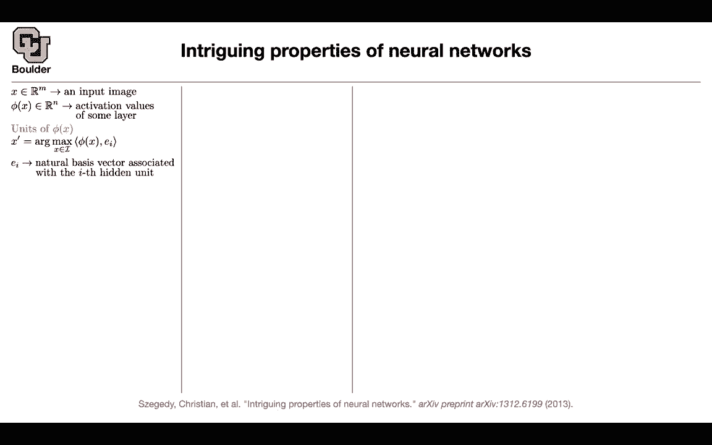

individual units，and the individual features that the，neural network learns。

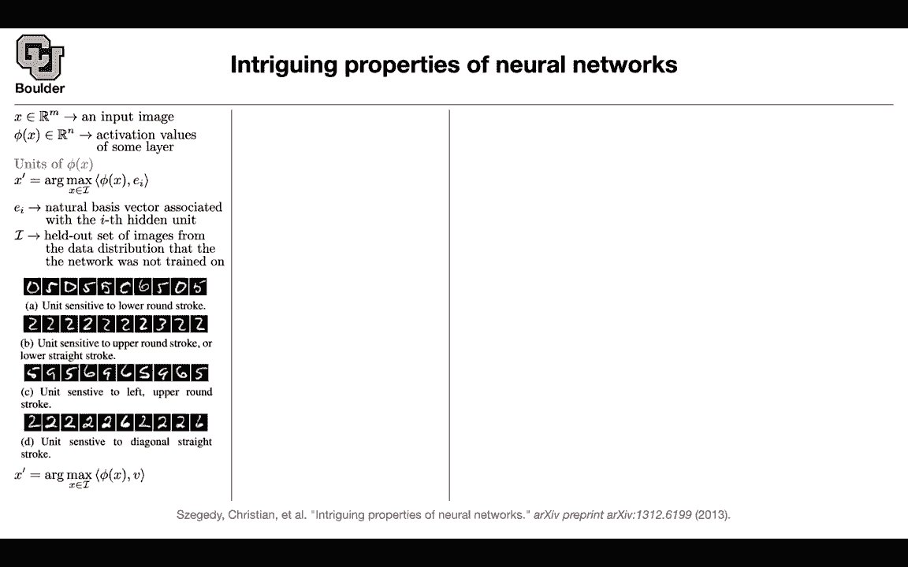

and basically any random direction in，the space。

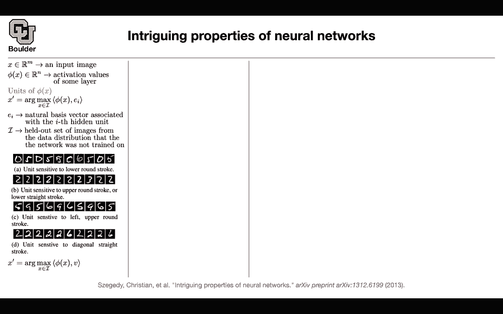

spanned by our neural network is，interpretable，you can actually start interpreting any。

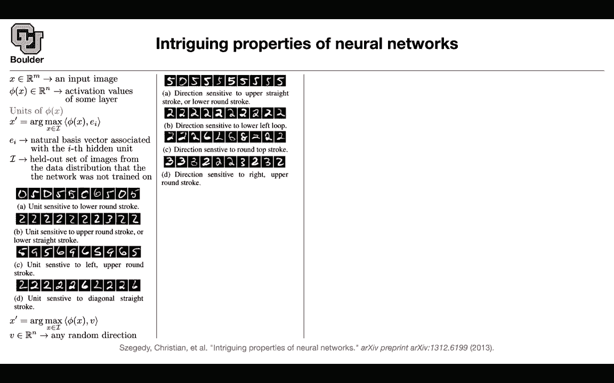

random direction，in the space so the message is that the，entire space。

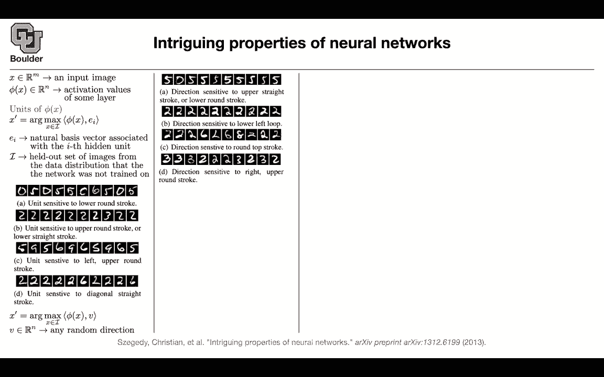

matters it's not only a single，unit but the entire space then we。

started with this observation，that neural networks have some blind，spots。

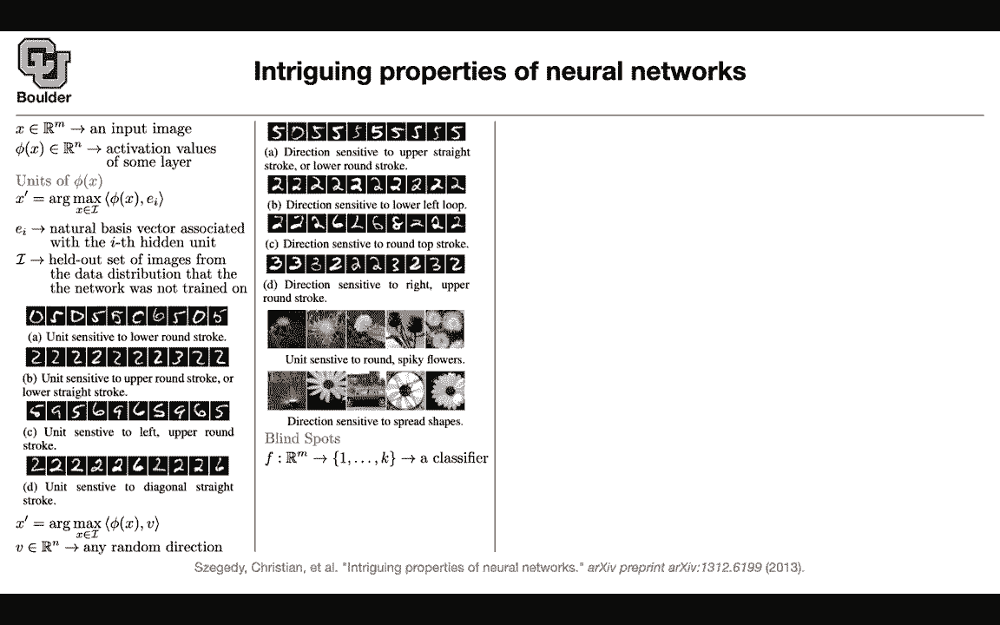

and to find the blind spots we have to，solve an optimization problem。

trying to find an image as close as，possible。

to our original image such that，our network is going to make a mistake，with 100。

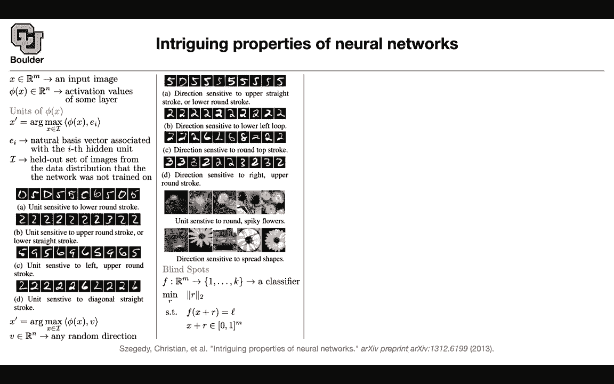

uh failure rate and this is what we call，a targeted attack。

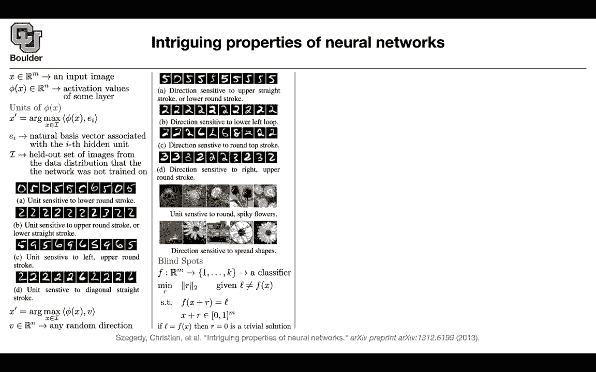

that's why l has to be not equal to f of，x because otherwise the solution is。

trivial to that problem，but then we said solving this problem is。

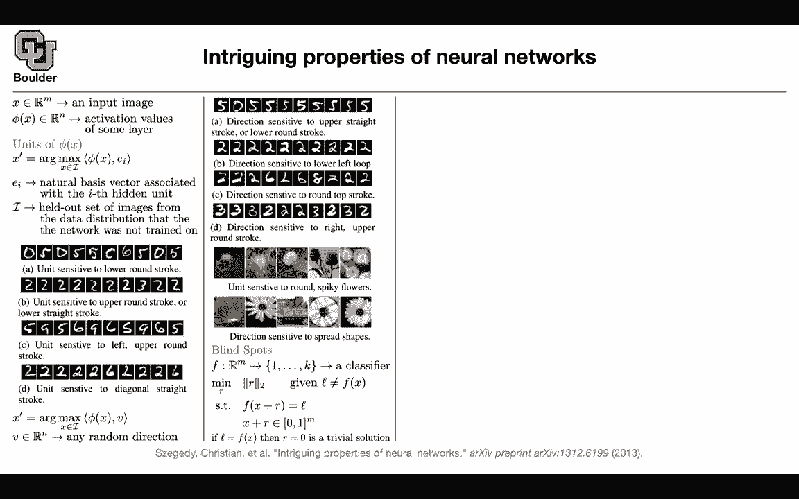

difficult so you try to，come up with a different objective，function using our loss function。

basically enforcing this equality is，difficult。

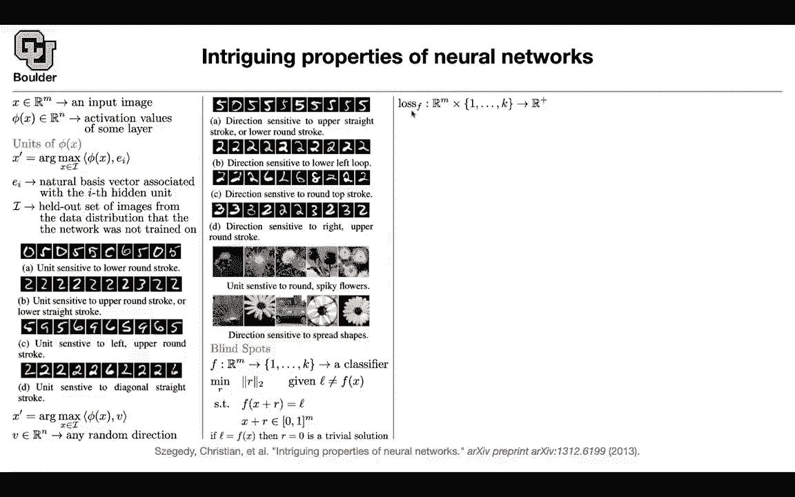

but you can take a look at your loss，function，and use that as a surrogate to。

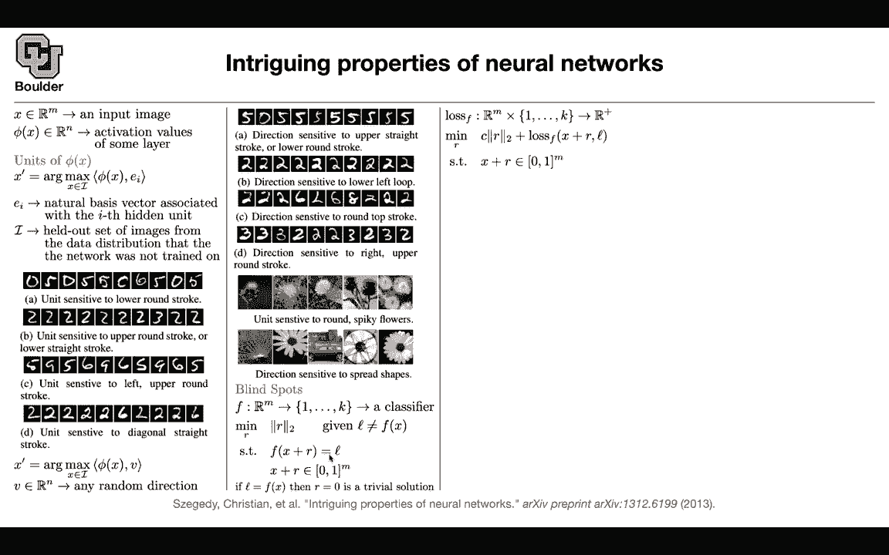

approximate this equality，and then that problem you can solve it，with lbfgs but it has to be box。

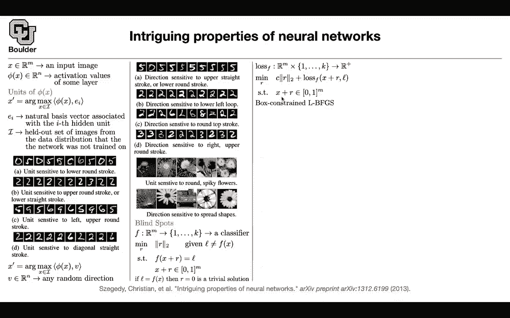

constraint because we don't want to go，beyond the limits from 0 to 1 because we。

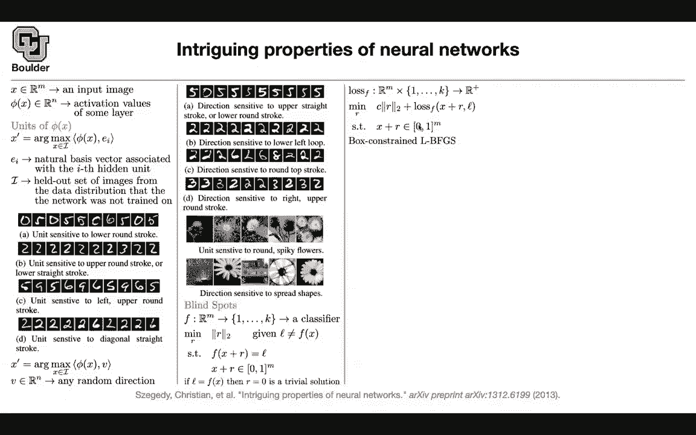

are normalizing our images，and using that we were able to。

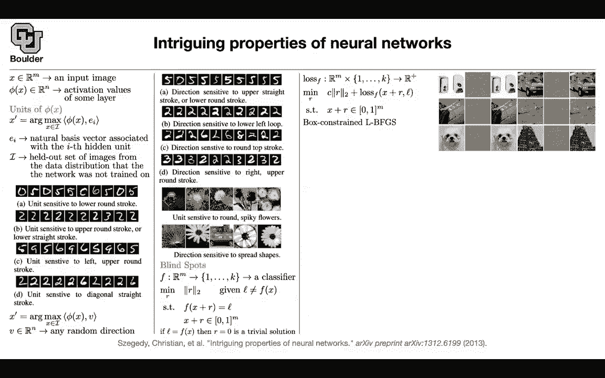

start with an image add a noise to it，and then，make our network make a mistake rather。

than classifying it correctly it's going，to classify this。

as an ostrich actually all of these，ostrich。

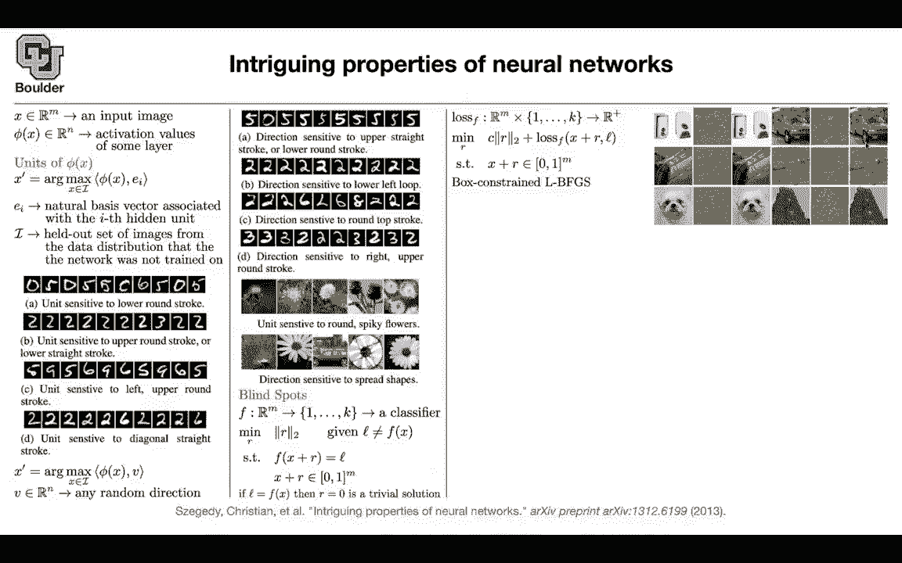

or similarly here and that's going to be，our l，but then a criticism might have been，that。

maybe you don't know your network that，you're attacking maybe you don't have，access to the。

internal structure of the neural network，that you're attacking。

and uh it turns out that you can create，an attack，on a network of your own choice of your。

own choosing，and your own data do this exercise and，find the corresponding。

perturbation and that perturbation not，only is going to mess up with the。

network that you have access to with a，high，probability the same perturbations。

are going to confuse other networks and，this means that，there is a cross-model generality to。

these adversarial examples，not only its cross model but also its，cross data。

but something i forgot to mention last，time，this uh these are hyper parameters of，our training。

and for instance 10 to the power，negative 4 10 to the power negative 2，and 1。

they correspond to the weight decay so，whenever we are training our neural，network using。

stochastic gradient descent we are going，to do a weight decay and that's。

equivalent to doing l2 normalization you，can say，this is 10 to the power negative 4 times。

your parameters the norm of your，parameters squared that's for，regularization。

so with different regularization level，and even different architectures。

you're able to attack different，structures，yes with the neural network that you。

start with you're going to be able to，attack it and make it make 100 mistakes，errors。

but then the same attack is gonna cause，the other networks to make huge mistakes。

with a high probability，any questions so far so the general，conclusion。

was that adversarial examples tend to，stay hard，even for models trained with different。

hyper parameters，and these are hyper parameters the，the weight decay and different。

structures depth and，width of your networks the problem is，even more serious。

you can actually have different training，data sets，and these adversarial examples are going。

to generalize，across training data so what we are，seeing here are different structures。

trained on different data sets and still，these adversarial examples are being。

effective in attacking those networks，and it's just not about things being，random。

it's not about if you add gaussian noise，for instance，with the highest standard deviation to。

your images，and hope that that's going to be an，attack no these are。

carefully designed perturbations so to，find this perturbation you have to solve。

an optimization problem，and as you can see these are more，effective than adding just random noise。

and the standard deviation of the，perturbations are equivalent。

so these are just not just random noise，these are carefully designed。

attacks for that particular image so，there are two conclusions here。

these examples are effective across，trending data，and across hyper parameters and network，structure。

and that's why this is a serious problem，and this is a serious observation。

that this paper made and they started an，entire new field，of designing new attacks and then trying。

to mitigate，those that do the attacks and trying to，fix those attacks and avoid them any。

