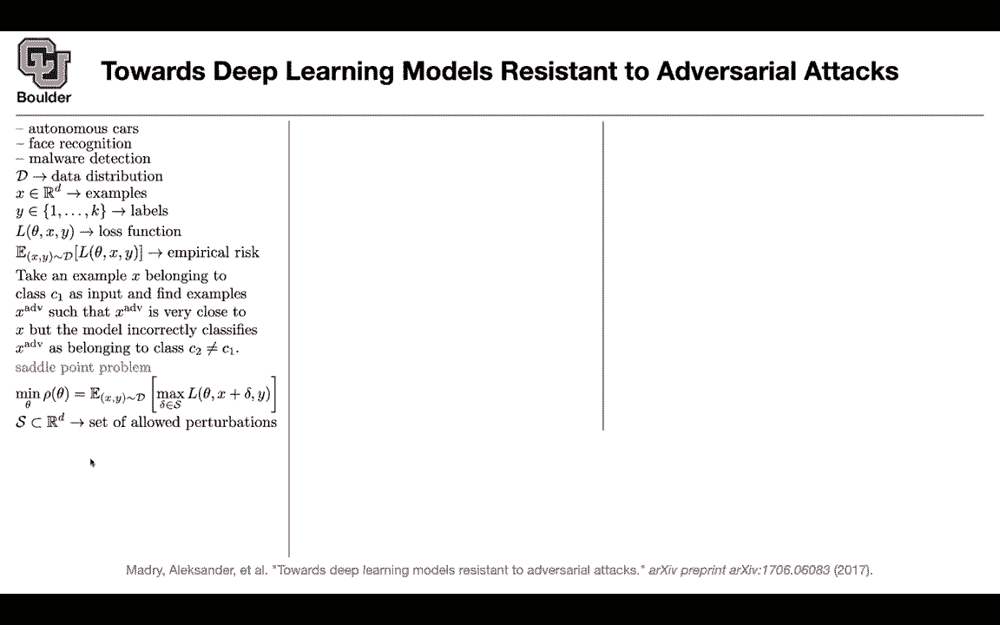
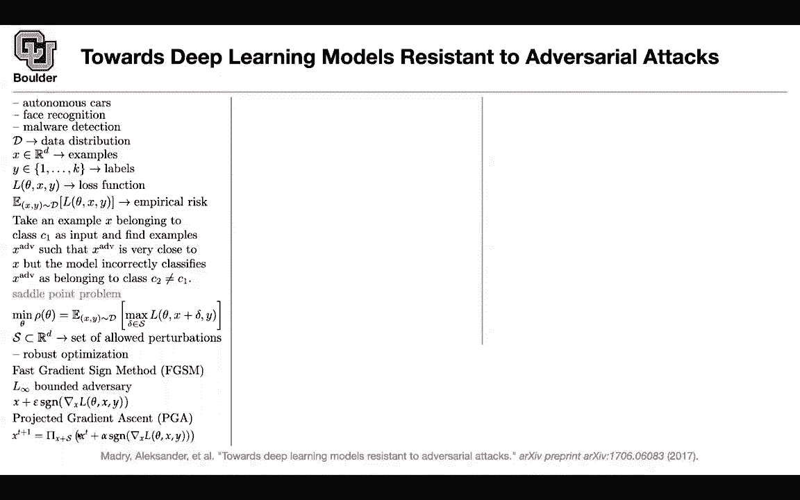
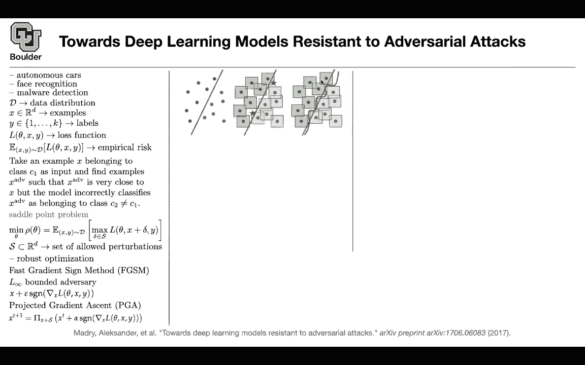

# P46：L23.2- 稳健优化 - ShowMeAI - BV1Dg411F71G

so we all know whether the applications。

the applications are in autonomous cars，autonomous vehicles，face recognition malware detection the。

one for malware detection is really，interesting。

you are making your malware detection，system，to make a mistake and that's dangerous。

is that defeating the entire purpose of，coming up with an algorithm，to detect malwares or to detect。

anomalies，for instance you can have a camera in，smart cities。

you can have a camera that is monitoring，the traffic。

and you want to have an algorithm that，is，capable of detecting anomalies for，instance a car is。

driving on the other side of the road。

because the driver is drunk，and imagine you have an algorithm that's，going to make a mistake there。

or you have an adversarial attack to，that type of an algorithm。

okay let's now go into the details of，the，math behind this paper you have your。

data distribution，and a little bit of notation you have，your examples。

that are coming from your data，distribution and you have your labels。

and let's say you have k labels or 1，1000 labels，you usually have a loss function which。

is a function of，the parameters of your model and the，ground truth。

the examples and the corresponding，labels and we usually minimize the。

empirical risk which is basically。

data，and we know it by now that the objective，of coming away that were several，examples。

is that you take an example x it belongs，to class c one。

this is your input you want to find an，adversarial example。

that is close to x in some norm but then，you want your，adversarial example to be incorrectly。

classified。

as c2 rather than c1 so i went through，this because i wanted to introduce。

what is c1 what is c2 and what is x adv，and what is our x but we know what is。

the objective we saw it before。

where，this is your objective rather than，minimizing the empirical risk。

you add a perturbation to your input you，say x plus delta。

now you have a delta in your loss，function and you want to do something，with it。

loss，so this is acting as an adversary you。

want to find，delta in a set of acceptable。

perturbations for instance these，perturbations should be small，and at the same time you want to。

maximize your loss that's the objective，of the adversary。

and the objective of the algorithm is，in general is to try to minimize the。

parameters of our model and what is，s s is a set of acceptable perturbations。

for instance we want them to have a，maximum l infinity norm of epsilon。

that's an example so rather than，minimizing，that objective function now we are。

trying to minimize，an objective function that is trying to，be robust。

at the same time and there is a huge，literature on robust optimization。

so this is the first paper that is。

trying to relate，adversarial attacks or find the。

relationship between adversarial attacks，and robust optimization so the。

robustness here comes because we're。

looking at the，one worst case we're looking for the。

maximum over delta so it's，it's going to highlight the like the。

worst case scenario whereas before with。

empirical risk，get。

get average down so exactly so here you，don't have any worst case scenario。

because these are your actual data set，here you're sort of。

augmenting your data we saw this also，in this second paper of this series that，we covered。

with fast gradient sine method with fast，gradient sine method we were coming up。

with new adversarial examples，and we were then adding that to our。

dataset we were augmenting the data，now you can do a similar thing here you，can have it。

you can add a perturbation to your input，try to maximize your loss。

that's going to be the worst scenario，and then，try to minimize the worst case scenario。

and this way you hope that your。

algorithm is going to be robust，and is it the case that every single，data point。

x gets its own worst case perturbation，delta that。

when we're considering this yes exactly，okay thank you，so delta is x dependent so we came up。

with fast gradient sine method，we covered it for fast gradient sine，method we had。

l infinity and where is l infinity，coming into place。

now coming into the picture it's coming，into the picture，when you're defining your s you want。

your delta，to have a particular l infinity norm。

or an l infinity norm of less than or，equal to a threshold。

that，if you try to maximize this objective。

function with respect to delta，you can take a gradient step you can say。

x plus delta forget about the sign now，the gradient of your loss is gradient，ascent now。

so you're taking the step in the，direction of the gradient of your loss，function。

to maximize whatever whatever that's，inside that。

objective function but then you need the，sign because you want your perturbation。

to be inside your s to be，an acceptable perturbation because if。

you have a constraint it's a constrained，optimization，you take the gradient you compute the。

sign you add epsilon and that's going to，give you x，so it means that fast gradient sine，method is。

problem，and this is how the algorithm is going。

to work a batch of，inputs x is going to go in and let's say。

your batch size is 1 for now，so an input goes inside your algorithm，you compute your loss。

and then you try to maximize with，respect to delta you can maximize it to，the end。

do i don't know thousands of iterations，maximize it to the end and then。

plug that delta inside your objective，and then。

compute the empirical risk or you can，just take one step，trying to maximize this objective and。

doing，so is this clear the idea is that fast。

or the message is that fast gradient，sign method，is a special case of finding trying to。

solve the satellite problem is this，clear，that's clear okay perfect you can。

actually try to，solve that saddle point problem by，taking multiple steps。

of gradient descent or actually gradient，essence because you want to maximize，that loss。

but it's going to be gradient ascent it，has to be projected because。

we need to project into this space you，take a step but then you have to project。

it and so when we say that projected we，just mean that we're taking the sign。

and just multiplying by an epsilon。

that's within，the space we're talking about here this，s yes。

for fast gradient sine method yes that's，enough okay，but when you take multiple steps now you。

are taking multiple steps。

take xd plus one uh as a function of xt，so you're doing multiple steps of。

gradient ascent，okay but then at each time we're at each，step of your optimizer。

you need to project it into your space，you want to be near。

x and basically you want your delta to，be inside this。

space of acceptable perturbations，depending on the。

norm that you choose so that's the idea，rather than taking one。

step you can take multiple steps that pi，is a projection operator。

and what's the what's the x plus x，notation form x plus s。

is just a set it's going to be x plus。

delta for all delta in s okay，so it's perturbations that are close to。

x yeah that was a great question，so x plus s is x plus all of the deltas。

where delta is in s so what's the，intuition。

for saddle point problem let's say your，norm is an infinity norm。

and you try to minimize your empirical，risk and that's what you're gonna get。

and usually you're gonna end up with a。

couple of hard examples，like these stars and that star once you，introduce。

a box because now we are doing l，infinity。

and x plus uh s is basically this box，that you're seeing。

you have x plus delta and that's going，to give you the box。

now we are making the life of our，classifier a little bit harder it rather。

than finding a simple line，it has to try to find a curve trying to，respect。

those boundaries i think i'm one minute，over time，for those of you who have questions you。

are more than welcome to stay and ask，and for those of you want to leave you。

can leave so that's a great。

question wouldn't that line over fit the，data actually you're gonna have。

more data now anything，that's within these boxes is gonna be。

data and these are，augmented data by perturbation can i ask。

a，slightly unrelated question um i。

uh i was looking at uh this week um，this thing called stochastic forward。

passes，which are just essentially like leaving，dropout on。

during inference to get uh and then you，produce like a distribution of。

uh predictions instead of a single，prediction um。

i'm curious if something like that could，be used，to protect against adversarial attacks。

where instead of just，taking one taking your one prediction。

you sort of produce a distribution of，predictions that may be。

given that these like adversarial images。

are so close to，uh like they're hardly they're。

indistinguishable to the human eye，it seems like that might be effective uh。

i think that's a good idea。

you can actually try it and see whether，drop out is going to help with average。

examples，is this actually a defense mechanism but，you haven't heard of it。

being being used i don't think so。

okay interesting the best of my，knowledge i don't know okay，thanks so much did that answer your。

question。

yeah but it still seems that depending，on your training data。

uh even if you're perturbing and，augmenting you may，actually miss some test cases you know。

if you have some test cases close to the，boundary，yes that's going to happen regardless。

but this is not an overfit。

because your true data are still these，the circles these are just augmented。

data and your algorithm has to respect，that behavior，after doing the saddle point。

