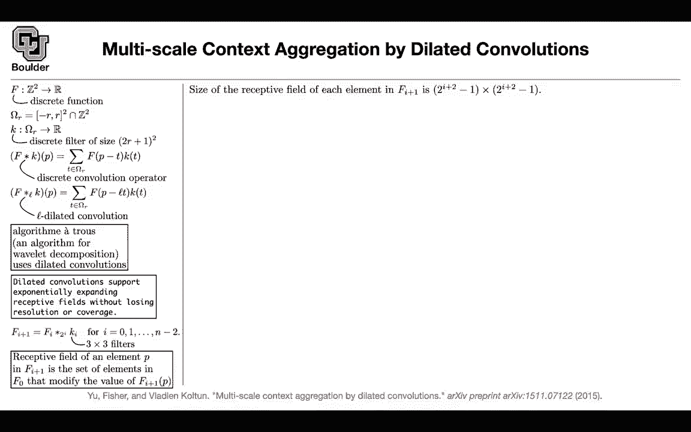
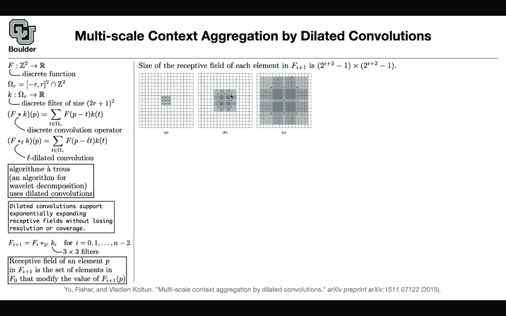
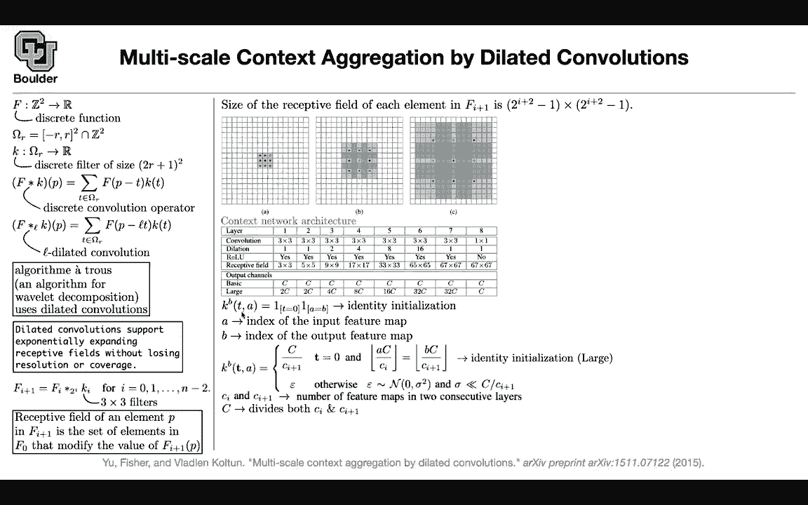
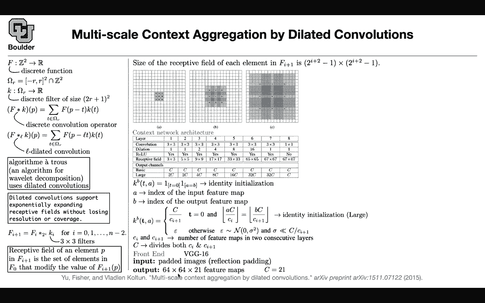

# P66：L32.1- 扩张卷积 [续] - ShowMeAI - BV1Dg411F71G

So last session， we covered the lab， and we started covering。

Context aggregation because context matters when you want to do semantic segmentation。

And this paper is nice because it's going to give us a new perspective on convolutions as well and it should be able to help us put the pieces of the puzzle together because we know about convolutions and convolutions have been around I don't know things forever so there are not something new but how are they related to the convolutions that we see in computer vision these paper is going to give us the mathematical formula so you can think of your images as functions you can think of your kernels as functions and you can convolve them and you can introduce dilated convolutions and for this paper it's very important for them to make a distinction between mind terminology some people use as convolutions some people use dilated convolutions。

Some people use convolutions with holes， et cea。That's okay you're going to see that in different papers but if you want to be precise dilated convolutions is the correct name because originally it was Ats it was an algorithm it's the name of an algorithm and it was for vlet decomposition but and they were using dilated convolutions so probably a better terminology is dilated convolutions rather than at convolutions but it's not a big deal it's just terminology potato potatota it doesn't matter that much but the cool thing is that you can use dilated convolutions to support exponentially expanding receptive fields which is nice and the way you do it you're gonna start working with powers of two as your dilation factor or dilation rate。

And you're going to keep convolving with three by three filters。

 and this is going to enable you to have a very large receptive field。

 And this is a precise definition of what a receptive field is any pixel in your original image that's affecting。

The current pixel in your current layer through do some computations。

 that's going to be part of your receptive field and when you do powers of two。

You're going to end up with the size of your receptive field exponentially growing the deeper you go。

 the size of the receptive field is gonna grow exponentially and last session we started discussing this and we have some discussions over what this figure means I think it's better to think about it this way。

 These red points are the points that are directly affecting the current pixel in your current layer and these nine points are the ones that are affecting the center point in your next layer and the dilation factor originally is zero is two to the power zero that's going be a one So that's just a three by three convolution and that's going to be your receptive field Now you have a convolution with a dilation factor of two for the next layer and this is a di So these nine points the red ones are going to affect a single points in the next layer and each one of these points have a receptive field。

of three by three because of what we just discovered from the previous layer So these ones are gonna to have receptive fields of three by three and the original the final receptive field is going be this in the original image Now let's go to dilation factor of four two to the power2 So these points are going be four pixels apart and these nine red pixels in this layer are going to affect one pixel in the next layer and each one of them have a receptive field of this speak and that's coming from panel B of this figure So each one have a receptive field of that size and if you put everything together the original receptive the final receptive field of these operations is going be bigger and it's growing exponentially and then we move on to context network architecture So what network architecture are they using the first two。

Layers are going to have a dilation factor of one and then the dilation is gonna be powers of two and you're gonna have two architectures in terms of your channel size。

 One is the basic where the channel sizes are the same and the other one has channel size is being different but then it's a matter of training this network and when they trained it when they set behind the computer and they trained it the network didn't converge and it had to do with the way that you have to initialize your network so initialization matters you can use identity initializations for your filters and apparently that solved the problem because now you're taking your image and initially during the initial phase of your training。

 you are just pushing your image to the end it's just the identity map and we know that identity helps we saw that in residual network paper resnets so it's trying to be at least initially similar to a residual network and then later on depart from it。

Based on the training， how the training goes， This is where the basic architecture。

 if your architecture is having different channels from one layer to the next one like from here to here and from here to the next one then you cannot use this identity mapping anymore。

 it's gonna be a little bit more complex to initialize and to come up with identity initializations or as close as possible to identity and this is just the generalization of the formula as you see up there and to see that C and C plus one are the number of channels number of filter maps in two consecutive layers。

 So for instance， it's gonna to be 8c and 16 C。 and let's assume they are the same。

 let's say we are with the basic network for now and C is a number that's dividing both of them。

 So that's gonna be the common divisor and let's say C and C plus one are the same。

 So when you do the division you're gonna to get the one here C divided by that is going。

Give you A because these are the same and that's gonna to give you B。

 So that's gonna to give you the identity initialization。 So yes。

 it's a general formula compared to that one。 And there is a question for those A and B indices。

 we are assuming a flattened feature map， not really So you have two components to your kernel one is taking care of your pixels T。

 and if you remember T is a number is a pair of numbers from negative r to our it's a pair of integers So that's gonna to be your index and what we are saying is that on the diagonal of our image of our kernel we are setting up one then we are setting a bunch of zeros of diagonal and channel wise。

 these are gonna be matrices your kernels that are taking you from one dimension to the next one from dimension C to the next one and the diagonal of that matrix you have also the identity one Otherwise it's0 Yes。

 so。

Question is A B T or each dules T is a pair of numbers。

 pair of integers from negative R to R A is a scalar， B is a scalar these are。

Your matrix entries。

T is a tool ball A and BR scalrs or integers Does that answer your question It says here that that a is the index of the input feature map say it again right right here in the where your cursor is below it says a is the index of the input feature map and D is the index exactly so these are a scalrs and T is a pixel T is two dimensional a is one dimension because we have like multiple input feature maps in multiple output feature maps I think is exactly yes in a feature map is like an array basically your a matrix exactly so each feature map is a tensor it has a bunch of pixels and it has a number of channel but in the end you're going to get an identity out of this out of this can initially that's your initialization and you let it train what is the backbone or what is the front end of your network that's going be vG16 and your input or added images and。

're usings reflection padding like unit using and in the end you're going to get a lower resolution tensor with 21 channels because you have 21 classes in Askcal VC and then you have to increase the resolution go back to the original resolution and then you you do your prediction so there is an sampling going on after this layer and let's compare this to fully convolutional networks and with deep lab the previous late paper that we covered and deep lab multical multi scale images and with this front end and dilated convolutions constructed this way you are getting more context and because you have more context of the entire image you have a bigger field of view you can increase the intersection over unit that your metrics and qualitatively these are the type of。

Predictions that you're gonna get This is your front end if you add the context using dilated convolutions。

 you are able to get rid of some of these confusions that your network is making and when you add CRf。

 you're going to get better results and we know what CRf is we covered it last session is just a post processing step and you can compare it with the ground truth So these are really good predictions does that CRf was the CRf we talked about did that also include some RN or is this different the CRf no that one didn't include any R but you can include but whatever you do that's a post processing step and in terms of numbers front end your basic network。

 the large one is doing the best in terms of mean intersection or union if you add CRf you're going to add a little bit of improvement CRf we can apply to any。

The predictions of any network， so it's going to improve the prediction and any other questions before I move on to the nexty perfect。

