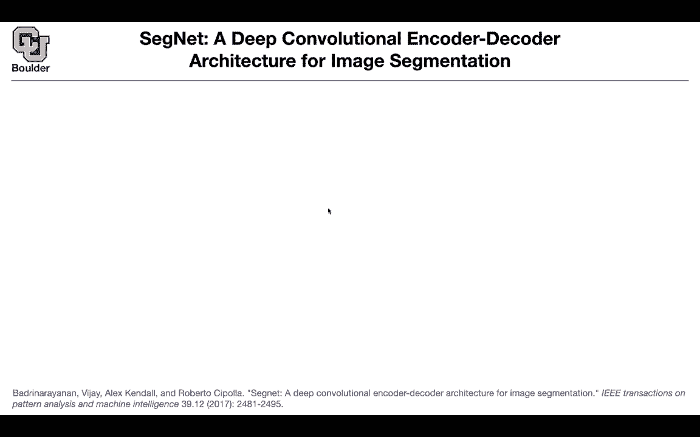
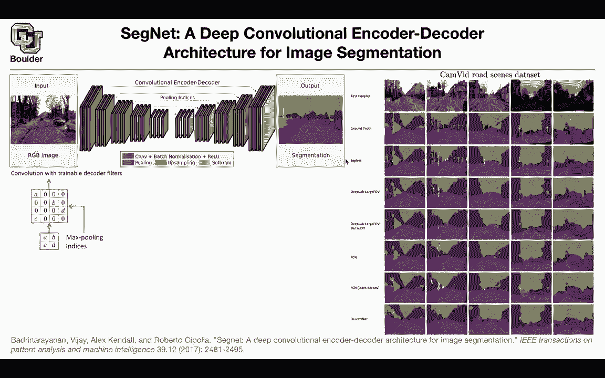

# P67：L32.2- SegNet - ShowMeAI - BV1Dg411F71G

So far， we had to do up sampling and we were doing it using convolutions to the up sampling using deconvolutions。

 or we were using a simple。By linear interpolation or even copy and paste your pixels from the low resolution to the higher resolution you just copyamp paste there is another way to increase the resolution from one layer to the next one and we saw the idea before when we were doing visualization of our network the first paper about visualizing features of a neural network and that was these switches that we were remembering the index of the pulling layers in the forward path and then when you wanted to increase the resolution we would just copy and paste the outputs in the correct location of where the switches was recommending so the idea of these paper is very similar to what we saw before so this is different from unit what you are doing here these are a bunch of convolutions and these green ones are pulling layers so that we know that one is straightforward for unit。

You take that and copy and paste it here and then you use a theconvolution What these guys are doing is you don't copy the input。

 you just copy the indices you just remember the indices after the pullinging where did you put and then you take the output of this layer and because you remember the indices you're just copy these you're just gonna copy these pixels of values in the corresponding indices that you remember from the previous layers so to be precise this is what's happening and this is just the switches this ABC and D are let's say the output of these convolution at this layer this is ABC and B and then you take the indices from the pullinging you remember where you pulled you take those pooling indices and then you just copy a in the correct location you copy D in the correct location because you remember the indices that you pulled from。

The maximum locations and do the same thing for the rest and the rest of the network is very simple rather than using decomvolutions you're gonna use convolutions with their own layers with their own weights and biases etc so this is really smart but the idea we saw it before where we were visualizing features of any neural network so is is clear Yes so the question is do you feel the rest of them with zeros yes you feel the rest of them with zeros but you are putting your value from this layer in the location that you remember when you are pulling and remember pool is the reverse of them so when you are doing pool you had some numbers here and the maximum one was located on the upper left corner so you remember the upper left corner for the pooling and when you are doing the up sampling you just copy a in the correct location the one that you remember Does't answer your question the question is is it gonna cause the output map to be sparse it is sparse here。

At the first up sampling， but then because of these convolutions what you get here is not going to be sparse so no what you get here after all of your convolutions is not going to be sparse does' that answer your question perfect any other questions。

And apparently this simple idea is doing very good look at the ground truth and look at the predictions of segments at least qualitatively it's doing a very good job。

 even getting the fine details to acceptable accuracy but this is not the case for the other networks' definitely not the case here you are missing your trees you are missing your lamps etc。

 this is fully convolutional networks and we covered all of these papers so the simple idea is working very good and in terms of mean intersection over union it's getting 90% 90。

4 for your mean intersection over union here's another example of indoor scenes and now you're starting to see the applications one is self driving cars and the other one is for robotics and in terms of computational time and hardware resources it is comparable to the rest of the networks that we saw before。

when it comes to CPU inference memory it doing the best because all you need to do is just copy the indices。

 just remember the indices and that's going to be cheap these are integer values and you don't have many of them any questions before I move to the next paper。

