# P76：L35.1- 空间金字塔池化 - ShowMeAI - BV1Dg411F71G

So we started object detection， I recently saw a very nice application and thats for recycling compost versus noncomos objects。

 you can have a robot arm and that robot arm could be having some vision system powered by these object detection systems。

 and then if we forget about the mechanical part which is about grasping objects which is a totally different problem and if we focus on the vision part。

You can have a classifier and an object detector that's going to detect compost versus noncompost and then the robot arm is going separate them one after another。

 So that's another application that you can keep in mind when we go through object detection so we started with the metric which is a totally different metric compared to what we are used to。

 It's not accuracy anymore we are doing a different task and we need a different metric to measure the performance of our algorithms and in the end we came up with mean average precision and then we moved on to the algorithm to one of the first algorithms trying to solve object detection using deep neural networks and convolutional neural networks and they were using a lot of pieces and then the only part that they were using a deep neural network was the feature extractor the rest of it。

Extracting region proposals and classifying regions is what has been in the literature for a long time。

 so the only part was extracting features so you don't need to do feature feature engineering anymore and in the next papers we are going keep moving towards an end to end training and end to end object detection basically getting rid of these region proposal algorithms like selective search and getting rid of the support vector machines etc and making everything end to end using deep learning so let's start we saw that a drawback of the last paper was that you needed to。

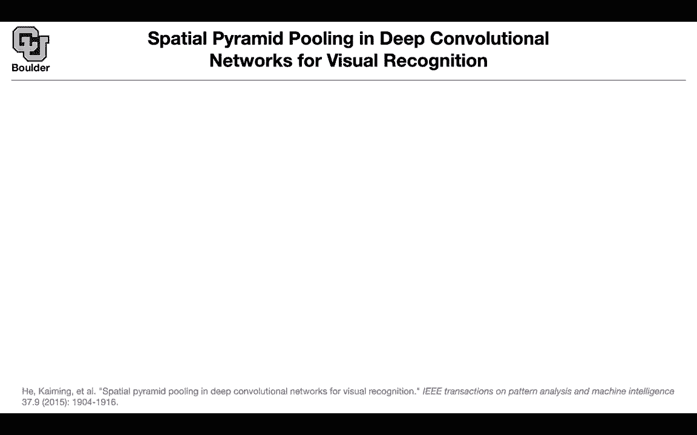

Crop your image， either crop it or warp pit part of your image that was within your bounding box because then you needed to push it through your neural network and these neural networks needed I don't know。

220 of 70 something pixels by 27 something or 224 pixels by 224 pixels as their inputs So you had to either crop or warp and then push it through your neural network to get your features So that's one problem and the other one is that you needed to apply your convolutional neural network thousands of times for instance。

2000 times or even more and these are costly networks。

 Why did you have to do that because you had multiple regions that are being proposed to you and then you had to take that region crop it or warp it and then push it through your neural network get your features and then do your classification for that part of the image so that was costly these paper came along and said。

Don't have to actually crop and work and you can actually share a lot of computations by using spatial pyramid pullinging and we saw spatial pyramid pooling when we are doing semantic segmentation as well So how is it going to work You're going to change your classifier This is your classification network up until this part there is an input image there is a convolutional layers and then you're going to get your feature map at some convolution after some convolution and that's going to be your input that we're going to work with then you're going to divide your inputs into bins it could be the entire feature map could be a single bin or it could be four bins or it could be 16 bin so your create bins out of your last convolution layer and then the rest of it is pulling you just do an average pulling or a max pulling there you just do。

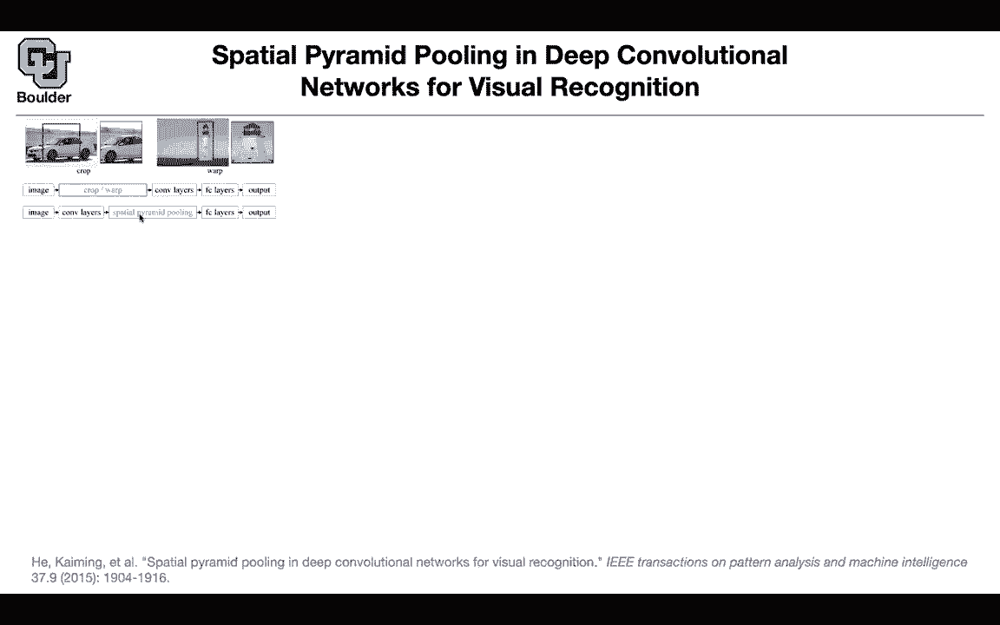

Average pulling or max pulling per each bin。 The first one is gonna give you 256 numbers。

 That's the size of these feature map and then you're getting rid of your pixels。

 so that's gonna to give you 20 and fixed6256 dimensional vector。

 The next one is gonna give you four of those 256 dimensional vectors。

 The next one is going give you 16 and then you're concatenate all of them together and then you can push you through your fully connected network through the rest of your network。

 The cool thing is that this vector is now fixed dimensional it has a fixed length。

 This pulling could have different sizes but it doesn't matter because youre you' are in the end going have one plus4 plus 16 of them and you're pulling a different sizes for your bins so you can have different sizes of the pixels here P dimensions So let's say a by a is the feature map size。

That you end up with after your con5 for instance， for VGG is going to be 13 by 13 and let's say you want to divide that feature map into n by n bins for instance two by two like here then you're going to define your window size and the window size is going to be adjusted automatically it's a function of a and N the ones that you chose that's going to give you your window size that's going to be the window size of each one of these bins and and the stride is going to be the floor that's the ceiling this is the floor of a over N so maybe some pixels are going to have overlap but the overlap is very small when you do your striding so this is how you're gonna implement that that was the classification network and the advantage of that is that now you can input images of variable sizes into your network so you don't have to input24D2 24。

By 2 to any4 anymore you can put any sizes for your images and push it through your network and do your classification That's from the classification side of things But when you go to object detection something interesting happens on your input image There is a box you can take that box and project it into your feature and that's gonna to correspond to a window on your feature map so you begin with a box。

 you push that box through your convolutions and that's gonna to give you a window you don't even actually have to push the box through your convolution operators。

 you can just compute that window where it's gonna to be located because it's a rectangular grid and things are gonna be nice you can actually compute the size of this but then what you're gonna do is take your image push it through your convolutions only once and that's the part of the computations that you're saving you push it through your convolutions only once you take that window is you compute it's very easy to compute that。

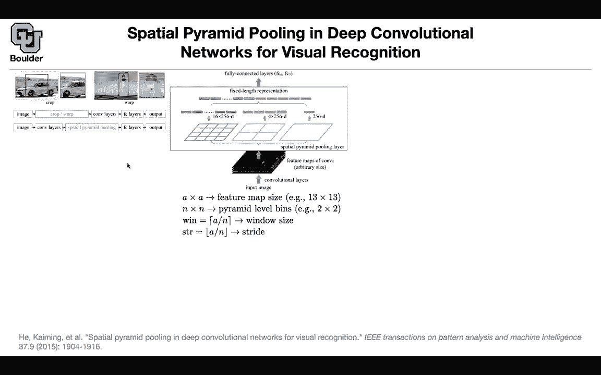

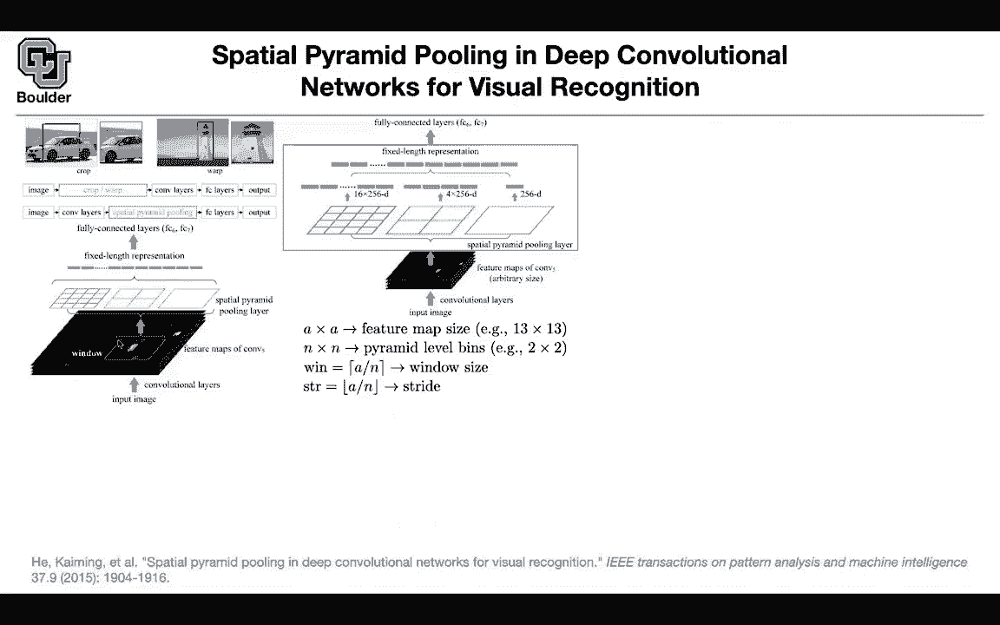

Once you have that window you do your spatial pyramid pooling it's going to give you a fixed length。

 This is going to be your features that you're going to use through the rest of your algorithm so what you need to do now is just do your computations from this point on so that's the computational cost per region proposal and you're pushing your operations your you're saving a lot of computations by only taking one image and pushing it through your convolution so these part of the computation is saved the rest of it is going to be repeated multiple times so does this makes sense what you are saving and where we are saving computations。

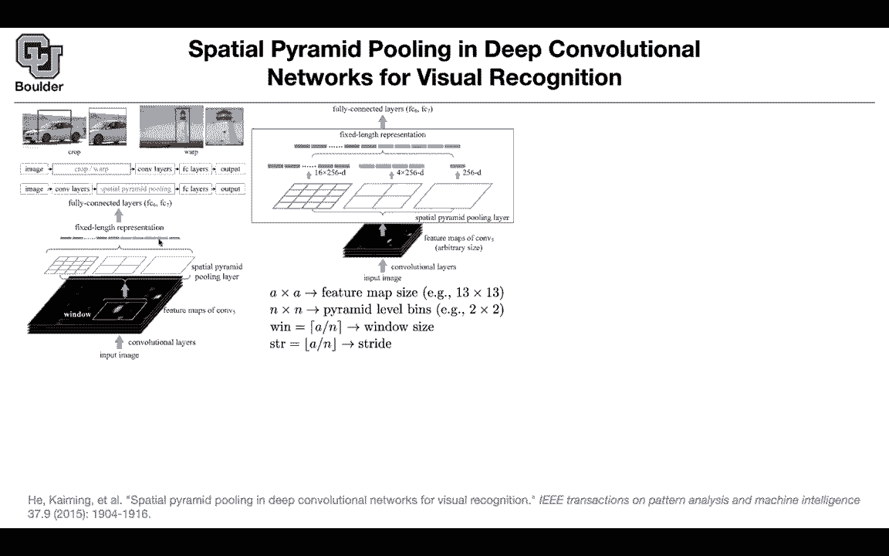

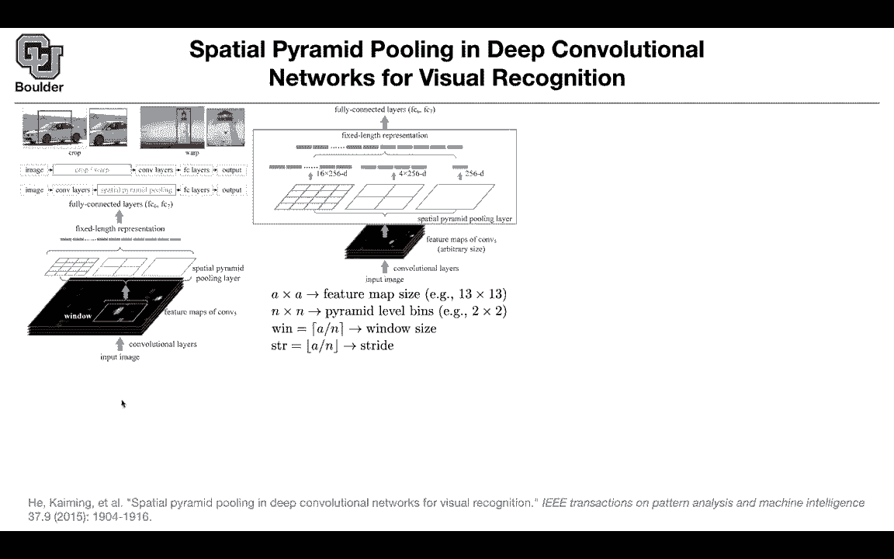

And this is this is different than what we just talked about on the right there where in that case were looking at the whole feature map。

 but now we're looking at like a subwind of the feature map exactly so this one was some modifications that you have to do to be able to input images of any size to your network because this is going to be your backbone then you're trained that on imagenet and then you're going to do some transfer learning here then once you're here this window you can compute it for instance if you you know that down sampling size of your convolutions so it's very easy to compute this window once you have that window you can take a look at your feature maps。

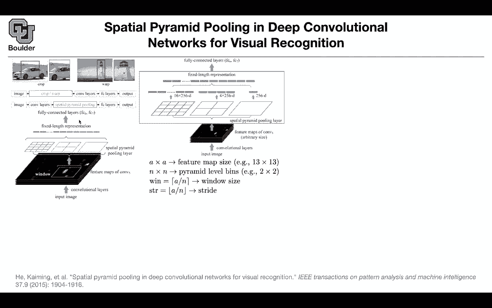

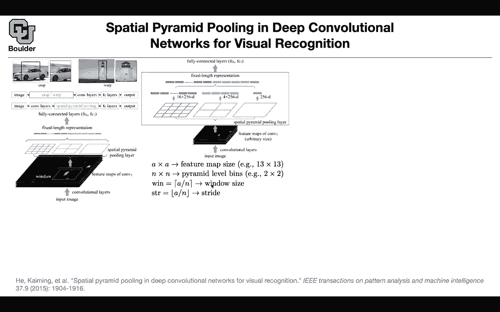

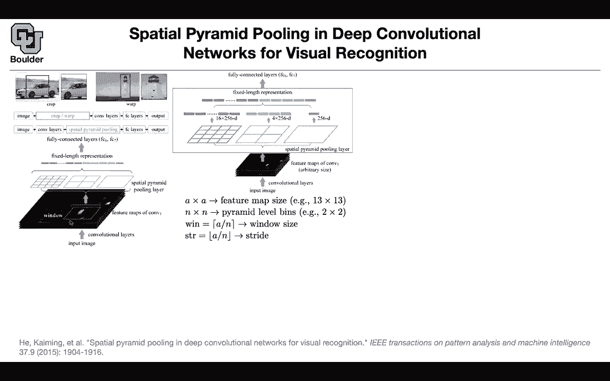

And then compute features per each window that you might end up with and the rest of it is the same as before and this this fixed length representation is the same dimension whether it's a representation of a window or whether it's a representation of the entire image exactly and you can just do then like the the window with the ceiling and the floor division just gives you a different value exactly okay perfect。

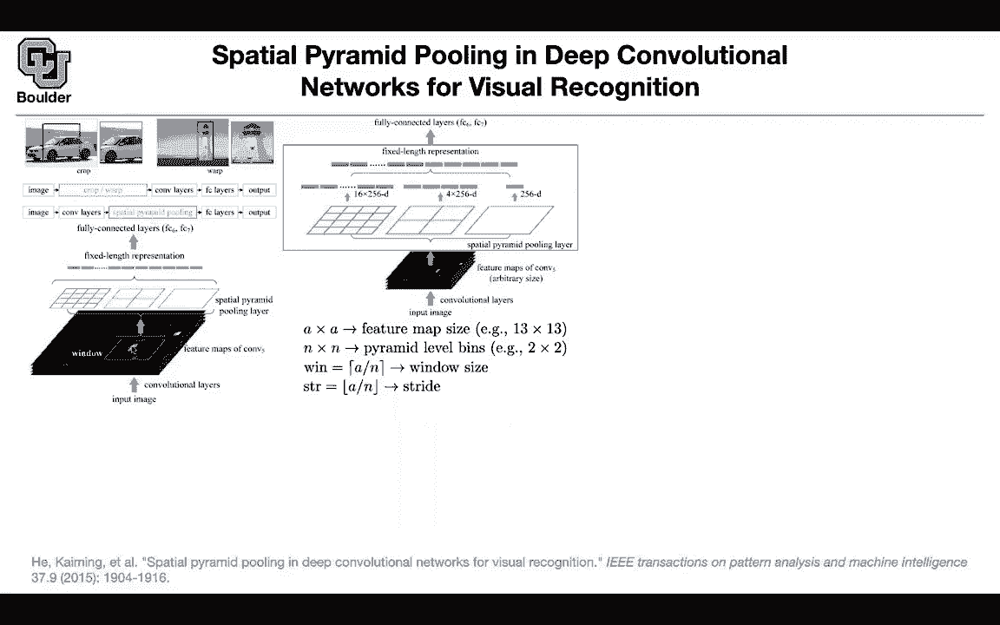

So the cool thing is that this fixed length representation doesn't depend on the size of on the pixel size of the input It's always gonna have that length as long as our window isn't isn't smaller than like 16 pixels or something or I guess you could add padding in that case and still do it Yes so the problem might happen when you have very small objects then you might have some trouble you might lose in terms of your evaluation metric that could be a drawback but it still it's worth it you're saving a lot of computation because previously you had to take that part of the image。

 drop it or warp it push it through your convolutions multiple times thousands of times now all you need to do is push it once push the entire image through your convolution only once and then do your computations from these point on multiple times after the window after the convolution and is this window still being determined by that search。

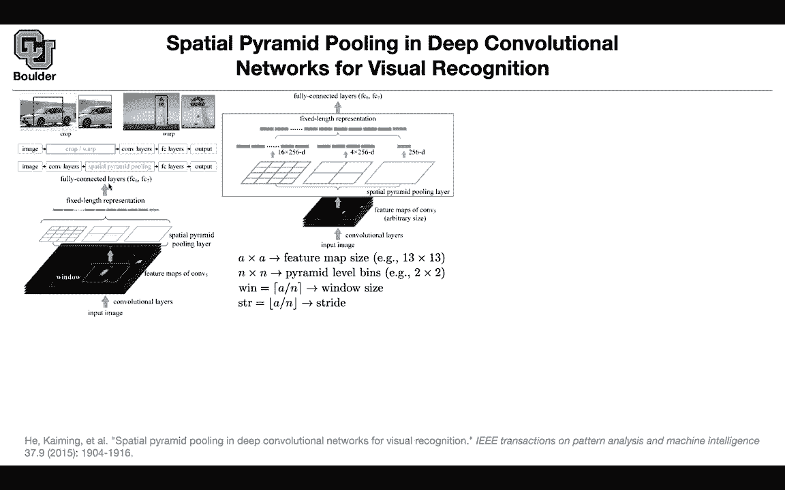

We talked about in a previous paper， Yes， so everything is the same as the previous paper except for this part Okay。

 that you are sharing computations and these are some of the results qualitatively。

 you can identify the bus and the car and locate them。And in terms of numbers mean average precision。

 this is doing very good and it's much faster compared to RCNna and it's much faster faster because of the amount of computations that you're saving。

Computational savings comes here because you push an image through and find the feature map only one time and then you just subsample that to get these fixed length representations a whole bunch of times and before you would subsle first and then push the subsampled image through a convolutional neural network exactly so you first have to crop it crop part of the image and then warp it crop and warp and then push it through your convolution Yes。

 you're evaluating the network itself like tens of thousands of times for all the different croppings Yes and remember we want these algorithms to be fast because we want to apply item on video data and there is a frame rate per second that we have to these algorithms have to be fast so RCN wasn't that fast so it wasn't practical for real cases so you needed to save computations to make the algorithm useful okay is this sorry is。

Also called ROI pooling because I've seen that name No that one is what we are going to cover now so I needed to cover the previous one first to convey some ideas of why we are doing what we are doing Now fast our CNN is going to build upon the ideas that you just saw of spatial pyramid pooling it's going have a similar idea and it's going to be about ROI pullinging。

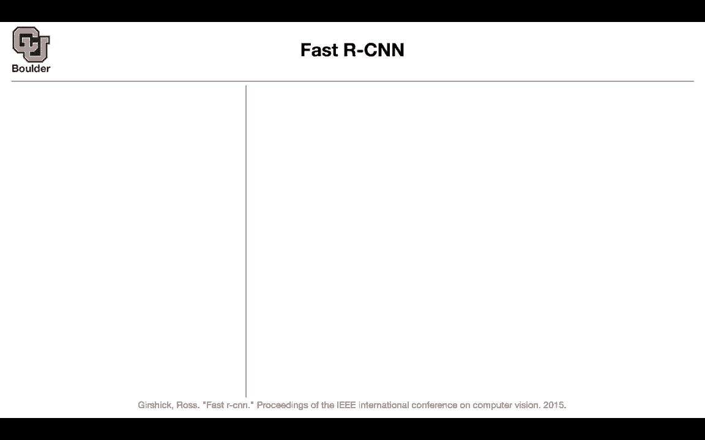