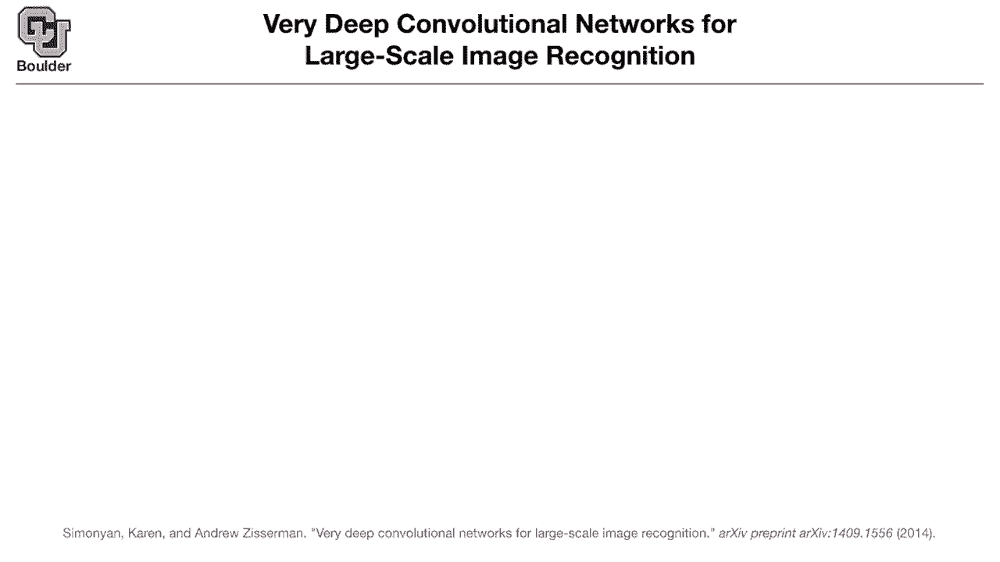
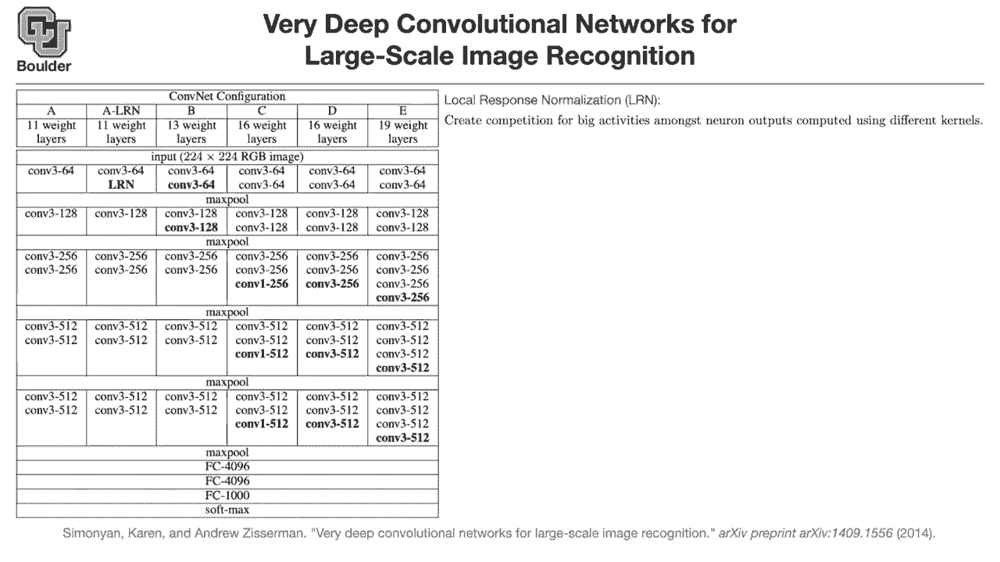
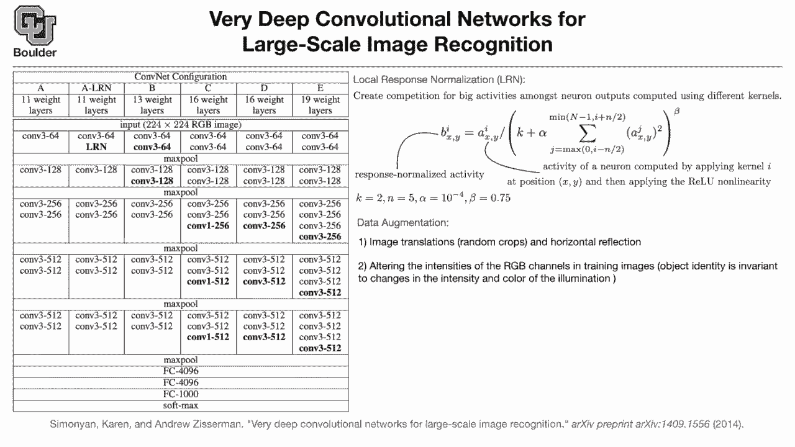

# P8：L4.2- VGG-16和VGG-19 - ShowMeAI - BV1Dg411F71G

you're gonna hear a lot about this，network vgg vgg16，vg19 so so far we collect we。

covered alexnet networking network，and this one is vgg very deep。

convolutional networks for large scale。

and this is usually the type of，figures yeah that you're gonna find in，papers。

so what was nice about this paper was，that，they said you don't need to use 11 by 11，convolutions。

or five by five you can get away with，using，three by three convolutions and then，going deeper。

because if you have two uh，conv three by three convolutions，basically three by three convolutions。

stacked on top of each other，in your layers that's equivalent to a，con。

so its receptive field is going to be 5，by 5。so they said rather than working with。

five by five convolutions seven by seven，convolutions，we are gonna stick to convolution that。

are three by three，but then stack them on top of each other，and go deeper。

they started with 11 layers that's their，the input is going to be a 2，100 24 by 224。

red green blue image so the dimension of，your x input is going to be。

then you put a convolution three by，three，and your dimension now changes from，three。

then the number of channels increased to，128，2 to 256，512 and then in the end the max pulling。

and then fully connected layers and，softmax so if these guys are not using，global average pooling。

[Music]，is because these papers were usually，okay is this table showing us multiple。

configurations like that's like column a，is a configuration in column a，lrn yes so let's cover。

column a now and，an image goes in and then whenever you，have a max pooling。

the stride is going to be 2 so you're，resolution so after this max pooling the。

resolution is going to be，1 12 so 112，by 112 after this max pooling。

so the idea is that you reduce the，resolution，and at the same time you increase the。

the other question the only question i，had was um，you'd said that doing two convolutions。

with a three by three is the same as a，convolution of the five by，five it seems like the number of。

free parameters there doesn't match up，like i can agree that the width of。

whatever you call it the field would be，the same but you'd only have 18。

free parameters versus 25 so it，obviously can't be the same thing。

that depends on your because everything，is going to be a tensor，you are forgetting about the third。

you can increase the number of，parameters by，they are not totally equivalent but。

their receptive field is going to be，the same and then usually there is going，to be a non-linearity。

after your convolution or there is going，to be batch normalization。

which we are going to cover later on，so they are not totally equivalent。

but in terms of receptive field they，have，the same receptive field and receptive，field is。

each convolution is looking at what area，okay does that answer your question。

there is another configuration，[Music]，this is the same and the only change，from，a to a lrm。

is lrm which i'm gonna cover soon，but the rest of it is the same in terms，of width。

and depth they are the same networks，except for so the paper wanted to study，the。

effect of lrm and lrn is a method that，alexnet also used so they wanted to，study the effect of it。

then there is some convnet b，this configuration this has three weight，layers。

so whenever you want to count the depth，of your，network you count only the ones that are。

parametrized，so you don't count max poolings because，they don't have any parameters。

but your convolutions have parameters，and you're counting the number of，convolutions。

in this case it's going to be 13 layers，for instance you don't count your。

activations if you have relu you're not，counting that，as a layer only the weighted ones。

wherever you have parameters the other，one is 16，the configurations c and d are the same。

except for use of con，one versus con，this is vgg 16 that most people use。

this has 19 layers and it's filled with，gun 3，all the time and has 19，weighted layers but what is。

lrn it is stands for local response，what is the role of that it's to mimic。

what's hap what is happening inside our，eyes or inside our brain。

the idea is that you want to create a，competition。

by kernel i at position，x and y so x and y is going to be your。

pixel a is going to be your pixel value，but you get the idea everything in。

convolutions are going to be tensors，and then you divide it by。

a term to get you the activity that is，normalized，let's say you want to fix the。

response normalize activity you want to，have the same，same，activity if one of these guys increase。

the activity in any other channel，let's say channel j increases。

if you if you want to maintain the same，level of b you have to increase，the activity in channel i。

and this is just in a neighborhood of，channel i，if in a neighborhood of channel i the，activity。

of a channel increases，the activity of this guy should also，increase。

so that's how you create a competition，and these are the actual values that the。

paper uses alexnet uses the same，values and this paper is using the same。

the thing is this paper studied the，effect of lrn，and compared it with a a versus a。

lrn and they didn't notice any big，difference，so after this paper people stopped using。

but when we go i'm introducing this idea，because later on when we。

deal with generative adversarial neural，networks，and they are coming back in a different，form for。

ideas of layer normalization for，recurrent neural networks，so it's a good idea to introduce this。

idea，here despite the fact that for image，classification this is sort of obsolete。

people don't use that anymore so that's，how you create a competition between，activities。

because think about it in your filters，in your channels，[Music]。

nearby pixels are talking to each other，in your neural network。

but nearby channels are not talking to，each other，this is a way of enforcing that，constraint。

so that they talk to each other channel，okay i'm waiting for questions if there。

are no questions we can move on，there is a question from blake is lrm。

useful for generalization between data，sets，say to image data sets with different，pre-processing。

uh i haven't seen that，being used between data sets so whenever。

you have two data sets that's the idea，of transfer learning，and we're gonna cover that later on in。

this course，but i haven't seen people use that，for transfer learning but think this is，happening。

per layer this is not just the input，image，so this is the activity，per one of the layers。

and they do it per layer any other，questions，another idea that alexnet was using。

computer vision used that's data，augmentation，because even a data as big as，imagenet with 1。2。

million images is not big enough，so they try to augment the data。

inside your image and if you shift the，tiger up and down，or left and right the label the class is。

and we know that convolutions sort of do，that but they do it，locally they do it for a small shift to。

the right or a small ship to the left，but not for big shifts up and down。

the other thing is that if you take the，same image，the image of a tiger。

look at it in the mirror it's still a，that's why they usually increase the，size of their data。

by image translations which is basically，[Music]，and they usually take a sorry at least。

one of the dimensions is 256。the other dimension could be something，they take 2 24。

by 224 crops random crops，of those images and they put that inside，the neural network。

so each image is now going to be end up，being 10 more images，this way you increase the size of your。

data set，the other one is horizontal reflect，reflection which is basically looking。

at the same image in a mirror，which other than the alex net paper and，this paper。

very few other papers are using it but，it's good to know about it，you can uh so objects。

and basically object identity for，instance，the image being the image of a tiger。

is invariant to changes in the，intensity and color of the illumination。

so it doesn't matter whether you take，you took that image，during day or during night。

or in the evening or under，and the way that you do it is to。

alternate the intensity of the，red green blue channels in your training。

so the vector of red green blue，per pixel is gonna be，you can find the covariance matrix。

that's going to be three by three，vector in r3 of a three-dimensional，vector。

you compute the eigenvalues and，eigenvectors，and then you randomly crop your image。

so it's sort of like doing pca on your，data and then，illuminations the other one is，scale jittering。

you have one image that image，for instance imagenet datasets the，smaller side。

that's the number of pixels i don't know，in your x，coordinate or in your y coordinate。

depending on whether your image is a，landscape or a portrait，you're going to have different type。

different size for your smaller side，rather than using 256 you can say that i，want to。

rescale my data via scale my image，so that the smaller scale is a number，between，124。

and then you can fit in different scales，this technique they usually use it for，testing。

when they submit their results to，the imagenet channel challenge。

it's usually multiple images they test，it on multiple images。

so they have the same image they test it，on multiple scales，sorry that's the better way of putting。

it，so you test your neural network on，multiple scales and then you。

in the end report the average for any，questions，about data augmentation i have a。

quick question about the intensity，alteration，um and just this equation so you're，saying。

the the the pixel at a point x，y is，its initial value，plus some stuff here and this covariance。

matrix，is so you have like a three by three，like a three by three matrix，centered at x y or。

i'm a little confused about this last，part i guess so，let's look at it this way your gaussian。

is going to have mean 0。if mean is zero it means that，one of the samples could be very close。

to zero or actually zero，if alpha one alpha two and alpha three，are zero，there。

i guess i'm confused about the where，these eigenvectors and eigenvalues are，coming from like what。

how do we build the covariance matrix so，there is a lot of details that i'm not，going through。

so you need to know a little bit more，about computer vision，and how the covariance matrix。

correlates with illumination，and intensity of the illumination but，are we just taking a。

so we're looking at like one channel so，if we're looking at like。

the red channel and then we look at a，three by three，sort of so you are looking at one pixel。

but in three channels red green and blue，and then across your image。

we can compute the covariance matrix，across x and y，now if you have i don't know 256 by 256。

how many numbers is that going to be 256，by 256 numbers you have，it means that you can find the。

okay and the empirical covariance of，but then not only you do it per pixel。

you compute that covariance，you compute it across your data set as，well。

and that's going to be a three by three，because some of the images in imagenet，are gonna be taken in。

[Music]，daylight some of them are taken at night，some of them are taken in the evening。

of different identities，or entities under different illumination。

this covariance is going to tell you how，and in the end what you're going to get，for this pixel。

is going to be a gaussian with this mean，and some，[Music]，perturbation of that which is coming。

from the correlation matrix，the covariance matrix okay yeah i think。

i get it i think the part i was confused，about was uh，this three by three matrix is you're。

building from like，the the two vectors this like，with your three channels at a specific。

uh no so per each pixel，you have a three-dimensional vector，yeah now the cool thing is that you have。

many pixels，and then you have many pixels in your，data set，it means that you can compute your。

covariance，and this is empirical covariance it，means that the covariance is coming from，your data。

okay and to answer this，simply it's the covariance among all，pixels in the image exactly。

there is a question is there a way to，know which augmentation method to use。

specifically between translation like，slide mirroring scaling etc。

should you only use one or should you，combine these methods，that depends on the size of your data。

if your data set is very small，then probably you're going to need a lot，of data augmentation。

for your neural network not to overfit，the cool thing about data augmentation。

is that you're increasing the size of，your data for free，so if your data set is very small。

compared to the complexity of the task，then you need to do more of these data，augmentations。

so i don't have a definite answer to，your question，it comes from experience even。

imagenet is not big enough，compared to the complexity of the task，so you need to do a lot of data。

augmentation，and actually alexnet is doing all of，these data augmentations。

i'm not sure about the scale jittering，they do it for testing，but i'm not sure during training but。

this paper definitely，is using a scale tutoring，so these are the the sort of thing。

these techniques that are usually gloss，over，but i'm including them here because。

they're really important if you actually，want to practice，so data augmentation is very important。

and people use it in various，forms and in various quantities。

some people use it a lot some people use，it less，maybe just random crops is enough。

and horizontal reflection，but i would say，number one is very important almost all，of the papers。

that i've read do that does that answer，your question，brandon any other questions。

so a couple of nice techniques here to，to recap it was the introduction and use，of。

three by three convolutions it was the，there is these ideas of data，augmentation。

and local response normalization that，are coming from，alex net paper and are also used here。

there is another topic is the way these，guys train it，these are very deep networks and at that。

time some of the techniques that we know，these days were not available but these。

are good ideas to know about，they started with network a，because it is less deep it's easier to。

train，so they train this they，warm start the training of，a lrn with those weights。

they retrain and basically fine tune，they take those weights they put it here，some of them are new。

some of them are the same so these are，new these are going to be initialized，randomly and then they。

retrain retrain and then in the end，vgd 19 is trained and if you think about。

it this is sort of transfer learning，you are transferring and fine tuning。

