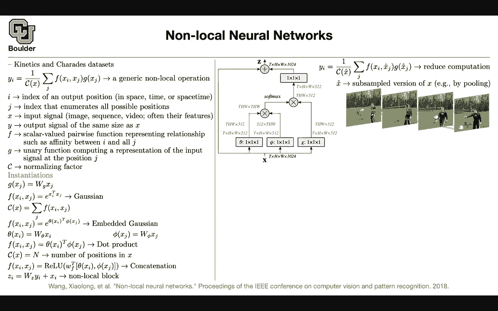

# P92：L42.1- 非局部神经网络 - ShowMeAI - BV1Dg411F71G

Let's get started we have been doing images for a while and then starting last week we are started with different types of data for instance a different type of data could be video which is gonna be a bunch of con frames of images and the task that we are interested in for now at least to begin working with video data set was a classification task a video comes in and we want to class for instance it could be action recognition what is happening in this video or what type of sport is this video about etc but then there are more complex tasks using video like video to video translation segmentation for videos when you want to be consistent in time you can do object detection object tracking and in all of those cases you want to be consistent in time So there is an entire field in front of us when。

It comes to videos and working with video data but I think for now we covered four important papers in this field and now let's continue with the next one which is about non-local neural networks so the method that's being introduced in this paper and the next one then not only are applicable to videos you can apply them to your images as well or even beyond that but the application the main application of nonlocal neural networks is videos it's introduced for videos we learned about kinetics data in the last session there is another data set that I encourage you to do exploratory data analysis on it if you have time or even after the semester ends if you are interested in videos but what is a nonlocal operation that's take a look at this general form and then I'm going to owe you a lot of details and specific definitions for these terms so there is why I won over。

Cf x the summation of F of X I Xj G of Xj so I need to tell you what is I， what is J。

 what are you summing over what is x what is y what is F what is G and what is C so I owe your these terms that's start I if we had an image this I could be the indices for our pixels now that you have a video there is also a time dimension so I is indexing not only the x coordinate of your image the y coordinate but also its time coordinate so I is indexing everything the output position in a space and time J is very similar to I but what we want to do is that any pixel in the output we want to pay attention to all of the other pixels not only in a space but also in time unless let's just call inposition so I is the output position and we want that I output position。

To pay attention to all of the possible positions in an image or or in a video What is x x is our input signal。

 which could be an image， which could be a sequence like sentences or speech which could be a video and these are their features for instance。

 if you have words your first come up with your word embeddings and then that's gonna be your features or it could be features of your the convolution or one convolution layer so these could be feature maps so that's your x it's not only the input image it could be the features in between your layers and y is the output the output signal it's gonna to have the same size as x same resolution and same temporal resolution and now that we know what is x we know what is y we know what is I we know what is J the question is what is F F is going to be scalar valued so it's not a vector gonna to be scalar valued it takes as input2 argument。

So it's a paraise function and it's going to represent some relationship between position I and position J。

 it could be how much position I is paying attention to position J and what is G G takes only one argument。

 so it's a unitary function， its output could be a vector because y could be a vector。

It takes us input the signal value at position J and Xj could be also a vector okay but I didn't give you much information up until now we just expanded these terms so it's now time to give you examples of what is G and what is F and see is a normalization factor So let's take a look at some examples for GNF G could be a matrix vector multiplication if you have fully connected networks it could be one by one convolution and it's better to think of this as a one by one convolution not only in the space but also in time So that's our G the vector goes in a vector comes out after matrix vector multiplication so how are we paying attention to the neighboring points in our image we can take a look at the dot product we can actually take a look at the distance between these two points that's also a value for instance。

 this is a vector that's a vector you can say X minus Xj and then the all two norm of that square。

and push it through your exponential that's an option。

 Another distance is this dot product distance and this is more it's easier to code this compared to X minus xj square because of the operations that we already have implemented in our I don't know in termsorflow p towards so you look at the cosine similarity distance and then you take the exponential and that's going to give you your f but then you need to normalize this otherwise exponential is going to explode and that's the normalization and after this operation F divided by c that's going to give you a subn So these actionss are going to be added up to1 they're not going to explode that's an example you can take a look at you can take these Xs and xjs push them through two functions phi and theta and that's going to be called embedded gaussian and what is phi what is theta they could be one by one conclusionvol Now you are parameterizing this。

You're learning your distance， you're learning your cosine similarity distance through an M two embedding matrices。

 And again， your C is gonna be the same as before。 So in the end， you're gonna get a soft max。

 Another example could be this phi and theta。 you get rid of the exponential and that's just the dot product of the two that's another example。

 and then in that case， your normalization is going be the number of terms。

 The number of positions in your x will be the number of pixels。

 Another example is just you take phi of X theta of Xj。 you cancatenate them。

 you multiply them by a weight matrix。 and then you take the non linearity。

 You take regular on top of that。 again， in this case， your C is gonna be n。

 then on top of everything。 We know what is X。 We know what is Yi。

 Now we can add a residual connection。 You take Yi multiply by a weight for it to have the same dimension as X。

 Now you're ready to。

Add them together。 And all of these， if you put them together， it's gonna give you non local block。

 We learned about convolutions。 This is another type of a block。 Your input goes in。

 this could have dimension of your time， a height and a width for your pixels。

 and then this could be the number of channels。 You take x。

 This is actually how you're gonna implement that。 You take x。 you multiplied by a  one by one。

 you actually convol it with a  one by one by one convolution。

 Now your dimension changes from 100 to 24 to 512。 That's our fee。 This is this term。 That's sorry。

 that's theta。 This is our fee fee is the same。 a one by one convolution。

 And then we had another operation here for G。 That's also a one by one convolution。

 And the way that you're gonna implement that is you flatten your tensor into a matrix。

 you flatten this one into a matrix and then。

Tranpose it。 Now you multiply these two matrices together。

 So this dimension there is a summation on it， so it's going to disappear and that's going give you a matrix of Tw by Tw and then you do a softm I guess it's gonna be a row softm Now everything is gonna add up to1 per each row。

 you take your G you flatten it， you reshape it and then you multiply this matrix which has this size Tw Tw by Tw 512。

 So in the end you're gonna get something that is Tw by 512。

 and this softm is exactly what you just it's embedded Gausian。

 you do matrix multiplication matrix vector multiplication then then you you reshape it back Now you want to add something that is 1001024 dimensional by 512。

 you cannot do that So you push the outcome through another one by。

One convolution to fix the dimension， this is what we just did here。 This is Wz。

 and then you add your residual connection。 So as you can see， this is not very hard to code it up。

 It's a very simple block especially I don't know if you want to code it in high to or tensor floor ks。

 etc。 It's very easy to implement that。 but there is a problem with these attention mechanisms and the problem is their cost。

 Each point has to pay attention to all of the other positions in your video or in your image So per each X there is a form of unlike convolutions where this summation is over a small window around the X。

 This is over the entire Xj。 So this is not cheap。 that's the computational cost that's not cheap。

 you can actually make that cheaper。

How rather than doing your summation over all of all of Xjs over all of your pixels and time snapshots。

 you can do it over a selected subset and how do you selected you can for instance。

 take your X push it through a pullinging layer and then that's gonna reduce the resolution for you Okay Any questions so I everything clear So let's see what happens after the training is done This is a video and let's say this is our X So X is gonna to be a pixel at a particular frame and we know that each X is gonna to have three dimensions。

 red green blue or it could be the channel dimension after the network is trained this is where this ball is paying attention to it's paying attention to the head of the person at the same time frame at different time frame still at the head of the person at the head and the ball So the ball is paying attention to the ball in another time。

Step paying attention to the ball on the head of the first。 Okay。

 let's apply this on a video and let's say this is your。

ToD convolution， the backbone is going be resnet 50。 So this is exactly Resnet 50。

 and then we are applying that on a video， perhaps frame by frame。

 So that's our network and then we are going to add their nonlocal lock。

 It could be added to the first layer， It could be added to the last layers。

 If you added to the later layers in your network。 that's a cheaper operation。

 This is our C2D baseline on this video top one and top five accuracy。

You can study these different choices that we have the Gaussian。

 Gaussian embedded Gaussian the duck product and kindcateation and you can see all of them are going to give you a boost in performance。

I don't think this study is decisive between these hopefully it's not decisive between theian embedded got product or cancateation I think these three are better than this one because they have more parameters you can also study whether your attention should be only in a space should be only in time or it could be in a space and time we know that there is a trade up there is always a trade up yes with a space and time you're getting more accuracy but there is a cost to it this is more expensive you have more points。

To pay attention to compare to time only or space only。

 but if you are willing to pay the cost then that's going to be more accurate we learned about inflated 3D convolutions in the last session we can add non local blocks to inflated 3D。

You can compare it to the baseline by 3D and one local network and then guess you are going get a boosting purple it's not only for videos you can do it for key point detection or you can also do it for Master CNN and apply to Coco dataset okay so it's a block that you can put it in multiple types of networks and usually you get more accurate results any questions is everything clear I guess' not sure how they how and where you add non local blocks to some of these networks Yes I know how right I mean you just call the block。

Where is is not clear me Yes that's a great question and that one I'm not covering because that's not the main focus of this paper but that's a great question if you want to actually implement it where are you going put your nonlocal block and you need to study that should I put it right after the image the input image should I put it right after rest2 rest3 Re4 and we know that there is a tradeoff if you put it right after your image there is going to be a lot of pixels and a lot of time steps so that's going make your method super slow or are you going put it after rest5 because here the resolution is four by seven by7 and that's going to be very cheap okay so I'm not going through a lot of details but that one you can find in the paper where they are putting it and what is the trade up Okay does that sound good。

Yeah， the trade off makes sense to me。I yes you are right。

 I'm not telling you where they are putting any other questions。

