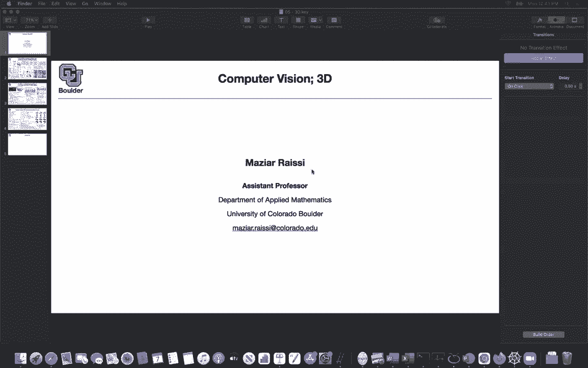
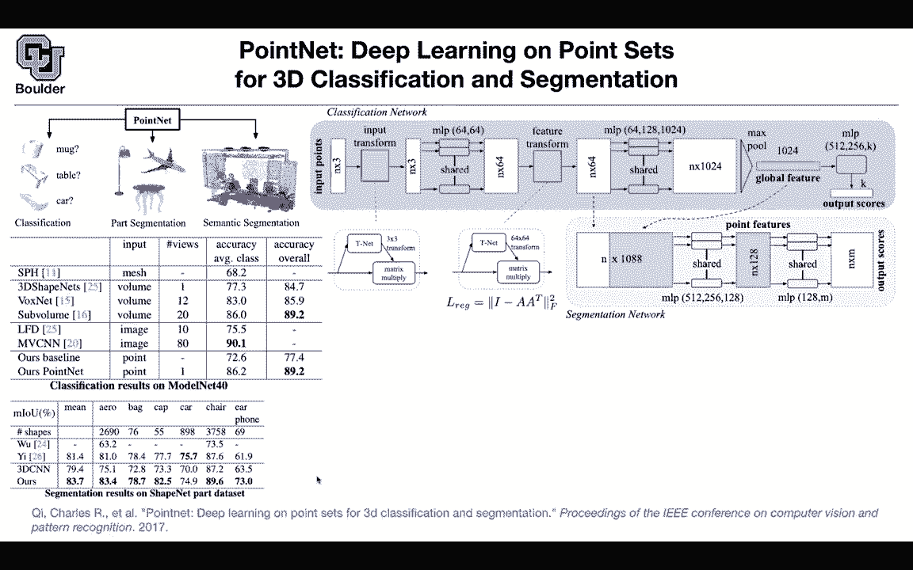

# P94：L43.1- PointNet - ShowMeAI - BV1Dg411F71G

okay let's move to 3d the world，around us is actually 3d，and i guess how we see we see objects in，3d。

it's not maybe computers，look at images and that's how they see。

these days using convolutional neural，networks，but i believe the way that humans see，are。

a 3d setup maybe we are，absorbing light in our eyes and then，that's going to be。

projected into some neurons and in the，end we're going to make some decisions。

make some abstract notation of what，we're seeing and i think，a good way to think about it or come up。

with the data，necessary to train our neural networks，is，rather than using images is to use data。

in the form of，lidar or structure sensors so lidar，stands for light detection and ranging。

i don't know the details of how it works，but in the end what you're going to end，data。

so in the end it's going to be a set of，points，it would be 3d points x y z coordinate。

or at the same time you could get the，color as the features，or you could get the normal to the。

surface etc，and these are going to be your features，but the problem is that these data。

are just a bunch of points it's a set of，points，unlike images or videos where your data。

were on a grid，keep，permuting your points in the set it's，still the same set。

so whatever method that you're gonna，design should be，permutation invariant if i take this。

point and put it here，there shouldn't be any difference okay，so these are just sets。

and we know that sets are permutation，invariant and what are the tasks that，we're gonna do。

first what are the applications you're，going to have applications in，self-driving car。

or robots or indoor navigation，etc and so let's start simple，and let's say our tasks are。

classification，but now our input is different it's just，a bunch of points。

and our training data is a set of，point clouds so it's a set of set of。

points so it's a subset of set of points，that's your training data and your task。

would be classification，could be part segmentation so you're，segmenting the parts of the airplane。

its wing its body its tail etc or it，could be，semantic segmentation so how are we。

going to approach that，one idea is that you could perhaps put a，turn your object into a mesh。

basically map that map your point clouds，and try to voxelize it。

voxel is a generalization of your pixels，now that you have some white cells you。

can use convolutional neural networks，3d and use that and that's actually what。

people use in the past，but the problem is if you like slice，there is going to be a lot of。

input space around your object so，your mesh is going to be very sparse。

another idea is to try to work with，point clouds，right away without voxelizing so your，input。

is going to have endpoints in it and n，could change，so，the mic could have a different n and。

your table，would have a different end and then each，point is going to have。

for instance three features x y z，coordinates，and the method that you want is that you，want it to be。

invariant to permutations of these，points and in the end that's the input。

to the network forget about what's，happening here，and in the end you want to get k scores。

and these are going to be your classes，so you want to take as input as set of。

points and you want to output k，scores okay perfect the first layer is。

not that important but for us it's not，that hard，we saw this idea before in a spatial。

transformer networks，where you took a an image，you mapped it through a neural network。

and in the end got a，3d three by three matrix and these are，parameterized this is going to be a。

matrix，and basically you have let's call this a，you're going to have a 1 1 a 1 2 a 1 3。

etc and these are going to be，the outputs of your network and that's。

going to give you a transformation，it's 3 by three this one is n by three。

you take n by three multiplied by this，matrix，and in the end you're gonna get m by。

three okay n by three，times three by three is gonna give you，an n by three matrix。

so this part is you're just transforming，maybe there is a better coordinate，system。

and you want to do a transformation，maybe there is some rotation，maybe there is some translation and。

that's what you're going to do now you，have a bunch of points again。

n by 3 the idea is that you take those，points，and you can think of these as one by one。

convolutions you just，apply a multi-layer perceptron that，takes you from dimension three to。

sixty-four，to sixty-four and you just put push your，points one by one。

after another one after another you take，your point，push it through the same mlp so it's。

shared and in the end you're gonna get，n by 64 matrix now you can do what you，did here。

but now in 64 dimensions so you are，going to end up with a 64 by 64。

transformation again you are changing，your coordinate system，but now in 64 dimensions now you do the。

same thing here，you take your points and you push them，one after another。

through a multi-layer perceptron these，are fully connected networks，with 64 hidden layers 128 and。

10 1024 you're gonna end up with a，with an n by 1024 matrix now，now you want your method to be。

permutation invariant，the cool thing about the maximum，function is that it's going to give you。

a permutation invariant no matter what，you do to these points，if you permute the rows the maximum is。

going to be the same，you，do the maximum it's going to give you a。

vector these are going to be your global，features，you can push that through another mlp，scores。

and you can use these ks scores for，classification okay and mog。

goes in a point cloud of mock and in the，end，k scores are going to come out you push。

that through a soft max and then，you know the correct label you're going。

to use your cross entropy loss and then，you maximize it，that's for classification how do you do。

segmentation，for segmentation we know that we need，both local features。

and global features similar to images we，needed，a global feature to give us an idea of。

what is in that picture，and then we needed to know the fine，details so you take your global feature。

from your classification and then you，just expand it，you just copy it row by row so it's the。

same vector，1024 1024 and it's the same vector that，you're copying。

and times and the rest of the features，for local，details you're going to just copy from，this layer。

and that's going to give you n by 1084，so it's 10 24 plus 64。 the rest of it，are a bunch of。

you can think after one by one，convolutions or，you take your points and you push them，through mlps。

point point wise it's gonna change the，dimension，you do the same thing one more time and。

then in the end per，each point you need m scores and，this method is going to give you that。

and then you can use your，pairpoint cross-entropy loss to do your，part segmentation or semantic。

segmentation，there is a minor detail here that，because this matrix is，heavily parametrized it has 64。

by 64 parameters it's a good idea to，regularize that，so you want that to be orthogonal or。

orthonormal because，this is identity okay that's going to，give you a transformation。

this is in addition to whatever，cross-entropy loss you have，you add this regularization loss in。

terms of results，you can have classification results on，this data set。

you can analyze that data set in your，free time，and then this method is extremely simple。

compared to the previous，methods this is extremely simple and，it's extremely。

successful in terms of overall accuracy，for instance this method is having uh 20，views。

of your environment this one only has，one view，you can do your segmentation shape net。

is a good data set for，your segmentation in terms of mean，intersection over union the method is。

doing pretty good overall and per class，it's really not that sensitive so this，is one of those uh。

ablation studies that you can do what，happens，if you use a lower resolution point。

cloud how sensitive is your method to，that so if you have a，low resolution input the method is still。

working，and here is another qualitative result，that's your point cloud，of data and this is your par。

segmentation sorry semantic segmentation，any questions so is everything clear。

perfect so it's an extremely simple idea，and it's working very good in practice。

but it has its own drawbacks，one is that to get these global features。

your method is looking globally unlike，convolutions，that were looking locally for instance。

each point was looking locally around，its neighbors，and then you had multiple layers of that。

this one has only one global feature，so it's gonna miss the fine grain，details。

and usually some of those fine-grained。