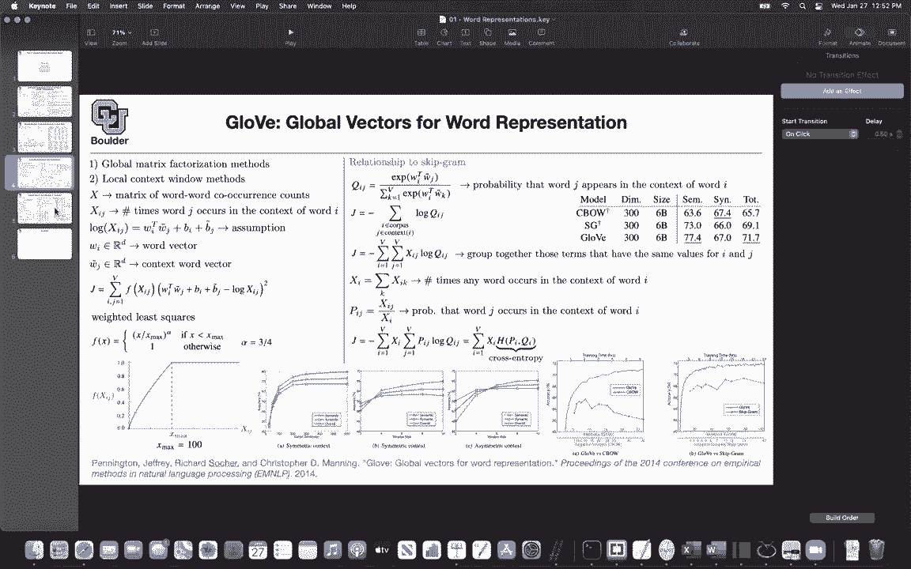
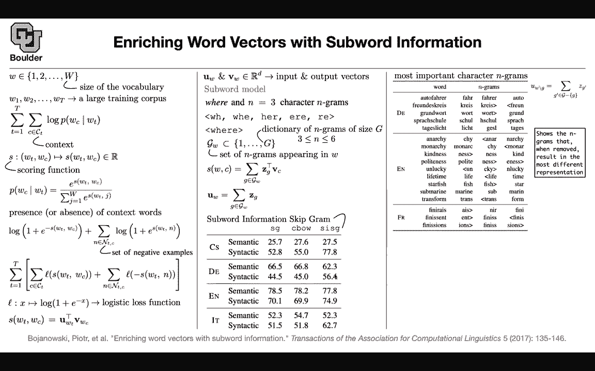

# P100：L47- 子词模型 - ShowMeAI - BV1Dg411F71G

So what have we done so far we learned about Wordwe through two papers and we learned two methods of doing it one was a Sgram model and the other one was continuous bag of words then we learned about G and we saw that it is sort of related to a Sgram model and the only difference is the distance measure that you're using one of them is using the L2 norm to come up with its distances and the other one is using the crossantropy but other than that it's a weighted list squares and this is a weighted crossantropy loss so there is a relationship between the two methods now the question is so far I was telling you how to deal with words in your vocabulary but what if there is a new word there is a rare word in the vocabulary that you haven't seen during training and it shows up in your test data how are you going to deal with that so there are these languages like German or even English that you combine multiple。

wordss together and then it's going to give you a new word so perhaps a good idea is to look at sub wordss rather than words not only you include your words in your vocabulary but you're going include sub wordss in your vocabulary as well so that's the idea of the next one so we are going enrich our word vectors with subword information that's a big picture but before we do that let me quickly go through a recap of what we have done so far with the skiprap model because we are going to generalize that so you have a bunch of words and you have a vocabulary of size W and each little w in this set is a word so it's going to be the first word the second word up until the last word in your vocabulary you have a large corpus of your words and capital T could be much bigger than capital W can somebody tell me why because words are repeated exactly so the same word can appear in multiple。

context and multiple documents so capital T is bigger than W and then we created this objective function and we wanted to maximize the probability of the words appearing in the context of other words So now see calliographic CT is the context of the word C the word t so any word in this context we are going to take a look at that and try to maximize the log of the probability so this is a skipgram model and now we are going to try to model this log of P if you remember we were trying to do that so this is a different perspective and different notation of coming up with the same formulation you are going to need a scoring function which is going to take two words the input word and the output word the word that you're interested in and its context and then it's going to map that into a score so the score is a value from negative infinity to positive infinite theory How do you come up once you have your score。

Then coming up with the probability is easy， you just apply the softmax on it the softmax function to take a value that is from negative infinity to positive infinity and make it a probability and it's actually going to give you a probability distribution if you do a summation over WT that summation is going to cancel by this summation it's going to give you a one so the probabilities are going to add up to one but then we said all that matters is the presence or absence of context words and that's why we came up with the idea of negative sampling so you don't need to write down that summation all the time because this is going to be in the order of 10 millions you can actually look at a word and say whether it's present or absent in the context of another word and the way we did it was using the sigmoid function and you're going to see why this is a sigmoid function it's actually one one over one plus exponential of negative x is the definition of the sigmoid function。

This is the log of the sigmoid function and you know that the negative of the log of something is going to be log of one over that something okay so we are using that probability as well so you can think of this as the negative of the log of the sigmoid function so this is for the positive case you want to increase the probability of your positive cases。

 the presence of words in a context and then youre going to show you a bunch of negative examples and we know that another property of the sigmoid function is that one minus sigma of negative x is sigma of x so this is basically one minus the probability and because it is one minus the probability you' are decreasing the probability of the negative samples when you maximize this entire objective function so increase the probability of the present context words and decrease the probability of the negative examples。

 the absent context words。I'm going to tell you what is the scoring function now so don't worry about that I'm going to tell you what that is for the skipG model can somebody tell me what the score was we did it we did it in the first slide exactly so you have a word vector for wT you had a word vector for WC and then you created a dot product between the two and that was giving you the score so does that answer your question Saggy yeah I know we also talked about how often words like the count how often they appear to get is that related No so that was that one was for the glove model so now you're confusing two concepts okay so this is the escapeG model and then what was our objective we would look at all of the words in our corpus and then try to maximize this objective function so youre increasing the probability of the words that are appearing in the。

text and decreasing the probabilities of the words that are not appearing in the context and this L that you're seeing here is just the logistic loss function。

 so it's the log of the sigmoid it's the negative of the log of the sigoid so this is exactly the same math as we did before and for word to V and in particular the skipgram model as the scoring function was that you had a word vector for Wt you had another word vector for the context and then you would just multiply them together so we did nothing here this part of the slide is what we covered previously but why did we do that because now if you want to encode the subward information the question is where can you do it。

What can you change， You cannot change your W。 You cannot change your corpus。

 The probability is still the same。 The log of the probability， so you cannot change that。

 that's your objective function。 This softmax you cannot change it。

 It's a still softmax you can approximate it by presence or absence of words there is some positive example some negative example。

 This is still our loss function。 this is a logistic loss function。

 So there is nothing to change there。 the only place that you can change is your scoring。

 The way that you're going to score two words。 So and that's exactly what we are gonna change to encode the sub word information So the rest of it we couldn't touch the only place is here So let's try to do that for the subword model。

 let's take an example。 let's say where is your word we are going create let's say character n grams and what is n and let's give an example。

 let's say n is three so we are。For character three grams What they're going to be is that you have the beginning of the word as an extra symbol in your characters and you have the end of the word as an extra symbol in your characters because you want to know where your word is starting and when it is ending so let's do that and create a character3 grams there is the beginning word W H these are three characters then you have W H E then you have H ER and then you have E RE and then R the good thing about these beginning and end characters is that if you have the word hair and this could be a word in your dictionary then you're gonna to have a beginning and end after that word and that's how you are distinguishing between this hair and the her as referring to somebody okay so these are different things so that if you were take the n equals three character and grand。

Her it'd be like car AG yes， okay， so you're going to have that。

 but then what we are going to do here， we don't want to use our words。

We still want to keep our words。 We still want to keep where。

 So we are going to include that in our in our character and grams that we are coming of it。

 So there is this one。 So the same word W， H， E， R， E is going to turn into 1，2，3，4。

5 and 6 components。 And these are the sub wordss。 Now for each word。

 let's say W is your word in this case， where。You're going to have a set of n gras that are appearing in W。

 For instance， the set of three grams that are appearing in the word where are these ones1，2，3，4，5。

6 but then not only we do it for n being equal to 3。

 we are going to do it for n equal to 4 n equal to 5 and n equal to 6 The question is why do we keep the entire word。

 because that's actually one word in your vocabulary and you want to keep it。

 you don't want to lose the information on that。 This is still in your training。

 we are doing this because maybe there is a word in your test data that is a composition of the parts of the word where and we want to take care of those And at the same time the word where might appear in your test data as a word of its own So we are increasing the size of our vocabulary by including these sub wordss。

 that's an answer your question。Yeah and do you go from three。

 which is a hyperparameter I suppose all the way to the end or six is also hyperparameter3。

 the lower bound and the upper bound are your hyperpara So you go from three grams up until six grams and these you can actually study the paper studies them which one is the best these are those appelachian studies that you need to do whenever you write a good paper okay Okay so far so good now how are we going to use this we are going to use that to come up with our scoring for w you had and if w is your where and let's assume n its3 you're going have multiple z's you have a z for this term you have a z for the other term So you have one to three4。

56 zs and those zs are going create each one of them are going to have their own vectors okay so now you're associating a vector to each subward。

And now you're scoring is just coming from doing a summation of these these's multiplied by V's and v is the word vector for C your context word and then in the end if you see a new word you're going to create its subwords it set of subwords set of n gras and then your word vector representation is just a summation of those it's the summation of every single word subward vector creating that word so it's as if you're creating a bag of n grams to represent your word vectors so this is going to be your new word vector the cool thing is that now you can apply this the paper actually applies this to nine different languages including check German English and Italian and then you can study that performance of the semantic and syntactic tasks。

 you can use a skipgramm model， you can use continuous。

Of words and then you have the subword information Sgram So this model is going to give you subword information S cr model and the performance is gonna improve at least on the syntactctic tasks and remember this performance is on your test data it's not on your training data so this performance that you're reporting for machine learning you need to always report your performance on the test data nobody cares about your training if you report a good result on your training data nobody is going to care Okay any question so far about the subword model So each word is going to have itself and its components in it so it's a bag of itself and its component So what's the question so if I understand correctly we assume that a new world will have。

All of the sub wordss in it but what we do when we have a word it doesn't have a subward each word is gonna have a subword were gonna see that regardless of your training and testing let's see let's consider English first and let's let's take a look at anarchy you can decompose anarchy to Anna N arc RC CY etc you can do monarchy it's gonna do monarcharch etc okay kindness politeness now you might have a word that is somethingness like here politeness and kindness both of them haveness in them now that you decompose your words into sub wordss if you didn't see politeness during training now it's a testing time but during training you saw polite and you sawness you can create a meaning。

Out of politeness by taking into account the subward information， so that's why it is helpful。

The situation is even more interesting for languages such as German or French because in German you're going to create a lot of words that are just concatenation of simple words together so you're going to see that a lot so does that answer your question I will go through what this figure means shortly but I have a question about where we get testing data it seems a little different from other machine learning tasks because if we would have like like a regression task then we would set aside some of our I't know whole data to uses testing but here it looks like we have these I guess like premade or like self- chosensen word associations for testing is that really what's happening or are we somehow like setting aside a chunk of our overall data and testing on that no so this is different you're right。

 this is different from what you do and because the task is different the task is you want to associate meaning。

your words and because this is your final task you want to actually test whether your method is learning any meaning and one way to test whether you're learning any meaning out of the word those words are tasks like this Okay so are there like you are not taking your large corpus and then setting aside a portion of it no this is not what you're doing or yeah there are intrinsic measures that like perplexity right perplexity doesn't apply here because those are for language models we are going to cover that later on got it here you what you want to come up bit are meanings for words you want to associate a word to a vector that's what you want to do。

Any other questions so I see a question on the chat how do you deal with ambiguity in constructing the word where so if you remember we are not including character so we are not doing one grams so what you are describing is how do you distinguish between where decompos as W H E R E or W H E RE so we are not including characters because that's going to give you a lot of flexibility then and it's going to become a character model but yes you are right those sort of things might happen but then in the end you are adding adding them up together？

Well I guess what my question was when we encounter an unknown word and we're going to sum up the software word representations to get a vector for the unknown word there might be multiple ways to do it and the question is and presumably those will result in different representations so my question is like how is that resolved or does that does not occur I think there is only one way to do it per each word that you have you're going to create three grams four grams five grams six grams and the word itself you're going associate a vector to each one of those components and then add them up together you are right the ordering here is lost but that's a feature of the model so yes you are summing up every ngram together it's not one versus the other all of them are in there all of these n gras are going to be in your representation that pose like a problem for like an nnagram but I guess then it's the same word。

Like because the beginning and ending ones have sort of like like have a difference。

 but like if you add up if your word had WHE in the middle and also EHW depending how they were ordered that made two different words but the sum would be the same Yes so what you're saying so if I were you I wouldn't start looking for corner cases because corner cases are going to get averaged out by the algorithm because in the end this is a statistical method and there is no other way of approaching a task as hard as language modeling or language understanding so these sorts of corner cases are good when you're writing a deterministic code but these are statistical codes that are going to come out of deep learning and what you're going to look at in the end are these average numbers how good is your model doing on average now the question is yes you are combining you are representing each word。

Bunch of n gras The question is which one is the most important one So the exercise that you're doing here you have distance。

 These are vectors so we can measure the distance between two words so you have a word representation for this word or let's take a look at anarchy you have a vector representation for that and that's the summation of every single n gra from three until six and the word itself that are appear appearing in the representation so what we are going to do is create a new word representation by subtracting every single one of those sub words from our word so in this addition we are dropping one of the sub words for instance you are going to drop WheE and then that's going to give you a new word word vector this is the original word vector you have a new word vector now you can because these are vectors you can measure the distance they cosine similarity distance and then sort them so you。

This sign WH WHE， HER， all of these ngrams according to their importance according to their similarity to the original word and then you are going to show the ones that if you remove are going to give you the biggest distance so it means that you' are losing your meaning and you're going to report the first the top three of them so for anarchy CHY anarch andarchy were the most important ones for monarchy monarch was the most important upward for kindnessness was the most important and kind was the third most important。

For politeness polite was the most important for unlucky on andlucky were the most important see again。

 this is a corner case you might say that maybe this should be the most important and lucky on and lucky but then it's a statistical method is going make mistakes it's not going to be perfect okay then you have lifetime and this is perfect it's giving you life and time as the most important components etc so this is one way of seeing whether the method is doing good on average and another way of seeing it is the qualitative way whether you learned anything important now let's take a look at another example and let's compare young and pre-adolescence and do the same exercise how important are the sub wordss and how they are related you can have the cosine similarity between these components because these are vectors。

Comput the cosine similarity the positive ones are very similar and negative ones are very different and some interesting things are happening like aols here is a component of preadoleescence and then it is very related to yng so these two are these two components y and aoles are very related they're very similar according to your cosine similarity they're vectors are very similar so any questions before I move to the next topic I was curious about you were saying in this the diagram above with finding the three most important sub wordss and you said removing them you remove one subword from the vector like in that sum in the top right and then you the cosine similarity with which original vector the one which had all of the ngrams built in or just the vector representation of the original word itself so no the ngram that included all of the。

So for autofa， you' are going to have all of the components and then you remove fire or auto and then do the cosine similarity exactly so you say as all includes the word because we're including that is a component say again so we're including the full word is a component like if we're like auto we're including that as a word yes so everything except for the original word Okay yes because otherwise it's going to be boring the auto fire the most important one is the auto fire So it doesn't make sense to include that Okay you are interested in the sub words how do we train the ngrams or how do we so these ngrams you're going have a dictionary of them So now your dictionary is no more these words but it's the words in addition to the sub words So G is much bigger than w and for each one of those components you're gonna have a vector and the way that you train it is the same。

Los function as before so the only thing that's going to change is this s previously or s was the dot product of two vectors now is the summation of the dot product of a couple of vectors so the only thing that changes is this s but the training process is the same as before。

You do negative sampling， and then you train the algorithm。 Any other questions。

 So what have we done， We included sub word information in this， in this paper。

 Then we included words like phrases。New York Times these are combinations of multiple words。

 we included them in our vocabulary， so now we know how to handle words。

 we know how to handle phrases and we know how to handle subward information for cases where there might be a word it's a rare word we haven't seen it during training but now during testing we might encounter that and this is actually how humans are going to solve the same problem when we see a new word that we haven't seen before we are going to look at its subwards and try to associate meaning to that word So the process here makes sense。

