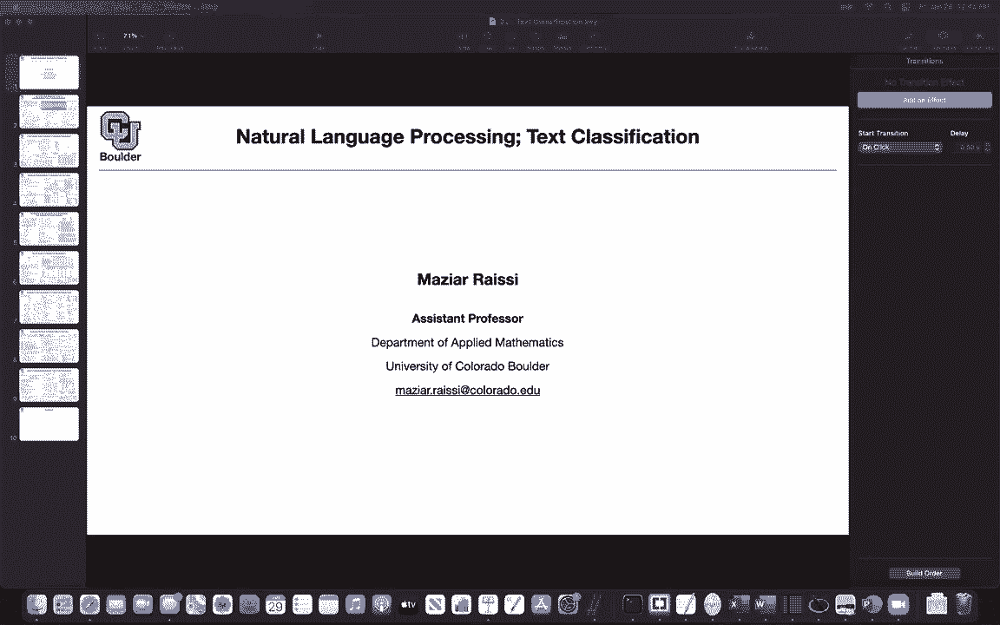
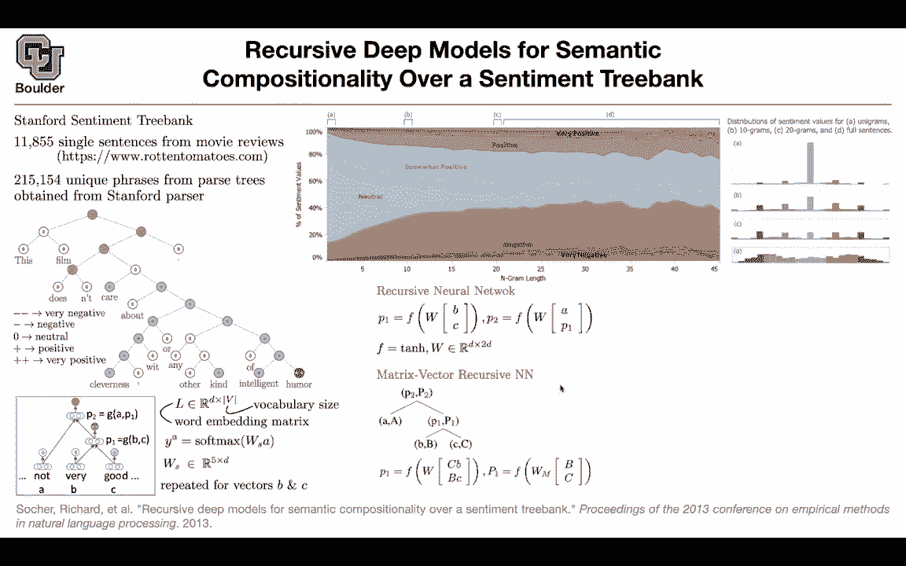

# P101：L48.1- 递归深度模型 - ShowMeAI - BV1Dg411F71G

So what I've been done so far the first step in dealing with natural languages is representing your data and the data in natural languages are in the form of texts and the texts are in the form of words and words are in the form of characters so you can have two different models for representing your data。

 one is character level models and the other one is wordle models and what we covered so far is models for representing words and our words could be actually a combination of a couple of words like New York Times so it's a phrase or actually you have some words in your test data that you have never seen during your training data and for those a good idea is to decompose those types of words into soft words and then try to associate meaning two soft words and as a。

and sequence the new word that you saw and any word that's not in your vocabulary。

 you're going to represent it with unknown， so it's going to be a special word and that's how you're going to deal with all of the words in your corpus。

So now that you know how to represent your data， your text。

 it's now time to go towards applications and the first application that we are going to cover is text classification and text classification the simplest one is let's say you have an email you receive emails and then you want to classify your emails as a spammer and not a spam so the input data is in the form of a paragraph and the output data is spam or not a spam so you're classifying between the two and once you're able to do that then you can sell your service to your customers for instance if you're Google or Yahoo or hotmail or whatever you're going sell that service to your customers as part of your electronic mail service okay。

Another application is sentiment analysis you want to know what is the dominant sentiment of a review for an Amazon product so you have a bunch of examples the input is a review is a paragraph that somebody wrote and the output you know you either have automatically generated labels from zero to five or zero and one good and bad or it's your test data you don't have any label for it and then you want to predict what is the sentiment of this particular review and that is exactly what we are going to start with we are going to start with recursive models for sentiment analysis so sentiment analysis is just text classification is under the umbrella of text classification I'm introducing this paper for two reasons one is they are introducing a new data set Stanford sentiment tree bank and this is one of the benchmarks。

When you want to test the performance of your text classification so whatever model that you come up with。

 this could be one of the benchmarks that you're gonna to test your model language and the other reason is you are going to hear the word recursive deep neural networks and I don't want you to confuse it with recurrent neural networks so they are different So what is the objective here somebody gives us a piece of text and we want to take that text and turn it into a single number or two numbers or five numbers corresponding you to the probabilities of for instance five different types of reviews or two different types of reviews good and bad Okay so the input is a text and the output is going to be two numbers or five numbers or five probabilities。

So for this data set Staffford Sentiment Tbank you have 11855 single sentences and these are about movie reviews you can use a parser so this has nothing to do with deep learning。

 there is a parser you can just use that and it's going to give you 200 around 200。

000 phrases unique phrases but why do we need a parser why do we need to parse our sentences as trees because the structure of recursive neural network is going to depend on the underlying tree so the parser is going to do this for us it's going to say you gave me a sentence this film doesn't care about cleverness with or any other kind of intelligent humor so this is a single example out of those 200。

000 unique phrases okay。So this is an example and then per each node you have sentiments it's labeled so this has a neutral fill is neutral。

 doesn't is neutral and these are the labels zero is for neutral plus is for positive double plus is for very positive so humor is very positive and we don't have any very negative here。

 we have a bunch of negatives here and in the end the total sense of this phrase is labeled as negative in the data so that's your data your data is in this one。

 this is your input， the tree and the output is very negative negative neutral positive very positive and this is coming out of the parsor but once you have that you can actually take a look at the n grams in your sentences the one grams are going to correspond this a panel here。

 they are going to correspond to these single words。F doesn't care about etc。

 So these are your words And as you can see if you look at only one grams。

 if you look at only words then most of your words are gonna to be neutral most of the words have a neutral sense some of them are somewhat negative and very few of them are negative and very little are very negative similarly for somewhat positive positive and very positive this is for when you have single words but once you start considering curves of words that's going to give you by gram you're gonna to see less of neutral and more of the other classes and as you keep doing that。

 if you have 10 grams22 grams，25 grams and above actually 20 grams and above then you're going to see a more balanced distribution so another way of looking at the same figure is the one on the right now we are doing cuts1D cuts so there is a cut here and you can take a look at your histogram。

Many of your words are neutral and very few of them are gonna to be very positive or very negative。

 As you go to 10 grams， you're gonna to have a more balanced distribution then your distribution is going get more balanced and when you go here then it's gonna be the most balanced distribution。

 It turns out that you're going have bimodal distribution for these So this is just expelatory data analysis。

 So we are taking a look at our data and analyzing it。

 So the question is are the node labels provided as ground truth or just the true structure or just the tree structure。

 So these nodes theyre they're being labeled So this is part of your labeling。

 So there are two things that are happening in the parser。

 One is you have labels per each word So this film etc。

 then you're gonna have labels for each node and then the tree structure is also coming out of the parser So that does the phrase this。

That corresponds to that parent node of neutral zero Yes so this this fill is a combination of these two and when I say biograms。

 that's part of that Okay any other question。So this is exploratory data analysis you're exploring your data。

 you're looking at the distribution of your data in total。

 you look at a single example in your data set what is the input data what is the output data and once you look at your data everything in deep learning starts with the data data is a source code so once you take a look at your data it's going to give you an idea of what type of model you're going to write to explain the data okay it's always starting with the data and this is our data and this is giving us a clear picture of what the data set is like this is how many observations you have where is the data coming from these are movie reviews here's an example and here is a total big picture of the data set。

So whatever were going to do now we are going to rely on the tree structure to create a recursive model The question is that tree is automatically produced by the pars and the node sentiment is human labeled actually most of it is automatic so there is a classical machine learning algorithm that's going to give you this tree and there is actually a paper about or a couple of papers about that parser that are'm not going through but for now let's assume that you have a tree it is labeled it is correctly constructed and these are your data your data in this form does that answer your question so under that assumption we want to come up with a model for our data and let's take a look at these examples not very good for each one of these words you have a label these are neutral not is neutral various neutral good is positive。

And then you have a tree structure for it， and in the end we want to combine this sentence into a single number or into five numbers or a low dimensional vector because then we can classify vectors。

First thing first these is not very good， you can represent them by vectors and this is exactly what we did the pastov love sessions our words are going to be represented by vectors and these are not one hot vectors these are actually parameterized so you have a parameter vector for a B and C and let's say they have size 100 or 256 so that's what you choose and's it's not a sparse vector it's full and the values are from negative infinity to positive infinity Now the question is how are you going to combine and come up with the note here first of all you're going to represent your words with the word embedding matrix so that's why word embeddings we crucial it is the first step in natural language processing and that's why we spent a lot of time on representing words and the words in our dictionary are going to be d dimensionmensal these a choice that you make it's a hyperparameter and you have these。

Many words in your vocabulary so you can represent the entire thing by a matrix so this is your dictionary now and a is a column in this dictionary B is another column C is another column so you just read a mu Now what we are going do is gonna we need to know what is the probability of the label being neutral or the label being neutral or the label being positive and the other cases to turn a vector。

 for instance， a we want to turn it into a vector， we want to turn it into a probability we are gonna multiply it by a matrix so a is d dimensional once you multiplied by a matrix let's say this is five by a dimensionional the end product is going be a vector that is five dimensionmenal okay but the problem is that that vector is in real line real line it's not a probability to turn it into a。

you do a softmax so it's going to give you a probability distribution now Y is a probability distribution and now we can increase the probability of the correct class so now you're classifying your words per each leave in your tree you're doing a classification and as I said WS is5 by D so it's going to take a D dimensionsal vector and it's going to make it five dimensionmenional because you have five classes you're going to do the same thing for vectors B and C so you're going multiply that by a matrix you're going to multiply these by a matrix and then that's going to turn into probabilities after the softmax So far so good we took care of the words in our vocabulary or at least in this sentence now we want to come up with these functions G of B and C and G of A and P1 and P1 is just what you're going to put here and that's where the recursive recursive neural network is going to come into picture。

Your model could be very simple。 you can take two vectors B and C and you can concatenate them together。

 It's going to give you a new vector。 It's gonna to have dimension 2 d so the dimension is two times D you can multiply that by a matrix you can apply a nonlinearity on it otherwise your model is going to be linear and boring so you apply a nonlinearity and then that's going to give you a new vector P1 you can do the same thing for P2 once you know P1 you can concatenate it with a multiply by a matrix apply a nonlinearity and get a new vector F could be as simple as1 h tangent hyperbolic function so that's your activation function so now you're starting to see neural networks so far you didn't see any nonlinearities in our word representations now you're starting to see them so that's your nonlinearity and what is w we know that the input has a size of 2D it's a vector that is。

D dimensionional and in the end you're interested in coming up with a vector that is d dimensionsional so you're multiplying it by a matrix of proper size and once you have p1 and P2 the rest of it is the same then P1 is similar to ABC and then you can do a softmax on it and then it's going to give you a probability once you have P2 you multiply it by a matrix of this size and then that's going to give you the corresponding probability after the softmax now that you have probabilitybabilities you can write down your loss function and maximize your likelihood or minimize your loss function The problem with this model is that these words are not interacting So it's just a linear combination of B2 and there is no pairwise interaction between B and C and it turns out that this model is not going to give you good performance it's going to give you okay performance there is a paper after that that said。

Maybe the problem is that we need more parameters so not only we are going to have vector representations for each word we are going to have matrix representation for each word so not only you have a vector representation you have a matrix representation and these are the parameters of your model by the way a capital A B capital BC capital C etc and ws and w are the parameters of your model now your're parameterizing it heavily per each word and per each node you have matrix representations in addition to vector representations but once you have that if you want to know p1 the value of p1 you can say C is going to interact with B so you're going multiply it C times B and then capital B is going to interact with C that's how you're going get the interaction between the two term and the rest of it is the same as before。

Now you have a vector that is2D dimensional you're going to multiply it by W and that's going to give you P1 Now you're going have a corresponding big matrix that's going to give you matrices in the end so can somebody tell me what's the problem with this model So the first model was not performing good in practice because you didn't have interactions what is the problem with this model seemed like it would require like an exponentially bigger data set I mean with 12000 sentences we don't really have that much data that's a fair point so if I rephrase your answer you are telling me that you have a lot of parameters so for each yes so for each word you have a lot of parameters so it's a memory expensive method that's one problem and the other problem is what you're mentioning this is not enough data to train that many parameters it might end up overfitting etc so to deal with that all we needed was paravised。

Interaction that was what was missing from this model。

 and that's exactly what recursive neural tensor networks is going to do。

 and that's the method introduced by this paper Okay， so what is that。

In the end we need to have forget about this part for now because this is a tensor you might get confused so don't worry about that part that focus on this part because we know matrices and we know scals if you want to have the pairwise interaction between B and C you can just form a dot product between the two so this is going be a dot product of this vector B and BC but then you can change your dot product by putting a matrix in between so once you do that this is a 2 by 2 d by 2D matrix these are parameters of your model once you do that multiplication that's going to give you a single scalar H H but then the problem is we need vectors in the end so you need to have a vector that is d dimensional so you're gonna to repeat that d times to give you a vector It is very similar to multi head attention that we're gonna to cover later on so now you're going to have D of the。

And once you have D， this is now a vector that is D dimensional and a tensor is just a generalization of a matrix so it's going to be 2 d by 2 d by d dimensional And in the end what's going to happen is for each of these entries you're gonna do that multiplication So you're gonna have afford by D so each each of the Vs gives us one of the waitinging matrices for one of the entries of H and exactly we have D of them exactly so now what did we do this is the previous model recurs signal neural network at w times bc in it we still have that so it's a generalization of the previous model if you said v to be0 or if you optimization decides to set v to be0 you are not losing much you're going back to the original model that you started with but the other cool thing is now you have the pairwise interaction between words B and C through the do product and through this。

Tensor and that's why it's called a tensor network because V is a tensor So what else do we gain now V is independent of the size of your vocabulary so this is always going to be the dimension 2 d by 2 d by D and D is something that you choose so you have full control over the choice of D okay so now V is independent of the size of your vocabulary or is independent of the structure of your tree and this is going to give you less parameters and it still gives you the interaction parawiseise interaction between the words。

You do the same thing for P2 after applying a nonlinearity on that operation so you get P1 you put it here and the rest of it is the same as before Now the question is what is your last function you have five labels you have very negative negative neutral positive very positive and let's say this is one23。

4，5 what this last function is going to do is going look at the output of this softmax it's going have it' going give you five probabilities and let's call them P1 p2 p3 p4 p5 if the underlying ground truth if the underlying label for a node in this case it is the third node so you're going increase the probability of the third node so you're going to increase P3 so this is exactly what this last function is doing so it's going to pick out the corresponding probability and then the next term is just to regularize it for your model not to overfi and what is the。

the are V， W VS and L so your L， you can actually initialize it to your word vectors that we learned how to do it it could be word2 v or glove or you can initialize it randomly and let your run network you learn it if you have enough data you can actually learn them so you learn L you learn Ws you learn W and you learn V through this objective function and this objective function is the cross entropy loss and in fact these Ts are one hot vectors if the ground truth is let's say the third entry if the ground truth is neutral so your label is going be3 equivalently you can have a vector that is fivedimensal with dimensions124 and5 being0 and dimension3 being1 once you multiply that vector by a vector of the same size it's going to pick out the。

Reresponding probability Okay， so it's going to pick out the corresponding y。

 and then you are maximizing that。Is the superscript I that's just an index that's not being like raised just a certain power right No it's still that index。

And that's exactly what you're asking what is Yi Yi is a C dimensional vector and C is the number of classes in our case it's5 and T is a target distribution and the target distribution are those1 htz vectors that one is also5 by one dimensional and this is just saying that you're doing the dot product of the two if you have a vector that is00100 and then you multiply by another vector it's going to pick out that entry。

 the third entry and this is the J entry okay so is everything clear now。

Any questions and the range on J is E。It's going to be5 or it's going to be C。 Okay。

 so Y J I is the entry J of this vector or the J entry of this vector。

Oh yeah quick question so for making like so we have F is the hyperbol engine and that's can be applied to every element not because that's because these are vector or these are the p1 and P2s are going to be matrices so P1 and P2 are vectors but the vectors but we apply f to those where that's going to be's we're applyinging that coordinatewise exactly yes so that's a very good point and when in deep learning you're going to do pointwise operations a lot okay and in Python you're going to actually do pointwise operation a lot and that's called broadcasting so you're going apply 10h or on every single entry of your vectors so you should get to get used to it right now so it's going make your life much easier in deep learning we' are going to do a lot of pointwise operations so if an operation if I write an operation or if you read an operation in any papers。

That is going to be pointwise or elementwise unless otherwise stated so the default in your minds should be that this is pointwise so does that answer your question Yeah it it and any other question How do we represent the target distribution I it going to be like0123 the target distribution you mean this these are one had vectors So it's going to be a vector you can think of them as direct distributions direct delta Okay it is one at the correct label and zeros at the incorrect labels for instance here it is a one at the neutral neutral position at the third position and zeros everywhere else So that's what ti is representing Does that answer your question。

Any other questions I'm a little confused with what was the algorithm and matrix vectorcur Could you just that Which one can you say it again the second one the matrix vector recursive Oh yeah so the matrix vector recursive Nn it is very similar to recursive Nn but what is the difference now you have more parameters per each word and per each node in your tree。

 you're going have a matrix to represent your words so not only you have a small B you're going to have capital B not only you have small C。

 you're going to have capital C and these are the parameters of your model and how do you come up with the interaction between words you take C。

 you multiply it by B， you take capital B， you multiply by C that's going to give you a two vectors you concatenate them and then you multiply that by a matrix once you have a vector it is very similar to before Does that answer your question yeah。

What is the difference between this W subscript capital M and the W。So you can think of it this way。

 what is the size of B capital B？The size of B is B like the number of dimensions the size of small B is d by one。

 the size of capital B is D by D and the size of capital C is D by D so this vector you can vectorize that。

 you can flatten it， and then that's going to be 2 d squared。

And the size of this WM is going to be d squared by 2 d squared and that's going to give you a D by d matrix in the end so it's a lot of parameters Okay any other questions Okay in that case let's move on。

