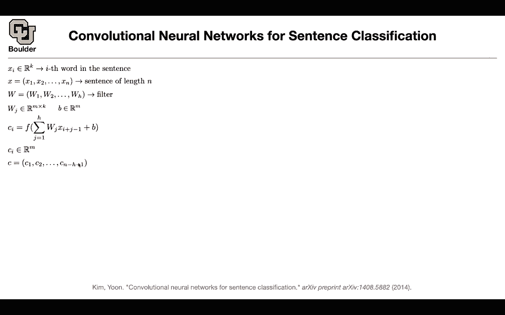
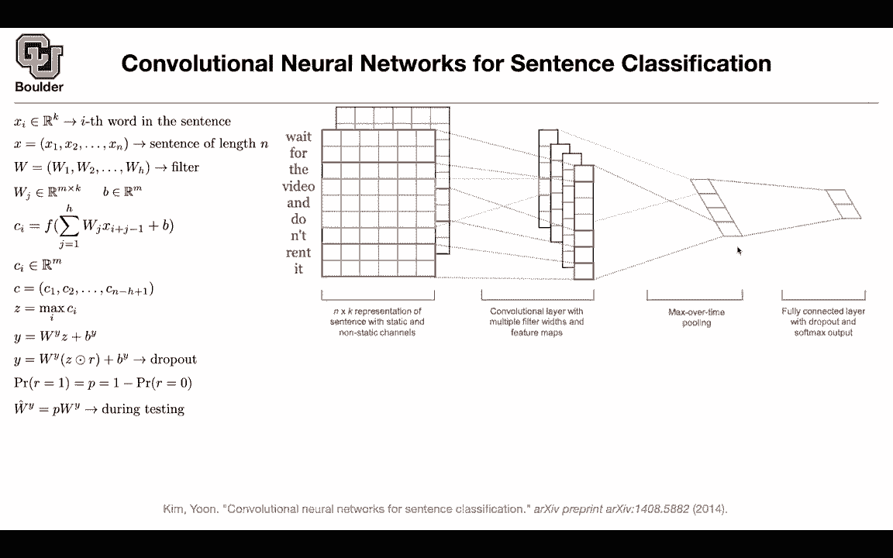
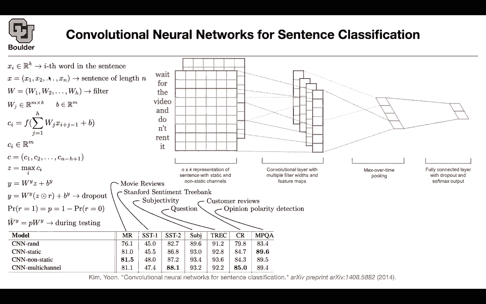

# 【双语字幕+资料下载】科罗拉多 APPLY-DL ｜ 应用深度学习-全知识点覆盖(2021最新·完整版） - P102：L49.1- 用于句子分类的CNN - ShowMeAI - BV1Dg411F71G

So as you can see for text there is this confusion of what method to use should we use recurrent neural networks。

 should we use recursive neural networks or should we use convolutions or should we use attention so I'm going to introduce all of them because it's going to help you decide the pros and cons of each one convolutions are mostly for images and we are going to do some images later on in this course as well when we are going to do multimodal learning and generative adversarial neural networks we're going to deal with images so it's a good time to learn about convolution but these are convolutions for sentences and sentences are one dimensionional so what are we going to do we know that each word in a sentence is a vector so that's by default that's what we are going to do by default that's how you represent words in a sentence these are vectors and each sentence is a sequence of。

NSo you're gonna to have x1 x2 up until X n this is your sentence and each one of these x1 x2 up until x n are k dimensionional vectors。

 You can think of that as a one dimensional image So for images you have two pixels two dimensions for your pixels the x coordinate and the y coordinate Now this is just the x coordinate or the y coordinate for an image Now you can have a filter and the filter size is going to be H So this is how many words per each convolution operation you're going end up using and each one of those because you want to take that filter and multiplied by a vector has to be a matrix so each one of these ws W1 W2 until W H or matrices and these are taking you from dimension K to dimension M and K could be either the dimension of your your word vector representation which was。

156 or 1024， or it could be a 10 vector for the entire size of your vocabulary。

 so you have the freedom to choose whatever that you want。

So we are going to deal with the first layer of a convolution we learned how to represent words now we are going to introduce convolutions and we are going to introduce what is Wj and what is B this is your kernel this is your filter this is the number of features that you're going end up with after applying your filter and b is a bias it's going to become clear so whatever we're going do we are going to take a window of size H from this input sequence so let's say you pick x1 x2 and x3 and let's say h is3 so you pick x1 x2 x3 and you're going multiply that by W1 W2 and w3 so it's going to be w1 x1 W2 x2 W3 x3 and then you just add them up This is going be a m dimensional vector the output after this summation you're going add a bias to it to take care of shifts in your mean distribution the mean of your。

ionSo the bias is going to take care of that。 Then you're going to introduce a non linearity like10 h or ra。

 And that's going to give you your first entry of your next sequence。 So sequence goes in。

 a sequence goes out So this is going give you C1。 Then for C2， What are you going do。

 you're going to take x2 x3 and x4 and I do the same thing here for C 3。

 you're going to take x3 x4 x5 and then you go up until the end and you are right if you are thinking that you're going to have less numbers after these operations。

 And yes， youre right。 So if the length of your original sequence is n。

 the length of the sequence C is going to be less than that。 okay So a sequence goes in。

 a sequence goes out and a sequence of k dimensional vectors goes in a sequence of n dimensional vectors comes out。

 But in the end， you are interested in a single vector。 you don't want to end up with。

Sequence you want to end up with a vector so that you can use that for classification it's exactly what we also did in recursive neural networks so that's what we are going to do and these are pointwise operations again okay by default it is going to be pointwise you take the first entry of this m dimensionmenional vector for every single vector is in your sequence and then you find a maximum and you put it in Z the first entry of z the second entry of z is doing a maximum over n minus h plus one numbers and then it's going to give you a vector in the end so you can think of these as max pullinging it's global max pulling。

Now Z is gonna be m dimensional We don't like m dimensionional stuff We like five dimensional stuff because in the end our classification task is a five dimensionmenal task it's classifying between five entries so again you're gonna multiply that by a matrix to do the projection for you from M dimension to five dimension so far so good are there n questions would we often do the convolution multiple times before the max pulling just like with images you could do it yes。

 absolutely So in this example're doing one convolution one max pullinging and then a prediction at the end but you could you could layer it up deeply exactly but exactly if we have a sentence it's likely that we can't sort of reduce as much because there might be only like three or I don't know five words in the sentence so you can only apply so many convolutions before you just yes exactly so what you're saying is that the size of n matters and you're right there are only。

on so many convolutions that you can do but a couple of them should be fine and what is the difference between this method and the previous method that we just saw recursive neural networks for this one you don't need to have a tree structure so the previous one depended on a tree structure and then classifying each node properly so you needed to do some preprocessing on your on your data this one doesn't need any preprocessing on the data okay and then when you go from one sequence to the next sequence it's as if you're going from your original sentence to one layer up in your tree so you're now combining words together another analogy between images and sentences is that these are your coordinates let's say this is your x dimension for your images but then if you remember for images you had K to be3 red green blue now you have a word vector representation so K could be one。

00So these are the number of channels so this is another analogy for those of you who know convolutions so there is a question is this also that this method deals with several words in comparison to the tree that deals with two at a time Yes exactly if you set your H to be two then you're gonna to process two words at a time if you set H to be three you're gonna process three words at a time or five words five words at a time so you have a choice of H that you make does that answer your question Yeah it just sounds like this method will have a better I guess measurement of the words in comparison to just two all at the time in comparison to like many probably and we're gonna to see the performance metrics later on but for now there is also another technique in machine learning that we use a lot in deep learning the reason that deep learning succeeds is not one of the main reasons or。

Couple of the main reasons are these nonlinearities and the particular choice that you make for those nonlinearities。

 so the paper rectified linear units was really influential。

And the other one is doing dropout and what is dropout you want to。

These zs that you're seeing they are neurons in your neuron network。

 so you're gonna have m neurons12 up until M。 What you want to do for your dropout to achieve is that these neurons need to operate independently so for instance if I give you an assignment I want you guys to be able to carry out that assignment individually if you're in a group。

 I don't want you to always rely on your groupmate so I don't want the entry Z1 to always rely on entry Z 10。

 That's why you're introducing a bunch of randomness in your neuron network during training and what is R with probability P you're gonna drop a neuron so you're gonna multiply that by zero so you're dropping it and with probability1 minus P you are keeping that neuron okay so with probability P your drop。

with probability 1 minus B。 you're keeping it。 and that's going give you the dropout algorithm。

 and this is gonna to happen perish data point that goes in。 you're gonna to drop a neuron。

 but in the end， you want to come up with an algorithm that is deterministic so you don't want your predictions to be stochastic how are' going do it you're going average out the predictions of all of these models that you're gonna end up with。

 So parish are you're gonna have a different model。

 how are' gonna average it out you just down weight your original weight by the probability that you used to drop your neurons Okay this is gonna to help your algorithm train much better and generalize much better。

 So this is another technique that I want you guys to learn you're going learn you're gonna hear about dropout a lot So this is a three line introduction to drop out Okay Any questions I think we are over time。

 for those of you who want to leave you can leave and for those of you want to stay and ask questions Ill be around Yeah I have a question about。

out so I get the topout for avenue new and we have this probability of topping it out in the forward pass I didn't quite catch the last part of averaging the results。

So yes， you have two options once you're doing your training there is some randomness each time that a data set data entry goes in。

 you're gonna sample from this distribution and then you're going to drop that entry but then in the end when you want to take your deep neural network to production you don't want things to be random you don't want your classifier that is doing your sentiment analysis to give your random predictions each time that a data goes in so how can we deal with that one option is to whenever a data goes in you can make multiple samples from this distribution and then average out the predictions that's one option but then what is the problem with that can you still not deterministic it is gonna be very closely deterministic so you're doing a Monte carlo averaging Yeah it's not gonna be the same every time which is what you want from your prediction software Yes。

 but it's gonna to be very。

Close but itll be be more expensive likewises going be it's got to be more expensive Yeah So yeah during testing during production time。

 you want things to be extremely fast So you don't want to do Monte Carlo you want to avoid it So whatever are you gonna do rather than averaging it out doing Monte Carlo you are going do an estimate because this is a binomial distribution you can have an estimate for the average weights and the way that you're going do it is you have your original wy。

 which is being trained through dropout and your training process but then you're gonna when you want to take it to production。

 you just down weighted So in in production， whether you're gonna give to your customer or whatever you're going to employ you're going employ you're gonna give your customer these word vector representations you have to give them that you have to give them these double use and Bs for them to be able to run your model and at the same time you have。

They give them P what P did you use and once they know that they're going to multiply WY by P is going to give them a new W and that W is going to go into production that's going to go here I hope that answers your question and yeah you can。

another question really to drop out because know one of the reasons why when you're not being popularized they're using the sigmoid functions because it's smooth and you well you don't have smooth for or for RLU functions you can it's still piecewise linear but with the dropout that seems like you can get you might have a lot of issues training because you're not really you're not really having these smooth functions for stuff is that like how's that really handled so why do we use dropout we use dropout because if you report your performance metrics on your training data nobody is going care so if your last function is going down amazingly fast and to very low levels nobody is going care what people are gonna care about is the performance of your method on your test data so dropout is going to help your method regularize it's going to help it not overfi your to your。

Trading data and then it's going give you a better performance on your test data I guess my question is more just like the more when you actually implement it because the reason why you like having a smooth function is because then you have for the back propagation portion of the network training it's really easy to compute the parc derivatives there。

 but with the dropout i'm like how does that impact the ease of doing the back propagation。

Still the same thing So in your back propagation whenever a node is absent the gradients of that node are gonna be zero Okay everything is gonna to be fine Okay at that okay and then with the discontinuity I don't think it's an issue because it's like impossibly unlikely to get an input which is right at the cusp where you'd have any ambiguity about derivatives yes。

 and the way to think about radio and the way that I like to think about it is that it is positive in the positive regimes and then it's zero but then each data point that goes in it's either going to end up on the zero side of your radio or it's going to end up on the positive side of your radio and if it ends up on the positive side of your radio then these weights and biases of your neural network are going to get updated and for many of your example。

 you're going to end up on the positive side and it means that your ratess and biases are going to get updated through back propagation。

And stochastic gradient， thanks yeah。

Is there a way to I'm just familiar with the part that you only about doing training I a bit confused about why do we have to re multiply P by W cant we just not use w doing testing so W is the one that is memorizing your data it's going to help you classify your it's going to help you solve your problem so you're going need to carry W with you but then if you use W the problem is it's going to be overestimating the probabilities thats going to occur out of your method so it's going to be an overestimation because W y is true for the cases when you're not dropping but then most of the times you are dropping actually P ratio of the times you are dropping that neuron that's why you have to down weight that because in the end you want to take an expectation you want your algorithm to be able to have a good。

formance on average okay yeah， that makes sense with theestim because neurons the ones that are not being dropped going to compensate for the ones that So all we're going have a model compensate because we always drop something exactly So that's why you have to multiply by P and that's actually that's actually going end up being an estimate of the expected value it's going be an estimate to that Monte carlo approach that I just explained any other questions Yeah you used P equal 0。

5 all your neurons in training would learn to become twice as strong And then if you turn them all on at the end you're gonna double the activation that you want Yes。

 that's a perfect way to put it and you cut it in happens back to what you want Yeah so that's intuitively why this is working and mathematically it's an estimate for that Monte carlo averaging would it make sense during training to do dynamic to change。

dynamically like so like say start at one and then slowly we decrease that 2。

5 and then let your training finish there that be with the main reason to do that yes。

 so you can actually do that so all of these things that you're all of these ideas that you're coming up with these are practical ideas that are going to help you so yes you're right maybe initially you want your network to train faster so you're going have a schedule for your P but you need to study that whether that's going actually end up giving you the best performance in the end with the intuition there being that。

Not dropping out is going speed training， but then later on it's going overfit。

 So you want to dial up the dropout as you get closer to overfitting Yes。

 okay wet talking out actually switch because you have less parameters to with you have read dropout you still have the same number of parameters you don't have to update all of them because some of them are being so you don't have to update them So what they are saying is that if you have a more powerful model and more parameters then you're gonna be able to overfit your data faster and in the end you can set P to be lower because you don't want them to be dependent on each other So that's an idea to be tested it's a good idea。

Okay， that makes sense thanks a and don't worry about the number of parameters in neural networks because in one single pass of Mac propagation。

 you're gonna get the derivative with respect to all of your parameters in one pass it's the same cost any other questions Thank you yeah just to be clear this is more on the last slide but when we're talking about like just the dense vector representations of the words I mean I guess it could matter to some extent。

 but it doesn't really matter whether we use like embeddings created with glove or created through word tobe right any of those embeddings will be valid for these models yes。

 so any of them would be valid， why because you have a you have an independent training process going on here even if you initialize and random given enough data you're gonna be able to learn L Okay so。

You can use word to V or glove to initialize this and then do the training gotcha thanks yeah any other questions no thanks okay see you next time let's get us started Last session we started sentence classification and this is important one of them is going to be sentiment analysis。

We introduced a new data cell and then we introduced a framework actually a couple of frameworks。

 one of them was recursive recursive neural networks。

 the other one was matrix vector recursive Nn the other one was recursive neural tensor network and all of them depending on a tree structure and then we said we don't like a tree structure can we use convolutional neural networks and the idea here was that we are going treat each word in our sentence as a pixelel so each word in a sentence is going to be a pixelel and if you remember peak cells are going to be represented as vectors that have red green blue in them so K for peak cells for images is three dimensionmensional redgr blue but here K could be the size of your word vectors so each sentence is a one dimensionmenional image for this framework then you have a filter your filter is going to have a size of H。

Every filter is going to be a matrix and each convolution is just a bunch of matrix vector product so I have a vector and then you're multiplying it by a matrix and then you're changing the dimensionality from K to M each round that you're doing your convolution and then it's called a convolution because you have a summation over your filter size that's going to take as input a sentence and it's going to output another sentence so it's going to take as input as sequence。

 it's going to output a sequence but the size of the sequence is going to go down a little bit in the end you're going to need a single vector that you're going do max pullinging this is global max pullinging once you have a single vector its size is probably going be the size of M which is going to be much larger than five classes that you need in the end because in the end you're going to need five classes how good is this review so you're going to do a projection so you're going to introduce a set of new parameters。

And then that in the end， that's going to give you a bunch of numbers that you can push through your softm that's going to help you write down your loss function。

But then there is a problem with that you're gonna to have a lot of parameters here and you want your neuraln network to get regularized that's why you're going to use a technique called dropout that you're going to drop a bunch of your neurons for them to be independent from each other to make them as independent as possible not to rely on each other that's going to help regularize your method when it comes to the test data and that was during training for dropout you have two stages one is the training when things are going to be random and it's okay to be random but during testing you want things to be deterministic so you're going to add you're going to multiply by a probability so what's your question I think exception sorrys was regarding the dimension of Cs like the numbers of C so it's n minus H plus one and I wasn't sure how we got to that Oh for that you have to be a little bit careful let's say H is。

3 and then you have to write down the math a little bit and let's say n is four to see an example then the first round that you do it you're gonna need x1 x2 x3 to give you c1 so we got C1 then you're gonna need x2 x3 and x4 to give you C2 but then remember you don't have any x5 because and we set it to be4 then if you want to have C3 then you would need x3 x4 which is okay but then you don't have x5 that's why the size is gonna go down a little bit depending on the H and let's check it this is4 minus3 that's going give you1 plus another one that's going give you two so you're you're gonna have c1 and C2 Okay so the math is correct That's answer yeah I think I was confused because I thought that H is the number of filters and I wasn't sure how do we was it depending on the number of filters。

Other than de dimensions So yeah this is your filter size。

 This is the window of your initial sentences that you consider per each convolution operation。

 but then you shouldn't confuse this with M M is the number of channels that you're going end up for the next layer so M is gonna be like k okay because then you can do the same thing you can rename c1 c2 up until C whatever to be your new xs Okay that makes sense I thought that H is the number of filters up and then de dimensions so that makes sense now Yeah one cool thing about convolutions is that you are sharing parameters so now you are sharing the same W1 W2 and W3 for and then you're taking that and then you are sliding it over this sequence so it's gonna be the same ws it's gonna be w1 x1 w2 x2 W3 x3 that's going。

Give you C1， but then for C2， you're going to say w1 x2 W2 x3， W3 x4。

 and then that's going to give you C2 got it Okay， any other questions in practice is something done like with images where there would have filter banks and so like this is one filter but then you do 10 of them in parallel at each round and come up with many C sequences。

That's exactly what we are doing。So you could think in one dimension。

 but now we are thinking in M dimension so in fact you're having M filters so these are m parallel filters fair enough yeah okay so in one line of math we are writing the same thing so these are perfect convolutions so if you know about images it's exactly the same thing but now your input image is one dimensional so it's not two dimensional you don't have x and y coordinate so it's only x coordinate and these are 1 d convolutions Any other questions okay perfect now let's take a look at it visually let's say this is your sentence wait for the video and don't rent it so that's your sentence you can think of each word as a pixel if that's how you want to think about it this is a pixel and you can think of these dimensions as the values of your red green blue color channels okay you can think about it that way but now there is。

Co associated with a word you have a word vector associated with it and then it's going to be k dimensional so it's one。

23，4，5， six dimensional for this figure but in practice this could be 100 dimensional to 156 etc and each word is going have its own word vectors now what you're going do is you're going to have a filter and each filter is going to have a filter size and let's say for this red part the filter size is2 so H is2 so you're going to take those two。

Enreries in your sequence and then you're going to keep sliding the same filter all over the sentence And then once you do that it's just a dot product you take that you multiplied it by your filter you add up the numbers and then you copy it here so this is your x This is gonna give you your C and then you can have multiple you can mix and match you can have filter different filter sizes the question is what filter size are you gonna to use let's use a couple of them let's say H is2 H is3 H is4 H is5 just use a couple of them and then each one is going to give you a vector which is cool in the end you want to end up with a single vector this is your Z that youre gonna put in the rest of your algorithm and let's say in the end you're interested in two classes and z could be m dimensional that's what we are doing now so we are doing max pooling here you just keep the maximum of these values。

You copy it here， the maximum of those values， you copy it here， it's going to give you a vector。

 then you are going to multiply it by a matrix to give you the correct size in the end。

One cool thing is that it doesn't really matter what number。

 what is the length of this sequence that you're going to end up with in the end So this number here n minus h plus one doesn't really matter because once you do the maximum pulling you're getting rid of that So whatever the length of this sequence you're going to keep the maximum values and then copy it here for the next round Can I ask a question about that Yes could we say something about like if you if you're looking at a four word sentence versus like a 90 word sentence you'd have like potentially worse accuracy on that longer sentence because sentiment would maybe get like drowned out across the like longer length Yes that's correct and that's the shortcoming of this method So you're exactly correct you can practice sentence maybe towards the end of the review。

 somebody is changing its mind or her mind and then the sense of the review is changing totally。

Will people try to like in their data set try to maintain some sort of constant if sentencing I know that during training。

 you would try to do that because these usually go on your GPUs and then you want your GPUs to process multiple data points in parallel So you want to process your data in batches for speed but for testing but that's just for computational efficiency during training you want things you want your GPU to do things faster so usually you sort your sentences according to their length and then batch them together but mathematically you're right there could be a long sentence and then suddenly the sense of the sentence changing and actually it's a good study if you want to do a study on this paper you could see what is the performance on shorter sentences versus medium size sentences and long sentences and see if empirically there is any drop in。

Accuracy of the method so that's a fair point and so let's see the performance in total on multiple different data sets so on these data sets you can do exploratory data analysis some of them are about movie reviews some of them are sentiment these is exactly Stanford sentiment re bank and you have two versions of that you have the subjectivity you have questions you have these are multiple questions I mean questions with multiple answers then you have customer reviews and then you have opinion polarity detection and then whenever you're writing a good paper you are going do you're gonna to study your method and for this method what type of studies can you do you can say I need word vectors for my words so these are the parameters of my model the question is what happens if I initialize them randomly and then you study that these are the accuracy of your method so。

100 examples on this particular data set you are getting 91。

2% of them correct these are correct predictions that's your accuracy what happens if I initialize these word vectors using G or word to back and then fix them keep them static what accuracy does this method give me but the rest of the parameters can be learned W and Bs can be learned and wy what happens if I initialize them using word vectors from word to X but then I let it train the other one is multichannel what happens if I include two versions basically are stacking them next to each other so you're going to have。

A word vector for weight you're going have the same word vector for weight again。

 you're just increasing the dimensionality of your input that's fine。

 but then you're learning you're making it nonesstatic you're learning let's say this part of your word vectors but then you're keeping the next one static and this is what multichannel is so you're going to have two channels and it's basically a combination of static and nonst so you have some word vectors that you're keeping static you have some word vectors that you're learning that's going give you multichannel and some of the data on some of the data sets is giving you better performance and comparable to the rest and in terms of the size of these data in terms of the big picture for MR data you have two classes and each sentence in your class is going on average have a length of 20 so this is what we were discussing some of the sentences could be shorter。

them could be medium size， some of them could be longer。

 so on average they have this length on average your data on SSD or around 18 and 19 this is five classes。

 this is two classes， two classes， six classes two classes。

 two classes and then these are the average length， these are the number of data。

 this is your vocabulary size， this is the vocabulary size for prediction。

 and you have the method that you use for testing， you can use cross validation or you can keep this many of your data aside for testing etc。

So any questions before I move to the next topic， so is everything clear perfect？

