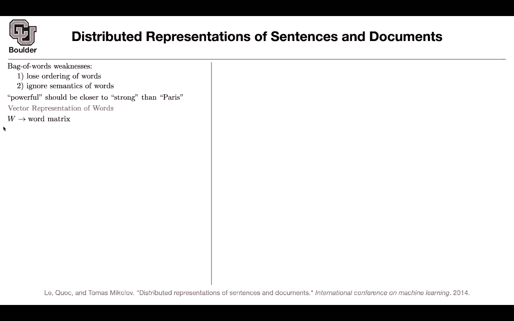
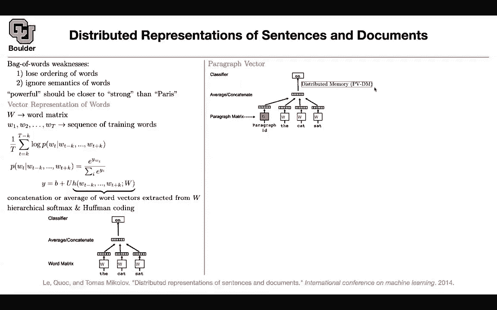
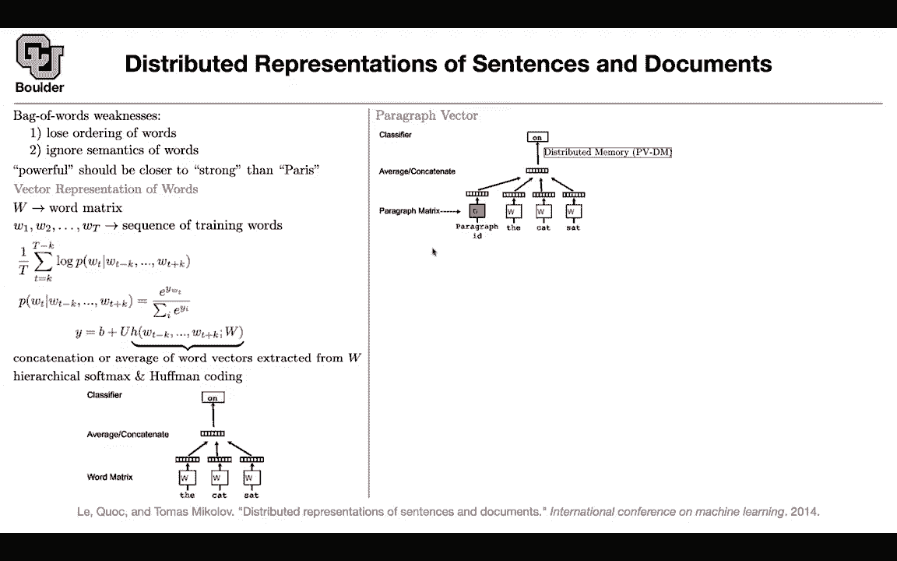

# 【双语字幕+资料下载】科罗拉多 APPLY-DL ｜ 应用深度学习-全知识点覆盖(2021最新·完整版） - P103：L49.2- Doc2vec - ShowMeAI - BV1Dg411F71G

So we learned about recursive neural networks， we learned about convolutional neural networks。

 there is this other idea that may be the same way that you had word representations you can have representations for sentences and documents once you have a representation you are representing it with a vector and once you have a vector you can use that for classification tasks。

 so what are the weaknesses the first idea that would come to your mind is bag of words。

 even if you don't know about recursive neural networks or convolutional neural networks。

 the first idea that comes to mind and the first thing that we are going to try is to represent each sentence like distributed representations of sentences and documents。

 this is a sentence by a bag of words， so you count the number of times that distributed appeared in this sentence representations appeared in your sentence。

 etc。

So you go through your vocabulary one after another and count the number of times that that particular vocabulary is appearing in your sentence and that's going to give you a bag of words most of the times it's going be a zero vector zero entry in your vector so it's gonna to be various sparse and there are gonna be a bunch of them that are non-zero and are appearing more than one maybe your maybe of is showing multiple times in your sentence so that's a bag of word but what are its weaknesses can you think about a couple of weaknesses of this approach ignores word ordering okay that's one you're going to lose ordering of your words perfect can you think of another one I mean I just I can think of like a bunch of consequences of losing word ordering like negation or double negation and triple negation you won't know if's like the word now shows up multiple times Okay these are consequences of the first item I'm looking for a second item that might be a little。

Its more complicated to guess but why did we do word representations。

 What was the intuition behind it certain words had sort of similarity to other words exactly so that's why we did that this type of an approach is going to ignore semantics of your words it's going to ignore the meaning for instance。

 we know that powerful should be closer to strong compared to powerful being closer to Paris in terms of meaning So these two have very different meanings compared to powerful and strong Okay so these two words should be closer to each other So if you treat your document as a bag of words you're going miss that you're gonna to miss the semantics That's why we did word representations so I'm going to go over word representations again because it's a very important topic and then we are going to expand on that for word representations you have a word matrix so this is basically your vocabulary the row。

A your words1，2，3，45，6， etc， and the columns are the representations of your words And then you have a corpus of size T then for continuous bag of words let's consider continuous bag of words we also learned about the skipgram model for continuous bag of words you would take as input your context of size K So previously we were calling it C。

 now let's call it K。 This is your context size given those you wanted to predict the word in the middle and then we said we are gonna to model that using softmax and then for y we are gonna say we are going to take a look at the words。

 these are our words in the context， we can read them off from the word matrix So this is your vocabulary Each one of these is an index okay w t minus k and w T plus k they are indices So once you know the indices you can go and read off the correct rows from your word。

Once you have the correct rows， you can either concatenate them or average them out so you just sum them up and divide them by the number of times that you are appearing so it's going be you're dividing by 2k minus1 in this case if you're averaging and now that you have a vector you can multiply it by a matrix to correct the size because you have that many classes in the end so you want to correct the size and then you can add you can add a bias or we can ignore it so previously we were ignoring this bias term you can actually include it now that you have y it's a vector of the same size as the number of vocabularies as the size of your vocabulary now we can do a softmax on it to turn those numbers into probabilities so this is what we learned about it in the first slide or in the second slide of this course and then we said that costly let's use hierarchical softmax and half an encoding and we said even that one is costly let's say。

He？Let's rephrase that and rephrase that using negative sampling so some cases are positive。

 theyre showing in the context， some cases are negative。

 they are not showing in your context and then your model should be able to distinguish between the two the positive cases versus the negative cases so you can play around with your loss function to make it more efficient once you do that that's your model you have for instance they cat the cat sat on the mat for instance so they cat sat there is a row in your double your matrix so you just read it off you copy it here you either concatenate your average and then you can do your classification。

What is an X word or what is the word in the middle， This is how we represented words。

 You can extend this idea。 You can have a vector for each paragraph。 For instance。

 a vector for each review on an Amazon product， you can have a paragraph vector the same way that you had word vectors in your W。

How do you do it， You go through your corpus and let's say you have a million paragraphs in your dataset for each one。

 you're gonna have a vector。 the same way that you are putting your word vectors in the rows of these w you're going to put your paragraph vectors in the rows of these d matrix。

 Now a paragraph goes in， you read off the corresponding vector， you copy it here。

 and then the idea is that the same way that you are kind ofcatenating and averaging the word vector is just average these out you average them amount and then you're gonna to predict an next word or the word in the middle。

 So that's the idea how do you train it， you're going to write a loss function。

 So this method is going to be called distributed memory Dm is going to stand for distributed memory and Pv is for paragraph vector。

 So PvDm is your distributed memory method。 So this is just the name of the method。

 What is your loss function。

Your last function is going to look like this。 What you had here and whatever are you're going to optimize this last function with respect to So you're going to maximize this with respect to the bias So this term here with respect to you with respect to your words and with respect to the paragraph vectors。

 so with respect to D this is training once the training is done you have to do inference。

 So somebody is going to give you a new paragraph， So there is a catch here。

There is a problem with this method The problem is for each new paragraph that somebody is going to give give it to you。

 you're going to have to a little bit of training so it's going to slow down inference so that's a drawback of this method you're going to have a details test so you need to first come up with these values so a little bit of training is going to go on there for each new paragraph that you see in your test data。

But once you know D， the rest of it is very easy you're going to do a logistic regression or support vector machine on D and do your classification once you have a vector everything is back to classical machine learning okay that's why you're going you're going through all of these trouble to transform your text into a vector and then once you have a vector then the rest of it is game over you can do a simple logistic regression and you're done。

This is distributed memory paragraph words。 You can have a similar idea to escapegram。

 A paragraph goes in， you're gonna sample a bunch of words from it and then your task is given this paragraph Can you predict what words are in are in this paragraph I give you a paragraph what are the words in this paragraph So you're just sample four words and the task of your training process is to solve this problem。

 if I give you the paragraph ID what words we in there So this method。

 this one here is a little bit more efficient in terms of parameters compared to the previous one can somebody tell me why Well you're just learning a single matrix here instead of four。

You're still learning you're still learning D there is going to be a W here there is going to be a U there is going to be a B during training I you're right during inference you don't need to carry with U W U and B anymore so you just need to learn these Ds and then that's game over so it's a little bit more efficient parameter is wise but let's take a look at its performance this one is going to be called P paragraph vector DB all W and distribute it's going to be distributed bag of words you can test it on Stanford Senmentary bank for a Stanford Senmentary bank you have two types of task is positive versus negative or or predicting the category between five classes good very good neutral etc very bad and bad and then if you compare it to naive based support vector machine。

Bgram naivebased word vector averaging so a simple solution is just average the word vectors recursive neural networks is what we covered last session and recursive neural tensor network is exactly what we covered last session and then this simple method is doing better than the rest of them but then there is a catch so these ones are going to be really fast when it comes to inference this one has a little bit to do so you need to do some optimization for these detailstest you can do IMDB so this method is doing the best using power of vectors compared to neural network type and classical machine learning type methods and then you can do information retrieval information retrieval is like search so you're searching for something in your documents in your data set it's what we do all the time with Google searches that we do that's information retrieval and then this is doing the best on information retrieval。

Any questions so we saw a couple of methods so far so and all of them have this in common a sentence goes in and in the end you want to end up with a vector you want to turn your sentences into vectors for classification the first one had a tree structure and then you were merging words pairs of words together from one layer of your tree to the next layer the second one was a convolutional operation and this is another one and each one has its own advantages and disadvantages for instance this one is going to be slow for inference because you have to do some optimization the convolution we saw an example so it matters how many convolutional layers you're going to use and this was exactly the point that you are making what if the length of the sequence is too big or you're going to lose performance or no and the first method has these drawback that you needed to have a three par so you needed to do。

I preprocessing on your data Any questions about this is everything clear I have a question about the telegraph I feel like telegraph can be very。

 very large I'm wondering how much information can you really hold in a vector is actually the same size as just vector fors actually if this method works and if you're happy to wheeling this price of optimizing for thetest for me this is the most flexible way of doing it why because you're gonna have the size of D at least the number of rows that you're gonna have is going to grow with the size of your data so you're gonna have a lot of parameters here and the more parameters you have the more flexible your method is going be so in terms of capacity I'm not worried about this method it has a lot of capacity the thing that worries me is this optimization during inference because in inference we want things to be fast that's the whole point of doing deep learning training it can take as much。

As you want for inference you need to be fast does it answer your question Yeah。

 so you're saying that the length of decon vary it doesn't have to be the same length as the for example。

 the cat at those three vectors。That's one thing， so the size of your paragraph vector could be very large。

 but then you can have many paragraph vectors for each paragraph in your data set you're going to have a vector so this is really flexible for each data point you have a parameter because now your data points are those sentences that you have are your paragraphs so that's going to be a lot of parameters and yes these other matrices w are fixed these are your vocabulary these are you can actually learn them but then during inference they are fixed given w U and B you're going to learn detest so is everything clear now okay perfect any other questions。

