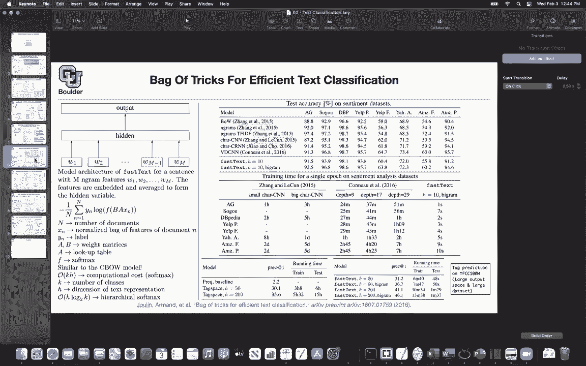
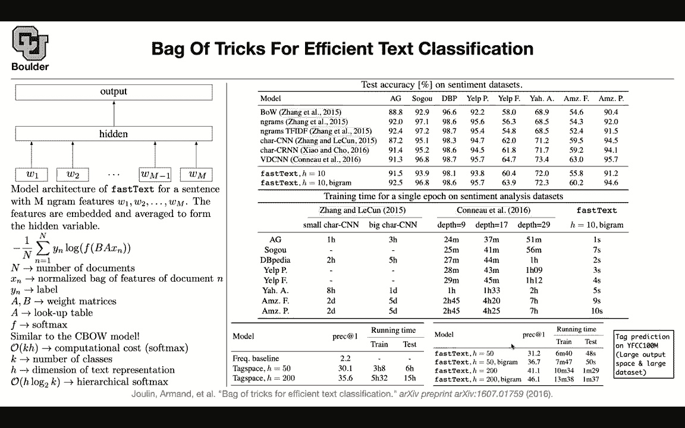

# 【双语字幕+资料下载】科罗拉多 APPLY-DL ｜ 应用深度学习-全知识点覆盖(2021最新·完整版） - P105：L50.1- FastText - ShowMeAI - BV1Dg411F71G

So what I've we done so far， we are still trying to do text classification and the applications are something like sentiment analysis。

 we started with recursive deep models for those types of models you need to have a parsed tree so there is some preprocessing that you needed to do on your data but once you have that the rest of it the model that you write is going to be dependent on the tree structure and then you keep merging words and nodes of the tree together until you end up with one vector in the end that you can use for classification purposes。

Then we said perhaps if we treat sentences the same way that we treated images where each word could be thought of as a pixel。

 then we can use convolutional neural networks to deal with that and then we saw two versions of it。

 the first version is using word vectors and the other one is using one h encoding for the words。

 so we saw two different versions of using convolutional neural networks。So these two models。

 reccursive models and convolutional neural networks， they are non nonlinear models。

This one is linear， the one that you try to represent your sentences and documents by paragraph vectors。

 so not only you have word vectors you're going to have paragraph vectors this is linear but then it's heavily parameterized and we know that we can approximate complicated functions。

 if we look at them locally and this is exactly what you're doing so locally around each one of your data points each one of your paragraphs。

You have a vector representation， so this is going to end up being a very powerful model or the drawback is that you need to do some optimization during inference。

 so that's one drawback。Today we are going to learn about recurrent run networks and STM and GRUs gated recurrent units。

 but before we do that there is this strong benchmark that is surprisingly strong that I want to go through first and that's the the idea of this paper is very simple so you have and the model is going to be called fast text。

 this is the model architecture。

You have ngram features so think of ngrams as words in your document so these could be words or they could be pairs of words so these are your ngrams and each one is gonna to be a sentence because we want to take as input a sentence and output a vector what is the idea here the idea is that you take these ngram features which could be in terms of one hot encoding or it could be1。

23456 whatever however that you want to think about them it's okay the idea is that you're gonna take that and project it into a hidden space and by projection I mean matrix vector multiplication so in deep learning whenever I say projection or whenever you hear projection that's just vector matrix multiplication so this is a vector and then you're multiplying it by a matrix and because these are one hot encoded you are just picking out one of the columns or one of the rows。

Of that matrix。So you do that， you multiply by a matrix， or you just read of the。

 let's say W1 is 1000 and you have a matrix， so you're going to read the 1000 row of that matrix and you're going to put it here。

And you do it for every single word or every single ngram in that sentence。

 once you are here at the hidden layer， you just add the up so it's just a summation once you sum them up you're going to end up with a single vector that you can use for your classification now you turn your sentence into a single vector and once you do that it came over the rest of it is classical machine learning logistic regression okay。

The entire framework， you can write it in a single formula。 This XN is your n document。

 so it's your n data point， it's your n review on an Amazon product because things are linear you could do your summation either at the hidden layer so you can first do your projections and then do your summation there or you can do your summation here at this level end of it XN and then multiply by a so it's equivalent。

 you can multiply a by W1 go there a by W2 go up there a by WM minus1 going the hidden layer and add them up or you can do your summation here and then multiply by a1 so it's equivalent。

Once you're here this is axN in the hidden it's just one vector you multiplied by another matrix to take you to the correct dimension of your classes let's say you have five classes let's say you're predicting five classes so this is gonna correct the dimension for you you do a softm to turn those numbers into probabilities and then you want to max the probability of the correct class this yn is going to choose the correct class because these are1 hot vectors so whenever you multiply a1 h vector by another vector it's going to pick out the corresponding element in that probability distribution so you want to maximize this or equivalently we can try to minimize the negative of the log of your probability so that's your last function and this is the entire model A and B are the parameters of your model that you're optimizing over so you are minimizing this last function with respect to A andB。

A takes you from your ngrams to the hidden layer and then you go from hidden layer to the output layer by B N is the size of your entire corpus。

 that's the entire data set， total number of documents XN is just the way that you featureurized your document n this could be a bunch of ngrams like what I just explained or when you add them up。

 basically you're counting the number of times that a particular word is appearing in your document that's another way to think about it because these are one hot encoded once you add them up if a word is appearing twice in a sentence that's going to give you a two in the corresponding entry of that vector after the summation and that's going to give you a bag of features or you can try to normalize it what do I mean some of the words are very frequent in your corpus。

We want to down weight those types of words that's what normalization is going to do for us So for this XN think something like TF IDF term frequency inverse document frequency so term frequency is just the number of times that a word is appearing in your sentence so that's the term frequency and then you are dividing that because you want to normalize by how frequent that word is so you're going to count the number of times that that particular word is appearing in your documents so that's how you so it's not a complicated topic TfiIDF iss just trying to take care of the frequency of the words and you want to down weight the words that are really frequent in your corpus like of like for these are frequency words that's your XN Once you have XN you're going to multiply by a Y is going to be your label。

Wwhich you encoded in terms of one hot vectors you have these weight matrices you can think of a as a lookup table that's another way to think about it so these are all equivalent interpretations of the same concept because this model is linear if w1 has only a nonzero entry at the particular row or column once you multiply by a matrix a it's going to pick that corresponding row or column of this matrix so that's why you can think of it as a lookup table if it's a softmax it's going to turn a bunch of numbers into probabilities and if you think about it this model is very similar to continuous back of wordss and we know that the computational cost for the softmax is going to depend on K the number of classes and it's going to depend on the dimension of the text representation because you are doing a dot product and the dot product is going to do a summation over。

H so there is going to be a for loop of size H and the number of output classes matter because that's what you are going to use to normalize your softmax because you want your softmax to whatever that comes out of softmax you want it to add up to one you want it to be a probability distribution so there is going be a for loop on number of classes we saw this before and it can reduce the cost by hierarchical softmax rather than being order of log2 order of k you can turn it to be order of log 2K so the model is very simple and it is in terms of performance on multiple sentiment analysis data sets it is on par with non- nonlinear models like such as CNNs or recurrent run networks or CNNs again so and as I said you can only include words and that's going to give you the baseline fast text or you can include bygrams as well。

For your features。To featureurize your document， see these numbers are very good。

 They are on par with the previous state of the art comparable to nonlinear models and what is cool about this。

Is that a CNN is going to take one hour， two hour， eight hours， two days。

 this is the small model to train on different datas or it's going to take three hours， five hours。

 one day， five days to train on these datasets we can make that better so I'm not going to go through the details of that paper but that's a nonlinear that one is also based on CNNs。

 that's a nonlinear model， this is a little bit faster for instance two hours 45 minutes or seven hours depending on the depth of your neural network。

 but this simple model is giving you similar performance and it's training in one second up until 10 seconds。

So it's an impressive model， it's super fast and it's very hard to beat so it's a powerful model not only that but because of this hierarchical softmax you can scale this model to large output space where you have large number of classes where your k is large or where you have large corpus and this is a data set these are tags on images but then you remove the images and then from the title and the description of the image you are predicting the tag and you can have a lot of tags and this is how it is comparing to the previous state of the art this is a nonlinear model and as you can see this is training for three hours these are the running times or five hours and this one is in the order of minutes and seconds so for text classification if you come up with a model then you need。

Compare to powerful benchmarks， powerful state of the art。

 this is one of the state of the art that you need to compare to so at least if your model is taking one day or two days to train。

 then it should give you better numbers than this。So does this make sense。

 any questions about this before I move to the next topic？

