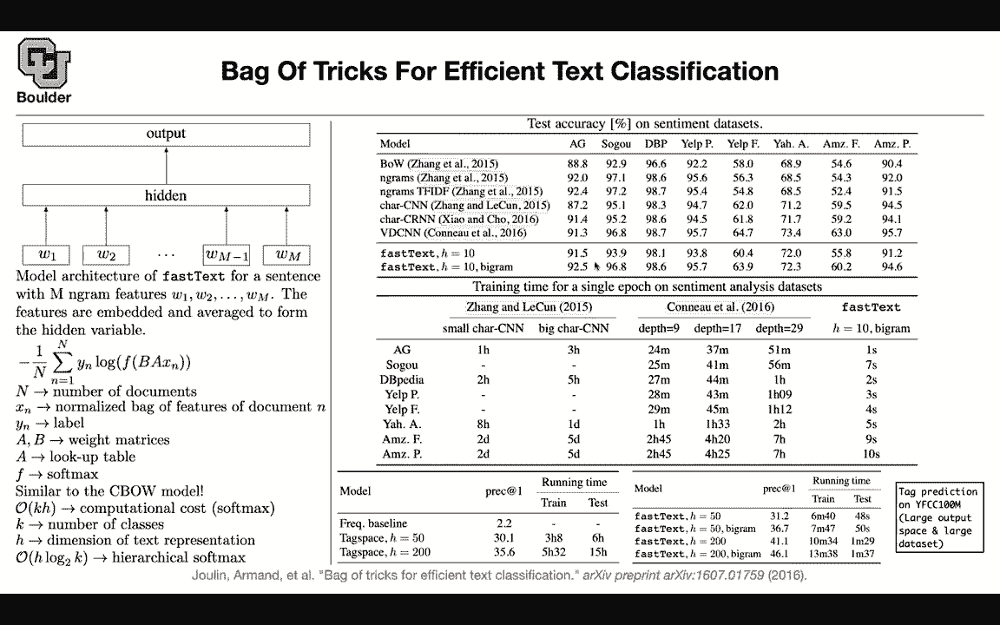
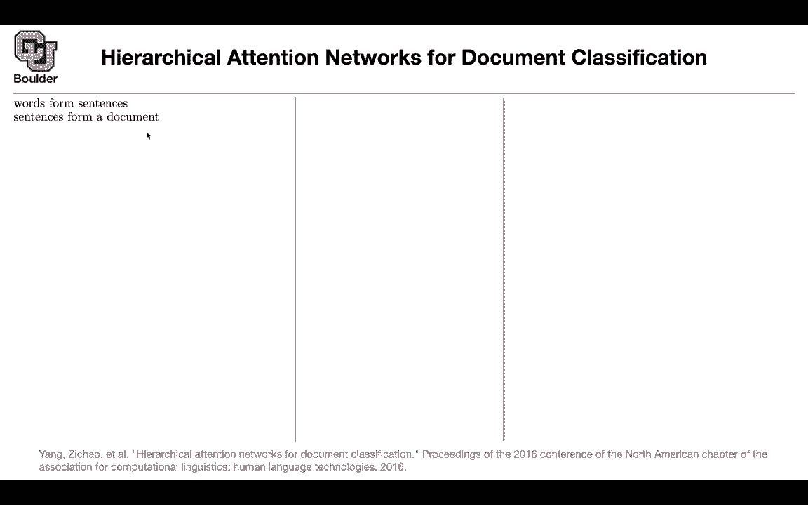
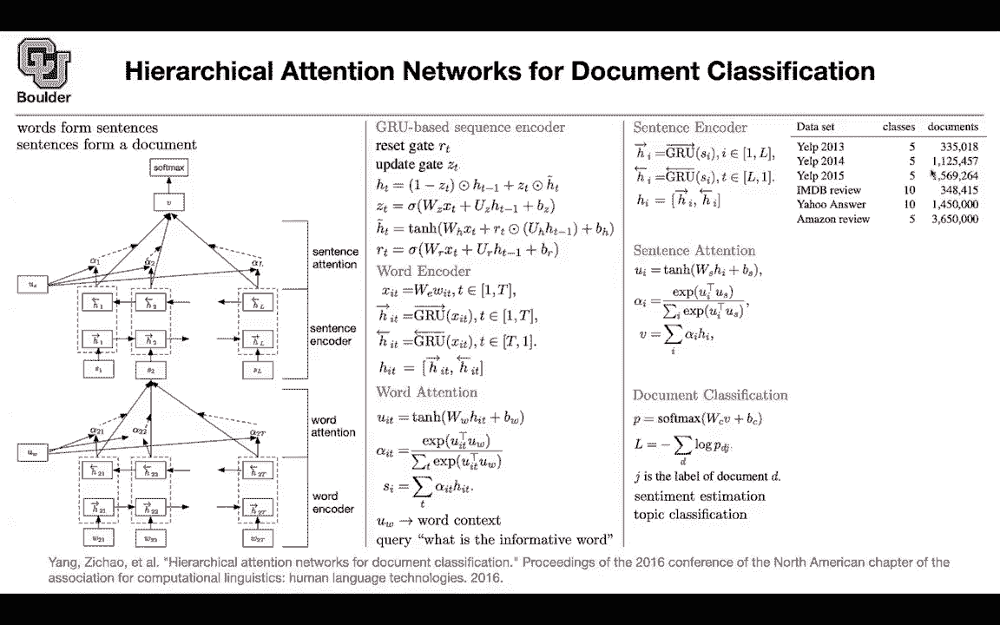

# 【双语字幕+资料下载】科罗拉多 APPLY-DL ｜ 应用深度学习-全知识点覆盖(2021最新·完整版） - P106：L50.2- 层次注意力网络 - ShowMeAI - BV1Dg411F71G

We can move on to gated recurrent neural networks so if I think by now you have noticed that whenever I want to introduce a method I try to introduce it in terms of application so we introduce convolutional neural networks recursive neural networks and different types of models in the context of application so our application here is document classification so for these paper it's nice because I'm going to introduce gated recurrent neural networks and we' are going to see a glimpse of attention so what is the idea what is the big picture here we know that words are going to form sentences so a sentence is a sequence of words and we know that documents are form by sentences so words form sentences sentences form document so that's a big。

about language and there is nothing wrong with it and you can even go at a lower level charactersact form words and we' are going to see that in the next slide when characters are forming words but there is nothing wrong with this statement Word form sentences sentences form a document so let's leverage that and let's write a model that is trying to leverage it you have a document and you want to represent your document by a single vector V once you know V then you can do a softmax and then you can do your classification then your problem is solved but then each document is formed by a bunch of sentences sentence one sentence2 up until sentence L and L could change from one document to the next document so it's a variable length sequence and each sentence is going to get formed by words So the second sentence is going to have W to1 W22 up until W2 T。

And then T can also change from one sentence to the next sentence the same thing is going to happen for S3 S4 etc。

 So now we want to write a model for it don't worry about these components what's happening here or what is happening here I'm going go through it in more details right now so what type of a model that we' going to use we are going to use a GRU it's a gated recurrent unit so we are gonna to have an RN with a nice activation function with a gated activation function and this is exactly what you're seeing here it's a recurrent neural network you have the previous hidden state。

 the current word they combine to give you the current hidden state and then the same pattern is going to repeat and then you are sharing parameters so these parameter here and these parameter here are shared with the parameters here and the next one the parameter here and here they are shared they're the same parameters and I said you are going to have a。

Acation function and that's called you're going to need two gates you're going to need a reset gate and you're going to need an update gate What is the update gate doing you want to go from the previous hidden state to the next hidden state so this is where the information is getting accumulated so you want to go from the previous to the current Z is going to tell you how much of the previous state you're going to keep so you're going to keep one minus z of that the previous state and how much of the new information are you going to pay attention to how much of the new information are you going to keep so that's the update gate。

If z is one you're ignoring the history because this is going to end up being zero and then you're paying a lot of weight。

 you're putting a lot of weight on the current information that you just got but what is that information and how you set Z Z is gonna to be sentence dependent so it's not a single number and that's why it is smart so each data point that goes in。

 it's going to have its own Z okay it's sentence that goes in。

 it's going to have its own Z actually each word that goes in。

 it's going to have its own Z and how does it happen。

 this is a new word or this could be a new sentence so this model is for both words and sentences so you're going to use the same model down here and out there a new word or a new sentence goes in you're going to multiply it by a bunch of weights it's a linear combination the previous then state goes in so this is the previous。

state this is the current information X you multiply that by a weight matrix so these are the parameters that you're gonna to learn and you add some bias but this is a number from negative infinity to positive infinity we want to have a number from zero to1 so you're going push it through a sigmoid function and that's going to squash it into0 and1 okay this is your update gate and what is the new information the new information again it's very similar to what you have up there it's going to do this there is going be x at the current time that goes in forget about R for now then there is the previous information that is going in you multiply them by weights you add a bias you push it through a nonlinearity and then that's going to give you the new the new state and z is going to tell you how much of that new state you are keeping but there is also another point where you can reset the information。

So even in Htilda you are going to reset the information that you want to keep so there are two versions of this gated recurrent unit one is that you first multiply by a matrix and then you decide to keep the information or equivalently you can first multiply H minus1 by Rt and then multiply by a matrix so you can switch the roles of Rt and UH there are two versions of it I think the one that multiplies ht minus1 by Rt is more popular they are very close in terms of performance but empirically that one is doing better and when we go towards covering speech recognition I'm going go through a paper studying all of these types of recurrent networks and telling you which one is better what type of a configuration so that's a systematic study。

But for now this is the model that we're going to use and if you think about it Rt is operating on ht minus-1 So this is how much of ht minus-1 you are resetting and h and Zt is operating on h tilda So this is happening at time T this is happening at the previous time so you're resetting some of the information on Rt is very similar to Zt having its own parameters Any questions so far So that's the left to right part of this diagram but then what about the differentarrow that's right above it going from right to left So that's a great question So what you're going to do then is just reverse your time and then it's going to let you go from right to left So it's the same model but now you're going from time capital T to time zero or to time1 so your forward loop is is just going to be a backward for loop and then you can catnate those and push those forward Yes so this operation that you。

is concatenation and that's what I'm going to cover right now So you have your words This is your word The first step is always encoding it so you're going to have word embedding you multiply your word embedding matrix by your one hot encoded words and this WE you can either initialize it randomly if you have enough data or you can initialize it using word to V or a glove model but then it's going to give you X and this x is the one that is going go through the GRU and as you said there is going to be a forward GRU and then you're going from your time is going to get indexed from one up until capital T。

And you can have a backward GRU where your time is getting indexed from capital T to1。

 so it's going in the backward round， so this one has its own parameters。

 this one has its own parameters， these are the parameters of your model， WZ， UZ， BZ， WH， U H， BH。

 WR， UR BR， and then you have forward weights and then you have backward weights。And as you said。

 you're going to concatenate them， you have a vector for the forward。

 you have a vector for the by word at state capital T。

 you're just going to concatenate them and that's going to give you a vector having twice the size of each one of these。

So far so good that's a forward backward GRU So we covered up until this point and exactly the same thing is going happen up there it's still a GRU but then that one is operating on the sentence level so now let's introduce these attention because in the end you want to combine these words into a single vector for your sentence so your sentence is going to be a linear combination of these vectors with some parameters alpha alpha to one alpha to2 etc so let's see how we're going to do it we are going to take h first we are going correct the dimension we are going push it through a linearity and that going to give you a vector UI so for each one of these now you have a vector but then you want to know what should be the weight when you're combining these H ITs together see this S I is just a linear combination of these H now you want to know what is the most important。

W in this sentence or what are the most important words。

 maybe a couple of them or the most important ones And these are the important weights that you're associating to each word in that sentence So this is how much attention you are paying to this word in the sentence and we know that we want we have a fixed budget of one this is our attention span we have only one attention unit and we want to spread it across our words in the sentence and how we're going to do it。

 We need these numbers to be from zero to one because that's our attention our attention cannot be bigger than one and then we want them to add up to one and whenever you have these property there is a softmax behind the scene So we know that there is gonna to be a softmax perfect but now these vectors have a dimension they are vectors we want to turn them into scalrs and how do we usually do it we turn a vector into a scalar by dot product So a lot of the。

leearning we can think of it just as dot products and that's what we are going to do The question is what are you going to dot product with what is UW this is a parameter in your model and you can think of it this is an interpretation mathematically this is just a parameter but in terms of interpretation you can think of it as a context word or you can think of it as a query you can associate with it a meaning and by query I mean it's just a question you are asking from this sentence what is the informative what is the most informative word in this sentence。

We can think of it that way but its role is to give you numbers mathematically once you have those numbers you have a softmax these are going add up to one and your sentence is a linear combination of your words so that is what we just covered here words are going to form our sentences and this is how they are going form your sentences you have a forward GRU you have a backward GRU you concatennate the states and then you're going to linear linearly combine the states to give you your sentence so is is clear how do we ensure the dimensions are compatible here the WW the capital W subw Yes so this is going to take care of that so you set the dimension of UW and then all of these dimensions you know these are the things that you are controlling the dimension of your hidden unit you set it yourself and these are hyperparameters of the model what you don't know you don't know how many words。

there are a percentage， right？But that doesn't matter why。

 because in the end you're going to end up with these alphas that are going to combine all of those words into a vector yeah。

 it's like max pool or average pulling， but now it's a weighted average pulling。

That makes perfect sense and then that ask will always be the same size because we can control the size of H Yes。

 okay perfect thank you， whatever we're gonna do next。

 now we need to combine our sentences into a single vector and the pattern is exactly the same as before you're just renaming your input and hidden states that's all let's see how do we encode a sentence。

 you have these essays How do you encode a document So these are your sentences your document is going to be formed by a bunch of sentences you're gonna have a forward GR。

 you're gonna have a backward GR， they're gonna have their own parameters Okay perfect you're concatenate them then you're going do the attention you want to know what are these alphas you're going have a。

Sentence query or sentence context vector that you're going to borrow these are the parameters of your model and you can interpret it as what is the most informative sentence in this document and V is just a linear combination of these concatenated vectors and these alphas they're going to add up to one you have an attention span of one or attention budget of one and you're spreading it across your vectors once you have v you can do your document classification now the dimension of V could be different from the five classes that you're interested in so you do a projection you do your softmax this is going to give you a probability the distribution per each document in your data you're going to have a PD。

Now you want to maximize the probability of the correct class and J is gonna to pick out the correct class for you so J is the correct label this is coming from your training data for training data you know your document and you know it's class for instance the class could be the second one piece is a vector and then you're picking up the second entry of your vector and maximizing that this is the same thing as before except before you had like the coefficient y and that was just like essentially an indicator variable right you were saying that's a onehat vector so it's acting just to select a certain index and this is a different way of writing the same notation Yes okay so I want you to get used to these two types of thinking about it one of them is a crossantropy loss and one of them is a maximum likelihood maximum likelihood loss or your likelihood loss they equivalent so what I'm writing here is the likelihood or negative of the log of the likelihood and what we saw before。

with one heart vectors that's just the crossantropy and because oneH vectors are one at a hot location and zero everywhere else these two formulations are going to end up being the same so what can you do you can do sentiment estimation you can do topic classification and you can have different data sets。

 different number of classes and different size for your data sets so these are the ones that you can do exploratory data analysis on the cool thing about attention mechanisms or attention in general is that you can visualize it and this is awesome you can visualize alphas and let's say you have a sentence and that sentence had the ground truth of the class being four and the prediction was for also so the algorithm is doing the correct thing it's not making a mistake there but now you want to know which one of these sentences。

Were the most important ones， so you can look at these red column here and it turns out that this entry and this entry were the most important ones。

 this is another example， this entry here and this sentence here。

Were the most important ones for predicting a very negative outcome and a relatively positive outcome。

 but then you can do it per sentence as well for this sentence which words are the most important ones for that prediction The prediction here was negative and it turns out that terrible was the most important word and not here same thing here amazing was the most important or delicious was the most important for that Yelp review so attention。

Is very nice because you can visualize it and you can see what the network is thinking so what did we do we learned about recurrent neural networks with a particular activation and this is our gated recurrent neural network and we learned about attention a little bit I think there might be something that you're showing that we can't see I think you just talked about an example but I think that so now do you see it now no I just see up to document classification I don't see anything on the right side and I think I'm not the only one I think something is wrong with zoom so how about now do you see it yeah I see it now so this is our data set you can do exploratory data analysis on that data set and each one of them have different number of classes and documents and then you can have an example the cool thing about attention is that you can visualize for instance for this prediction what is the most important。

And sentence for that prediction， and you can look at this column， the where you have the most red。

 that's where the network is paying the most attention to。

And you can have another example where your prediction is negative this term here this sentence and this sentence here are the most important they have the biggest alphas but not only you can do it for sentences you can do it for words for instance。

 for these sentence delicious and amazing for the other sentence or the most important ones and here terrible is the most important word and not etc any questions So there is a question how is the query context word selected is it a global learn parameter or is it the word embedding at the position or something else No this is actually a global vector of parameters that you're gonna to learn and it has a global meaning it means what is the most informative word in this sentence or what is the most informative sentence in this document Okay perfect any other questions。

General agreed upon best inbedding like for these first layers。 Does everyone use one hot。

 Does everyone use glove or is it kind of just whatever your favorite flavor is。

 So that depends on the size of your data。 See some of the data sets are smaller。

 Some of them are bigger for the smaller ones， probably starting with the word vector initialized by glove is probably gonna give you better results。

 So you're doing some transfer learning there for some of your parameters。 But the bigger data sets。

 there is probably enough data that even if you initialize this from random locations。

 they're gonna end up in the correct location。 Okay， Yeah， any other questions。 Yeah， I have a one。

 would you mind briefly going over which parameters are being shared between the walls。

 I know you said that each word will have its own Z。 and also， I believe in attention。Yes。

 so what is being shared from each hidden state and each input word or in each input sentence depending on where you are in this graph。

You're gonna have parameters。 You're gonna have W Z here。 W H， W R， Actually， sorry， W is here。

 You're gonna have W Z W H W R for your x's。 you're gonna have U Z U H you are here for this arrow。

 and you're gonna combine them。 But then from this point to the next point from this time step to the next time step。

 you're gonna use the same parameters。 So it's gonna be the same use and the same Ws as the previous time step up until the end。

 it's gonna be the same parameters。 And that's how you are sharing parameters。

 So that's for the forward for the backward it's the same story。 you're gonna have Ws here use here。

 But then from this time step to the next one。 You're gonna copy and paste the same parameters。

 That's answer your question。 Yeah， definitely And then did we say that we have a different attention for H each in the dataset。

Yes this is going to be different because you have different data sets going in see these are functions。

 this alpha I is a function of u， U is a function of your previous time step it's a function of H and H is a function of the previous time step and X。

 so each new data， each new word that goes in， it's going to change your alphas。

And this is exactly what we are seeing here。 These are two different predictions to different data and each one is having its own attention pattern。

 It is because are we are having a function here not because we have a lot of parameters we are very efficient in terms of parameters but we have different alphas I think we are one minute over time for those of you want to leave you can leave and for those of you want to stay and asked questions I'll be around。

 Yes， so Tedy is right the alphas are not learned they are computed each time so they depend on what is being learned are these ws and use and Bs。

 but alpha is a function of your input Yeah， this is smart this is really smart and that's why these recurrent run networks LSDMs G use are powerful because these weights that you are putting here are data dependent。

So not many people take that into account， but these are powerful because they are data dependent。

 they are functions of your data is this is this a by LSTM。Say it again。

 is this what they call I think the bidirectional LSTM This is bi directional GRU so GRU's gated recurrent units is a simplified version of LSDMs so they have less parameters okay and they have less gates this one has only two gates but then LSTM is going to have three gates you're going to have a four gate gate input gate output gate Okay but they belong to the same family they belong to a family of gated and they have the same performance or similar performance。

Okay I started with GRs because they have less parameters and they are easier to explain not that LMs are difficult to explain but are we going to do LSM next Yes it's going to be next session on Friday yes I've seen I've seen those before and we kind of breeze past them in the NLP class that took in the fall so so these ones a SMs GRUs etc they have more applications when we do a speech speech recognition so I'm going to go into more details there interesting for now I wanted to say that for natural language processing you can use different types of models you can use convolutional neural networks you can use recurrent neural networks you can use recursive neural networks you can use attention models and this is the first time that you're seeing attention and we're going to keep updating that attention it comes back all over the place yes。

Cool thank you yeah any other questions yeah I just want to verify that I understand that part of the digs are just a value to tell you how much to forget or to reset so that they are also functions that relates to the previous values the previous sector assessment suppose exactly yes cool so Z is going to tell you how much of the previous information to keep。

So they are similar to the attention in the sense that we calculate them every time rather than them。

Yes， you can think of it exactly like that so you can think of these gates as attentions also how much attention do you pay to the previous time step and how much information how much attention do you pay to current information that you just observed because a new information came in Xd came in and how much attention do you want to pay to that so yeah you can think of these gates as attentions as well if that's how you want to think about it okay that makes a lot of sense so so we have for the forward class we have。

1 w from H to1 to H to2 and then 1 w from W to2 to H to2 yes yes okay。

 and then we have the same sorry not the same but we also have two different ws for the backward pass exactly so you're going to have your own ws and use for the forward pass and then different types of ws and use for the backward path and then we have four Ws for the sentences or a。

So the same thing here， you have different。Ws and use here these are different from the ones that you use for your words Okay that makes lot of sense Thank you so what is being shared is from one time step to the next one so nothing is being shared from this so horizontal this is vertical quicklyly nothing is being shared but horizontally things are being shared in this figure Okay that makes sense so you have parameter sharing over time Okay。

 any other questions so there's been a lot of debate around attention is not explanation and attention is explanation So can we still call like whatever word has a higher attention Can we still say that a model is paying more a model is finding that important for a prediction。

I think so yes and this is an example of trying to make sense of those attentions I mean there was a paper that I read called attention is not explanation and in there they made some experiment like they did some experiments where they。

Chaed the values of the attention and still the prediction was same and they attributed the and they attributed it to the fact that attention is very convoluted and like we cannot say that even if a word has higher attention it might be important for a particular prediction probably but that depends on the model so sometimes you're doing multiple attention mechanisms and you're stacking them on top of each other Yeah like for those ones maybe it's more difficult to interpret them but here this is a simple model so you have one attention for your sentences and you have a bunch of attentions for your words I would say that for this model this is a you could think of this as explanation。

But at the same time there is some nonlinearity going on here， this is not actually your sentence。

 it is whatever information that is being accumulated in your sentence up until that point so yes you're right it's hard to interpret them。

 but at least。For these two examples they make sense I was thinking that it might be possible that some vector in say the S1 S2 Sl maybe some vector is upweighting so it might be that because of some multiplication there it is upweighting some attention which was down weighted before so that's what I was thinking in this sort of model I mean it definitely makes sense in transformers because there are so many attention layers encodes and decoders but I was thinking like in in a model in a simpler model like this is it possible that some weight after this sentence encoder might be uping some vector which was down weighted and it might be difficult to understand after that Yes exactly that's exactly。

I mentioned。Once this sentence goes through these nonlinearities of your recurrent neural network then it's not the same sentence anymore it's just a representation of it it has some weights and biases so it's messed up so yes this alpha doesn't directly correspond to S1 or these other alpha it has other essayes in it and then youre right maybe one of these sentences is being down weighted because of these nonlinearities yeah so but this is these neural networks are hard to interpret there are some ways of interpreting them and I cover them in part one of the course but yes this is just an attempt at explaining that yeah did we talk about lime in part one Yes so those types of methods we cover in part one yeah thank you yeah you're welcome。

