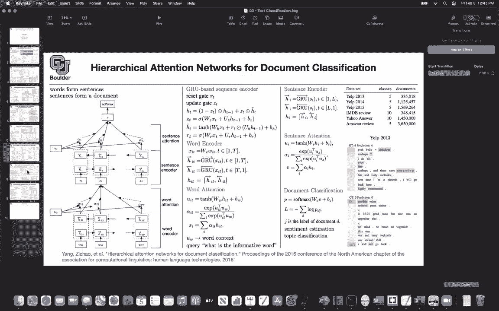
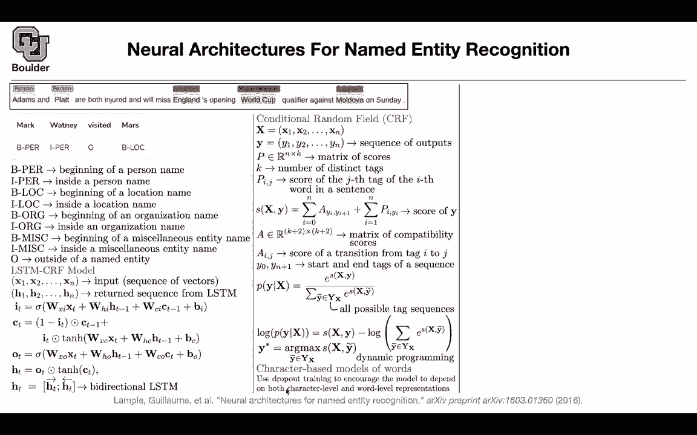

# 【双语字幕+资料下载】科罗拉多 APPLY-DL ｜ 应用深度学习-全知识点覆盖(2021最新·完整版） - P107：L51.1- 命名实体识别 - ShowMeAI - BV1Dg411F71G

Let's get us started， we are still doing document classification。

 we learned about recursive neural networks， we learned about convolutional neural networks。

 we learned about document representations similar to word representations for classifying documents。

 we learned about gated recurrent units and basically RNMs。

And we learn about a little bit about attention or a simplified version of attention mechanism for document classification and in all of them the aim is you have a sentence which is being composed of a bunch of words and then you want to combine all of those words and sentences together and in the end end up with a vector once you end up with a vector these are going to be your features that you can use inside your logistic regression today we are going to learn about another application it's related to classification but now you are doing classification per each word in your sentence so for those of you who know about images we had image classification and we had semantic segmentation of images so it's very similar here for natural language processing you're going to have named entity recognition。

So what is that perish word that you see in your sentence for instance。

 Adams and plot are both injured and we miss England's opening World Cup qualifier against Maldova and Sunday so that's a sentence that goes in and you want to classify each word is it a person what is and what is plot is that a person is at a location is that miscellaneous what is R what is both what is injured what is England what is world。

 what is Cup and what is Maldova etc so now you're doing classification perish word in your sentence and this is called named entity recognition here's another example Mark whney visited Mars so this is a person that's a person forget about B andI I will explain them in a second always is other and Mars' is location so this is how your data is being。

Labeled so these are actually the labels for your data and what could happen for each word you can have person。

 for instance， B stands for beginning of whatever entity So it's the beginning of a person beginning of a person's name I person is inside a person's name B location is the beginning of a location's name inside location's name organization miscellaneous and oh。

 for instance， the beginning and inside are going to help you merge words together for instance。

 World Cup this is the beginning of a miscellaneous word this is the inside of a miscellaneous word and then you can merge them together and report your results that way So is a problem clear the data at least what we want to achieve okay perfect so how are we going。

Approach this problem， we are going to approach it using LSDMs and continuous random fields I'm going to explain what they are again you have an application and in the eye of that application we are introducing a model that is suitable for that application。

So let's write things in mathematics because our computers are going to understand vectors and math。

 so let's use that the sentence above you can have word vectors per each word and then you can think of that sentence as a sequence of vectors so x1 is a vector x2 is a vector Xn is a vector and then you have a sequence of vectors。

 what an LSTM is going to do for us is that it's going to take as input a sequence of vectors and it's going to output it's going to return a sequence of vectors。

 so a sequence of vectors goes in a sequence of vectors comes out and n could be variable length。

 so some of your sentences are shorter， some of them are longer etc so n could vary from one sentence to the next but then whatever that's happening is that a sequences goes in a sequence of vectors comes out of the LSTM。

Here's the formulation for an LSDM it is actually a simplified version of it similar to gated recurrent units and LSTM unit is going to have some gates so this is going to be input gate so and the general formulation of an LSDM is going to have input gate for get gate and then output gate that's the general formulation but this is a simplified version you have input gate which is going tell you how much of the new information because you're going to see your words one after another so at this point in the sequence you' are seeing a new word the input gate is going to tell you how much of the new information to keep and how much of it to discard so that's what the input gate is doing in the general formulation you're going to have a for get gate here but then this is a simplified version of it so forge gate is one minus the input gate。

And this way you are saving parameters and if you had for get gate。

 it would be very similar to this sigmoid function that you have here and the role of the fourget gate is how much of the previous information and the memory you want to forget at this step so this is how much of the previous information you' are forgetting and this is how much of the new information you' are inputting to the system then you're gonna to have an output gate。

 you don't want to output everything per each you don't want to output C because this is the entire memory you want to output a fraction of it and this O is going to tell you what fraction of the memory you are outputting to give you the hidden state so as you can see Xt goes in Ht comes out not only Xt goes in but the previous x1 x2 up until xt minus1 are hidden inside is Ht minus。

1 and ct minus one so that's the role of the Eestia x1 goes in H1 comes out x1 and x2 goes in H2 comes out and up until the end。

So a sequence goes in a sequence goes out， but then these parameters ws and bes are shared per each time step so the same parameters are going to get reused from one time step to the next one and that's why in terms of parameters LSTMs are being efficient so is everything clear these gates are vector valued so we're taking like one entry and multiplying it by the corresponding entry of the sigmoid in activation Yeah so that's a great question basically your question is what is that what is this circular dot this is Hadam product and you are basically doing elementwise vector multiplication Yeah so these are element wise vector multiplications Yeah so the the O the I and the C are all vector valued Yes everything is vector。

Any other questions Okay perfect but the same way that we did bidirectional GRs we are going to do bi direction on the LTMs so one of the LSTMs is going from left to right and the other one is going from right to left so the first one is accumulating information in H and C from left to right and the other one is accumulating from right to left from XN up until x1 and then at each time step you' are going to concatetnate them the one that is going from left to right and the one that is going from right to left to give you a new vector that has twice the size of the previous one now the question is what is going to be your last function for this problem so one would say what comes out of these LSTM you can turn these H1 H2 up until Hn into probabilities so you just multiply them by matrices for them to have the correct dimension because the dimension of the output is1 to three。

45，6，789， but the dimension of H could be 256， so you need to turn the dimension into the number of outputs that you're going to have the number of classes that you're going to do with a matrix vector multiplication。

 you take this vector， you multiply by a matrix you take the same matrix multiplied by this vector etc now you have the correct dimension but now these are not probabilities。

 you want to turn them into probabilities so what would you do you would push that through a softmax to turn those numbers into probabilities now that you have probabilities you can write down your loss function。

And your loss function is going to be per each word so you're gonna have a summation per each word but what is wrong with that what is the underlying assumption that we are making when you're doing a summation that each word has like a label and they have a label so let's assume they have label and in practice they do but are we not considering like we're not classifying injured in the sentence above oh injured is O it's like visit it's okay outside of it's not a named entity's assuming independence Yes。

 so you're assuming independent you're assuming that Adamoms is independent from and and it's independent from plot so a good example is this one B per and I per they are not independent if you think about it because you cannot switch the role of these two you cannot be inside somebody's name and then suddenly the beginning。

Of the name is after insight so does that make sense so there is some ordering going on there so these are not independent so how can we take care of that that's why you're going to need conditional random field to write down your last function because if the previous word is the beginning of somebody's name a person's name then you are increasing the likelihood of the next word being inside somebody's name that's why these are not independent if they were independent this class wouldn't have any effect on this class on the outcome of the other random variables because you can think of these as random variables so the independent assumption doesn't make sense here but we still have probabilities and we know how to encode our probabilities。

So what do we have as our labels， these are going to be1 hott vectors， y1， y2 yn。

 and they are going to be1 hot， wherever you have the correct class， for instance。

 if this is a beginning of a person's name， it's going to be one here and zeros everywhere everywhere else and that's going to give you y1 and you're going to y2 up until Yn。

 this is how your data is being labeled input output data。

We know that out of our LSTM we are going to end up with a matrix of scores matrix of probabilities why because for each word for each of these words you're going to end up with an output that is K dimensional after your softmax now you can put everything inside one matrix and that matrix is going to be n by k dimensional so this is coming out of your LSTM model so is is clear yes k is the number of output classes no K is not the number of hidden so if in this case K is going to be12。

34，5，6，7，89 that you're k so out of your LSTM you're going to end up with a matrix of a scores matrix of probabilities perfect and as you mentioned k is the number of distinct tags so this is a number of classes that you have see previously you would take a sentence and then you would。

End up with only one probability。 Now you take a sentence of length N and you're going to end up with n probability distributions。

 So you're going to end up with a matrix rather than a single vector。

That's our P and what is pi J denoting I is the I word in the sentence so for instance injured and J is the probability of a particular tag and then at each word you' are outputwiting all of those probabilities some of them are going be bigger some of them are going to be smaller and we are going to choose the biggest one when you are doing prediction for instance for injured it's going to be O so the if your model is doing the correct thing and if your parameters are in the correct location and they are optimized then the probability of O should be the biggest compared to the rest of them okay now whatever are we going to do we want it to have pairwise relationship between our words because we knew that they are not independent if you are inside somebody's person some person's name the next word cannot be the beginning of that person's name so how are we going to encode that Y I。

Is one of your words and it's an index and Yi plus one is the next word in your sentence you're going to have a matrix which is going to take into account the pairwise relationship between your words for each rows and columns and it is going to encode the relationship between words the pairwise relationship between words that is the first part and we' are going to define a score and then you're going to have another score coming out of your probability so for each word in your sentence basically for each row of this P you're going to look at the correct label for instance for England the correct label is location and location is the fourth one where the third one and you're picking out that and that's going to give you the score corresponding to this y so for each pairs of input and output you're going to have a score and a is a matrix of compatibility scores。

IJ is a score of a transition from tag I to tag J This has the size of your tags in this case it's going to be9 by9 it's actually nine plus two it's going to be 11 by 11 but where is this two coming from you're going to have a start and end of tags for a sentence so these are two special tag denoting what is the start and what is the end this is the start of the sentence that's the end of the sentence okay we went through all of that trouble to give you what we want to maximize we want to maximize the likelihood and now we are able to write down the likelihood you're going to take a look at your scores and then you're going to push that through a softmax but now this time your softmax is going to do a summation over all possible tag sequences so you're going to have a lot of options here。

And like before that you had。Only nine options when you are doing classification now you have nine options for the first word。

 nine options for the second word and it's going to be combinatorially big So this set is combinatorially big but let's assume you're able to write down that summation and compute P once you have P you can take the log of B and try to maximize that So we are going the question is how big is the size of this set of all possible tag sequences it's going to be K because you're going to have K per each sequence and then you have n of those it's going to be K to the power N but then it's going to vary because your sequence length is vary So this is just a mathematical formulation and there is another question is this compatibility matrix learned Yes。

 that's a great question we are going parameterize this a is going to be the parameters of your model and you are going to learn that in addition to double。

Bs and yes， so Ws Bs and a are going to be your parameters Does that answer your question Okay perfect。

We take a lot。😊，We get rid of this exponential， we are going to end up with the score and then we are going to end up with the rest of the terms。

 this is going to go because the log of one over something is the negative of the log of that something。

 so we are going to end up with that that we are going to use to maximize our likelihood and then we are maximizing with respect to A's and ws。

Once you have that， once the training is done， once your parameters are in the correct location。

 it's time to do prediction， this is now inference time and new sequence goes in。

And we want to know what is the corresponding y Tilde， so you need to solve a maximization problem。

To give you the correct prediction So this is gonna to be your test data that's going to be your training data that objective there we are going to use for training this one we are going to use for testing so this is inference but what is the problem here this is a very big set it turns out that you can solve that problem was or these sorts of problems using dynamic programming So what I want you to know is that yes that's a big set but there is a way to solve it efficiently So there is actually a way to write down this loss function or this objective function and compute it in practice and this other problem you can solve if it beam search it's a greedy algorithm solving this maximization problem so this to have nothing to do with deep learning but we need to know about them because that's what is needed to solve this problem what is deep learning is this part and writing your loss function but this is not yet over the same way that。

In the previous slide， we had words are giving us sentences and sentences are giving us documents。

 we can have character based models for words， so characters can form words and this is useful whenever you have rare words whenever you have words that are not appearing in your。

Test data but in your training data what you see them in test data etc and I'm going to tell you what is that model but then to encourage that your model is using both the character level representation and word level representations you're going to use a dropout technique and we saw dropout it's very similar to before and we know that one functionality of dropout is to make things independent for one one set of features to not depend all all the time on the other set of features or the other set of representations so what is our character level model let's say your model your characters or your word is Mars one way to encode Mars is to have your lookup table this is your word vectors you find the word Mars in your lookup table and then you copy and paste the word embedding there so that's going to be your word vector。

Another way is to have a character level model for each word。

And then similar to before you can have LSDMs and this time your LSDM is processing characters rather than words so your LSDM is going to take m as an input it's going to push it through your LSDM it's going take a it's going to take a history。

 push that through an LSDM unit it's going to take R it's going to take the hidden unit push them through your LSDM unit etc or you can have the backward So this is the forward LSDM that's the backward LSDM and then you just copy and paste those representations here and there you're concatenate them and that's going to give you an embedding coming from your characters So this is a vector that's a vector now you can concatenate them and then that's your final embedding it's very similar to what we did here you're just concatenating the forward LSDM backward LSDM and your word word embedding but this is now happening at the character level okay what have we done。

We defined our problem。 This is our data set。 We took a look at our source code。

 The source code is the。The data is a source code for deep learning。 We wrote down a model using LSM。

 We needed to write down a loss function。 If a is just zeros then you're relying on the independence assumption but if a is a learnable is a set of learnable parameters then you're at least adding some paravis relationship between your words。

 So one might argue that maybe this is not enough and then you might write more than parawise maybe every threeword should talk to each other you should have a transition for that。

 but then that's going to be a too complicated of a model and then we notice that。

 yes you can write down your loss function， you can take a look at your word vectors but at the same time you can have a character based model for your words for the type of words that you're not going to see in your training data and you're going to encounter them in your test data in terms of performance So LSM。

CF without any character model without this one is giving you this performance if you CRF the with character models that's going to increase the performance but for English you can do it for Spanish and that's a new data set that you can explore for this task Any questions so far before I move on to the next topic so with this character level of LSTM its it's kind of like one of these hierarchical models again we're doing an LSTM just to get an embedding for a word and then the word is the input for another LSTM which gets the embedding for the sequence or for the sentence Yes so these LSTM here is what you have for words and then you have another LSTM that's going to give you these hidden units that you can use to come up with your probability it's like what we saw before what we saw before was words were forming sentences and sentences where forming。

Do here characters are forming a word and words are forming a sentence and then we are going to stop there because that's what we need we have a sentence and then we want to classify each word so for those of you who know images and semantic segmentation this task is basically semantic segmentation but now for sentences rather than images and it's going to be called named entity recognition and in the end the aim of natural language processing are these sorts of tasks for instance coming up with good sentiment analysis software or spam versus not a spam。

So that's the final aim or named entity recognition， these are the final tasks。

 but the problem is these sorts of tasks don't have enough data。

 I guess one of you mentioned that do you have labels per each word， yes you do。

 but it's very costly so somebody needs to be sitting down and labeling a lot of data。

 but in natural language processing you have a lot of unlabeled data。

The question is can you somehow use those onlabeled data do unsupervised learning and whatever that you learn transfer them into these sorts of tasks that are your final tasks we sign an example of that when we were learning word representations for word representations that was an unsupervised task you will just look at a lot of words in your corpus that's going to give you a word presentation and that one you can actually put it here so you're doing some transfer learning already so we want in the next slide to do even more transfer learning the question is could this model be used for part of speech tagging as well yes so that one belongs to semantic segmentation as well。

Does that answer your question so these sorts of tasks sentiment analysis。

 question answering paragraph completion， etc， name entity recognition。

 part of a speech tagging these are the sort of tasks that are your final task this is what you're interested in you are not interested in language models per se because they are cool you're interested in them because they are going to help you do transfer learning。

