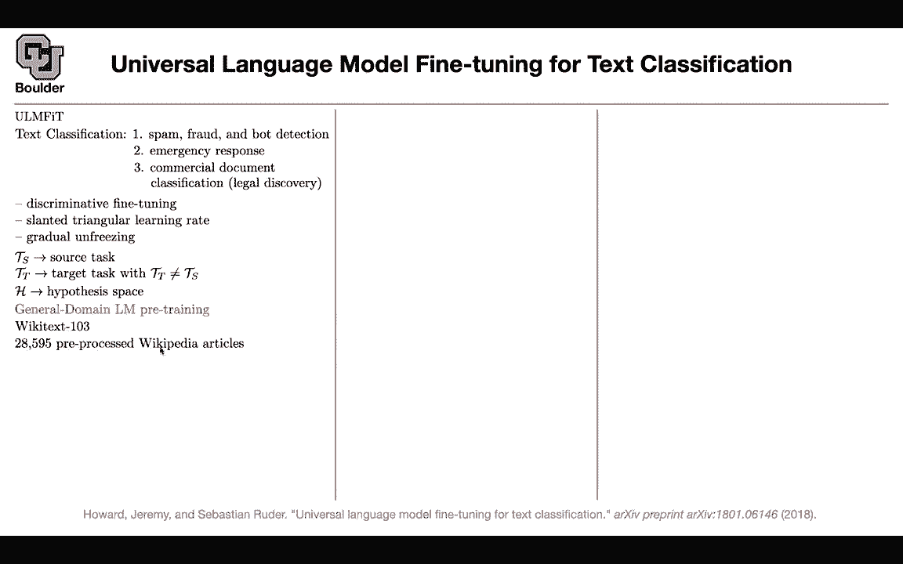
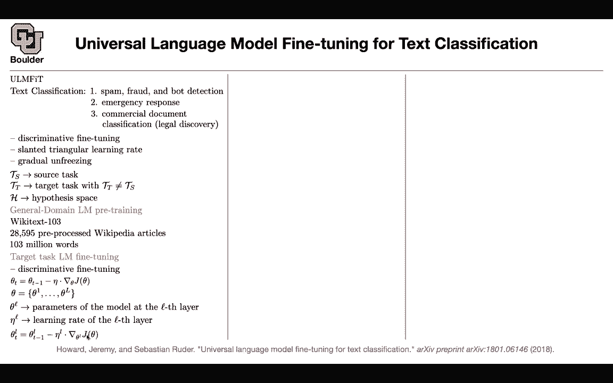

# 【双语字幕+资料下载】科罗拉多 APPLY-DL ｜ 应用深度学习-全知识点覆盖(2021最新·完整版） - P108：L51.2- ULMFIT - ShowMeAI - BV1Dg411F71G

I'm going to touch upon that in this slide because it has to do with text classification and it is one of the first papers that was using language models to do transfer learning for text classification at least but then I guess next week we are going to do another important task in natural language processing which is translation but then after that we are going to go back to language models and do transfer learning all the time okay the model is called ULM fit。

 it's universal language model find tuning and this is for text classification what are the applications of text classification。

 you can do spam is this email and spam or not spam is this email or is this comment on LinkedIn or another social media platform is it a fraud。

 what is being posted on Facebook is that a bot or。

That's a real person you can have emergency response so these are the sorts of question answering type do another application could be legal discovery so there is some commercial document and then you want to classify them whatever were going to do we are going to have a language model I'm not going to go into the details of what is a language model but for now this paper made an observation that for images you would train your a model let's say a residual renet on imagenet it's going to give you some parameters it's going to give you a pre-trained network that you can use it for other tasks like segmentation or object detection the question is can you do the same thing for natural languages can you do transfer learning and for transfer learning for languages we are going to do language modeling for language modeling what is a task？

Somebody gives you a sentence， for instance universal language model。

 and then you want to predict the next sentence， the next word in your sentence。

 so that's a language model， given the previous words， can you tell me what is the next word。

 and then you want to increase the likelihood of that happening， giving you the correct answer？

And as you can see， this doesn't need any labels， this is unsupervised。

 you just look at unlabeled corpses and you have plenty of them on the internet and then you just train。

 for instance， an LSDM for now let's leave with LSDM because this is 2018。

Okay once you have those parameters we are going to use them for a classification task。

 but before you're gonna be able to do that you are going to need to do some fine tuning on your data for this particular task that you have at hand for let's say text classification so that's one trick that the paper is using and the other one is a slanted triangular learning rate so before these paper things were not working these idea is very simple but it was not working and this is the first paper one of the first papers that using some tricks managed to get that big picture big idea working and you're going to see the ideas are not fundamental these are a bunch of tricks but then once it works you get the big picture that yes it is also possible for text not only it is possible for images to do transfer learning you can do transfer learning for text as well so these are the tricks thisriminly fine tuning slanted triangular learning。

Great and gradual and freezing whatever we're going to do， we have a source task。

 which is your language model， given these three words predict the next word。

We have a target task， which is your text classification and we are doing it so far that' our target task and this is a different task from your source task and you don't need to worry about this。

And we are going to do a general domain language model c training。

First， you train your language model。 We are going to use Wiki textext so you can take a look at that data。

 These are from Wikipedia articles， and this is how many articles are in that data set。

 This is how many words you have。 This is unlabeled， and you train it。 You train your language model。

 You're going to be an LSDM， you train it。 But then for your text classification task。

 you're gonna have a bunch of text。 on those text。 you're gonna fine tune your language model。

 So you're going to ignore the labels。 You're going ignore the classes。

 You're just going look at your pure text and fine tune。 Here's a trick。 This is discriminationrimin。

 fine tuning。

The trick is you're going to do gradient descent these parameters are the ones that are already trained on your large corpus。

 so you're going to initialize your network with them。

 but then you're going to divide your parameter space per each layer the first layer of your LSDM the second layer of your LSDM up until the last layer of your LSDM so you're going divide them and then you're going to have parameters for each of these layers so you're going to have parameters specific to each layer and then you're going have learning grades specific to each layer so you're going to have different learning grades rather than doing gradient decentscent that way you're going to do gradient decentscent this way so you're going to have learning rate for each set of your parameters per layer and as you get closer to your input your learning grade is getting smaller and smaller so you're changing the ones on the top faster compared to the ones at the bottom closer to your input data。

So that's a trick and this number is some magical number through trial and error okay the idea of this paper is just you want to get that idea of transfer learning working no matter the cost so let's just try to make it work this is one idea this is actually a trick the other trick is sy triangular learning rate。

Don't worry about the math year， the math is for it to be exact， but what is happening in the end。

 you start with a learning rate initially you increase your learning rate and then you decrease it gradually another trick。

 so you increase your learning grade， you let it go down。

And T is the total number of iterations that you're going have for your fine tuning and these are the specific realizations of these parameters so you're gonna to have some parameters here and the ratio that you see here is going to tell you what is the smallest what is the biggest learning rate and what is the ratio between the two basically how smaller is the lowest learning rate compared to the biggest learning rate so far so good so we pretrain a language model we find tune on our task now we're going to transfer learning we are going to freeze most of the parameters and on top of those parameters we are going to add a bunch of other layers so we are going to add two additional linear blocks these are fully connected one of them is going to have a ratio activation the other one is going to have a softmax because in the end you want to end up with probabilities of your classes and we know that you're going have an LDM。

Sent goes in a sequence of vectors comes out so this is a sequence of vectors this is out of your language model then before adding these additional linear blocks you take the last entry coming out of your L SDM you're going to take the max max pullinging of these and you're going to do the average pulling of these vectors you're going to concatenate them and then you're going to take that and push that through your linear layers you multiply by a matrix you apply value on it you multiply the outcome by another matrix and then you do softmax on it and then in the end that's going to give you a probability here's another trick you are going to gradually and freeze the parameters of your language model。

During training now your loss function is coming out of classification and then don't worry about back propagation through time in modern machine learning frameworks and deep learning frameworks this is actually implemented so don't worry about that so you're going to do two back propagation one for fine tuning one for your text classification here are the data sets that you're going to use and you're going to have different tasks question answering sentiment analysis topic classification here are the size of your data and here are the results compared to the previous state of the art you're doing much better and the idea of transfer learning is working after doing some tricks the idea of transfer learning for texts is working。

And you are transferring whatever that your language model learned to the task of takes classification I think we are one minute over time for those of you who want to leave you can leave and for those of you who want to stay and ask questions I'll be around So I was curious the bioOSTM that we looked at just previously had just one hidden layer in this case you could kind of generalize that to have like the input go into bioTM and that output go into another and that output go into another and continue like that and that's these H1 H2 up to HT。

No or are the H1 through HT just like word one through word T and the embeddings that come out from so what we saw was just one layer of LSDM so LSTMs are deep in time but then you can make them deep in space as well okay so what is the task of an LSTM and in the first layer when at least1 or at is zero your sentence goes in and a bunch of a sequence of vectors is going to come out then you're going to take that and push it through another layer of LSDM a sequence goes in a sequence goes out then you do the same thing a sequence goes in a sequence goes out and then you do it for capital L times so these are both deep in space and deep in time but whatever that you do in the end you're going to end up with H T vectors and this is after all of those layers of LSDMs。

the final output layer at the final output layer because each layer is going to take a sequence has input output a sequence take the same sequence output another sequence and in the last layer you have a sequence and that's okay so wet we don't necessarily store all the intermediary sequences they're just computational and then we throw them out exactly so they are just there to help you what you're going be interested in is the last guy so this T here is not not your layer it's the size of your sequence L is the number of layers that you have so T is the depth in time L is the depth in a space and then the other question I had is that this training sed triangle process is probably pretty helpful with really all models right。

This is actually a technique that people use a lot these days so yeah that's a very good technique I think there is a question from Matthew that they want to answer as well are all of these tricks primarily needed because LDMs are hard to train or do these tricks appear in transformers as well？

So no you need these tricks， this is the first paper trying to do transfer learning or one of the first papers trying to do transfer learning from unlabeled corpus to labelbeled corpus。

And things before this paper were not working sometimes you have a great idea and then things are not going to work when you take them to computer especially in deep learning things are not going to work but these guys were really persistent they said we want this idea to work no matter the cost and in the end these were the tricks that they needed to use so one of them was thisrimin fine tuning which is smaller learning grade for lower layers the other one was this slanted triangular learning rate and the other one was gradually un freezingez the layers so I know it's not because unless the end are hard to train it's because doing the transfer learning was hard at that time okay that makes sense thank you okay sure I had a question my internet kept disconnecting on the first slide so I missed a few things I was wondering if we can go it if you have a second sure。

So I missed the part about the LSDMCF， so I get the input we have x1 to xn。

 which is the input towards and then the output is classification for each node I is the input sorry it's one of the gates is that the IT is at the four gate。

IT is the input gate this model doesn't have any for gate because they wanted to save parameters and the way that they are saving parameters is that F of T is equal to1 minus I of T so there is actually a for gate but it's implicit this is their for gate but then they are tying their for gate to the input gate。

What is it again。So they are tyd the4 get gate to the input gate。 So F is1 minus I Okay， yeah。

 that makes sense。 and then O of T is the output。So we are going to study LNs and gated recurrent run networks in details when we do speech recognition because there are multiple versions of them and the question is which one is the best what is a crucial component so it turns out we are going to learn about it later it turns out that this10age is really crucial so you cannot get rid of that and then this forget gate no matter how you want to code it up or what formulation you're going to write for it you're going to need to have a forget gate so this term and this term here are crucial Intuition behind the forget gate is that。

I guess it's similar to attention how much I guess attention should be put to the previous world Yes。

 so you want to get rid of some of the information that is already in C minus one that's the idea of the forget and we do that when the words are I guess not really correlated that's just random so when the question is when when do we get a high value for forget hypothetically so let's say let's see if it is one what's going to happen if it is one then you're not going remember anything from the past all you're remembering is through your age age you can think of you can think of C as a shortcut connection through all of your layers because you're going from this is deep in time okay。

So you're gonna have a route C1 c2 C3 up until C that you are not seeing。

 but then sometimes you add information to that sometimes you subtract the information from that some of the details you're gonna keep some of the details you're gonna to forget because if you remember everything then you're going to be in trouble not every single information accumulated in CT is informative that makes sense so C is all the information in the previous worlds where age of T minus s one is only the previous world Yes there it's the same thing with human we have a shortcut connection through the history of our life and then sometimes we forget stuff that are irrelevant to the to our lives for the future Yeah that makes a lot sense and this is the same thing so you're forgetting some of the information Okay Google then I had another question about a so A is get it's a metrics。

Compatibility scores so it's going to be 11 by 11 over here how do we and it's going to be a learnable one so how do we get a score you mean how do we get a's Yes so I know we initialize a because it's a learnable one learnable make accessible yes so P is coming from your LSDM model。

A is the parameters that you choose， So you initialize them randomly and then。

Through this objective function， you're going to learn them， you're going to learn that for instance。

 I pair should have a higher probability of appearing after B pair。

 so these are the sort of things that you're learning in a。

 so the transition score from B to I is higher than going from I to B。

That makes a lot of sense okay and P you said coming from the softmax and P is coming out of is going to be a I guess the al maxax actually no p is not coming out of the softmax it's before the softmax these are the scores but then your softmax is here Okay what is the purpose of taking all possible tag sequences so we were doing the same thing this is you want this to be a probability distribution okay and the probability distribution needs to add up to one so you need to take into account all of the other possibilities and why is that because in the end you are maximizing these probability yes so you're maximizing the probability of the correct class at the same time if they add up to one all of these possibilities you're increasing the possibility of the correct outcome and then at the same time decreasing the probability of the wrong outcomes because they。

Have to add up to one so all of the possibilities because it's a probability distribution needs to add up to1 and this softmax is doing that Okay so E of e to the s that topout is the I guess's I guess it's also a matrix of probilities of what's the probability of each word in the sentence to be each class so S of x and y this is x。

 this is your y and this are the correct class So this is the score of the correct class and then what you're writing here is the probability of the correct class and then if you do a summation over all of the possible tags that's going to add up to1 yes。

 because that summation is going to cancel out with this and it's going to give you1 So if you increase this probability you're decreasing the probabilitybabilities of the wrong ys So if you have y1 and y2。

 if you and y1 is the correct label， sorry Y and。W is the correct label Y prime is the wrong label If you increase the probability of the correct label because this is a probability distribution it has to add up to one the probability of the long the wrong label is going to go down automatically because you have a budget of one you are increasing the contribution for one of the probabilities so the other probabilities have to go down because that's your budget your budget is one Yeah that makes sense and the reason it's so big is because we have so many different possibilities for every word in the sentence Yes so we have to go through this trouble because of the fact that the independence assumption is not a good assumption here Otherwise this why would be very simple you could have only 11 outcomes or nine outcomes Okay yeah it makes a lot of sense now。

Because if you have the independence assumption。You would just the probability of y1， given x1。

 the probability of y given x is just the product of the probability of y1， given x1， y2。

 given x to y and given x1。independent if they were independent。

 but they are not independent So we have to think all combinations Okay， yeah。

 it makes a lot of sense， why are we doing the I mean。

 I guess why we're doing the bi directional when we were taking walls because we can flip the walls and it will have the same meaning。

 at least that's what I thought why we're doing that。

 So why are we doing that when we're taking characters。Oh for characters because first of all。

 why do we do characterbased model because there might be a new word that we see in production or during testing that we didn't see during training so this part might be the unknown so you're going to look up the unknown that's going to be a vector but then this part is going to compensate for it because each word you can write it as a bunch of characters so is that similar to the what we did with the Ngam one of the models when we divided a word into subwards to get a better representation of the word and also for production if we have a word that we haven't seen Yes so there is a problem with character based models is that your sequence length is going to become very long。

And that's a problem， that's why we a way to compensate for it was subward models， I see。

And why are we going backwards， I mean I get the right because A comes after M so you actually learn the word。

 but the going backwards doesn't really make sense to me because if you're predicting after S。

 it's very unlikely that will happen so the idea of forward and backward SMs in general is that the word A depends on the word M the word sorry the letter A depends on the previous letter。

 the previous character。And the character coming after it so it's a way of encoding that by directionality again。

 the same thing is happening here the probability of seeing an A after M it probably is bigger than the other way around so these are not independent Okay so the reason we're going backward was to take that forward like R as well as M into account and were looking at a Yes when you look at a you are taking into account R and M not only you're taking into account M you're taking into account R so you want to have an entire representation for the entire word Okay cool they have a lot of things I mean thanks a lot appreciate Okay perfect Thank you yeah sure by。

