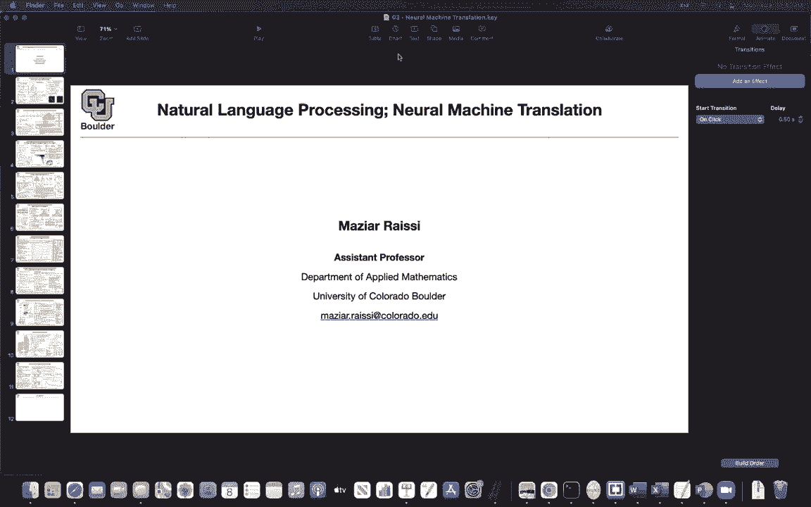

# 【双语字幕+资料下载】科罗拉多 APPLY-DL ｜ 应用深度学习-全知识点覆盖(2021最新·完整版） - P109：L52.1- 神经机器翻译 - ShowMeAI - BV1Dg411F71G

Let's move on with the next big task in natural language processing。

 And that is neural machine translation。 So we are gonna try to use neural networks to do machine translation for us。

 to be honest， the task is very similar to classification。 At least when it comes to inference。

You are doing an arc max of the target sentence let's say this is French and then from English you want to go to French assuming that you know your probability and you somehow came up with a good model for your probability for your conditional probability then inferences is very easy you just need to solve an arc max problem given a source sentence give me a target sentence and as you can see there are no unique answers to the translation that's why you are modeling the probability because for each source sentence there might be multiple good target sentences。

 multiple good translations so it's better to model the probability the entire neural machine translation is going to be about modeling this P。

And we are going to start with a model with recurrent neural networks。

 and what we are going to do is we are going to do in codeder decoder architecture。

What is the source sentence like it's going to be a sequence of vectors and we know that we are representing our words with vectors so the input sequence is a input sentence is going to be a sequence of vectors but the problem is that this could be variable length that's why we are going to use an encoder to encode the entire thing the entire sequence into a single vector and this is actually what we were doing for classification as well we had a variable length sequence and we were transforming it into a vector so that's the encoder part we are going to use an LsTM or any other type of recurrent run network is going to work here and we know that the input to an LsTM is a sequence the output is going to be another sequence of vectors and the sequence of vectors is going to be the sequence of HTs and the question is what is this C how are you going to model it previously。

This is what people have been doing so you said C to be a function of all of your hidden states。

 but then a particular formula for Q could be the function that is just picking out the last vector in your sequence and that's going to give you a single vector and that's going to have the size of HFx so always you are picking picking up the last guy the last vector in your sequence and we know that these are n dimensional vectors this is the encoder。

Now you encoded a sequence into a single vector， now the problem is you want to go back and you want to keep outputting your translated sentence。

 one word at a time。So you want to write down this probability of y given x。 I'm removing x。

 but this is exactly what you have up there。 It's P of y given x what you write here is just a chain rule for probabilities So there is nothing wrong with that you can say the probability of y given x is the probability of y1 given x times the probability of y2 given y1 and x times the probability of y3 given y2 y1 and x etc。

 So this is just a chain rule there is nothing wrong with that but then you are doing an approximation here for this probability first of all。

 you are not conditioning on x you are conditioning on c。

 which is a representation of x So there is some approximation going on there and then your conditioning you need to be conditioning on all of the previous words that are already produced by your。

machine translation y1 up until y t minus1 so these are the French words these are the English words as an example。

 but then that one you can approximated by saying let's condition only on the last guy the last word in the translation that we just uttered and let's summarize everything else in a hidden state so ST is very similar to HT so this is the hidden state and its role is to summarize the words from y1 until y t minus1 so this is your output sequence and it's gonna to be a sequence of1 hot vectors because that's your distribution you want to know what word is gonna come out next out of your translation and as I've mentioned St is the hidden state of theren neural network this is the decoder so you're gonna to have an encodeder architecture you're gonna to have a decoder architecture and this is the previous state of the art before this paper so this is neural machine translation now what we want to do is we want to introduce attention。

And this is I could claim that this is the first paper that introduced attention mechanism for natural language processing The problem is when you want to output a word you want to know which word in the input you need to pay attention to because sometimes the words are going to get reordered when you're doing your translation and we are going to see an example of that later on going from English to French so the problem is how do you want to model this previously we were modeling it with a single vector now we are going to put Ct here and T is going to correspond to the word that you're outputting at these time step for your translation so you are translating one word at a time so rather than having a fixed C we are going have a time dependency that's one change this is for when you're modeling your G here which is outputting your probabilities and then for hidden states previously this was。

constant C and if you look at it， there is a one to one correspondence between this function。

 this LSTM here and the LSTM up there， you just replace H by S so it is going to be ST minus1 like ht minus1 and for translation you don't know your next word that's why you have to work with the previous word this is why t minus1 and then there is a context that is time dependent。

The question is what is CT you are paying attention so it's a linear combination so you are paying attention to all of the words in the encoder so these are basically all of the hidden states in your encoder so T prime is indexing one up until Tx so this is the length of your source sentence but then we know that we have an attention budget of one and whenever you have an a budget of one like probability distributions or attention whatever we're going to use that's a question for you softmax yes so we are going to use softmax so that's going to give you a softmax of some scores now the question is how we're going to model these scores E T T prime and ET tau so ETt prime is going to give you your alignment scores at that time they were calling it alignment because they wanted to align the。

Source sentence with the target sentence， but this is basically an attention mechanism and i'm going to tell you what is a or what particular formula for a we are going to use but in the end it's about the hidden state of the encoder and a decoder so this is the hidden state of the decoder hidden state of the encoder one of them is t the other one is t prime that's why it's going to give you E of T t prime so for each pair of T and t prime you're going to have a score and once you have that you are going to push that through your selfm that's going to give you a budget of1 that you can distribute among the source sentence and that's going to give you Ct so the only changes that you're replacing c by Ct and visual speaking this is what is happening the source sentence goes in from x1 of until Xt X this is basically Xt。

Then you are going have a bidirectally SM that's going to give you your hidden states。

 So this is going give you Hts。 then these alphas are these alphas here。

 So you're going to do a linear combination and then sum them up that's going to give you your C and then to update ST what goes in S minus1 goes in So that's st minus1 Yt minus1 goes in and then C is going go in and then it's going to give you the next state of your decoder So let's see particular examples for F。

 So these were just general functions up until now now we are going look at some instances of them some examples This we learned before Can somebody remember what this is G or GRU Yes exactly So it's gated recurrent unit and there is this new information the hidden information that we just got it's a function of the previous word but you cannot input words。

You have to first embed them into vectors and that's what you're going to do is the embedding matrix and if you remember previously we had the roles of these two guys switched now this is the most used version of GRU that first you multiply by R and then you multiply by your matrix so these are the parameters w U and Cr parameters that you're going to learn through stochastic gradient descent and then C is just C here so there is a correspondence between T and I so they're the thing and as you mentioned this is just a GRU you have update gate reset gate that was for the decoder for the encodeder you are going to ignore C so there is no C anymore so these terms are going go away and you're going to replace S by H so in these formula you're going have H is F of H minus1 and X and you're going。

placela y i minus1 by X and then there is no C anymore， so that's encodeder that's your decoder。

 so I gave you F and this F here I gave you this Q function， this is your attention mechanism now。

Now， I need to tell you what is your last function and how are you actually going to update。

 How are you going to output with these probabil， So I need to tell you what is G。

 That's what I owe you。 And the other thing that I owe you is this attention。

 So I need to tell you what is a， and I need to tell you what is G。 So a。

Is this mechanism so you're going to have the hidden state for the decoder you're going to have the hidden state for the encoder and then you're just going to multiply them by two matrices these are going be parameters of your model you're going to learn them push them through a nonlinearity this is going to give you a vector but for attention you want to have a scalar that's why you're going to multiply by a vector of the same size so it's just an inner product of the two that's going to give you a scalar that you can then push through your softm to turn them into numbers from zero to1 that add up to one。

So that's a Now I need to tell you what is G for G， you have a 10 vector Yi。

 which is going to pick out the corresponding index or the corresponding element of your vector so whatever that you multiply this vector by it's going to pick out the corresponding element so wherever it's one it's going to pick out that element。

We are going have an output weight， and then I need to tell you what is Ti for T。

 we are going to use non nonlinearity， So this is an activation function。

 This is a particular activation function it has a regularization effect in the end So there is a paper max out neuraln network。

's it's a very good paper， but it's for image classification and we're going to use that idea here。

 So that's going to give you T。 Now I owe you what is T tilde T tilde is exactly what is going to tie everything together So you have the hidden state of your decoder。

 You're going multiply it by a matrix。 you have the previous word You're going first encode it。

 You're going to do the embedding matrix and then multiply it by another matrix。

 These are the parameters of your model and then it's also a function of ci and in the end。

 everything is now tying together。 I told you what is F。

I told you what is Q we know what is G how the probability is being modeled and we know what is this F and we know what is a okay now the question is what is your last function。

 this is your probability coming out of your model once you have the probability you can this is basically your likelihood and you can maximize the likelihood or minimize the negative of the log of the likelihood so your data is going to be in the form of pairs of source sentence target sentence source sentence target sentence is going to give you the corresponding likelihood and you maximize it with respect to the parameters of your model and these are the parameters you O V O CO W O U A W A V。

D Cs and uses and ws。 And I guess that's it。 And of course。

 if you want to optimize your embedding matrix， you can also do that。

 if you have enough data for pairs of languages such as English and French。

 you have a lot of pairs of data So there is a question what is Va in here So Va is also a bunch of parameters。

 It's a vector of the same size that is coming out of this operation。 It has exactly the same size。

 but now you're transposing it that's going to give it a dot product between Va and the other vector it's going to turn the outcome to be a single number So we are paraizing a So any other question I everything clear I there just a single embedding built from both languages for the languages embedded separately。

That's a great question and this is exactly if you attended the colloquium the second speaker was telling us about different choices should we just merge the two languages together and come up with one single embedding or have separate embedding for the two languages I guess this is separate embedding for this paper Okay but these are really important questions because they can have an effect on the outcome on the accuracy of your model IM which LSTMs the same for the F that we're using up above and down below and the decoder what's different as the inputs or are the parameters totally different so you have different parameters that's one thing totally different parameters for the encoder and decoder yeah but the rest of it is the inputs are being renamed I mean you don't have C so there is no parameters C anymore and SiI is going to take your role。

H and Yi minus1 is X。So it's exactly the formulas above you just do these modifications so I didn't want to write them again because it's the exact same formulas you just have new parameters and new names perfect you any other questions so there seems to be a trend here yes in machine translation and in natural language processing we are most of the times using GRUs K recurrent units because they are simpler they give you similar performance they have less parameters but when we go to speech we are going work mostly with L STMs the usual ones any other questions so this is your attention mechanism so。

What is missing？I told you。What you're going do for inference you're just going to solve this maximization problem per each sentence word per each input sentence that was in。

 you want to know what is the corresponding translation and you're going solve this I gave it a model for this P。

 We know what is the last function we know what is our data at least going look like it's pairs of source and target sentences and the loss I also told you what is missing is how we're going to know how good your translation is what is your metric So there is always these four components data model training inference and then you need to evaluate your model The metric that you're going to use and I'm sure you're familiar with it at least you have heard the name it's blue score for blue score the more is better So the larger your numbers。

 the better is your model， what does blue stand for stands for bilingual evaluation under study and under study is just。

So you want to have a substitute for human translators you want to have an understudy for human translators so blue is going to do that so there is this nice video this is your homework I want you to click on this it's going to take you 10 to 15 minutes to watch this and then it's going to give you the intuition behind the blue score it's a perfect video if you want to know the formula so what is the problem with machine translation the problem is for each input sequence X there might be multiple good translations so you might have multiple candidates so multiple good candidates so the candidates in the numerator are the target translations the candidates in the denominator or the candidate translations coming out of the translator our neuro machine translationlator and then you want to use a precision score how precise is your translation but the problem。

I if you use that it's going to give you a bunch of ones and you're not going to get much information out of it so you're just going to need to clip your counts so you're going to look at your n gras。

 you start with words one grams， you're going to write P1， you're going to do two grams or bi gras。

 you're going to write P2， you're going to write up until whatever blue score that you want blue5 blue6。

 etc。You're gonna create these pNs and I want you to watch this video for intuition behind this formula okay so why this works but once you do that there is a problem and the problem is this is score is gonna give higher scores to shorter sentences so there is a tendency for this score to give higher values or give higher score to shorter sentences to compensate for that you're going to penalize the score if it gives you a short sentence you're going to do a penalty on the blue score so I think it's better if I take a log of the blue score and then things are going to become more clear if you take a log of the blue score there is this BPP brevity penalty there is an exponential in it the log is going to cancel the exponential and then the other one log of one is zero so that's why you get this formula here and this exponential。

Go to go away， you're going to have a linear combination of these logs of these ngrams precision so it's the log of the precision score corresponding to ngrams so what's going to happen and let's see what is R what is C R is the reference translation length C is the candidate translation length So the candidate is coming out of your translator and the reference is the ground truth。

 they have length。

And let's say C is less than R if C is less than R。

 let's divide both sides by R it's going to be by C it's going to be c divided by c is going to give you1 is less than a recall to R divided by C take everything to one side it's going to give you one minus R divided by C less than a recall to zero so if the candidate length is less than the reference length this term is going to be negative and the minimum of something negative and0 is that negative thing so your penalizing the log of the blue so a similar thing is going to have is going happen to blue so yourre penalizing the blue score if the candidates translations that are being out with it by your model have a shorter length compared to the reference length so that's the blue score the higher is the better and if you subtract something from it then you're penalizing you're reducing the blue score。

And that's how you're going to evaluate your models， your translation models。

 I promise that i'm going to give you an example of a translation and how the attention mechanism is working let's say you want to translate from English to French and the sentences the agreement on the European economic area was signed in August。

1992。 And let's read this sentence， Laor Su La Z E or at a senior on U。

Milov song Kavans now most of the words are going to align together the agreement on the European。

 there is alignment there， but then if you look at zone economic open and European economic area they're switched their roles and that's how your model is paying attention to them。

And was signed and Ita they are there is a little bit of confusion of where to attend and then the rest of it is one to one correspondence more or less speaking That's how the attention mechanism is working here's another example So there is some rearrangement of the furniture here but then the rest of it is mostly one to one correspondence Any questions before I move to the next topic So yeah I told you everything I told you how to translate what is actually a translation what is the aim What is the how do you model the probability and how do you write your loss function and how do you evaluate your model So this is a very important homework I want you to watch this Otherwise you're not going to know why this is important and what is happening behind the scenes Okay let's move on the attention we are gonna revisit in the future So I don't worry about that but what I worry about is this encodeder decoder。

And the other problem with this neuro machine translation is that there was still a gap at that time between purely neural machine translations and the previous state of the art。

