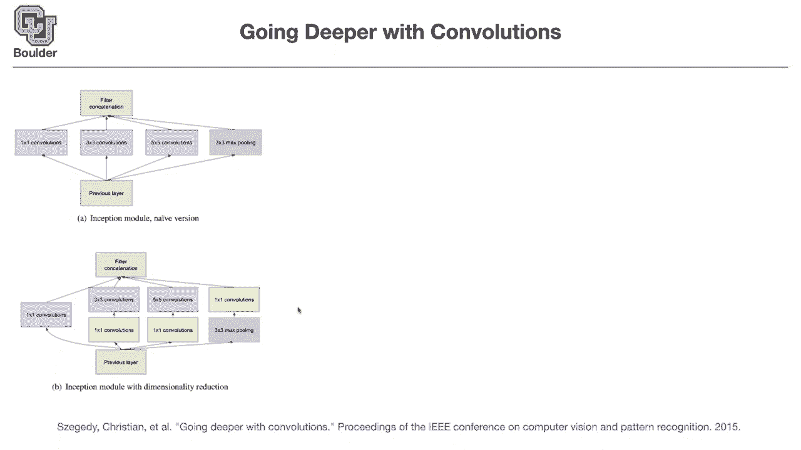
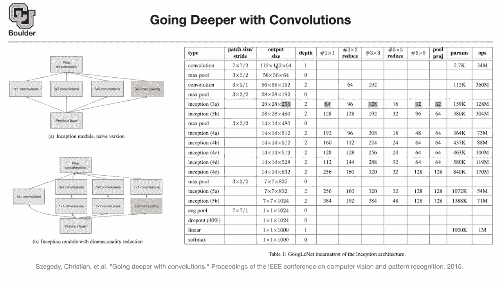

# 【双语字幕+资料下载】科罗拉多 APPLY-DL ｜ 应用深度学习-全知识点覆盖(2021最新·完整版） - P10：L5.1- GoogLeNet [续] - ShowMeAI - BV1Dg411F71G

and we were going through the structure，of inception，inception module，and this is called google net。

when you stack multiple inception，they wanted to figure out whether they。

should use one by one convolution or，three by three or five by five or max，pooling or。

that's a good idea but there was a catch，that they could make their，network more efficient by first。

projecting into a low dimension，using one by one convolutions。

so one by one convolutions are good for，basically changing the number of。

another name for it is called feature，maps so you are changing the number of，feature maps。

and basically you are going from a high，dimension to a low dimension。

in low dimension which is gonna be more，efficient。

channel wise so the entire architecture，is gonna look like this，the first few layers。

are gonna be very similar to what we，have seen before，basically at 224 by 224。

by three image which is a tensor，of red green blue goes into the first，convolution。

the first convolution is seven by seven，and it has a stride of two and because，the stride is two。

your resolution is gonna become lower，so the resolution divides by two。

and the depth of the depth is one and，you have this many parameters。

and this many operations what does it，mean by depth is depth just what you've。

shown on the right like，the model a all have depth one and model，b there's some depth。

uh no for the first one it's just a，convolution from before，so whenever you have，a weighted layer。

and then usually you are concatenating，you can think of them as function，compositions。

so this is the first function takes the，text as input as，an image and outputs a tensor of this，size。

takes a tensor of 224 by 224 by 3 as an，input and outputs，this but because this one has a bunch of。

weights，and biases we're gonna count it as one，layer，then you have max pooling max pulling。

is gonna be done over three by three，windows，it has a stride of two so you are，dividing one。

twelve by two it's going to give you 56，and max max pooling is done channel wise。

so the number of channels don't change，and it doesn't add to the number of。

your layers so it's not adding to the，number，to the depth because it's not，parameterized。

okay then you use two convolutions，three by three stride of one because。

they stride this one the resolution，doesn't change，dimension。

then another max pooling so you have two，layers of convolution，after the first max pooling and then。

another，[Music]，and because the stride is two the，resolution goes down。

so it's usually the trend in image，classification，you want to summarize your image。

and make it lower resolution as you go，deeper in your network，but then you want to add to the number。

of your，you want to increase the dimension of，your channels，are there any networks that add a。

learned，weight to the max pulling，seems like it's always a normal，averaging i've never seen。

any weights associated with max pooling，so no it's just you take a window of，three by three。

which are basically nine numbers，and you report the maximum，and then you slide that window over your。

does that answer your question sorry，i think adding adding weighting would。

just be the same thing as a convolution，you would you would take a neighborhood。

or a patch of the image and wait，different pixels accordingly，uh i think his question relates to i。

think，he has read something about，activation functions having some，parameters。

making them parameterized and that's why，he's asking about that。

but yes convolutions are going to do the，parameterization for us。

and max pooling is just to make things，locally invariant，to translations so it's gonna be。

invariant to small translations of your，image up and down，okay up until this point。

it's the same as before what other，people were doing，but then here is where inception the。

first inception module comes in，and that's of this form the resolution。

and the output size is going to be after，you concatenate everything。

so what are you concatenating are，concatenating a，you are concatenating 128。

3x3 convolutions so these are the number，of filters，so this one has 64 channels this one has，128。

filters this one has 32 filters，and then there is a max pooling。

and if you add them up you are gonna get，256。but what are these numbers 96 16。

these are these one by one convolutions，that are first projecting into a low，dimension。

to a 96 dimension for instance，and then you go to 128，this one projects into 16 dimensions and。

then 32。so is everything clear how the inception，module works，any questions the question is how is。

this reducing the dimension，so what is a one by one convolution，doing。

it takes a pixel and each pixel，for instance here you have 28 by 28，pixels。

take one of those pixels that pixel is，gonna have，256 dimensions，does。

to change the dimension from 256 to 96，so your matrix is going to be 256。

by 96 and it's the same peak same，matrix for every pixel so you do the，same operation on every pixel。

and the way you change dimensions is by，matrices matrix multiplication。

and your matrices are of this size by，96。if that's the case then what is that，highlighted 64。

which one this one correct，this is for this first one by one，the first one is a one by one and then。

you keep the field the，64 filters that you have so it's exactly，the same thing as i explained。

this is the one by one convolution so，it's changing your dimension from 256 to，64。

this is a one by one convolution，that is changing 256 to 96，okay so we。

took care of this we took care of this，convolution，now the next operation is the three by，three。

which is a three by three convolution，so first you do this then you do that。

then another time you decrease a，dimension，from 256 to 16 using this one one，one by one convolution。

then you do 32 of five by five，convolutions，the first max pulling what is it doing。

it is doing it channel wise so after the，max pooling operation you are gonna have。

but then you do a one by one convolution，to reduce the dimension to 32。and then in the end you are。

to get 256。 so these are just，intermediate，operations does that answer your，question。

yeah it does thank you any other，questions，so this concept of one by one，convolutions are really。

interesting we are going to see that all，over the places，to reduce the dimension to increase the。

dimension and so on，and by dimension i mean the channel，dimension，with convolutional neural networks。

every the output of every layer and the，input to every layer，are like。

images they have three dimensions，this more general question is there is，there common notation。

or verbiage for the difference between，the dimension you're talking about。

like the channel dimension and the，um size of the like，like the 28 by 28 or later on 14 by 14。

um is that distinguished or meaningful，or is it just，um so for notation you can say this is。

your x coordinate this is your y，coordinate and this is your，so each image has a pixel。

which is a location in x and y，coordinate，and usually for images the coordinates，starts from。

upper left corner of your screen，so this starts from here this is the，x-coordinate。

this is the y-coordinate，and then this pixel here in the screen，second and tenth pixel。

but then at this point you have three，numbers it's a red green，blue so that's a vector each p each。

pixel is a vector，and you have the same structure entire，in your entire convolutional negative。

network，you're reducing the resolution but then，you're increasing the number of。

channels you can think of that as the，number of colors，that can exist okay any other questions。

and then the rest of the stuff，i think self-explanatory，we are doing two of these inceptions and。

then two other inceptions，max pooling you know what that is you，know what inception is。

you know what max pooling is you have a，couple of other inceptions。

and then you have average pooling this，in the end you are going to end up with，a 7x7。

image and each pixel is going to be，this many elements，so it's a vector in 1024 it's a 1024。

dimensional vector，each pixel is that and then you average，them out。

and you put it here that's the global，average pooling layer，you add a little bit of dropout with 40。

percent，a linear to map from，dimension 124，soft max is going to help you。

turn these into probabilities basically，you want the numbers that are being。

outputted from your network to add up to，one，that's what soft max does once you have。

the probabilities you can write down，your loss function and，is everything clear is is that linear。

layer is that just like a dense，like a fully connected layer to reduce，that dimension。

whenever you see linear that's just，matrix multiplication，okay you have a matrix that's this。

dimensional by this time，you know so so but，so the answer would be yes then i guess。

because that's just what，a fully connected like a dense layer is，doing，exactly okay cool。

the name is sort of the paper is written，by a bunch of，people from google and。

lonette is a paper written by，jan lacun is one of the first papers，introducing convolutions。

around in 1980 around that time，so convolutions are really all concepts。

but the idea of putting stacking them on，top of each other and，[Music]。

uh being able to train them actually，is very recent and they are sort of，paying a tribute。

to that paper so the people in deep，learning are really nice people。

so they give each other credit whenever，needed，any other questions looking at this。

number of parameters per layer as it，goes down，and it's strictly increasing and i know，that's。

partly just a um facts or like a like a，property of the，the number of channels increasing but is。

there，any rationale behind that and it would，it，still work would we still or would we。

lose information if it，would say like narrow and bottleneck，towards the end。

convolutions are usually cheap in terms，of，saving parameters what is causing us，trouble。

and these numbers increasing is the，that are increasing each time yeah。

and let's see what is going to be，where is this number of parameters，coming from。

which is the product of the it is，so that's the number of uh parameters。

dealing with resolution it's a 7 by 7，filter，and then you have three these were the。

number of channels，that are going inside red green blue，so multiply 3 by 7 by 7。

by 64 and you should be close to this，number，so the cool thing about the convolution。

that it's independent，of the resolution of the input image and，the output one。

okay the number of parameters is，independent，of the resolution that's why they are，cheap。

and efficient but then as you，increase the number of your channels。

then these are gonna be more expensive，so fully connected layers are really。

expensive if you look at this one，this is really expensive and these are，just estimates，the。

the parameters estimate this tried no，okay，stride has nothing to do with that so。

yeah that's a good question i don't know，why this is so off so three by seven by。

seven by sixty four is around nine，so there is a comment，seems like the first row is actually a。

seven，by one layer and a one by seven layer，okay so it makes sense。

i will talk about that in future slides，that you can convert a seven by seven，convolution。

and approximated by seven by one and a，so yeah perfect thank you serge。

and is the ops number just the number of，parameters，times the number of pixels these are。

really expensive operations，see you need to have a for loop that is，gonna take your convolution。

and slide it over your pixels，so let's say i think it's gonna be 112，by 112。

times that you have to do，those multiplications so you need a for，loop on these two。

