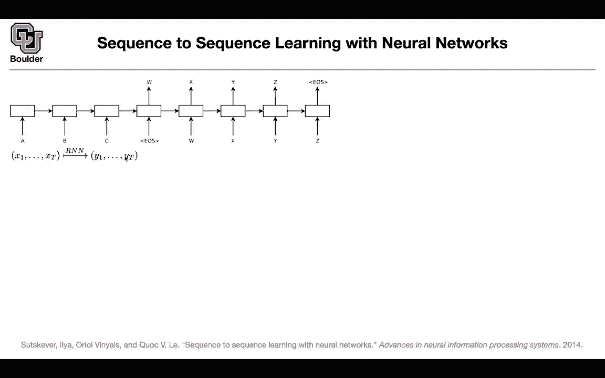

# 【双语字幕+资料下载】科罗拉多 APPLY-DL ｜ 应用深度学习-全知识点覆盖(2021最新·完整版） - P110：L52.2- 序列到序列建模(seq2seq) - ShowMeAI - BV1Dg411F71G

So let's try to do that and focus on sequence to sequence modeling So there's a sequence。 ABC。

 this is the input sequence and it's going to output the output sequence with recurrent neural networks。

 we know that an input sequence is gonna go in x1 upon txt and then a sequence of the same length is going to come out So it's going to be x1 up untilxt y1 until Yt that's the role of an RN regardless of the version that you're going to use So a simple RN without any bells and whistle is just you take the current input。

 you take the hidden state， you multiply them by weight。

 you do selfm or sorry you do sigmoid it's going to give you your hidden and then if you want to get an output you just multiply it by the corresponding vector the of an appropriate size That's good and it's gonna to work for language modeling because for language modeling。

We're going to input a sequence of this length and you're going to expect a sequence of the same length。

 but for translation you have sequences of different length from the input to the output so that's your input ABC and then the output is W X Y Z and we learned how to deal with that first we are going to take the input sequence we are going to encode it encode the entire sequence in a single vector so now we are forgetting about attention so we are putting everything in a single vector and then the rest of it is a usual R&N so it's exactly similar to above or a modified version of it with some new entries。

Once you have that it's going to give you your model that you can use to write down your likelihood or you can use to do your translation during inference time so what is the contribution of this paper and how does it push the state of the art compared to the previous paper you're going to use two different LstMs actually the previous paper was doing the same thing so you have two different Lests for input and output sequences The second change is that you're doing it deep so you're stacking multiple eesttMs on top of each other so both at the input and output layers so you're going to have multiple eestts so these are stacked LstMs on top of each other what other change this turned out to be the most important one you're going to reverse the order of your input sequence so if your input sequences if you want to translate from ABC to alpha beta gamma you keep the output sequence in the same order and then you change your input sequence。

And reverse it is gonna to be CBA And the idea is that by the time that you're arriving here during back propagation。

 the words that you're interested in are closer rather than being further away from where you want to do your translation so that was the idea just reversing the order of the inputs of the input sequence these are the three major contributions the training is the same as before you have a pairs of you have a corpus of the pairs of target and source sentences in English and French and then for solving that maxim problem during inference we are going to solve it using a greedy optimization algorithm and the greedy optimization algorithm is beam search so if you don't know about beam search there is another video that I want you to watch this one is also 15 minutes and it's going to give you an intuition of why this is working okay so there is a way to solve this maximization。

Problem beamM search that's how you solve that problem let's see some numbers these are the numbers from the previous paper to any 8。

45 as you can see this is still far behind the baseline system the baseline system is Mos it's not using any deep learning at all。

 but then the idea is you want to use neural networks to beat these baseline system so if you' are doing research in neural networks you want to beat that baseline system。

If you use a single forward LsTM with beam size of 12 so beam size is a hyperparameter that you need for your beam search that's going to give you to any 6。

17 still below these two numbers if you reverse the order so this 03 it turns out that's a very important contribution so it's going to give you a huge boost and it's going to beat the previous state of the using neuraln networks but then it's a matter of enssembling even if you ensemble 5 reversed LDM with beam sizes of1 and 12 you are still below the baseline so the baseline is very hard to beat if you use ensemble of5 with beam size 2 and beam size 12 and then you finally manage to beat the baseline system with an ensemble of5 reverse LsTMs and the beam size is helping a little bit but then beyond that the beam size is not going to help that much it's going to slow。

Down your translation system significantly so they went through a lot of trouble to beat that number but then there was not a second idea let's use the baseline the baseline is going to score pairs of sentences for us it actually is going to propose good translations for us and then what we are going to do is we are going to use a neural network system to reco let's say the baseline system is going to give you 1000 good translations so out of those 1000 we are going to sort them according to the probabilities that are coming out of our neural network system that's going to help you choose the best among those 1000 recommendations for your translation and they just report that so we are going to report that we are going to report the other number。

And you're easily being the baseline system by reasscoring it so you can use your neural networks to reescor a previous model and then if you reco using five reverse LNs you're getting closer to the estate of the art but it still you're far from it so these baselines are really hard to beat and don't worry about this oracle this oracle is if the baseline system is proposing 1000 translations and then you have a human to order them this is the best number that you're going to get out of test score this is the maximum so there is still a lot of room for improvement and for neural networks it's very hard for them to beat usual machine learning okay。

And here is an example of the translation that you're going to see。

 so that's the ground truth that's what the model is predicting and that's not a bad translation if you want to look at it qualitatively any questions。

So what is the message that I want to convey is that people are working really hard or have been working really hard to beat the previous state of the art。

Could you explain again the logic behind reversing the input sequence So there is this tendency for recurrent neural neural networks and it happens during back propagation that you start forgetting so you forget what happened by reversing the order the first word in your sentence is closer to where you want to do your translation let's say at this point you need to have access to the first point or the second word in the initial sentence in the source sentence so now the information is closer rather than going to the first word you're now closer to the first word here so that's a problem with the back propagation so the gradients tend to vanish the longer the length of your sentences because these are deep model in time so that's the intuition you want to have your sentence。

 the first word in your sentence closer to where。You start translating but that's just an intuition。

 I don't know how much it's going to make sense or no okay。Does that answer your question？

Yeah yeah I think that and the whole idea of using LSDMs and gated re units is because these re neural networks tend to forget and another way to put it there is there is vanishing gradient problems so for the rescoring is it that the original sentences each have their own like probabilities or scores assigned to them and then you use the LSTM to recompute those probabilities and then it reshuffles which ones are actually most probable exactly so that's a great point so you have pairs of source and target for a particular source the baseline is going to give you multiple targets given a pair of a source and a target you can use this probability to recore and reorder the translations and that's the idea so it's a combination of the baseline system and a neural network。

I think we are finishing right on time for those of you who want to leave have classes etc ceter。

 you can leave for those of you who want to stay and ask questions I'll be around Any other question I had question sorry you know okay。

 can you explain the ensemble of five of those LTMs like what does it mean when you combine five of them you train five LTM separately and。

The output is reed somehow Yes so that's a good question what do you mean by ensembling models first of all you need to train five different models whatever you're gonna to change when you're doing that maybe you change the dimension of your age okay wherever you have a hyperparameter you can change it maybe the learning rate that you use for training these five different models is different maybe you initialize them differently so these are minor modifications to the entire idea but then it's going to give you five trained models those five trained models are gonna to give you five probabilities here there is going to be P1 p2 up until P5 and a simple way to ensemble them is to just average the probabilities that are getting output with it and the idea is that if you have five models that are voting even if they are V model once they vote the collective。

them is gonna give you a good translation okay like having five experts sharing their opinions and's actually how democracy works so the idea is that maybe if a lot of people collaborate the outcome of that group is going be the correct answer or a correct answer doesnt answer your question Yeah so basically if five of those five models two of them are voting on the same sentence and the out of three are voting on three out sentences then the first sentence that had two votes will be chosen Yes。

 but these votes are going be soft votes they're not hard by soft I mean you know the weight that the first model is giving to this translation and maybe 1000 other translations one of them is having a probability of0。

 a the other one is having is probability of 0。1 and then these probabilities are going add up to one it's not like。

Pick one of them but then it's a soft vote you say I favor this option with this number i'm disconfident that this is a good translation okay yeah yeah totally I was kind of going on this that are weaker models vote together on something so if two of them are certain about one sentence then that sentence will be higher average than the other ones yes that's correct but these are not weaker if you think about them I mean all of them are five deep neural networks making a decision together。

Yes questions intuition behind that that you can encode more information in several networks than one network。

Like five networks can learn more nuances about language separately they'll have different understandings and basically you just pull them together probably that could be a good explanation of why ensembling works but ensembling is a big idea it applies to the big idea of machine learning in general whenever you hear random forest for instance。

 there is an ensembling going on ensembling of trees now you're doing ensembling of neural networks。

Thank you， yes。