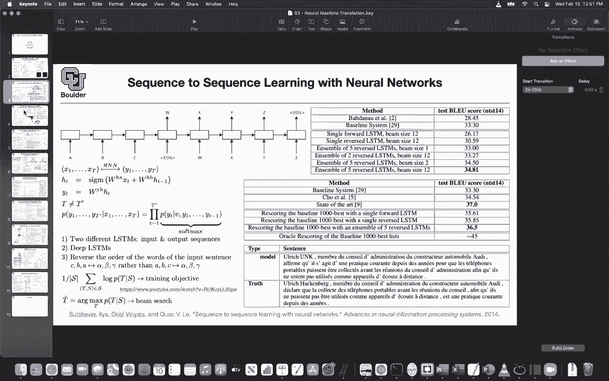
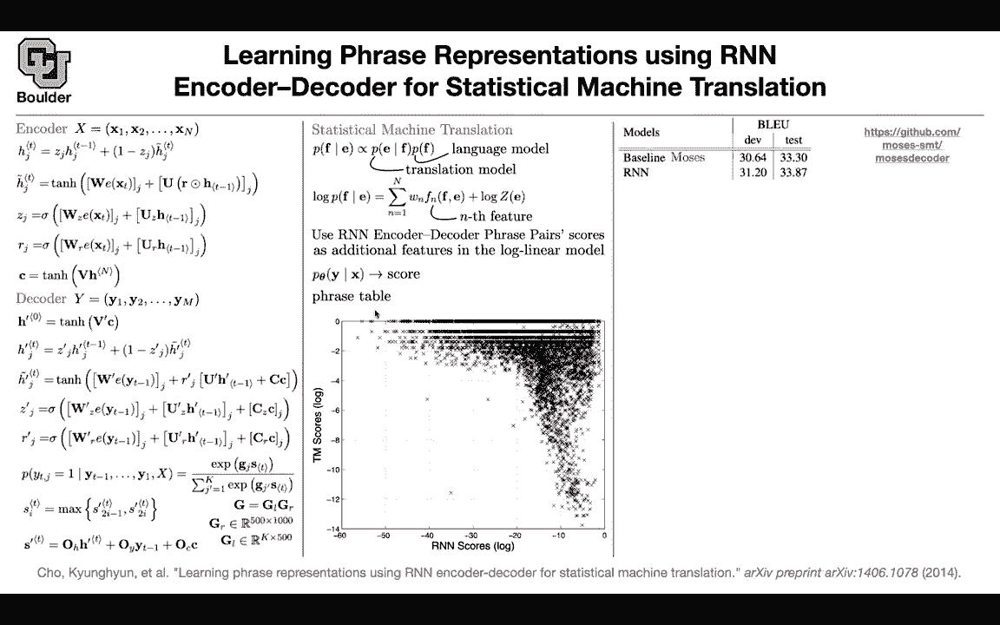

# 【双语字幕+资料下载】科罗拉多 APPLY-DL ｜ 应用深度学习-全知识点覆盖(2021最新·完整版） - P111：L53.1- 短语表征 - ShowMeAI - BV1Dg411F71G

What have we done so far we started machine translation and in particular neural machine translation we said how we are gonna what is a machine translation task。

 how we are going model it how we are going to train the model what is the loss function and how we are going evaluate it using the blue score we learned about GRUs and we learned about attention mechanism a little bit and then we said maybe a good idea is to reverse the order of the words so that's an idea you take it to the computer and yes you see that it's working reversing the order of your input sequence is helping so these two are the things that we did last session and another thing that we did last session was that we had this baseline translator which had nothing to do with deep learning and then we were using and neural network to rear score the outcome or the recommendations from the sta。

Ca machine translationAnd after reascor， we were getting better translations。

 so we were using neural networks to complement the results of a statistical machine translation。

This paper is going to be along the same lines， we are going to use neural networks to help a statistical machine translation but in a different way and we' are going to see how but first a quick recap of the encodeder decoder architecture so a sentence goes in a sequence words actually a sequence of word vectors then we know what this formula is。

 this is just a GRU it's a gated record unit there is some new information going in H tilda and now J these are not vectors so HJ is the J entry of your vector。

And now1 H you can see that it's acting element wise， so a new information goes in， you embed it。

 you multiply by a matrix， you have another matrix。

 you reset some of the information from the previous hidden state and then you update some of it using this。

 so there is a reset gate， there is an update gate。Then you take that sentence。

 you push it through your reren neural network and in the end you're going to end up with a single vector so we are not doing attention anymore it's just a sequence modeling so you're going to have C for the decoder。

You have an output sentence and you're outputting it one after another。

 So you first output the first word， the second word up until the m word。

 what you're going to do is you're going to take this C and initialize h0 or h prime0。

Prime is for the hidden state of the decoder， previously we were calling it S。

 you can call it H prime。Again， this is going to be a gated recurrent unit。

 some new information comes in， so we just outputted this work。

 we're going to take that and embed it multiplly by a matrix and then reset some of the information from the past。

This is the update gate， this is the reset gate for the decoder and then in the end you're going need to output the probability of the next word in your translation So what is the probability of the next word because these are one hot vectors the question is what is the probability of the J entry of the output vector being the1 and the rest of them being0 you model that by a bunch of matrix vector multiplication so this is your softmax and then the question is what is G if you put a matrix it's going to have a huge dimension。

 the dimension is going to go to the dimension of your vocabulary to the size of your vocabulary and the input dimension is going to be also big because you're having a big dimension for your hidden states and then if you multiply if you have a output matrix a single output matrix is going to be a huge matrix and it's not。

Efficient in terms of parameters and in terms of computation。

 so what you can do you can decompose G and then first go to a lower dimension and then from the lower dimension you go to the size of your vocabulary and this way you're saving some dimension some computations so you're going to decompose G as GL GR left right GL G is going to take you from dimension 1000 this is the dimension of S to a lower dimension let's say 500 and then GR is going to take you from dimension 500 to the size of your vocabulary and this we saw before this is the max out activation so you're maxing out if somebody gives you a vector you take pairs of elements in your vector and then just out with the maximum of those two numbers so that's a max out activation and it's a nonlinear activation it's going to help you regularize your net。

Work the output of your network actually and then what is S the question is what is S It depends on the hidden state of the decoder。

 the previous word and the context of your encodeder So that's your encoder decoder architecture and this we saw before This is just a new notation We saw everything that I mentioned here before except for how youre decomposing your matrix and how youre saving computation So far so good。

 how we're going to use this we know that a pure neural network at that time was not powerful enough to give you good translations on its own so we are gonna use the help of a neural network to increase the performance of a classical statistical machine translation So what is a machine translation in general somebody gives you an English sentence and you want to know the probability of a French translation you can write down the Bayes rule this is going be the basees rule is just gonna。

Help you reverse the order of the conditioning so now you have PFE condition and F then you're gonna to have a language model the language model is going to give you the probability of every single sentence in your language how probable is this sentence and then you have a translation model and then you are dividing this this is proportional so you have to normalize it by PFE so there is a division here that I'm not showing and it's hidden inside this proportion if you take log from both sides。

Here you're going to have this is the joint distribution P of E given F times P of F is the joint distribution it's going to be P of E comma F so that's the joint distribution and your joint distribution you' are going to model it in a statistical machine translation you're going model it in terms of a bunch of features that you hand the engineer it's going to take an inputs an output translation and an input sentence it's going to featureurize it and it's going to be a linear combination of those features and we don't care how you featureurize it maybe it's a bag of word maybe you're creating the co occurrence matrix and then you're doing matrix factorization on that whatever that you do you're going to end up with a bunch of features so that's the term de numerator the denominator you're dividing by PFE or you can actually call it Z of E so you're dividing by something and that's going to give you a log of that something so you have two terms。

The question is how we're going use a neural network to help you we are going to use whatever that we learned here about a recurrent neural network encodeder decoder。

 we are going to end up with a probability and we are going to use that probability that is heavily parameterized by the parameters of our neural network to score pairs of input output sentences okay it's going to give you a bunch of numbers and those numbers you are going to add as features to your dictionary of features some of them are coming from classical machine learning。

 some of them are coming from your neural network by the way this is trained these thes are already optimized and the training process you have a likelihood for your neural network and you are training it it's independent once the training is done you' are going to end up with a bunch of features coming out of your neural network you' are adding them to whatever hand engineer features that you have in your statistical machine translation and then you're going to translate you are going to train these parameters。

endSo it's going to be a simple linear regression。So one might say are you actually adding features that are independent from what is already in your statistical machine translation what you already have the engineers and the answer is yes we are actually learning something new these are independent features and how are you going to test it you are going to look at the scores that are coming out of your RN so these are your scores and then youre going to look at the scores that are coming out of your statistical machine translation if they were the same thing you would see a line here they would be heavily correlated but you don't see any particular correlation in these scores so yes you are actually adding some new information you are looking at the same problem through the lens of two different approaches one is classical and one is a neural network approach okay if you do that how much gain do you obtain over the baseline the baseline is you can find the code here it's on Gitthub you can download it and play around with it。

On the development set and on the test set， this is how much improvement you're going to get by adding the features from your neuron network and basically you're increasing increasing your blue score and in terms of qualitative performance if you look at it qualitatively I think clear here there are some random stuff here are see there are some question marks there so it doesn't know what those words are once you add the RN encode encodeder decoder most of those random stuff are going go away and these translations actually make more sense that's wrong frequent source phrases you can have some rare source phrases and still qualitatively your predictions or your language is doing a better job your translator there is one more thing you can actually take a look at these embeddings that you're learning out of these process we know about word embeddings you can actually。

Learn word embeddings through translation from one language to the next one if you look at word vectors and you visualize them using something like PCA or TsNE etc you can see that these words are clustering together and what is let's focus on this blue part because these figures are deal bit cluttered if you look this part and you zoom in you see that most of the countries are sitting next to each other France。

 China Russia， English， French， Germany， Ontario， Iraq。

 British so these have to do something with country okay you can actually learn word embeddings out of translation Any questions before I move to the next topic the question is why is G learned why are you de composing G aren't you going to end up with the same number of parameters or aren't they mathematically equivalent you're doing it for computational reasons。

And no they are not going to end up being equivalent you're going to have far less parameters if you decompose that way and computationally speaking you're gonna have four loops that are smaller so you're doing iterations less so computationally speaking and memory wise this is more efficient This is like doing SVD singular value decomposition but now you're learning them so it's more efficient computationally so we learn two ways to get help from neural networks to improve the quality of our translation systems One of them was okay let your baseline to the translation for you it's going to give you 1000 good translations and use a neural network to resco it the other one is to add your neural network scores as features to your statistical on machine translation so this is for this you had to change your algorithm a little bit so you're changing your statistical。

Machine translation a little bit you're adding some features and you learn these parameters Is everything clear the WN in that formula you're just highlighting in the middle column the WNs are weights Yes。

 so if you have any statistical machine translation framework and this is actually what Moses is doing you spend a lot of time featureurizing but once you do your feature or your featureurization the rest of it is a linear regression。

these are ways that you're going to learn and the scores that are coming out of the encoder decoder you can also just think of them as like vector embeddings Yes。

 so these are going be vectors actually okay and these are going to have the size of your vocabulary these probabilities they're going to have the size of your vocabulary so you're going add a lot of other features and okay it's a vector the size of your vocabulary that has like a high weight at certain words that are important yes and that's going to depend on the input data that goes in so it's going to depend on EF。

Here x is going to be E and F is going to be y。And you're going add that vector as a bunch of other features to your feature dictionary Go it the other question I had was the if the probability of E was in the denominator up above with the base rule wouldn't this be minus log Yes。

 so you're taking the negative here Okay so z is like the negative probability Yes。

 I mean the end it doesn't matter is just a constant in your objective function what you care about or these ws when you're going to maximize this log of the translation it doesn't depend on z yeah it depends on w so you're maximizing with respect to ws。

Is this this when your combination is a model for the P of e given f times the probability of F Yes so this is a model for the joint distribution yeah it's kind of P of E comm F and this is the product of E two yeah perfect thank you Okay any other questions。

