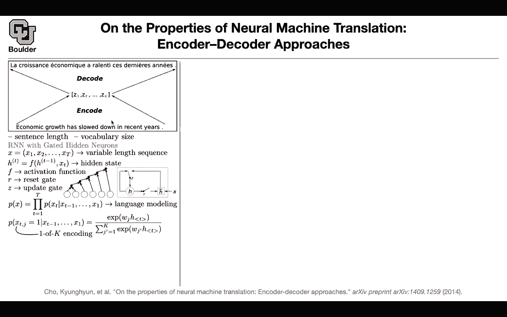
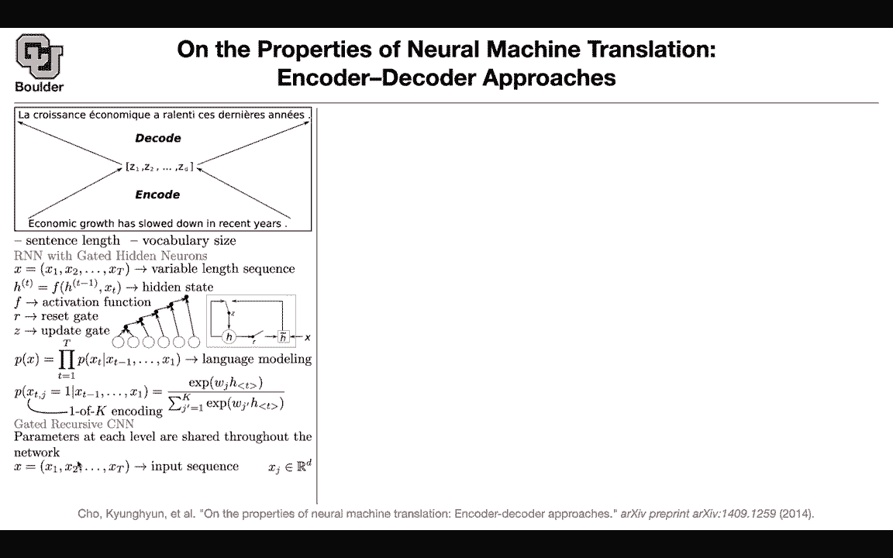
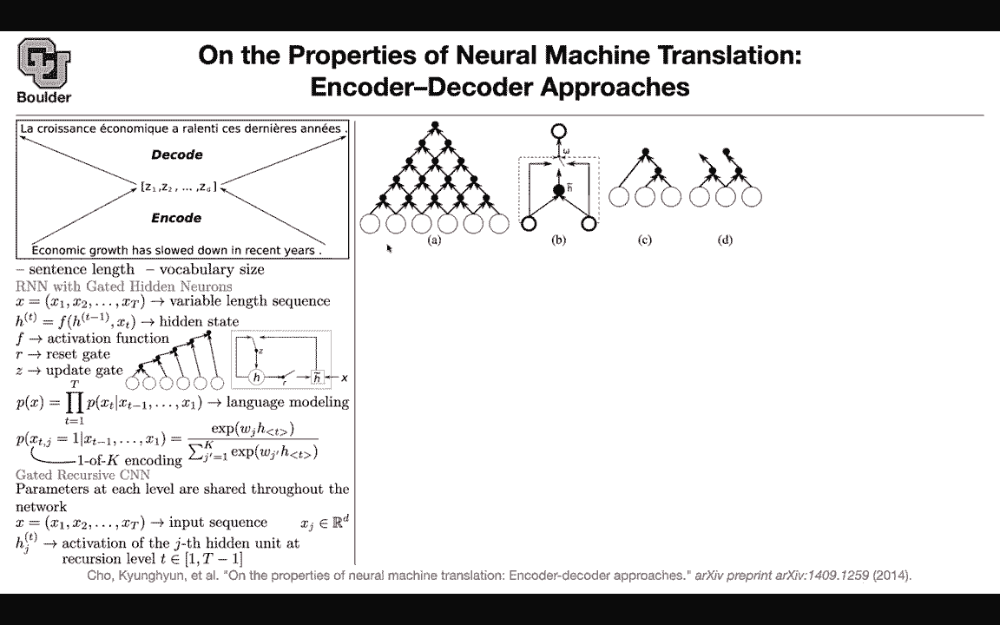
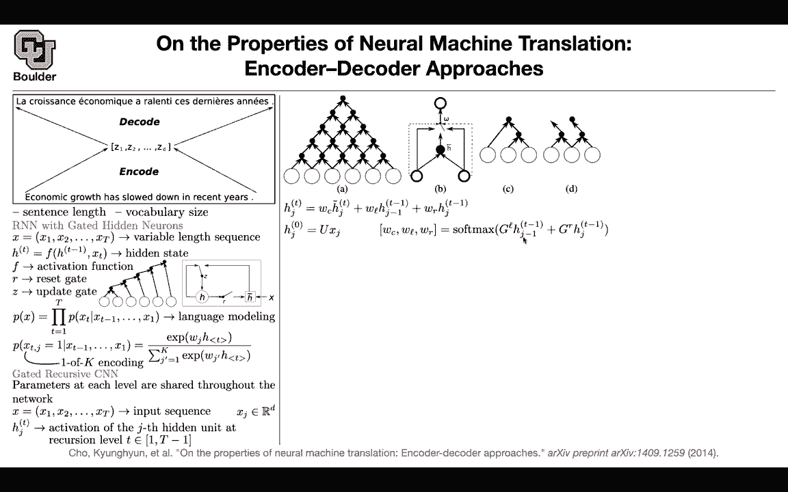

# 【双语字幕+资料下载】科罗拉多 APPLY-DL ｜ 应用深度学习-全知识点覆盖(2021最新·完整版） - P112：L53.2- Gated Recursive CNN - ShowMeAI - BV1Dg411F71G

I guess we can move to the next topic then。Let's take a look at the encoder decoder this is your English sentence that's your frame sentence。

 you're encoding everything inside a vector and then you're using that vector and decoding it to give you the translation so that's for the big picture and the details could be a SDMs GRUs attention models whatever that you do so these are the details but that's the big picture there is still this question that is bothering us why aren't neural network at least at that time are not able to surpass the performance of classical machine learning techniques and this paper is going to try to study and see what's wrong。

Could it be that the sequence length matters， could it be that your recurrent run letter is forgetting some information。

 or could it be your vocabulary， maybe there are many unknown words in your vocabulary that you don't know。

 maybe your vocabulary matters。

So this paper will try to address both of them， at least study them and see what is the performance loss and then at the same time there is a nice architecture here that is being introduced I want you to know about that as well about the details of the encoder the decoder is still the same it's a recurren neural network but the encoder you have multiple options。

This is a recap of what we did before with recarren neural neural networks you have a variable length input sequence like economic growth has slowed down in recent years then you' are gonna whatever F is that's going to be your recurrent neural neural network and you can model this to be a GRU or LSTM and that's going to give you your hidden state F could be a fancy activation like what you saw before with GRUs you can have a reset gate you can have an update gate if you're using GRUs and visually speaking。

 this is how things are gonna to progress in time you take two words you combine them together that's going to give you a hidden state that's your Ht minus1 Xt goes in you're gonna combine them together that's going to give you H now you rename things this is going to be H minus1 this is going to be your X you do the same thing and your sharing parameters so these arrows are shared and if you。

Fancy activation function like GRU， that's how it's gonna to look like。

 That's how people usually visualize it。 I don't like it that much。 I like the math more。

 but you can actually try to visualize there is a reset gate。

 there is an update gate So the reset gate could be sometimes open sometimes closed or partly open partly closed and then the information is passing from one state to the next state。

 at least if you want to use that for language modeling this is what's going be your probability why am I talking about language modeling because it's going to help me introduce language modeling what the task is and it's actually helping us not worry about the decoder part for language modeling this is gonna give you a loss and then you're going optimize it withspec to the parameters of your neural network and you can actually try to model this using a softmax so I didn't want to talk about the decoder part。

 that's why I stop with the language model。

But we know how to add the decoder and how to train it， how to train the entire system end to end。

But there is another architecture you might say maybe for they encoder you can use convolutional neural networks and there is this idea of gated recursive CNNns it's a convolutional neural network that you are sharing parameters at each level of the convolution so you can have multiple layers of convolution but now you're sharing the parameters from one layer to the next one again the same thing is going to happen input sequence youre going to have a bunch of activation functions or activation outputs or activated hidden units J is going to give you where you are in your sequence J is going to count one up until T and then a level of your convolution these are the layers you are going to count them by t that's your index this is how it's going to look like so J is going to count from one2。

3，4，56 and then t is going to count from1 to34，5 that's why you have t minus-1。

Okay so one of them is going to go vertically and the other one is going to go horizontally J and T now we are going to have a fancy activation now I'm talking about this panel B of the figure two words going。

 this word and the next word and then you're going to have a gate similar to the gates that you had here。

 but now your gate is going to have three options to attend to the information coming from the right word to attend to the joint information from both words left and right and to attend to the information from the left。

So one of them is right WR WR is the right WL is the information from left and WC is the information from the center and you have an attention span of one attention budget of one it means that you're going to have a softm on these WR WL and WC what is H you're going to encode so the first layer H0 this is the first layer is going to take your word and then embed it so always the first layer to and neuro run network for language modeling is the embedding so that's why they are fundamental。

And you have a softmax that's going to tell you how you're going to spread the budget of one among left right under and what you're going to take as input is going to be the embeddings from the previous layer at time J minus1 and J and you're going to have information from left and right So these are the parameters that you're going to learn GL GR and then what is the center information。

 what is htlda， it's a linear combination of the first word， the left word， the right word。

 and then you're going to push it through an element why is' not linearity。

 but the end of this paper is not to introduce a new architecture。

 it's going to tell you regardless of the architecture， regardless of the encoder。

 whether you're using a。

An RNN or a CNN I want to study or this paper wants to study the effect of the sequence length and compare long versus short。

 This is qualitatively speaking， one cool thing about the CNN is that you're learning some nice pattern so you're learning some nice semantics coming out of the model and if you remember recursive neural networks that we covered it that one could happen as part of this gated recursive CNN on the fly through training so these sorts of pattern could appear and that can encode some syntax so syntactically speaking this CNN is doing a better job and wherever you see RN encoder that is when you're using the RN here and whenever you see G con that is gated recurrent convolution on neural network and more as we know it's the baseline so there are a long sentence。

There are the short sentences and the long sentences， regardless of the encoder that you use。

You're going forget some stuff towards the end this is your source translation this is your reference translation and then it turns out the length of the sequence matters and if I remember correctly one of you mentioned that the length of your sequence matters for classification it also matters for translation that was qualitatively speaking quantitatively speaking let's take a look at the sentence length and compute the blue score and sentences of for instance length 10 or maximum of 10 or sentences of length maximum of 20 so basically what you're doing here you have your entire data set and then you are filtering out only the ones in your test data that have a length of less than 20 and then you're going to report your performance of the blue score on those sentences and as you increase the sentence length the quality of the blue score drops significantly so the。

matters regardless of the architecture， whether you're using RNN encoder or you're using a convolution on neural network so it happens regardless and now let's study the vocabulary size again the vocabulary size matters if you have a lot of unknown words in your sentences then the quality of your translation is going to go down so what does this mean it's pointing us to two directions that are important for improvement one is the sequence length。

 the sentence length and the other one is the vocabulary size so you need to make some adjustments to your neural networks to address these two issues so is everything here so this paper is posing problems the problem was why isn't the neural network beating the state of the art and this paper is saying maybe these are the two reasons the sentence length and the vocabulary size It makes me wonder if the loss in blue score is just due to like properties of the blue score itself。

If even a human translation quality， like the gold truth。

 the score would decrease if the sentence length got longer。Actually if you remember you're right。

 but in the blue score we are trying to decrease the effect of the sentence length when you have that brrevity penalty in your blue score so you're actually penalizing the sentence length if it's short you're penalizing your blue score you're pushing this down even after pushing the blue score down。

 you have that problem Yeah okay and then the other question was just about the like the dimensions of these things the G matrix the G matrix is output of three dimension of acting or WCwL and WR that's a great question Yes very scs so this is a vector of the size that you chose Yeah that's a hyperparameter but then you need to go to dimension 3 sos it's by 1003 by100 okay no that was a good question Any other questions。

