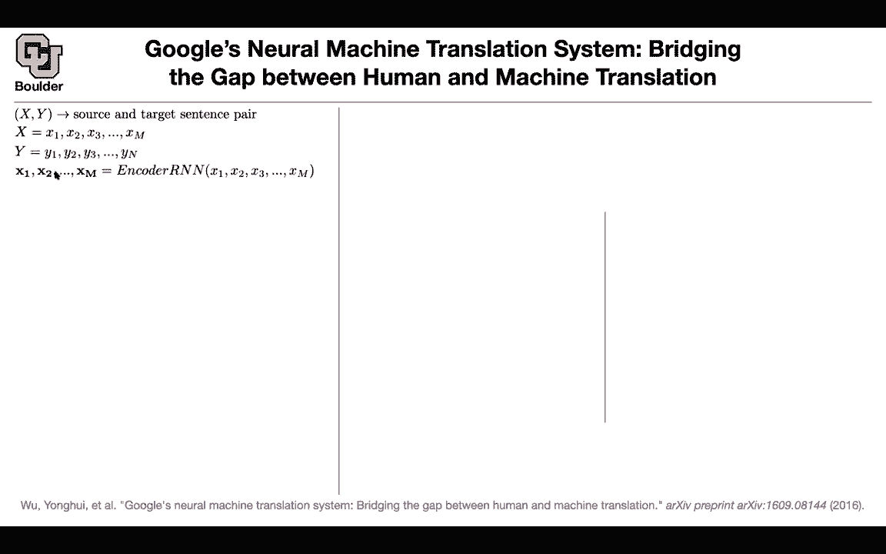
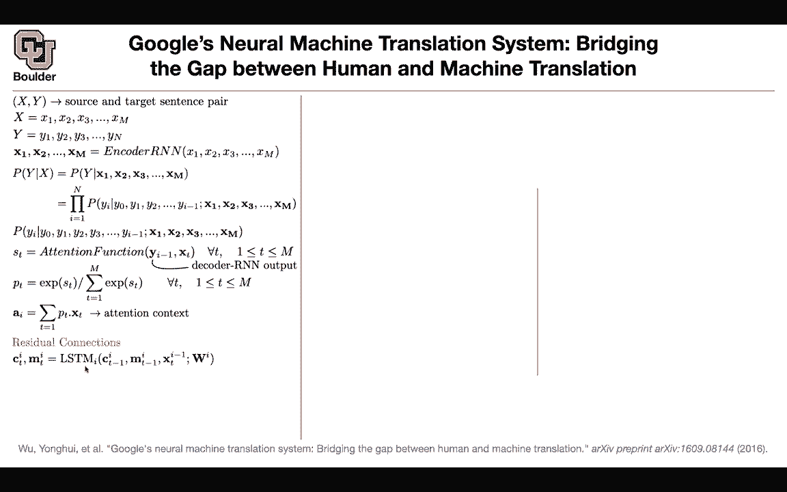
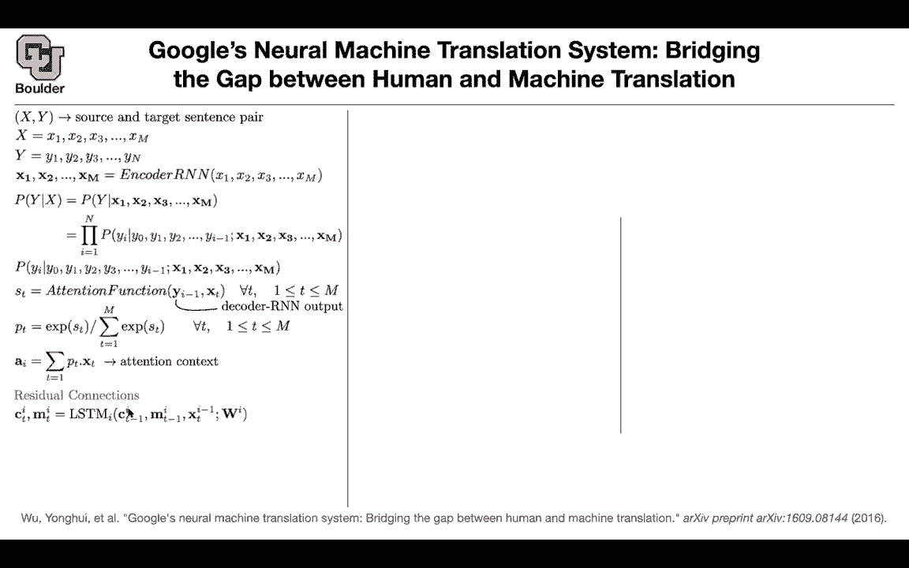
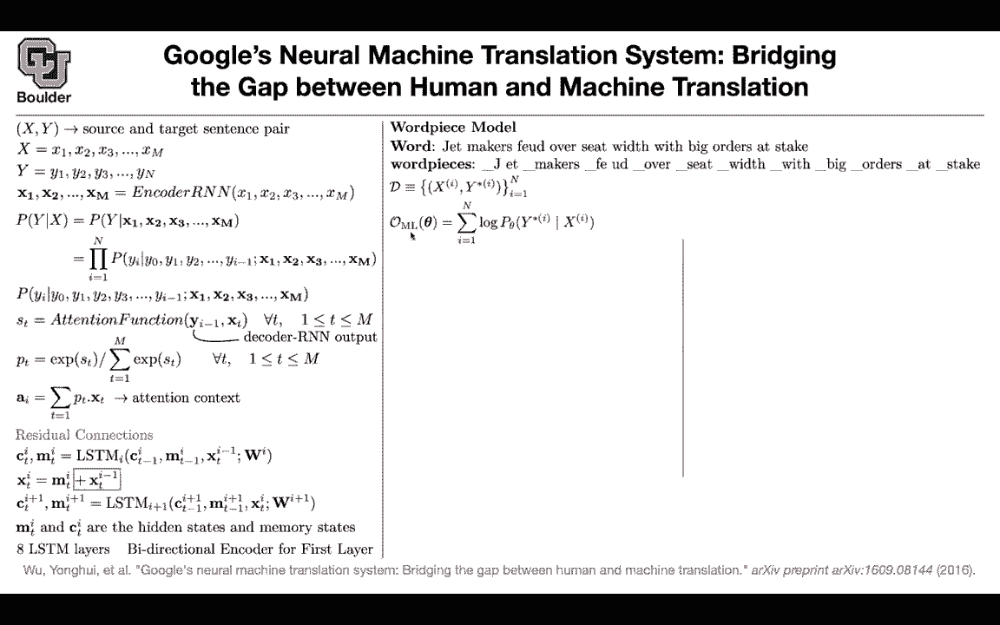
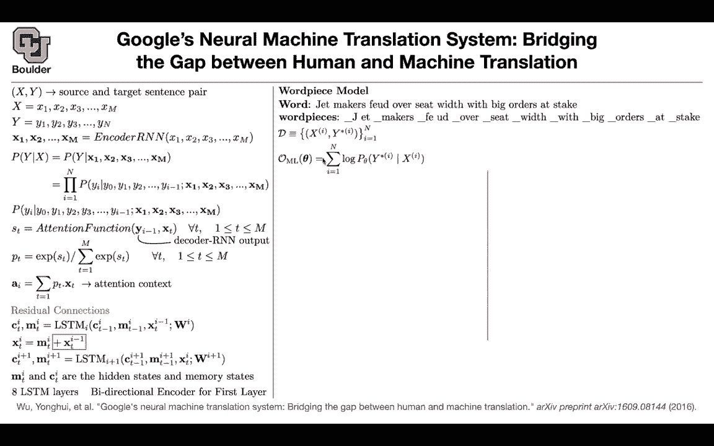
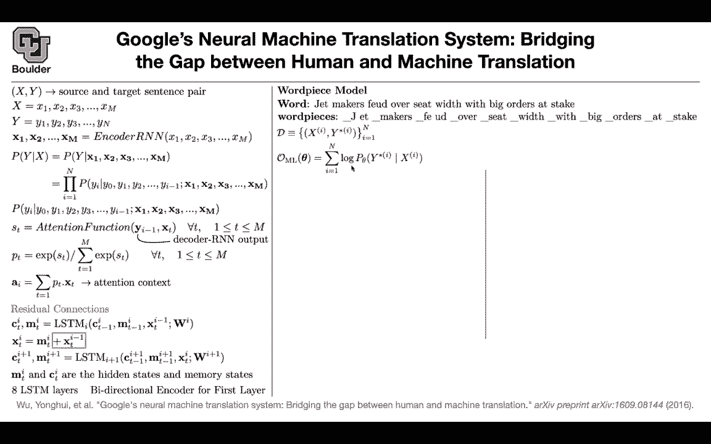
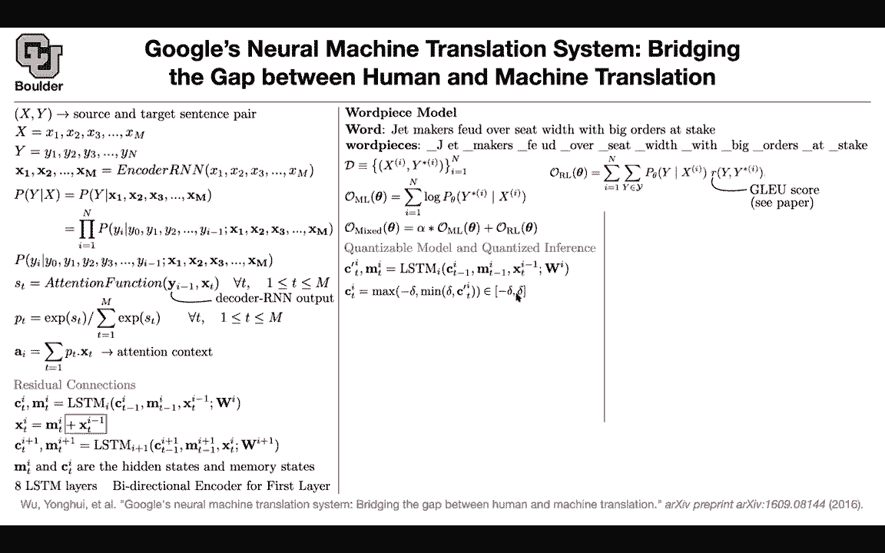

# P115：L55.1- 谷歌神经机器翻译系统 - ShowMeAI - BV1Dg411F71G

So in that case， if there are no questions let's get started I had one quick question with all of these models whether it's translation or classification the first step is often vectorizing words or vectorizing in this case subwards and do all of the models generally retrain those embeddings or is there like a agreed upon gold standard for an embedding that they just kind of take and plug into the first layer of their network so that depends on the size of the target data that you have if your task is language modeling and it's aren't supervised you have the entire internet in front of you so probably you don't need to have good initialization for your word embedding matrix but if your task is small then you need to do some transfer learning for instance if your task。

I maybe you want you have a company and then you want to do some tagging of the type of data that your company only has this is the type of data that you are collecting and these types of data are usually smaller much smaller for those a good initialization is glove or the type of word to wax that we learned about Okay so those are the goldless standard for that makes perfect sense Thank you okay。

For translation if your task is translating from English to French you have a lot of data so probably you can learn these word embeddings on the fly but for some other languages like English to I don't know check you don't have as much data then you need to have good word embeddings and you're going to do that using unlabeled data and some transfer learning okay any other questions so what have we done we learned that when it comes to neural machine translation we are still far behind statistical machine translation in terms of performance and if you want to report only one number in terms of blue score you are still far behind it and this paper came along and said there are two reasons for it for at least two reasons for your neural machine translation lacking。

in performance one of them is sentence length and the other one is vocabulary size for the sentence length it turns out that attention helps a lot so attention can help mitigate that problem as you increase the sentence length for a usual sequence to sequence model the performance in terms of blue score goes down as you increase your sentence length but as you add attention it's going to fix that so attention is going to take care of the sentence length and the other one vocabulary size the problem was that the more unknown words that you have in your sentences maybe you want to sentence to translate a sentence and you have a lot of unknown words then the quality of the translation is going to go down so a very smart solution to that is this paper by pairingcoding it says that you do some preprocessing on your corpus and then rather than using。

Words you're going to use subward units and how do you come up with subward units you're going to keep merging characters according to their frequency Once you merge after a couple of iterations then you're going to be able to have zero unknown words so this is basically open vocabulary from this point on and it's going to take care of that other issue that the first paper that we saw raised okay then came this paper Google's neural machine translation and it's actually the first time that a neural machine translation is getting better than a statistical machine translation techniques on its own and it's actually closing the gap towards human performance but how did they do it so this is one of those papers that they want to do it at whatever cost so they're going to throw whatever that they learned at this problem so whatever that we learned in the literature and they throw。

That machine translation to just get it better。 It's an engineering approach and we're gonna to see how things are going to work A quick recap of the problem set up you have source and target pairs of sentences let's say this is just to introduce new notation let's say this is your X input sentence you have your output sentence they can have different length M andN you take your input sentence and then you use an Rn to encoded so the task of an RN and LSDn GRru。

 whatever that you have is that you give it a sequence is going to output another sequence so now here the bold notation is stay incodings so these are vectors Okay so you encoded your sentence to a bunch of vectors using RnNs then we know that for translation you need to model this probability there is nothing wrong with what we are doing here。

 This is just a chain rule for probability this is equality so there is nothing wrong with。

And you're just breaking your problem apart。 now you're predicting one word at a time。

Now the question is how we're going model this P of YI given the rest of it。

 we know that attention helps one of them is you're going to have a decoder RNN。

 you had an encodeder RNN， you're going to have a corresponding decoder RNN the decoder is going to turn this they are not boldface they are going to make it boldface so there is some hidden stuff going on this is what is going to come out of your decoder for translation you know your previous word you predicted it and you want to predict an X word at YI so a better notation here would have been S of I and T but timem sticking to the notation of the paper okay。

So this is S of T and you are predicting Yi and what we did was we were looking at the hidden state that's coming out of the Rnn decoder。

 the hidden state at the original sentence this is going to give you an attention a score and we saw different versions of it of how you can do it so this is going to give you a score from negative infinity to positive infinity in the end you need attention and you have an attention budget of one you turn these into you push those numbers through a softm that's going to give you your PT now you spread P across XT that's why I was saying a better notation is ST PT then here you would have PiT and then you're doing your summation over your original your source sentence so T is indexing the source sentence I is indexing the target sentence。

 the translation so that's going to give you a context so that's one trick so we know that they are going to。

Use attention because it's going to help you deal with the sequence length， So we learned about it。

The other one is residual connections， this is something that we learned or we are going to learn about it in part one of the course。

And it is coming from image classification ideas， so you're going to have residual connections。

 but the question is how are' going to introduce residual connections for LSDMs？

We are going to keep stacking LSDMs on top of each other and actually this paper is going to stack eight of them on top of each other we know that LSDMs are deep in time so that's fine CT is the memory state m is the hidden state of the LSDM I is indexing the this stack so the first layer of LSTMs the second layer LSTMs up until the eighth layer of LSTMs that's the input and new information goes in and then you're going to get the output so that's a usual LSDM it has its own parameters for residual connection this is what you're going to change if if you don't add this term there is no residual connection but now you're adding residual connection and the idea of residual connection is that learning the difference is easier than learning the entire function from one layer to the other one so learning the difference between。

These layers state and the next layers state is easier than learning the entire function。

 so we are going to learn the difference through M because M is a function it's an LSDM so this is how you are going to connect the previous input to the output of the LSDM at this layer。

 you're going to add them and you're going to be ready for the next layer。

And now that you're ready for the next layer you take Xti and then you index everything one layer up now you're going one layer up。

 this is the next Eestium for the layer on top of the first esium and then you're going to repeat that procedure eight times so as I said empty and CTR the hidden and memory states you're going to have eight eesttium layers so you're stacking eight layers of that there is a caveat the first layer is a bidirectional encoder it's a bidirectional eestium and this is important we saw this in sequence to sequence paper and in that paper they were reversing the order of the input sentence it was ABC and then they were reversing it to CBA rather than messing with your data you can have a bidirectional elesium to process your data from left to right and then right to left so we learned about attention there is an。

three residual connections So this paper is going to use that。 We learned about word piece model。

 This is by pair encoding。 So we are going to do by pair encoding if this is your sentence jet makers viewed over seat with with big orders at a stake for word pieces previously we had end of word sign you can have the beginning of the word sign or that's the beginning of the word character you add that because in the end you want to know when your word begins or ends and you can do either of them and then you're going to end up with a bunch of word pieces this is exactly by pair encoding that's the same algorithm and what is your data and what is your loss function your data are going to be in the form of pairs of source and target sentences This is your source sentence。

 This is the ground truth translation and you have this n is not the same as that n you have。

Many sentences in your corpus， many pairs of sentences， many pairs of translations。

 so this n is not the same n， but it's not a bad typo or misuse of notation actually but then previously for our loss function we were maximizing the log of the likelihood of this pair of sentences happening in our corpus so this is the maximum likelihood loss or objective function if you multiply by a negative sign it becomes a loss but then there is a catch。

This objective function has nothing to do with the blue score that we' are going to use to judge the quality of the translations so maybe we can add a blue score somehow in our objective function but the blue score is not differentiable It's not a differentiable objective function whenever something is not differentiable and you want to optimize it one of the approaches is genetic algorithms or the other approach is reinforcement learning so you're going to do you're going treat your blue score forget about it being blue。

 we can assume this is blue score This is your reward function and you're maximizing these objective we are going to learn about reinforcement learning later on so don't worry about it Okay we're going to go over that but what is this R。

 the blue score is for the entire corpus it's not a good score if you have pairs of sentences for a single pair of sentences。

A couple of pairs of sentences， it's not a good score blue score is for the entire corpus。

So there are some modifications in the paper to come up with a new score that is related to the blue score and it's still a good it's going to give you a good objective function to optimize then whatever you going to do you're going to write an objective function that is a mixed combination of these to the ML that we were using before and the reinforcement learning one so we change the model wein attention and residual connections you change the way that you're going to process your data。

 you change your loss function and then in the end you want to end up with your translation system and your translation system you want it to be fast maybe you want it to put it on mobile devices。

 maybe you want to put it on smaller devices or even if it is on a large cloud of computing resources you want them to be fast and one technique to make things fast we learned about these quantization in part。

One of the course we actually spend a couple of weeks on that。

 but here is a quick introduction of the idea the idea is that you want to make your model fast in inference so that's your objective so you want to quantize your model but in the first place your model needs to be quantizable what do I mean if this is your LSDM this is exactly the same as before but now there is a prime on C the problem with D LSDM is that C can take values from there is no bound on the values that that it can take it can be from negative infinity to positive infinity there is no bound we want to bound it so during training we are going to do clipping it's not gradient clipping you are doing your parameters it's parameter clipping so you want your parameters to be you want your variables to be from negative delta and delta and it is something that you choose。

You don't want these to be infinity。 You do the same thing。

 You still have this connection residual connection。

 but after the connection X prime could become unbounded so you make it you make this bounded again to be from negative delta to delta What else you go to the next layer of your LSDM and C prime of the next layer could become unbounded so you make that bounded as well so now youre trying to make your model quantizable if they are from negative infinity to infinity it's not quantizable this is an LSDM this is this block that you see here LSDM you have input gate。

 you have4 gate， you have output gate and then you have your memory cell and then you have your hidden state So whatever that you see in there is just this function so now our model is quantizable it's bounded。

 it's outputs are bounded， its variables are bounded whatever were gonna to do the aim is to replace the flow。

pointin operations with fixed point integer operations because one。

 they are more memory efficient two， they' are faster to compute Okay。

 it's less operations and we're going to use either 8 bit or 16 bit for instance。

 for your Ws these ws here， you can represent them by Wq， it's not a multiplication。

 it's just a new bait It's W Q It's a name。So you're replacing your floating float 32 weight matrix by an8 bit integer matrix and another float vector。

And this is going to be row wise， you take a row of w， you take the absolute value。

 this is operating pointwise， you do the maximum， it's going to give you a single number and then you can divide and round it and this is going to give you integers。

 8 bit integers for your WQ we took care of Wq， now it's time to take care of we took care of weights。

 now it's time to take care of your variables CT and Xt you're going to represent them by 16 bit integers。

Any matrix multiplication that you have here they are going to be done using8 bit integers。

 integer multiplications， any other operation that you have like sigmoid like10h like point y is multiplication like addition。

 there are going to be 16 bit integer operations， you do the same thing for the output because in the end you're going to end up with a y。

 and then you want to output the probability。You do the same thing first of all it needs to be quantizable after multiplying YT by a matrix to correct a dimension and give you the number of words。

 the size of the number of words， you first do you first bound it and then you push it through the selfax okay so far so good。

Any machine learning framework is going to have these five components， it's going to have data。

 it's going to have modeling， so you write a model。

 then you write down a last function and you do some training on that last function。

 then you need to do prediction or you do inference and then you do evaluation。

So this paper is contributing is changing the models in all I would say five aspects。

 maybe not that so much on the fifth aspect， but on the other four it's doing a lot of contributions one is using attention and residual connections this is for model you're going change your data or the way that you treat your data there is some contributions there rather than using words you're using word pieces you're changing your loss function and for prediction you're quantizing your model to be fast there is another contribution and that is for the beam search because we know that in the end if you have a probability you need to do beam search okay let me finish that and then I will answer questions because this is one more line that I need to for beam search what do you do。

You have a score and then you write down your log of the probability and forget about the rest of the terms here。

 you have the log of the probability and using that you're going to start decoding you're going to decode one word at a time the problem with that approach if you use log of the probability is that it's going to give you it's going to have a bias towards shorter sentences So you're going to have a length penalty to debias that to give you longer sentences as is translation So you're going to divide by this term that's one change in your beam search。

 the other change is that while doing your translation you want to pay attention to all of the words in your source sentence So you want to spread out the attention and these CP term is going to do it it's the context penalty and these Pis that you're seeing here they are not from these。

P they are from this attention here， so you're going to look at your attention and try to spread it across your source sentence。

 so a lot of contributions on the model side on the data side on the loss function side on quant on quantization and inference and on your beam search。

Okay now it's time for the questions so the question is why not bound the value to eight bits before training and keep them at eight bits instead of replacing them afterwards because then you cannot train it if you do eight bit operations then your last function is going to be not that much differentiable okay you're losing a lot of flexibility so it's better to work with floating point operations and during training you're allowed to take as much time as you like but you want your algorithm to be fast in inference so that's why you do it。

And why do they do this quantization Che training No， the training is gonna to be the same expense。

 but who cares about training The training can take a long time。

 but inference needs to be fast actually the one who is designing the algorithm cares about the training time but once you sell it to your customers。

 you train it once and then you call it millions of times in production and it is still differentiable。

 everything here is differentiable you first take your gradient。

 you update these parameters and if these Ctxtx prime fall outside of these negative delta to delta you just clip it。

 you keep the values So does that answer all of your questions Yes。

 no you say that clipping the gradient part one time like how how do the clipping outputs has that effect the clipping of the gradient So these these variables and T and C prime。

They depend on the parameters of your LSDM okay they depend on this during train age。

 you are back propagating your errors and then you're updating these weights from one iteration of your optimization to the next iteration so they're going to change once these parameters change you push that through your LSDN and therefore M and C prime change if they change and they change is acceptable is within this range you do nothing but if the change is unacceptable you're falling outside of this interval you just clip those values and so these are going to be vectors。

 whatever element in your vector that is falling outside of this you just set it to be delta or negative delta does it ask your question so you only have to clip the outputs of the LSTM you don't actually have to clip the gradients No okay so these are the so yeah it's exactly what I say it's not gradient clipping it is output clipping。

Or variable clipping and if you put those operations in a like py towards or tensorflow it would it would handle those fine。

 Yeah， so this is just exactly what you do so that's your model this is exactly what you do So mathematically and coadvised this is line by line what you're gonna do in your py towards or tensorflow code Any other questions Okay in that case let's move on and after all of these contributions。

 Yes， we were finally in 2016 we're able to surpass a statistical called machine translation okay。

