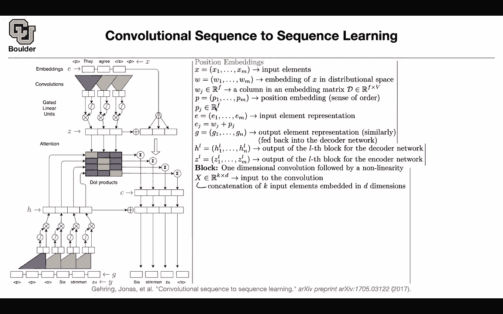
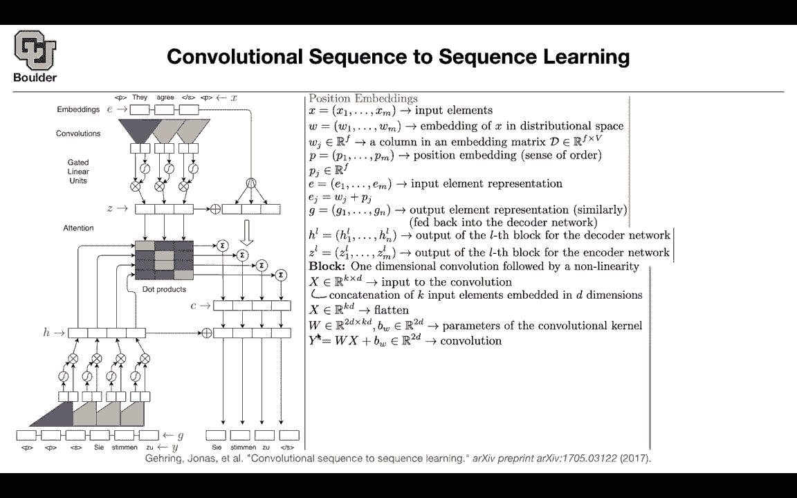

# 【双语字幕+资料下载】科罗拉多 APPLY-DL ｜ 应用深度学习-全知识点覆盖(2021最新·完整版） - P116：L55.2- 卷积序列到序列模型 - ShowMeAI - BV1Dg411F71G

There is another question rather than using so far we were using LSDMs or ret neural networks or GRUs all the time The question is can use convolutions why convolutions because modern hardware like GPUs they like to process things in parallel so they are really good at that theyre problem with LSTMs is that they are sequential both in time and if you have stacks of LSDMs they are sequential to go from one layer to the next layer both in time and in space you need to know the output of the previous layer so they are sequential in nature but we know that convolutional neural networks they are highly parallelzizable and theyre good and they're going to fit GPUus and GPUus and other modern chips okay so there is a trend in the literature towards going towards using more。

Using these computing resources more efficiently that's why you're going to go towards convolutional neural networks and just try to see what's going to come out of it Can you use convolutions for sequence to sequence modeling I'm going to break down this figure So don't worry about it I'm going to go through every single detail but first of all。

 the figure is going to start from up there So we're going to start from here then we're going to continue from here and then we' are gonna to merge the two So this is the encoder part that's the decor part and then we are going to do some attention and then output the translation So that's how you're going to read this figure from up to down from down to up and then you merge the two first of all position embedding you have a source sentence This is x they agree something So that's your input elements that's your X These are numbers Okay。

 these are one to three and these numbers cannot。

Have values bigger than your dictionary or dictionary size。 Okay。

 they might they might appear multiple times。 So this is exactly what you have These are numbers 1，2。

3，4，5，6， etc ce。 Then you're gonna first embed them to embedding matrix。

 So this is always the first layer of whatever that you do with natural language。

 you first embed your words。

You're gonna to have an embedding matrix it's going have the size of your vocabulary and F is a hyperparameter that you choose and each word embedding is going to be a vector it's going be f dimensional so that's our words there is a problem here with recurrent neural networks you know there is there is an order you know what is left what is right and how you're going to go from one word to the next word so there is some counting process going on naturally you first process the first word then you process the next word etc but when you do convolutions everything is going to be in parallel so you're going to lose the sense of ordering okay to bring the sense of ordering back you're going to have a position embedding so you're going to have vectors for each number in your sequence the first word is going have its own vector the second word is going to have its own vector actually a second location the second position the third。

Poition is going to have its own vector， etc。 Okay that's going to give you。

 and these are learnable parameters， the same way that you had embedding word embeddings and you were turning numbers1。

2，3，4，5 etc to vectors。 You are going to change1，2，3，4。

5 for indices of the locations or position to vectors and they're gonna to have the same size as wj。

 Now how do you bring the sense of order back You just add them together。 This is your E。

 So I gave you what is x。 Now you need to give you what is E and e is just the word embedding plus the position embedding So that's bringing the order back to convolutions。

 That's one part。 you do exactly the same thing Now I'm here。

 you need to take a look at your target sentence and then you need to turn it into G we had x。

 we turn it into E Now you have y you need to turn it into G and you do the same thing。

 It's exactly the same thing。 you。

renaming y x to be y okay and E to be G so it's exactly the same thing Now the question is what is this H and what is this Z How do you model it。

 how do you use convolutions so this is where the convolution is going to come in and these are convolutions and there is a minor difference between the encoder and the decoder the encodeder is symmetric so it's looking at the words to the right and left the decoder is asymmetric it's only allowed to look at the words on the left。

Okay so that's the output of the e block so you're going to have multiple convolutions on top of each other。

 This figure is showing only one of them but you can stack multiple convolutions you're going have L block for the encodeder E block for the decoder and these are the notations H and Z so this is H that your Z What is a block it's a convolution followed by a non nonlinearity and we're going have stacks of these convolutional blocks What is a convolution somebody gives you an input of Es or Gs and that's going to be let's call it X theyre going to be d dimensional and you're going to have K words that you're processing maybe you're processing P they and I so these are three so K could be3 and d could be F but I'm keeping it general it's a general notation because in the next layer you could be changing your dimension maybe。

Noor more f it could be another dimension okay what you're gonna to do is you just flatten them So convolutions are very easy。

 You first flatten them and then you do matrix vector multiplication so you're going to matrix。

 you're going to multiply a matrix by your vector and a bias and your matrix is going to have the size of 2 d by Kd because the size of x is Kd and y2 d this is where these gated linear units are going to come in in the end you're going have a2D vector per each one of these outputs you divide them into a and B now a's d dimensional b2 dimension d dimensionional and Ab which is y is going to be two dimensional2D dimensional you take a you take B B you push it through a seat might function and then you multiply these two together That's your nonlinearity that's your activation function and it's called gated linear units so that's your nonlinear。

One of them goes through sigmoid and then you multiply them element wise so now we are here and we are here it's symmetric you're doing the same thing You add residual connection。

 we know that residual connections are important We saw it in the first paper in the previous paper。

The problem is in the end you need to output this so this is going from one layer to the next layer L minus1 to the next layer L and you're adding your residual connection but then for prediction you need to predict the number of words the size of the number of words in your dictionary and so you multiply by a matrix you correct the size and then you push it through softmax so this we have been doing forever in this course so there is no attention yet if you stop here there is no attention we can just output your probabilities and game over we know that attention is important so we are going to bring it back let's take a look at this age here this age the I entry is going pay attention or how much it's going to pay attention to the rest of the entries in your input to the rest of zs so for each one of these you want to know how much attention and you have an an。

ensent budgett of one that you're spreading among the vector Z or the sequence。 first of all。

 there is a minor modification。 are not you are not going to process H you're going to process D instead so you have an embedding for G you don't want to forget the ordering and you initial word vectors per each layer of your network。

 so you just keep adding them you first correct the size of H and now theyre in a good form to be added so you add them together Otherwise you cannot just add them so you need to change a dimension with some parameters。

These AIs are exactly these values that you're seeing here these are your attentions。

 how much state I is going to pay attention to a state J now we want to pay attention to these zs and you can have multiple blocks so you could be counting U is very similar to L so that's your L block or it could be u block how do you spread your attention。

 you multiply the vector D that is coming out of H。

 you multiply it by the vector Z it's going to give you a number you push it through selfm and it's going to give you values from zero to1 that add up to1。

Okay we created this dot product now we need to spread the attention among the input Z。

 so you can just multiply these numbers， these attentions by Z， they encoded Z from the encoder。

But there is another thing that you need to do， you don't need to forget the ordering so you just bring back your embedding the same way that you brought back G here so G was here。

 the same way you are bringing back E so you don't want to lose the ordering from one layer to the next layer and that's it that's going to give you disease this summation that you see here is exactly this summation that's going to give you a bunch of C's。

 you add C to H this is the addition it's going to give you a bunch of a sequence of vectors now that sequence of vectors is the one that you're going multiply by a matrix and then push it through softax to give you a probabilities of the next how does it perform in terms of blue score from English to Roman it's doing the best。

And we know that by pair encoding is also very important so we're going to use that it's convolutional sequence to sequence with byte pair byte pair encoding then from English to German it's even beating Google's neural machine translation this convolutional neural network and it's also beating Google's neural machine translation for English to French I think I'm finishing right on time for those of you who want to stay and ask questions I'll be around and if anybody wants to leave you are more than welcome to leave。

I have a quick question Sure I just I feel like I've gotten a little confused between this some of the math and this diagram here so this like in the diagram this upper portion up to sort of Z is our encoder Yes。

 and then the way the diagram makes it look is that we also have this input y but why we would obtain from our encoder。

Correct so why you're gonna what do you mean where is Y coming from I guess is my question Oh so for prediction you are doing one word at a time for first of all for training you know y you know pairs of x and y correct okay okay yeah so you know everything for training you know X you know Y so you can encode y you can encode x there is a minor catch when you're encodeding your y you're not allowed to look into the future words and we're gonna respect that we're gonna look at only the words on the left so it's a one sided convolution so under the training is gonna get done okay you encode it you encode x。

 you encode y， you pay attention and then you output the sequence Okay。

 that's done for prediction once these parameters are learned what you're gonna do is you you know x entirely you do your you know y up until some point because。

You're translating one word at a time okay so you know why up until some point and you're gonna keep that you're gonna encode it and then you're gonna pay attention there is no training going on and you're you're gonna predict the next word so you don't need to predict everything you're just going predict the next word So is the first predict it's actually here so it's gonna predict this word these words you're already predict it ZST and zoo youre already predict it and this is the end of sentence that you need to predict next and then when you predict the first word of the output are you not using any sort of yes。

 so you're going have the gonna have you're gonna have the beginning of the sentence that you're talkingken just like an indicator that it's the beginning of the sentence Yes so it's very similar to what you have here Okay yeah okay or it's the end of the sentence from the source sentence Okay Yeah so there's sort of more computation that's going on as you get more information。

As you build up like more。Actually， the X part is the same。

 So there is no additional computation going on there。 Yeah。

 but you'd get more computation from this Y encoding。 Yes， so you're going to have more of that Okay。

 because you just。

Unravel a new word in your translation， or you're right。

I had one other question I don't know if anyone else wanted to ask a question。

But I was going to ask about sequence length as for inputs to these convolution networks and whether is that sequence length static they have like a known like all that makes sense like either it's padded or truncated to fit that static sequence link so if you look at this architecture this is fully convolutional okay yeah and and we know that convolutions they don't depend on the sequence length Yeah because you're sharing parameters and then you're just sliding it and this is exactly what you were doing for classification as well okay and you ask the same question back then also if your sentence is very short then you might get into trouble but even that you can do padding Yeah on some side but that's a good question during training because you want to use your GPUs more efficiently so the way that the training works for languages is that you're going。

Btch together sentences of the same length and then process them in batches。 That makes sense。

 That's gonna improve their performance during training。 Okay。

 I think I ran into a problem related to that with this week's report in fixing the sequence length as like a static size seem to help。

 But I think that also batching them together would have helped as well。 Yes， okay， thank you。

 and the other thing is that you can actually pad as much zeros as you want。

 So it's just gonna ignore them。 Yeah， it's not gonna show up in your computations at all。

 It's just a bunch of zeros getting multiplied。 Thank you。

