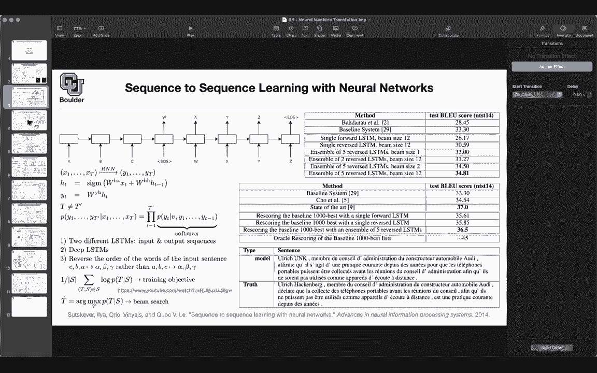
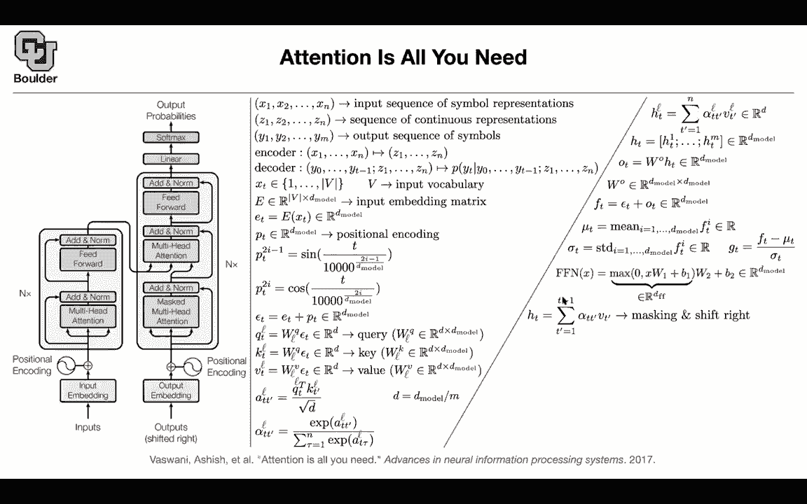

# 【双语字幕+资料下载】科罗拉多 APPLY-DL ｜ 应用深度学习-全知识点覆盖(2021最新·完整版） - P117：L56.1- Transformer - ShowMeAI - BV1Dg411F71G

Let's get us started， but then before we do that， let's quickly recap what we have done so far in terms of machine translation。

We started with this paper neuron machine translation this paper was using RNNs in terms of encoder decoder architecture。

 and then it was also using attention mechanisms so we had to do some attention then the question was can we get rid of attention Can we just do sequence to sequence modeling using required neural networks。

And the problem was the performance was not as good as baseline systems。

 statistical machine translation， so we were not beating the state of the art and two papers tried to do that using only sequence to sequence modeling and only other an ends this is the second paper but then the next one that we covered was saying that neural networks are lagging behind in terms of performance compared to classic all the statistical machine translation for at least two reasons one is that the sequence length matters。

 the other one is that these out of vocabulary words or unknown words。

 they are hurting the performance to deal with the sequence length we said how about we bring attention back and yes indeed it worked it helped us get rid of the issue with the sentence length and the next paper was basically。

by pair encoding and this is able to give us open vocabulary so it is something between character modeling and word modeling by pair encoding is something in between it's a tradeoff right in the middle and it's going help you get rid of your unknown words okay that's great then this paper came along and this was the first one that was actually able to push the a state of the art beyond statistical machine translation and it was using RN it had to do residual connections it had to do word peace models by pair encoding it had to change its loss function a little bit the maximum likelihood plus a little bit of reinforcement learning loss and it had to change its beam search a little bit as well in terms of model it is still using an RN and it is it needed to use attention the next paper。

cameme along and said we don't like the sequential nature of RNNs because if you look at modern hardware such as GPUs and TUs。

 they like to process things in par and now we want to use that opportunity Can we improve upon recurrent run networks。

 maybe convolutions are the answer so were going to replace the recurrent run network with a convolution but convolutions on their own are not going be good translators we needed to work with attention so we needed to introduce multistep attention again and yes。

 these paper pushed the state of the art a little bit compared to Google's neural machine translation and it is achieving the objective of processing your sentences in par now the next paper came along and said okay we couldn't get rid of attention but can we get rid of RNNs or can we get rid of CNN。

Do we really need them okay and then this paper came along and said we can get rid of CNNNs and RNNs altogether。

 but let's keep attention and it turns out that attention is probably all we need so don't worry about this figure I'm going go through it and break it apart shortly and we are gonna but in terms of big picture you still have that encoder decoder architecture so there is an input sentence English goes in you encode it in the end you take that and give it to a decoder the decoder is going to take that as input in addition to the outputs that you are generating this is your target translated sentence and it's going to decod it and then it's going to give it an next word the probability of an next word okay so you still have encoder decoder architecture What is the input your input is a sentence and a sentence you can think of it as a bunch of。

Numbers so it's 1，2，34， etc so Xs are numbers from one until the size of your vocabulary the job of the encoder is to take the input and then give you sequence of continuous representations you have a similar thing for output there is an output sentence that goes in。

 they have different size one of them as size n the other one has size M this is your encoder it's going to take x1 until Xn and it's going to output Z1 up until Zn you have the same thing for recurrentural networks and SM GRUs and convolutions so always the encoder as this it takes a sentence and it's going to give you a bunch of a sequence of vectors continuous representations the decor is going to take the encoded sentence from the input so D Z and whatever words that you have already translated in your target。

It's going to take y0 up until y t minus1 and the objective of the decoder is to give you the probability of the next word。

 given the part of the sentence that you already translated and your initial sentence your source sentence or the encoded version of your source sentence so that's a big picture and Xt is as I mentioned are just numbers from one up until the size of your vocabulary so this is not the size of your corpus this is the size of the vocabulary the first operation is that you're gonna look at your embedding matrix so always the first layer is the embedding matrix so you look at your embedding matrix you look at index I don't know10 and then you just read it off that's going to give you a vector representation for Xt now you turn it into a vector and you are just reading of rows from this embedding matrix so that's the input input embedding that's the first layer and it's exactly what I just said you give it Xt it's going to give you。

And you're just reading of the corresponding row from E the same way that convolutions were processing the entire sentence in parallel and they were losing the information about what word is coming out of which after which word so you were losing the order and you have to introduce positional encoding you have to introduce position encoding at what position are you currently at is it the first word in your sentence is it the second word in your sentence that you're processing which word are you processing so unlike ricar neuralural networks that you know your position you have a sequential nature。

Here everything is being processed in par， the entire sentence。

 So you need to know what position you are processing now。

 previously this was a parameter or a parameter vector here。

 it could be just the fullyear expansion so you can do some fully expansion T is the index。

 the current index the odd positions of these vector at time T at position T you're going to use a sine function and for the event positions you're going to use the cosine function and this 10000 is just a big number that you choose okay so at T is going to go in and number 12。

3，4，5 etc and then the corresponding output is going be a vector so you can either learn this set it to be parameters or you can actually use fullyear expansion or full yearear series so that you don't have to learn them at all so there is nothing to be learned here that's your positional encoding that's your input encoding。

You have E， you have P and the same way that for convolutions， you just added them up together。

 you're gonna do the same thing here。 You just add them up。 just add E plus pt。

 that's going to give you Epsilon t Now we are ready to go in the attention module whatever were gonna do so far the only parameters that we introduced where E they were our wording beddings。

 We are going need to introduce parameters。 Otherwise there is not gonna to be any learning going on。

 So we need to introduce parameters。 you take Et multipied it by a matrix W Q and it's gonna to give you your query So let's say this arrow is a query Qt。

 You're gonna have a key。 So this is wk and you're multiplying it by Epsilon t So this is a typo This is wK。

 These are different matrices and then you're gonna have Et and you're gonna have a matrix for your value So you're gonna have pairs of query key value。

What you're gonna do is you' are gonna see how close is the query to the key and the measure of the distance that you have is the cosine similarity distance。

 How similar are these two together。 The more similar they are the more attention you're gonna pay to that and by the way。

 this is a self-atten mechanism So in the encoder you're attending to yourself。

 So x2 is attending to x1 is attending to itself it's attending to x3 and it's attending to xn。

 Okay now you have a score you just see how similar is your query to the key iss going to give you a score。

 but then you have to normalize it for numerical reasons。

 What you're doing here is a transpose of a vector multiplied by another vector So there is a summation going on and the summation has a size of D So you're doing a for loop over D and because you have a summation you need to you have a sum here you need to normalize it a little bit otherwise it's going。

at okay it's gonna to become a very big number for no good reason。

 You're just summing up a bunch of numbers together and then there is a chance that it might explode to positive infinity or negative infinity So for numerical reasons you divide it by the square root of the size of that summation So why a square root if you choose D that's a very big number that was too big it's not going to converge and if you put one here it's too small So some number between them was a square root of t square root of D okay now the question is what is D D is smaller than d model So let's say this is just a fraction M of your d model So it's m times smaller than your d model and D model is the same size for all of these hidden layers and your embedding size okay these are numbers from negative infinity to positive infinity。

 how do we make them we have an attention。Budget of one。

 so you need to turn these numbers to be between 0 and1 and add up to one。 So you do a softm。

 So we have been doing it throughout these course。 the softm and again it's appearing。

 So now these numbers are going to add up to one if you do a summation over t prime and they are all positive and you less than1 now you're going to spread your attention among your input among your values。

 So the query was for you to see how close you are to the key and that's going give you how much attention。

 you're gonna pay to that entry， now that you know that you can just multiply it by your vector v prime。

 we have t prime。 and that's going to give you a hidden state。

 So what did we do now you take x1 x2 up until xn。 and then after all of these operations。

 you're going to get h1 H2 up until hn and these guys have a size that is less than d model and these was deliberately chosen that way。

I explained what is attention， but what is multi head for those of you who know about group convolutions。

 this should be very similar for those of you who don't know about it， that's fine。It's very simple。

 you do the same operation M times okay so now I'm introducing this L here and L is going to go from one until M So you're going to do the same thing the same operations M times and M is your number of heads and then youll just concatetnnate them to give you a vector that has the size of your D model so again this is very similar to group convolutions but if you don't know about it it's very simple you're just concatetnating everything on top of each other and that's multihe So I explain this part then thats selfatten Now what is this add and norm first of all you take H you multiply by another matrix that's going to give you Ot Wo has a big size it has the size of your D model by D model what is the role of add we know that residual connections are important we saw it in Google neural machine translation paper you are seeing it again here so you take the input。

And you add it to the output input plus the output is gonna give you your addition。

 and we know that normalizations are important。 Otherwise these numbers are gonna to grow big and we're gonna normal。

 but you're normalizing across your dimension Each one of these fs is a vector It's a d dimensionmensional vector and this mu t is independent of the words next to it。

 okay it's just t。 now you're computing the mean of these vector and your mean is over the i index over the your vector size。

 you do the standard deviation and then you do the normalization so this normalization doesn't depend on your batch so it's not patch normalization So it doesn't depend on batch and it doesn't depend on neighboring entries in your sequence So that's a normalization per each word Okay now that you normal。

 you're ready to go to the next layer The next layer is just。

Simple fit forward neural network and this is gonna process your words one after another So this is like one by one convolution So it's not gonna pay attention to the word to the left or to the right it's just gonna pay attention to the current word but it's the same weights and biases for all of these and that's exactly what you're doing you take your F and you push it through this you take F multipied by W1 at the bias do your non nonlinearity multiply by another by another matrix at your bias now youre here after the feet forward Okay so far so good and then add and norm is the same as before is exactly the same as these operations and that's your encoder you just stack is n times on top of each other so you make it deep you have one layer of attention a second layer of attention。

 a third layer of attention and then in the end you're done The question is what is the decoder the。

der is very similar to the encoder。 This first part is a self-atten。 You take your output sentence。

 you embed it， you need to know what position you are processing。

 you go in your attention mechanism your query key and value are coming from the same sequence your output sequence。

 the add a norm， we know what that is， Now the next layer is exactly the type of attention that we were doing for recurrent run networks or the convolution the query is coming from the target sentence。

 the word that you want to translate and the key and the value are coming from the encoder。

 basically how much attention should you pay to the input sequence or the entries of your input sequence while predicting the word at time T but there is a catch in this mask attention So the rest of it I explained。

The rest of it is speed forward add the linear is just a densely connected matrix vector multiplication and then you have your softm to give you the probabilities of the size of your vocabulary。

 the only thing that I owe you。Is what is this mask and that one mathematically is a little bit different from what you do on your computer mathematically while processing the target sentence。

 youre not allowed see your conditioning up until time t minus-1 So you are not allowed to pay attention to words after the current word。

 So previously we were doing our summation t prime is equal to1 up until n。

 that was the entire length of our input sentence here you do your summation up until t minus-1。

 So you do your summation up until this and that's masking and basically shifting to the right mathematicalmaticly that's exactly what you do on your computer you just mask them So you just multiply these alpha T T primes for t prime bigger than bigger than or equal to T you multiply that by a0 So that's why it means to be masked。

 You still do your summation。the entire sequence but then most of them are zero and that's exactly what you get here terms of performance some of these techniques we saw yes bytenet is the paper that introduced byte pair encoding work piece model Google's neural machine translation plus reinforcement learning loss we saw it these are the blue scores for two different types of translations we saw convolutional sequence to sequence modeling these are ensemble model ensembles are going to give you the best performance but then you can have two different versions of your transformer a base model and a bigger model and the bigger model has more ends has more layers and it its D model is bigger。

And that one is giving you the best performance okay， and in terms of training costs。

 they seem to be on the same order， so the training cost is the total cost。

You take into account all of these steps that you're taking while convergence while giving you the best model if you take into account the total cost。

 it turns out that this model is probably converging faster despite being more expensive and I'm going talk about the expense in the next paper So are there any questions before I move on at the question in the mass multi head attention are are you are you taking into account in the like the attention variable alpha like are you only spreading your attention among the first t minus1 is you say you mask it here Yes exactly so you're right so this alpha Tt prime is going add up to one if I get rid of Vt prime it has to add up to one Okay within those first t minus1 Yes okay。

So yeah there is one masking going on here and then there is another one while you're computing your alphas。

 so here you don't do your summation up until the last entry of your sentence。

 you do your summation up until t minus one and then you are good yes they add up to one。

So the question is， is there a good intuition on why self-attention specifically self is so effective like there is a good intuition on why convolutions are good for images one good thing about attention mechanisms is that unlike convolutions that you look at your neighboring words and a small window now you're looking at the entire input so there is more inductive bias built into a CNN and a recarrent neural network for a CNN you're making the assumption that your sequence is a stationary okay that's why you can share your weights and you can take the same weight and a slide it over your sentence for recarrent neural networks you have this inductive bias that one word is following the next one so it has a sequence nature so there is more inductive bias in those two models and those two models are good for small。

Data sets okay but something like language modeling you have the entire internet in front of you so you have the entire you have a lot of data so you need to have a model that has less inductive bias so an attention mechanism is not making much much assumptions so you're just taking a look at your query you see how similar it is to the key and then you spread your attention among your values so there is very little inductive bias in an attention mechanism so it means that you are letting the data speak and whenever you have a lot of data you just let it speak it's big data regime okay a question about。

What are the what are the inputs and the input specifically for the decoder part or the the output multi head like the first time through you take your output embedding with the positional encoding and you pass it in and it goes through the masked and you get the input as well from the encoder just to the second attention head and then it goes through and then the second time through what happens you feed that output back into itself but the same output from the positional input and bedding or the the input embeddings gets fed in at the multi head attention time after time so now you're talking about happens what happens when you when you go deep there in the decoder is attending to the output of the previous decoder so this decoder is going have an output and this guy is going to pay attention to that so it's going to pay。

Some self attention。And at the same time it's gonna pay attention to the output of the encoder at the same layer Okay so at the same layer some information from the encoder is going to go in and then this is the previous layer and then the same pattern is gonna to repeat and you only you only do the positional encoding at the very beginning there are multiple versions of it I guess this paper is doing it at the very very beginning but you can actually do it everywhere So you'd put everywhere positional encoding like back loop from the output back into itself Yes it doesn't hurt because you need to know where you are what you are processing so it doesn't hurt and there are some models that actually benefit from putting the positional encoding at every layer that's a good question any other questions I think along that similar similar thread does this masking only take place at the first encoding for the output No it's everywhere okay。

So none of your attention blocks are allowed to pay attention to information after that time。

 if you're processing time T， you're not allowed to pay attention to things in front of you because that information you don't have that's cheating okay the output from this block will still have like more dimensions like it'll have in dimensions。

 but then the next block can only pay attention to the first t minus one。No。

 so a sequence goes in and a sequence comes out always for the encodeder and the decoder。

 so it's the same size， a sequence goes in and a sequence comes out but then the way that this is going to get processed when you have a sequence here。

 the first word is predicting the next word， this this probability that you are seeing here。

 the second word is predicting the third word etc， okay so a sequence goes in a sequence comes out。

Yeah， I get that I think maybe I'll just try and ask my question at the end of class Okay。

 sounds good any other questions Okay， perfect。