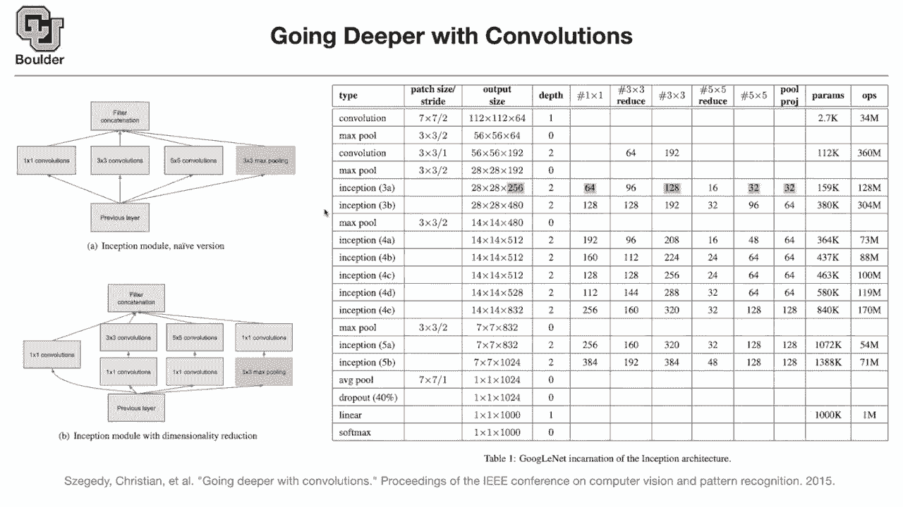
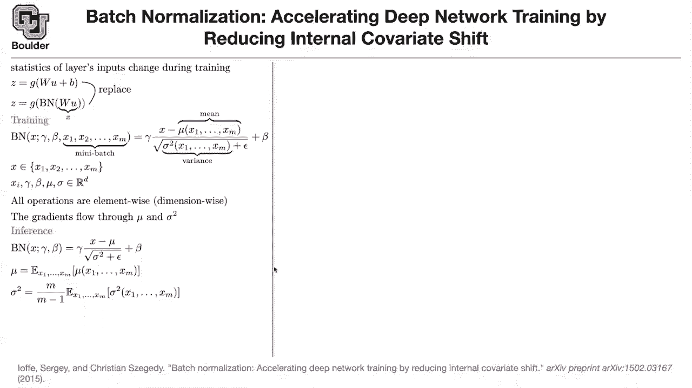

# P11：L5.2- 批标准化 - ShowMeAI - BV1Dg411F71G

there is this technique called，patch normalization and the idea is that。

you want to reduce the internal，covariance shift，but what is an internal covariance shift。

what does that mean，usually if you want to do，if you want to do any sort of regulation。

or classification，even for shallow networks even for，classical machine learning。

you need to normalize your data，it means that usually you subtract the。

mean and divide by the standard，deviation，nice，range otherwise the dimensions won't。

match the units are going to be crazy，some of your features are going to be。

very small some of your features are，going to be very huge and then it's。

going to confuse the training process，that you can do to your input images。

and it is actually what you have to do，but the problem is that that you can do，with your。

input data you can subtract the mean，divide by the standard deviation and。

everything is going to work out，the thing is that when you push that，through multiple layers。

the input to each layer changes during，training，so statistics of your data are fixed but。

the statistics of your，first layer or the input to the second，layer。

is gonna depend on the parameters of the，first layer，so the statistics depend on the，parameters。

so you cannot do the same trick and this，is a problem that's called internal，covariate shift。

so is this clear the concept of，basically the mean and variance of your。

intermediate tensors the hidden tensors，between layers，depends on your parameters so it's going。

to change during training，those，statistics change they are parameter。

is it clear yes or no that process is，clear to me it's not clear though why，that's necessarily。

the shift in，the images from being zero mean to，having non-zero mean。

it's not it's not apparent to me why，has a slowing effect on the d network so，yes what i recommend。

is that you do a very simple linear，and have your data be like this。

one of the features and your data have，three dimensions rather than。

the huge dimensions that you have to，deal with in the case of images。

let's say your data have three image，three dimensions，minus，epsilon to epsilon epsilon is very small。

okay the range of your second dimension，is from negative infinity to infinity。

so very big and these infinity numbers，are machine infinity，and the third dimension has a range。

that's uh，reasonable i don't know from negative 10，to 10。and then try to do your regression。

and see what happens that's a good，exercise，that'll cause conditioning issues right，yes。

so you don't see it in your head but，you're gonna see it in your computer。

things are not thing things are not，going to behave they're not going to。

would you run into the same conditioning，issues if the range of each variable。

were controlled and normal but，but the mean was shifted does that also。

yes as you shift the mean you can do the，same thing also，you can add a very large number。

to one of your variables and see what，happens，okay but i guess the problem is more，clearer thank you。

so even for a simple linear regression，you have to normalize your data，otherwise。

things are not going to converge，have，intermediate layers and those，intermediate layers depend on。

the weights and biases of the previous，layer，because now your statistics the mean and。

variance are shifting，with your data so，what they wanted to do in that paper is，to have。

which could be convolution or which，could be a fully connected。

layer so these concepts are very general，you can apply them to convolutions you，can。

apply them to rnns so batch，normalization but i'm introducing。

them in the concept of convolutions and，fully connected layers now，layer with a batch norm。

this is the input to the layer you，multiply it by a weight，there is a way to ignore bias because。

bash norm has its own bias，x，and then you push that through your，non-linearity to get your output。

we had a similar concept you have to，differentiate between training stage and，testing stage。

when we were dealing with dropout you，have a similar concept here。

during training you do one thing during，testing you do another thing。

we usually take a mini batch of data，let's say the mini batch has size。

m this is a sub sample of your data，then your batch norm is going to be。

and the idea is that x goes in，and you want to get the output of batch，norm out。

whatever the output is so you compute，the mean，you subtract it from x you divide by the。

standard deviation，and this epsilon is just a very small，number 10 to the power negative 8 for。

numerical stability reasons，so you subtract the mean divide by the，variance。

you are getting rid of the bias，to add the bias back you introduce some，parameters beta。

because whatever the bias is you're，cancelling it out，and you scale it up also because the。

scale of this，number is always going to be from zero，to one，i mean with mean zero and standard。

deviation one，so you correct the standard deviation，and whatever that you are seeing here。

are element-wise operations，so they are dimension wise this is a，vector。

being multiplied element by by another，the mean is going to be a bunch of，vectors。

x is a vector you are subtracting it，subtracting two vectors from each other。

dividing two vectors by each other，element wise，the question is are gamma and beta hyper。

parameters no they are parameters，so you can actually learn them，the same way that you learn w。

you are going to learn gamma and beta，through gradient descent，does that answer your question okay。

and x is an element of your mini batch，so this could be x，the batch normalization for that so the。

batch normalization，and your mini batch so it's a random，thing，why because your batches are random。

and during training it's okay for things，to be random，we saw the same thing when we were doing。

uh dropouts one nice feature that many，people gloss over，is that these are when you do your。

gradient descent，of the parameters that are giving you x1，to xn。

are being passed through mu and sigma，yes go ahead real quick um mu and sigma。

here they're they're indicating，operators right so it's like mu，is the mean of this of these data。

is that correct yes exactly so okay on，top of that i'm writing the mean，so you get this summation of。

x i's and then you divide by the size of，your，data which is m 1 over m the summation。

okay thank you value we computed the，i guess i'm unsure what this means when。

you say the gradients flow through，so how do you get x1 x1，has a weight and this guy is the input。

to your neural network，to this layer of your neural network，even u，depends on some parameters。

okay when you compute x1 it depends on w，and the rest of the parameters of your。

neural network whatever that's coming，before it，so the gradients are going to go through。

these mean operations，and you're taking your gradients of w，got it here you are taking the gradient。

with respect to，w and you see it's right here，yes this is x that's x。

so the gradient is going through x，but another observation is that the。

gradients are going through your mean，operations，and the variance operation。

so the algorithm is sort of anticipating，it's going to take the cumulative effect。

this is a minor detail but it's very，important because without that。

if you put stop gradients here in terms，of flow you have a，operation it's called tf dot stop。

gradients，if you do it on these two you're gonna，get into trouble。

for inference we don't want things to be，random，so we need to have only one number here。

that is batch independent，and we want a number here that is batch，so during training you can have a。

running average，of these numbers of these means that，you're computing。

and then you can have a running average，of these variances，and just plug those two numbers here and。

these are actually not numbers these are，vectors，plug those two vectors here doesn't that，converge。

does，so yes the idea is that you take the，expected value of your mu，and then this is a。

you take away the bias and you compute，the，so these are the two numbers that you，put in inference。

network becoming deterministic，now your network is deterministic you。

the same way that gamma beta weights and，biases，are going to be fixed during，interference。

a bunch of other vectors but they're，informed from your training data right。

they are informed by the training data，yes，so these are not trained mu and sigma。

they are not trainable parameters they，are just mean and average，and standard deviation but beta and。

gamma are trained，right i think i'm a little confused，about the the x's。

are those coming from your like image at，runtime or how is，what are those x1 through xm under the。

infrared section。

so let's go back to one of these，structures，maybe this structure is a good one the。

first x is gonna be your，image okay but then，you're having 256 images。

that you're processing at the same time，why because you're going to run that on。

a gpu and on gpu things are parallel，so you can run them fast it's actually。

much better to do things in mini patches，than do them one at a time okay，so you have 256 images。

and then out comes 256，and then you take the mean and standard，deviation of。

and then before you go to the next layer，you subtract，the mean and divide by the standard。

deviation before you go to the next，layer，now i'm renaming x to be whatever the。

outcome of these layers，so the input to each layer is being，called x，out。

okay so these x's depend on the，yeah that makes sense so x keeps，changing。

and it's parameter dependent it depends，on the parameters of this convolution it。

depends on the parameters of these two，convolutions，when you have one x here going through。

that's why these means and variances，so the very first let's say image。

that we're conducting inference on after，training，the first what do you mean so。

we've trained we've got a whole bunch of，x's that go through it。

uh we do this running average and we say，good it's it's fully trained we got all。

our parameters now i want to classify an，image，um where do these x1 through xm come，from。

in the inference stage are they just the，most recent，x's that were passed through during，training。

so no that's why during training you，keep a running average of your mean and，variance。

and then during testing you can just you，don't need，x1 to xm anymore you just。

you just take whatever the the running，last the last running average when we，stopped training was。

exactly okay yeah the last guy the，inference，the batch norm as i see in my notation。

it doesn't depend on your mini batch，yeah so we just，freeze the running average at the last。

stage of training but that makes sense，exactly but your batch norm for training。

depends on mini batch，this one is random this one is not this，one is deterministic。

so the so the x that's input to that，batch norm is，not the same x that's um in the next，that's。

getting confused is the the x's to，define mu，are from training but the exit patch，norm is。

sort of a new new data no look at this，during training you are doing a batch，norm of some x。

it depends on some two parameters you，have the same thing here，yes it's the same x gamma and beta。

but then there are a bunch of other x's，that are your mini batch，you don't have it during inference。

can can i say so i think that for me the，confusion is in training。

everything is happening happening in，parallel and so，like the u is the input to that layer。

and then we compute w u，for each data point in that mini batch，each。

x1 through xm we can do this batch norm，based on all the other x1 through xm and。

that's all happening in parallel，yes so if you had a normal，neural network layer。

you would have u1 and it's going to give，you z1，you would have u2 it's going to give you，z2。

and so on but with batch norm，your input which is u1 is going to，depend on u2。

through the batch node through this mean，and so this is entirely dependent on，having。

like gpu capability like you can't do，this，if you're not run if you're not training。

in parallel sort of exactly so，that's why gpus are so popular，okay it's one one is mini batches。

the other one is uh，these convolutions many of the，operations are going to be done in，parallel。

because they are linear algebra，operations，and make matrix multiplication you can，do it in power。

i had a question about the gamma and，parameters so when，when you are training or an inference。

they should stay the same for，both training and inference yes，okay and is it dependent on。

the data what is the best value of gamma，and beta，or how do you determine those values。

gamma and beta and w are determined，through gradient descent，that we had in this course mu。

and sigma are determined differently，right mu and sigma are different yep and。

whatever that i'm talking about here is，layer wise，it's just one layer of your neural。

network this is gonna happen for，every layer thank you，any other questions，thanks sure。

