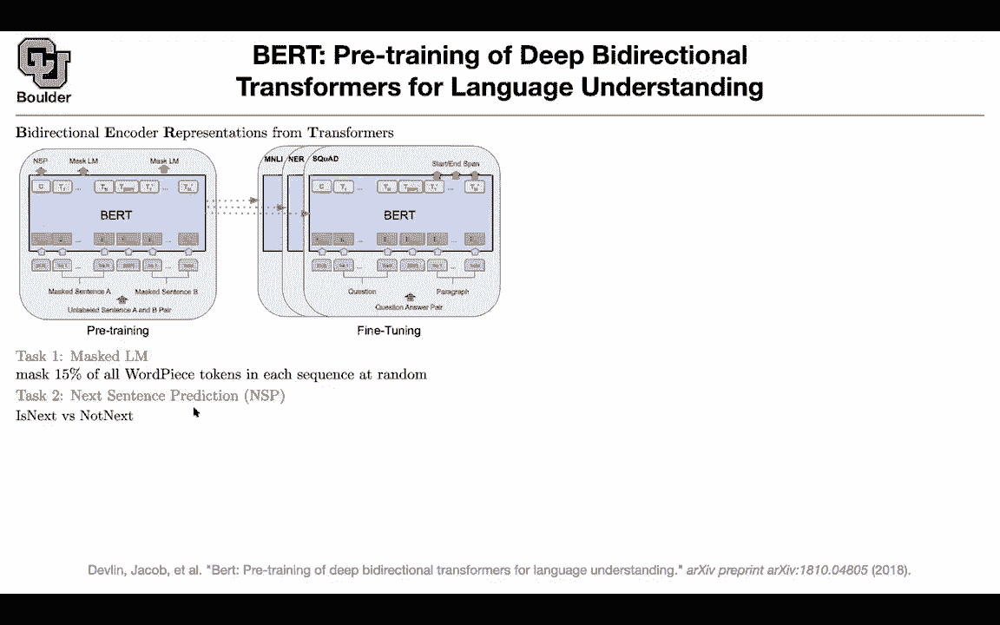
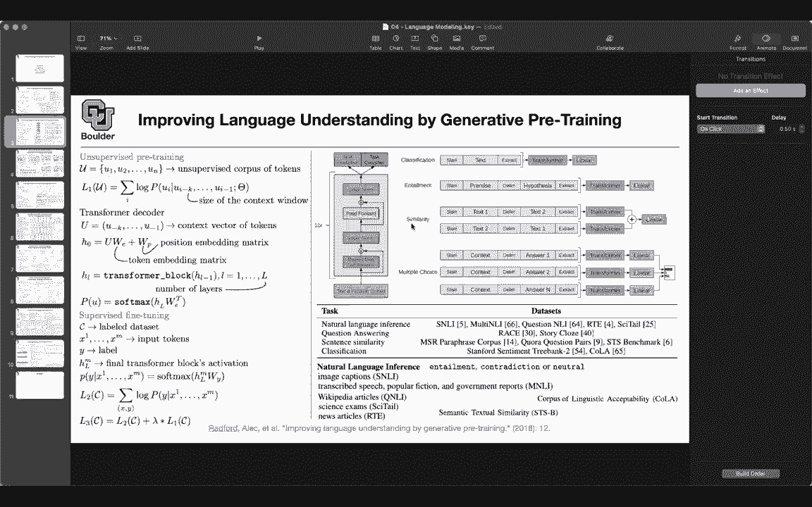
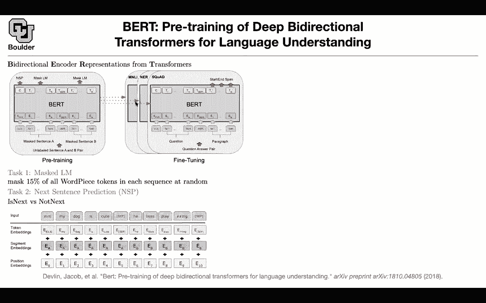

# 【双语字幕+资料下载】科罗拉多 APPLY-DL ｜ 应用深度学习-全知识点覆盖(2021最新·完整版） - P121：L58.1- BERT - ShowMeAI - BV1Dg411F71G

Let's move on to the next one I'm sure you have heard about BRT G was using the decoder part of your transformer block or transformers Bt is going to use the encoder part of a transformer first of all what does BRT stand for it stands for bidirectional encoder representations from transformers whatever are we gonna do it's the same paradigm of pretraining fine tuning your first pretrain and then you fine tune on your target task but now you're changing your loss function compared to before previously the loss function was a autoregressive loss function given the previous words Pre the next word here is' a little bit different whatever we going do you're going take your input and mask 50% of the tokens that you have at random So you're just going to mask them out let's say your sentence is near York is a city and then your。

York and the sentence that goes in is going to be new mask is a city and then your task is to tell you York to predict York or you can mask multiple words that is task one there is also a task two which is if I give you two sentences I this a next sentence in your paragraph is this next or not next and that is coming out of this part of your sequence so what is happening is that the sequence goes in a sequence comes out the CLS token is going to correspond to next sentence prediction some of these tokens are masked。

 you're going to input two sentences the question is the question that the first entry is answering is is this the next sentence yes or no and then the mask language model is trying to answer what word did you mask so the only change that you're doing compared to the previous one。

Is you have you're using the encoder part of your transformer and then you're changing your loss function your loss function is predicting the the masked words as well as the next sentence prediction so I think I'm going to stop here and continue okay perfect so what have we done so far we started with language modeling last session and we said that we are not interested in language modeling for the sake of modeling the language we are interested in it because of the downstream tasks so we want to do some sort of transfer learning because you have a lot of data on the internet。

 you are unlabeled maybe you can model them you learn something from them and you can transfer your learning to your downstream tasks maybe you want to do some sort of sentiment analysis maybe you want to do named entity recognition maybe you want to do question answering maybe you want to do summarization so these are your downstream tasks and we want to do。

Some transfer learning and we actually when we were doing word vectors we were doing transfer learning so we learned our words the vectors corresponding to our words on an unlabeled corpus on a large one and then we transferred those to our downstream tasks maybe then you had a CNNn on top of your word vectors coming from glove or word to vector and we started with this paper we set the problem with word vector representations is that you have only one meaning you have only one word one vector corresponding to each word it means that you cannot model the context for instance a word like play or bank could have different meanings in different sentences so what is the idea now you do some pretraining you learn your Lmo vectors these Lmo vectors are coming out of your LSDMs so in addition to your word vectors you have some more information you have some。

more vectors to work with This is gonna give you more information Now the rest of it is going to your downstream task So these are gonna do your feature engineering for you these Elmo vectors and then you go to your downstream task let it be question answering sentiment analysis name that it is recognition you name it So there is this paradigm of pretraining and then fine tuning because at the same time you could also fine tune these parameters of your Elmo vectors basically the parameters of these Lsdms The next paper is G1 it belongs to the same category of unsupervised pretraining and then supervised fine tuning pretraining fine tuning so it's the same category for pretraining it's the same as before So you're predicting the next word it's an autoregressive model it's an AR model given the context you want to predict the next word This is your pretraining。

But what are your pretraining what is your model your model is now a transformer block and it's a decoder part of your transformer rather than an LSDM now you have a transformer block for fine tuning for instance if you want to do classification you can keep the same architecture as the one that you used for pretraining and then have different heads you can have task specific heads according to your task maybe your task is classification maybe it is entailment similarity or multiple choice now let's move on to the next one we covered some part of it so we are going to continue with BRT。

What does it stand for is it stands for bidirectional encoder representations from Transers。

 A key point here is this bidirectality。 and the other one is using transformers and transformers。

 we are going to use the encoder part of the transformer now rather than the decoder。

 still the big picture is that you do pre-training and then you do fine tuning on your task。

 pretraining is unsupervised fine tuning is supervised。

 and it's gonna depend on whatever task that you want to do name entity recognition question answering natural language inferencefer sentiment analyses you name it。

 pre-training， fine tuning。 So the first change from before is that you' are using the encoder part of the transformer and that's and that's hence the name bydirectality because now you are not doing any masking。

 This word can attend to all of the words in the future as well as the past that's why it's bidirectional。

 That's one change。They encoder part of a transformer。

 The other change is the way that you're going to train this or pretrainPrevious your task was predicting your next word Now your task is you're gonna mask 15% of your word pieces for each sentence at random and then you are going predict the corresponding word that you mask for instance。

 if your sentences new York is a city， you can mask your and then youre going to get new mask is a city as your input and then the task of your mask Lm mask language model is to predict York So that's one task there is another task this is just to help because some of the task you're down thestream task like this one like question answering you have a question and then you have a paragraph it consists of curves of sentences so maybe having a task like that is going help。

Maybe inputting two sentences is going help So what are you gonna do you're gonna to have two sentences a masked sentence A。

 a mask sentence B if you're following each other then this sentence B is the next sentence for sentence A Otherwise if sentence B is from a totally different corpus then this is not a next sentence is next or not not next so that's how you're going to create your training data and this is going to give you your loss function So your loss function is going to be an addition of the NSB task plus this masked a L task and then you have to properly create the two losses youre pretraining for question answering task would you want to make sure all the sentences or questions and sentence Bs are answered No not necessarily so during pretraining you are pretraining it for general purpose So you're doing it for whatever down astream task that might happen So no these are not questions。

During pre training， these are just sentences that are either in the same paragraph or in totally different paragraphs or totally different documents。

 Okay， that's the pretrain。 What goes in， What is the input。

The input for instance could be CLS CLS stands for class my dogc is cuted a separator because you have two sentences that's a spatial token he likes playing and then another separator then these are your tokens these are just numbers I don't know 10020s5612 etc these correspond to unique identifiers in your dictionary you take that and you embed it these are your word embeddings and because now you have a huge data set in front of you you can initialize these guys to be random these don't have to be word vectors from glove or word vector word2 V so these could be random then you're gonna have two encoders basically two vectors telling you are you in sentence A or are you in sentence B so there is going be an embedding for sentence A there is going to be an embedding for sentence B and then you just add them together and we know that because these trans。

merers are going to process your entire sentence in parallel in one pass。

 You're gonna to lose the position。 It's not like RNs or Lests that you do it iteratively and you know the order Here you're going to lose the order So you're gonna to add the order back There is a position embedding corresponding to position one and another regular corresponding to position2 etc。

 and then these are learnable parameters。 This is the first layer。

 the next layers are just the encoder part of a transformer。

 So we cover it in attention is all you need paper。 So that's exactly the same setup。

 What happens a sequence goes in a sequence is going to come out The first sequence is for classification it's a binary classification is next not next and the other one you're gonna to have multiple classifications and it's basically which word in the vocabulary is going show up here。

 So there are multiple softmax here and then there is。

sigmoid function here because that's binary classification and this is a huge size classification for the size of your vocabulary That's pretraining so you're gonna wait you're gonna wait for a while you let your GPU work and in the end the parameters of these B model or your transformer are going to be put in the right place for your language model now you have your language model and we want to go to do down stream tasks here you're gonna have label data for instance your labeled data could be in the form of pairs of sentences so you have two sentences and it's a pair of sentence classification for instance natural language inference is this sentence a logical consequence of the first sentence yes or no that's natural language inference and then you have other tasks these are the tasks of sentence pairs so these data sets you can explore and why did you need these classification token because the corresponding。

Column is going to give you the class label， so you're going to need to have a head here， by the way。

 because here you might have multiple classes3， four， five， etc。

 so you're going to change the head here it's going to have some parameters task a specific parameters and then you're going to learn it you're going to learn the entire thing so this part you're going fine tune this part you're going to initialize randomly and learn from scratch。

If you have a single sentence classification like sentiment analysis you just fit in one sentence that's it The only thing that's going to change is that one sentence is going to go in and then you're going to read of the class from here there is question answering task this one I'm going explain more so don't worry about it and then we also covered named entity recognition for instance N is this other is this a person etc so this is per word classification and then you don't need to worry about it class anymore so you're going to have your output from this branch of your transformer so let's go back to question answering what is the task here somebody gives us a question it's going to give us the corresponding paragraph let's say it's a Wikipedia paragraph and then you ask a question from Wikipedia and then the task is for the machine learning framework to highlight the part of the Wikipedia test。

Or the paragraph text that corresponds to the answer of your question。

 so this could be a huge paragraph， but then you're interested in only a portion of it because the answer is there can you ask your question and then the machine needs to highlight some part of the text that your answer can be found in this part of the text。

Okay how are we going formulate this We need to know what is the start of the highlighting and what is the end of the highlighting as soon as you know that then you can just report it This is the start that's the end this is the part of the paragraph that you need to read You're gonna have some additional vectors you're gonna have a vector for the start these are parameters that you can learn and these are task a specific parameters So this corresponds to question answering that's the start you're gonna have an end you can think of this as a question。

 is this the start I this the end So this are query and we saw a query an example of a query vector when we were doing hierarchy called attention network for classification So here you have two query networks and then you need to output the probabilities how probable is that this word is the start how probable is that the next word in the paragraph is the start etc but then if you increase one of these probabilities the next one should go。

These are mutually exclusive so the start couldn't be located at multiple locations in your paragraph。

 That's why you are gonna to need a softmax on your words in your paragraph。

 This is for the start you can have a similar thing for the end these are going give you your probabilities now that you know your probabilities you know your likelihood and you know your ground truth you know that these are one hot vectors。

 that's the start that's the end now you can train this you can train S E and fine tune the parameters of your B okay that's for training for testing what's going to happen is that you need to report that portion of the text that is the most important one whatever you're going to do you're going look at the cosine similarity between this star vector that you trained multiply it by every single word every single vector that is coming out of your B and that's going to give you a cosine similarity and then you're going to add the cosine。

Marity between the end and the n words。 this is gonna to give you your score。

 So you're gonna have a for loop on I andj。 It's gonna to give you multiple scores for pairs of Ij and you're gonna to report a pair of Ij that has the highest score and that's going give you the answer that's going to highlight the portion of the paragraph that you're interested in。

 So what is a message here you're gonna to pretrain fine tune and each one of these fine tuning they're gonna have a small set of parameters that you need to learn additional parameters。

 Okay are there end questions， I see that there is a question on the chat So it has to be a con highlight E G1 line rather than multiple sections from some location in the paragraph。

 So yes， that's correct So it's a consecutive highlight But you know that you can change this model however you want if there are multiple parts of your text that needs to be highlighted you can have multiple start and end points。

So you can have multiple S and Es So does that answer your question Any other question and there is another question Did you say that the position embedding is also learnable Yes。

 so these position embeddings because you have a lot of data during fine tuning you can learn them and these position embedding sorry you're talking about these position embeddings the word embeddings you can learn them the position embeddings。

 they could be learnable or they could be those foury features that we covered when we were doing attention is all you need the sine and cosine so that's a choice that you make they could be learnable and they could be fixed and they are gonna give you equivalent results so don't worry about that Does that answer your question Yeah I guess I'm just to be confused about what is it that were learning in the regard the position because I thought that it's where each world is compared to other world yes。

 so the same way that you couldn't process integers when you were doing your。

Tokens your tokens could be 120 I don't know 256 etc。 you couldn't process them。

 you had to turn them into vectors the same way you cannot process integers0，1，2，3，4。

5 etc and for your position so you have to turn them into vectors because your machine learning framework likes vectors it cannot process integers 1。

2，3，4，5 unless you turn them into vectors Does that answer your question Yeah so now I guess I'm a bit confused about the token embedding so what stop the model from getting well how do you know that it's actually learning the position that is my question it's learning the position because it's the same thing for every single sentence so every single sentence that you put in it's gonna have the zeroth position the first position。

 the second position That's one sentence， the next sentence is gonna to have the same is the next sentence is gonna to have the same is so after a while it's gonna to learn that this E corresponds to the first position the other。

correspons to the second position etc So that's how it's learning it Okay does it answer your question perfect I was curious about it seems like in some cases we concatenate features and in other cases we add them and is there a big difference between the two or is it kind of just like whatever flavor you like for these embeddings you usually add because you don't want to add additional parameters these are high dimensional and then if you concatenate you're gonna have some more parameters and then all of your bird transformers need to be three times as big yes and the other question I have is about these all of these red arrows that are coming out of the top like to the NSP and the max Lm max Lm and yes so they are each individually a softm exactly so they're going have their own parameters and they're gonna be a softm on and so in particular like when you're doing the pretraining you have an individual soft max at。

Each sentence position token one has its own softm and token two has an independent softm for these you can actually look at where your mask is and then output only one you can have multiple of these outputs but then most of them you're going to multiply by zero so maybe it's more efficient to just output where you need it got it and you know where you need it there is a mask token going in in this column there is a mask token any other questions Okay perfect。

