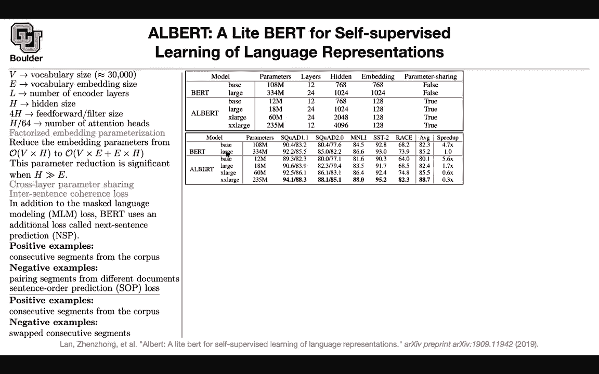
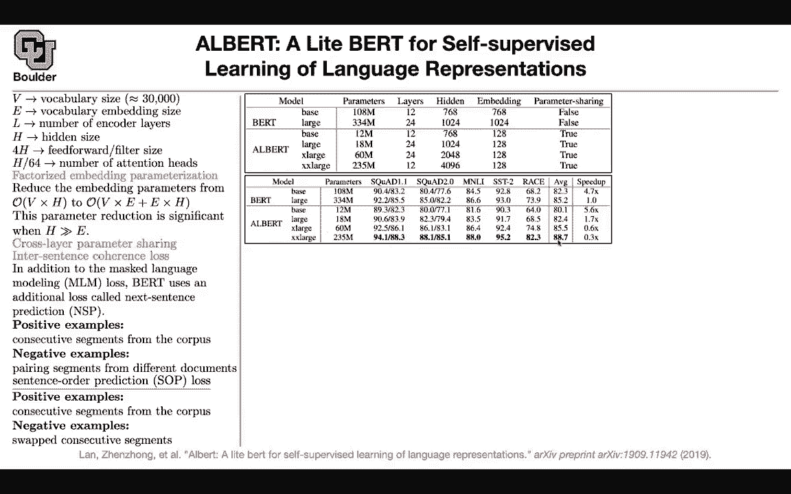

# 【双语字幕+资料下载】科罗拉多 APPLY-DL ｜ 应用深度学习-全知识点覆盖(2021最新·完整版） - P123：L58.3- ALBERT - ShowMeAI - BV1Dg411F71G

I'm going to go back to B and try to digest it a little bit more or dissect it and see what is in it and can you make it more efficient。

 We are trying to make bird more efficient let's say v is your vocabulary size it's usually in order of 30k or more you can have embedding size as's the size of your embedding you can have L to be the depth of your network these are the number of encoder layers you can have your hidden size for each of your encoder layers and then you had your feet forward neural network if you remember that usually has four times H as it hidden size and then if you remember you have multiple heads and H divided by 64 is the number of heads okay what these the first idea of Albert rather than doing V times H you can first go to a lower dimension to your。

Ebedding dimension， so you do word vectors and then you go back up and this is going to help you reduce the number of operations that you do So in B。

 you are going straight from your vocabulary size which was 30k to your H if you remember you had a D model size for your vectors D model is now H so you are going straight from your vocabulary size to H you can actually make it more efficient by first going to a lower dimension and then from lower dimension to the higher dimension This is going to help you reduce the number of parameters significantly from when your H is much bigger than E that's one change the other changes is that for those stacks of So you had L stacks of encoder transformer So this was L layers deep and they were not sharing parameters each one had their own individual parameters you can share them from layer to the next layer So use the same parameters going help。

You reduce a number of parameters。Then if you remember you had this task next sentence prediction is the sentence next yes or no you can change that loss a little bit so we know that previously in addition to the mass language modeling loss you had the next sentence prediction loss now you can change that you can have sentence order prediction loss this is a harder loss to solve for this is a harder task and therefore it's gonna help your model parameters to train better to be in better location so what is the task sentence order prediction you just pick two sentences first they are in the correct order your consecutive segments from your corpus the correct order that your positive example your negative examples is that you're switching the order of the two what did you do previously or what did you have to do previously your positive examples where consecutive segments so it's the same thing but your negative examples where much。

Eier to distinguish so they were a totally different segments。

 a totally different sentence from a different part of your document。

 So these is a much harder task to solve compared to this。

 This is easier to distinguish You know that this is a sentence It's totally unrelated and it's easy to classify This is harder So what is the effect we had two birds。

 you had bird base。 you had bird large。 These were the number of parameters。

 These were the number of layers hidden size embedding size and parameter sharing no for Albert you can have the same structure as your bird。

 then the number of parameters is going to go extremely down from 1。

8 million to 12 million and the only thing that you're changing is your embedding So E is much smaller compared to H These are your your age。

 so you can save a lot of parameters。 now that you saved a lot of parameters。

 you can actually increase the capacity of your model Use these tricks。

You can go up until 60 million by increasing your hidden size or you can go up until 235 million。

 which is still much smaller than your bird large， and then you can have a bigger hidden size and this is because you're doing some parameter sharing So what happens in terms of performance your performance for base and large for Albert compared to BRT。

 theyre going to go slightly down but your model is much faster。

 you get some speed up but then because now you can make your model bigger。

 you can fit it on your GPUs， you can make Albert bigger， you can make it x large。

 you can increase their performance and you can make it x large and then you can beat the state of the art it is yes lower。

 but then it's much bigger as a model it's giving you better performance so there is always this tradeoff between performance and speed what else So now these are。

Systematic studies that any good paper is going to perform What are the studies what are the effect of the vocabulary embedding size let's study E let's fix everything else and and try to study E and you change E from 64 to 1 to m a to 256 to 768 Yes the number of parameters is going to go up without sharing parameters and then the your performance is going to get good it's going to improve at a cost so that's the price that you're paying for these parameters improvements but if you share the parameters then it's not that bad your increase so then it's going to be worth it okay。

Let's see the effect of parameter sharing if you share all of the parameters from one layer to the next layer。

 if you share only the parameters of your attention。

 what happens if you share only the parameters of your feet forward neural network or if you don't share at all for two different sizes for your embedding for your word embeddings for E you see that most of the parameters that you're saving or coming out of your feet forward neural network so that one is consuming a lot of parameters or a lot of memory。

 let's study this task， next sentence prediction versus SOP you're switching the order of your sentences and as you can see SOP is going to give you an improvement on multiple different data sets and on average in total is going to give you better performance and you can do some other studies like what happens because some of these results in the state of the art for previous state of the art we're using additional data what？

appens if you use additional data additional data helps what happens if you remove dropout it turns out that removing dropout also helps so this is one of the first papers that is observing for natural languages that removing the dropout is helping and the reason is perhaps because of the existence of batchsh normalization already so batchsh normalization is normalizing and regularizing your network enough so there is no need for dropout it's going to help improve removing it it's going to help improve the performance so this is one of those papers that's going to study every single detail of an architecture and this is how it should be done properly okay any questions so is everything clear okay perfect。

