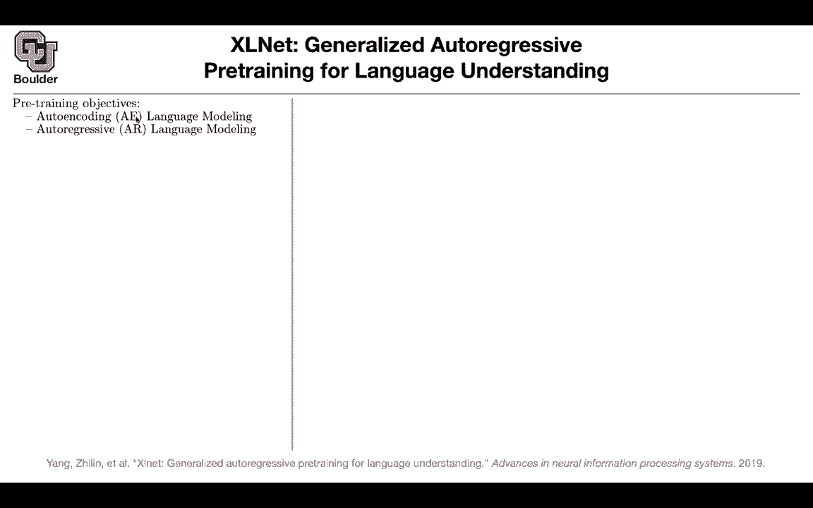

# 【双语字幕+资料下载】科罗拉多 APPLY-DL ｜ 应用深度学习-全知识点覆盖(2021最新·完整版） - P125：L59.2- XLNet - ShowMeAI - BV1Dg411F71G

Now let's move on to the next paper which is an extension of transformer Excel and that's called ExcelNe I like this paper because it's going to help you merge two ideas the ideas of GPT and the decoder part of your transformer and the ideas of B and the decoder part of the transformer this is beautiful there is a quote I guess from a famous person that intelligence is about discovering the similarity between different things and understanding the difference between similar things so one of them is about the big picture one of them is about the detail the question is you yes you gave us two language models one was autoencoding denoing the other one was autoregressive we know the difference between the two they are different one is predicting the next word。

 the other one is just denoing and predicting the masked words。

stand the difference but are they related somehow and what are the shortcomings of these two let's see again you have your corpus for AR model given the context you are predicting an next word this is forward we can have the back version given the future predict today so both of them are fine and these are valid ways of expanding this probability using the chain rule。

For the mask language model， the autoencoding one we mask a couple of words and then we are going predict those words so what are the shortcomings of these two methods for AR model I mean there is nothing special about the forward product or the backward product any possible parameterutation can work to factorize this probability so there is nothing special about this going forward or backward what is the problem with autoencoding methods B is that there is a discrepancy when you do pretraining and when you do fine tuning during pretraining you have this mask torken and this token you're not going to see it during fine tuning so there is a bias towards this mask in your data which doesn't exist when you go to fine tuning so both of them have problem have problems but how are they related let's expand this term a little bit let's parameterize it the problem。

Now you take a log of the product is going to give you the summation of the logs and let's say you' are doing the forward product and that one。

 we are modeling with a decoder with a decoder part of the transformer So this is just a decoder part of the transformer and then you have a softmax and these are your word embeddings at the target that's how you model this probability for autoencoding what do you do。

 you take your sentence， you corrupt it， you mask 50% of your words。

 and then you need to predict the mask tokens mathematically it's kind of how it's gonna to look like you have the maximum of the log of the probability of the mask token condition on the corrupted token or the corrupted sentence you can expand it again the product of the log is the log of the product you can expand it like this and now you are making an assumption that these probabilitybilities given the mask are independent。

 so you are making a。

ongAs here。 Otherwise you need to condition on the rest of this stuff。

 So that's another shortcoming of A autoencoding models。

 You are making a strong assumption that if I know the corrupted sentence while predicting each of these words you' are predicting I don't know 50% of your words those words that you're predicting are gonna to end up being independent and there is no guarantee that that's a correct assumption and what is this M this M is gonna be one。

 if X T is max is masked。 Otherwise it is zero。 So only for the mask tokens。

 you have this last function okay that's one change and the other change is how you model this probability So you model this probability by taking the encoder part of the transformer into account。

 This is the encoder part， a sentence goes in a sentence comes out and then you're gonna read the teeth。

Word in your sentence that was outputted from the encoder part of a transformer。

 Okay that's the decoder。 This is the encoder。 There is a strong assumption here。

 the independence assumption given the corruption your words that are out that you're outputting or independent There is this bias towards the torken mask which is not going to exist when you do your fine tuning and there is this idea of AR and using the decoder part and we saw that there is nothing special about going forward or backward Any permutation is going to work So maybe this is the key observation connecting the two any permutation is going to work So let's try that Let's create a perutation of these numbers one up until capital T So Zt is the set of all of the permutations What does it mean Any member of these Zt is an index okay is the teeth element of that perturbation。

 So maybe your perturbation is31。

4 so Z2 is now1 because it was31，24 and what is z of every term less than t。

 This is all of the first elements the first t minus1 elements in your paramutation so you're just parating these numbers so how about trying this out as your last function two pairutations one is the forward product one gives you the forward product one gives you the backward product and the other elements of these pairmutations set of permutations is going to give you different reordering of your words and different ways of expanding that product using the chain rule is everything clear so far Yes okay so what are we gonna do so you're you have an expectation over the pairmutations so you can have a summation over all of your permutations if you want to do it in a Monte colo fashion but there is a catch here in these forward model or backward model when you are predicting word T you know。

The index， you are sitting at location T and you are predicting the word T。

 but once you do your permutation， you're going to lose the position。

 you're not going to know what is Zt。

You're gonna know what is X Zt， but you're not gonna know what is Zt again。

 this is one of those cases that you have a brilliant idea。

 you take it to your computer and it's not going to work and the detail is that you're forgetting Zt at what location are you predicting the word so the solution for that is you sit on location Zt the same way that you are sitting at location T so you're gonna to sit at location Zt and let's forget about this mask to a stream attention for now and let's focus on this example let's say this is your permutation3241 while predicting word3 you are paying attention to word3 while predicting word2 you are allowed to pay attention to word2 and word3 so we are now at location2 youre allowed to look at these two locations while predicting word4 you can look at word 42 and3 so it's going be。

Here it's going to be4，2 and three while predicting word one， you can pay attention to everybody。

 including yourself so when you are implementing this you don't change the order。

 you're always going to predict x1 x2 x3 and x4 but what you' are going to play around with are these masking so you play around with your masking you don't play around with the order you're always predicting x1 x2 x3 and x4 and this way you are never going to forget ZT the location because you are sitting at this location and thenre predicting that so this problem we solved we brought back ZT。

But there is another catch while predicting word at location Zt。

 you can pay attention to the location， but you're not allowed to pay attention to the word or to the word vector while predicting x1 you're allowed to pay attention to position one。

 but you're not allowed to pay attention to the vector for x1 Y because if you do that you're cheating。

 you already know the answer the answer is x1 and you're paying attention to X1。

 So you know the answer That's why you need two heads or two streams of attention mathematically they are going to look like this。

 you can have a query stream， which is using the location but is not seeing the location the value or the word vector for xZt。

And then you have a content stream which is paying attention to both I'm going to tell you why you need a context stream but for now mathematically that's the formulation visually speaking for the content stream your query is coming from here the key and the value they can come from the future vectors and these vector here and itself that was the content stream。

 the query stream， you are missing that connection okay so you have a dedicated path。

 the query path which is not paying attention to the word to the current word but it's paying attention to the location and then you have a content path that is paying attention to the content the current content why do you need to do this because for transformers you are processing your sentence in parallel so that's the key point you are not doing it one word at a time you' are processing the entire。

Sentence at once if you are processing the entire sentence at once while predicting the words that are coming out of after time t。

 you are going to need Xzt but while predicting the current word you only need the location you shouldn't condition on XZT so basically the content the content stream。

 you need it because the sentence is being processed in parallel the entire sentence and the words that are coming after Xzt you need to know what is Xzt that's why you're gonna have the content stream。

 this is just what I explained and then you are going to have a dedicated mask for your query stream where you get rid of the diagonal you are not allowed to pay attention to the content and that's going and the way the way that you're going to predict you' are going to use the query。

 the output of the query stream to do your predictions The idea is that you。

You need H2 because you need to predict x3， you need H2 because you need to predict x4 etc。

 so this is one of those cases that an idea looks beautiful mathematically but when you code it up you are in trouble you need to go into a lot of es so is everything clear。

Do these attention masks get randomly sampled then exactly so this sampling here that you're seeing them on be call sampling and these permutations this is how you're going to implement them so you just implement the mask The mask is really the only thing that accounts for the the permutations everything else kind just flows through matrix multiplication all at once exactly exactly that's a smart Okay that's the only thing that you change and you just sample from all possible permutations you're not actually like running through because that would be potentially so you sample a permutation like what you did here you sample a perutation but then based on that permutation you're going to create your masks but in the end we' not we're not going to look at all possible permutations。

You're going to look at all possible permutations according to this formula。

 but your question is very relevant to what I'm going to explain next。

 what you're now telling me is that this is really costly， you sample an order a permutation。

 you create your mask， you push it through your network that's fine。

And then you do an addition over all of these probabilities so it's crazy costly unlike what you had for forward or backward models can you reduce the cost。

 the answer is you keep the permutations but then you only predict a portion of your sentence and this constant C you are choosing it according to the sentence length maybe some of your sentences are shorter and you always want to predict 20% of it to 20% of your sentence okay Why is it useful because now you can get rid of the summation and make it much smaller so only predict the words in the permutation that are happening after index C and C is chosen such that you are always predicting 220% of your sentence and you can imagine that these C is changing from one sentence to another sentence okay this is how you' are going to reduce the cost and this is partial predict。

This is changing your loss it is making it more efficient but what have we achieved first of all we started with the full permutations this is a generalization of the AR model but then it was too much to costly we said we are going to reduce the cost the cost of the computation okay still a generalization of AR to some extent but then how is this generalizing the autoencoding language modeling and this is where the beauty is going to come in the loss of the B you were assuming that if you know is a city and you were masking new and York the new and York given the context where independent that was the major assumption for BRT whatever you're going to do here your first condition on is a city it's going to give you new and then given new and is a city you can predict New York actually York so the only change is is new here so you。

Conditioning are new and you're relaxing that independence assumption and this is how you're generalizing BRT so this model is generalizing BRT and is generalizing GP type models it is beautiful and at the same time in addition to these loss you're going to have the transformer XL rather than transformer as your model Okay so you're going have increased context as well I guess i'm going to stop here for those of you who want to leave you can leave and for those of you want to stay and ask questions i'll be around I had a question along the sea lines of that。

Like if T is 256 or whatever the normal size 512 then there's 512 factorial possible permutations so we don't we don't actually sample over all of the permutations but we just choose I don't know 100 random or 1000 random permutations Yes that's correct so you don't need to consider all of the permutations actually a data a sentence goes in in addition to that data that goes in you sample a mask you sample a perutation it's going to give you your mask and then you push it through your network is going to do its predictions and then you're going to write down your loss function that makes sense and then you do that you do that as many times as you want till your training mask goes down sufficiently and then then you're happy and you usually have large corp you have the entire internet in front of you to do this per sentence on the internet you sample a couple of permutation。

And then you move onThis is really beautiful。 The way that you code this up。 This is brilliant。 Okay。

 go ahead。 I had a question just about this last thing here with how it's generalizing So are you saying that it's doing this in our like new loss function in this new model。

 It's like accomplishing this Yes， this partial prediction loss is accomplishing that so it's very similar to what you did for bird for B。

 you would mask 15% of your words Okay here you're masking 15% of your sentence Okay and because it's not ordered because it's like some random permutation It's just like a random mask in your sentence。

 exactly Okay okay and the other thing is that you don't need to input the mask token anymore it's just your permutation and these attentions are you gonna take care of that Do you have a results for this like what kind of。

Some downstream tasks Yes， so whatever that I'm presenting they are pushing the state of the art in terms of the perplexity and the downstream tasks so this is definitely better than transformer Excel and transformer Excel was better than B etc the actual numbers they are very good tables in the paper you can refer to that because this was the hard part of explaining this I'm sure if you read this paper on your own you're gonna get lost Yeah yeah this is a tough paper is something like G3 using methods like this or they still no G3 they are using very simple models and the reason is that they have other challenges like the size of their data is crazy they have billions of parameters and。

So they have a lot of engineering problems to deal with Okay so they are going to stick to a simple model but then scale it Okay just make it really big yes okay this is a complicated model actually not that complicated it is also do but they didn't want to do it yeah but maybe someone will look at scaling this sort of model up super big yes okay that's cool sure any other questions and the the reason is'm Sil this top right box or you have the loss for Bt in Excelnet the only difference here is that when when you're predicting the top layer from Bt you're doing it all in parallel so you're only given one context and predicting every single output in parallel and here it's still this sequential autoregressive prediction exactly so it is sequential but the sequence is in random order maybe you're first predicting your in your next iteration and then。

Here you're conditioning on your camp predicting new okay so it's doing kind of a little bit of both of the ideas it's got the sequential properties from the auto aggressive and it's got the masking from from bird Yes it's beautiful and you can actually use rather than using the encodeder you can actually use the decoder and get away with it because of this reordering the masking cool yeah pretty much sure。

