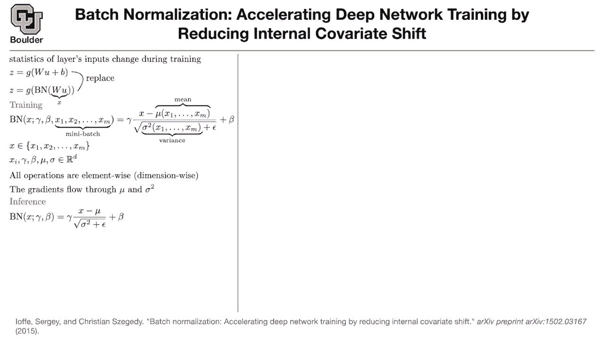
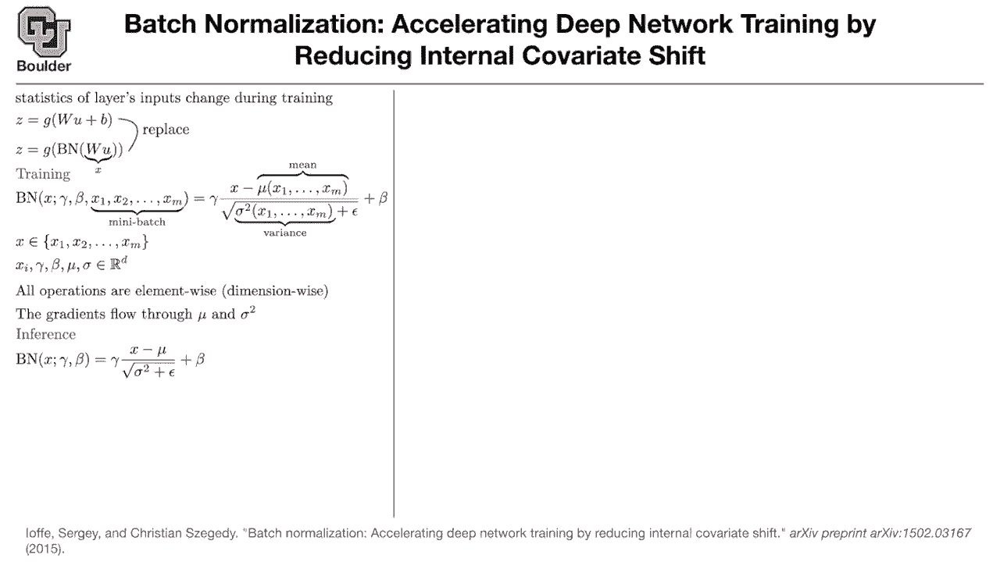
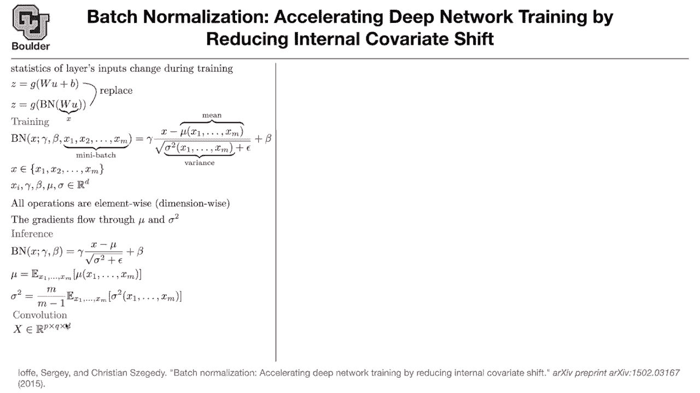
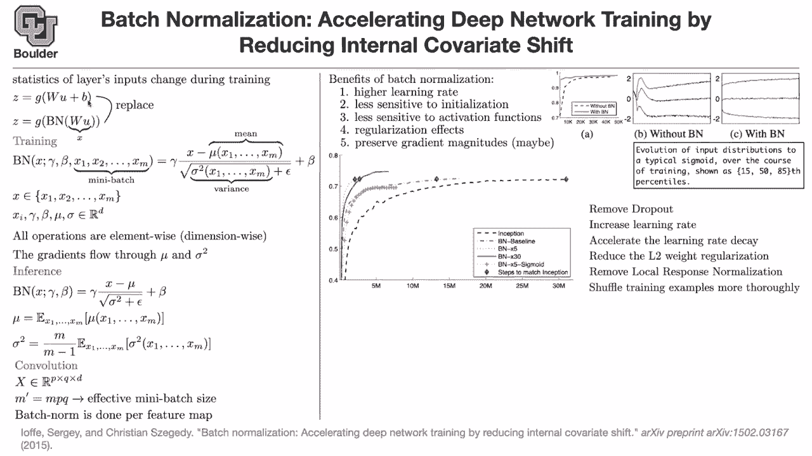

# 【双语字幕+资料下载】科罗拉多 APPLY-DL ｜ 应用深度学习-全知识点覆盖(2021最新·完整版） - P12：L6.1- 批标准化 [续] - ShowMeAI - BV1Dg411F71G

last session we introduced what we mean，by covariance shift，which is basically the statistics of。

each layer's inputs。

then we said we want to do batch。

normalization to mitigate that effect，and then batch normalization had two，parts one was training。

and one is testing during training。

things are allowed to be random，so you do it is random because you are。

and then we said we take a mini badge。

we take the mean of that mini batch，subtract it from x。

the input to that particular layer is x，we subtract the mean and divide by the，standard deviation。

and then that epsilon is just a。

but then if you do that you run into，trouble，because everything that goes inside your。

activation function，is going to have a mean 0 and unit。

to counter that effect you multiply by，gamma，which is acting as your standard，deviation。

and then you are adding a bias which is，acting at。

as your mean and these are going to be。

and every operation is element-wise，and one thing to note is that the。

gradients of your loss function。

flow through mu and sigma so batch。

normalization is sort of anticipating，what's going to happen as the parameters，change。

then during testing and in particular。

inference，you need to put a single number or a。

single vector，for things to be deterministic not to，depend，on your mini batch that's why during。

training。

you keep a running average of your mean，and variance，and basically mu is that running average。

and sigma is that。

so we stopped here any questions up。

now this is for a fully connected。

network，this is for a linear。

combination of the input。

to this particular layer u is the input。

and w times u is x，as you can see this is a linear，combination you are just multiplying a。

vector by a matrix，what happens in the case of，convolutional neural networks。

for convolution the input。

x is gonna。

it's gonna have p pixels in the x。

dimension q pixels in the y dimension，and you're gonna have d channels or d。

what you do is you take the number of。

the size of your mini batch which is m。

so all of these are going to be your，data now，and the effective size of your mini，batch increases。

and then you do your mean and a standard，deviation on that。

basically batch norm is being done，per feature map so you're doing it per。

each dimension of your feature map。

so not only you do your summation，necessary for computing your mean and，variance。

on your mini batch on the number of，images that just went into your neural。

network，but also pixel wise，you are doing a summation over the，pixels as well。

give you give you your mean and standard。

deviation which is going to be in rd，so your mean and a standard deviation is，not going to be in r。

p times q times d but rather it's going。

to be in d，and then everything that you see here。

this subtraction and division，are gonna be broadcasted for those of。

you who know，python you know that。

if you subtract a vector from a matrix。

then the vector is going to turn into a，matrix。

having the same size as your x and then，everything is going to get subtracted。

so first your vectors are going to turn，into matrices and then。

you do your subtraction or division or。

multiplication，that's the concept of broadcasting is，everything clear。

seems okay okay perfect so what are some，of the benefits。

you can get away with a higher learning。

basically you are taking care of the，covariate shift and。

these inputs to your activation are not，going to have crazy values。

think about it if g is，a sigmoid and then you don't do batch。

normalization，and this x gets too big basically this。

input，then you're in the saturating regime。

of your activation function and，everything is going to turn。

into a constant and then its derivative，is going to be zero，so you can get away with higher learning。

rate，the method is now less sensitive to。

because we are doing in the end and，optimization if you remember the first。

lecture。

it was all about optimization methods，and optimization methods depend on the，initial condition。

basically the initial values of your，rates and biases。

and in the next topic i will talk about，how to properly initialize your neural。

networks，but for now batch normalization is going。

to make things less sensitive，to initialization because whatever your。

initialization is，you're subtracting the mean and the，variance。

things are gonna be less sensitive to，activation function，right sorry when you say initialization。

do you mean initialization of weights，or like initial training data no。

initialization of rates and biases，okay in the end you're going to write a。

loss function，and that loss function is a function of。

these weights and biases，and the role of training is to find the，best。

combination of weights and biases。

right but then your algorithm。

let's say adam has to start，with a good guess if the initial guess。

for these parameters are very off。

then there is no hope for training，if you initialize everything with zero。

there is no signal to propagate and then，you you're gonna。

get stuck at zero for instance，right and how does basketball，normalization sort of。

help you become less sensitive to that。

so the way it does it it's by taking，care of the covariate shifts。

so whatever the weights and biases are，whatever this w is。

you get an x and from that x you are。

subtracting the mean and the variables。

thank you so see batch normalization is，multiplication。

so that's why it's less sensitive to，initialization，it's going to be less sensitive to the。

choice of activation function，because now the input，to your g function is gonna be。

mostly centered around zero。

so these numbers are not going to get。

and if you take a look at for instance。

the sigmoid activation function。

it's going to stay in the regime where，it's mostly linear，it's not going to go into the non-linear。

parts and then。

why because things are random each time。

your neural network is sort of random，because of different means and variances。

so it has a similar effect to drop out，because of the randomness you're。

introducing，and then it preserves gradient。

magnitudes this is a maybe，so this needs further investigation。

so basically you need to be careful，write down your gradients and see。

benefits。

to see what i mean by covariate shift，first of all what is the benefit this is，mnist。

dataset and you are training a simple，neural network。

and the m is digits data set。

this is with this is without batch，normalization this is with batch，normalization。

so you're converging much faster。

and what's the y-axis is basically，the accuracy，on the test data so this is actually the。

generalization error。

but then to see a concept of。

the input to a particular activation，g is。

uh for instance in this case it's going，to be wu。

that input you can take its mean and。

so what we are plotting here is not。

median and then。

the upper quartile and lower quartile，and then you can just plot that。

basically we are plotting the statistics。

of this，during training as you can see it's，nasty it goes。

up and down and it's not symmetric。

but after bash normalization the input，to your activation is sort of。

you're most of the time around zero and。

[Music]。

that's basically a way to plot your，distribution。

half and 85 percentiles。

so this is covariate shift this is your。

you removed covariate shift by this。

[Music]，this is the inception network basically，google net。

the one that we covered last session。

and this is the number of training steps。

and the y-axis is the accuracy，and it's getting closer to i don't know，70 percent。

that's the inception module and this is。

how many how much iteration how many，iterations you have to wait，for your method to convert you this。

only。

change that you do for this red dashed，line。

is introduce batch normalization and you，already cut。

the training the amount of，training necessary i would say less than。

half，compared to inception。

then you have batch normalization with。

five times bigger learning rate，which is going to get you here much。

then you have batch normalization 30。

times，faster basically that's your learning，rate。

you can change the sigmoid this is，because we just made a claim，that bash normalization is less。

sensitive to activation functions，you change the activation function to。

sigmoid，and this is what you get and。

these diamond blue diamonds is just。

how many iterations it takes to reach，the accuracy of the inception model。

so it's really beneficial at that time。

so if you think about it these are。

really huge，claims to be making when you're training。

a neural network，can i ask a quick question sure um。

so beta and gamma are。

parameters learned on the scale of like，an entire，layer is that correct as opposed to like。

like in for your in，the normal situation your bias is，applied to each。

connection right but in this case beta。

applies to every single connection in a，dense layer for example。

no it it it is actually it has the same，size as b。

learning，replacing the bias okay so you have a，different one for each。

each connection per each layer you have。

a different one，but i mentioned you have a different，scalar。

if that's what you mean but in like a，single dense。

layer if you have like a bunch of，neurons。

each each neuron would have their own，bias right yes each output neuron。

will have its own bias basically。

each d is gonna have its own bias，okay oh and i see okay that notation。

there so each，output neuron has their own beta in this，case in their own gamma as well。

okay yes but these are vectorized，notation here this is a vector of the。

same size as b，yeah okay thank you yeah。

so your beta is acting the role of b，because as you subtract the mean b is。

disappear，to。

one drawback is that this is sort of，random，things that are happening during。

one drawback maybe is that you cannot。

get away with，only one sample if m is one。

then you're in trouble because their，standard deviation of。

a number is going to be zero and then。

so batch normalization with a batch size。

how close does this end up being if you。

sort of append a layer，onto the front of your network that does。

you could do that but then your mean。

is your parameter and then what is the，data，to train that parameter is probably this。

you could do that you can say x minus a，parameter divided by。

sigma squared which one this one is also，a parameter，but then you need to train this。

you cannot use the same loss that you。

have for，gamma and beta and w to train mu and。

sigma。

it seems like a lot of these，regularization techniques end up being，external to the network。

yes exactly。

so actually，this paper batch normalization。

they're using the inception model the，one from the previous。

slide and they make improvements，actually huge improvements over that。

so what changes do they make they remove，dropout，altogether they say that we don't need。

it anymore，because batch normalization is sort of，doing the regularization。

on its own they increase their learning，rate。

which is this plot on the left which，means that，they don't have to look at their。

computer training for，i don't know。

14 million iterations so it's a，difference between。

one week versus。

uh three days four days，of staring at your computer and waiting，for your results。

they accelerate the learning rate decay，so usually when you're training your，neural networks。

as the training progresses。

you usually see that the loss is，dropping for some reason。

at those points they're reducing their，learning rate，so when they say they accelerate the。

learning rate decay。

they do it faster basically，they do these jumps faster for the，training。

there is a weight decay which is，equivalent to l2。

rate regularization。

and this was part of alexnet，and most neural networks do that there，is this weight decay。

and they want their weights to go，towards zero it's a usually very small。

parameter and they actually reduce that，even further。

so apparently there is no need for not，much。

do you remember that nasty local，response normalization。

so after this paper actually most of，neural networks where classification，don't use that anymore。

they don't use local response。

and they shuffle the training examples，more more thoroughly。

because the more random things are to，the eyes of the neural network。

and the more independent are those。

samples the network is gonna learn，faster。

how sensitive is this to batch size，so usually the way that you train your。

neural networks，is that you choose your m。

as big as possible so that it fits。

the data and the network itself，fits on the gpu but then how sensitive。

it is，uh that i don't have a definite answer。

to that depends on the model，that you're training so that i don't。

know，and these are some of the results that，you see，there is google net the inception model。

they had this resolution if you remember，224。

and it was an ensemble model，so they were using seven models doing，the prediction and in the end。

and they were using 144 crops，per image for things to be translation，invariant and this was their。

top five error and you can compare it to，4。9 when you do an ensemble of。

batch normalization neural networks so。

it's a huge gain，so bash normalization is really powerful，that's the message and it's really easy。

to implement，and it's already implemented most of，implemented in most of your。

neural network packages you just say i，want a batch normalization layer and put，it on top of my。

convolution so that number for，models is that independent like ensemble，models right。

yes so usually the way that they do it，is you train multiple models。

with different changes in your hyper，parameters and weight initialization。

a couple of these models not all of them，are coming from different，in the end they and some of them。

are a combination of being trained by a，learning rate five times bigger。

some of them with a sigmoid so these。

so minor changes but in the end，it has a huge effect from from 5。82。

because remember what is the aim here，there is this，challenge that you have to win so。

whatever changes that you make，you to your neural network in the end，that's your objective。

to reduce your top five error rate or。

and the competition is fierce so it's，not easy to improve by，such a huge margin any other questions。

are those batch norm models，including batch normalization once or，multiple times in the network。

no this is for one layer usually after，each。

convolution there is a patch node，so in your neural network you have，multiple layers。

and each layer usually has，a couple of convolutions after each，convolution。

there is a batch node does that answer，your question，any other questions before before i。

change the topic，just to follow up on that real quick so，in practice。

you will put like as many batch norm，layers，as there are convolution or dense layers，in your network。

essentially yes that's correct okay，some of them might not have it probably，the。

initial convolutions the one closer to，your input，because the input is already normalized。

usually your image is you take the image，subtract the mean，and then that's going to be your input。

to your neural network，your convolutional neural network okay。

and would that be uh be inserted before，or after max pooling or does it not make，a difference。

uh it makes a difference，and then we are gonna go over the best，place for batch norm。

in the future in some future papers，okay but for now after your convolution，you can put a batch。

any other questions see these are easy，questions，to ask and then easy to answer。

but then you have to answer them on a，computer，you might say why not put batch norm，right after you。

and then multiply it by weight，the people who wrote this paper actually，did that。

and it just doesn't work okay，sometimes the answers are as simple as，that it doesn't work。

the network doesn't converge any other，questions。

so the next topic is gonna be about，initialization we never talked about，that。

i was waiting until this moment，what is the proper way to initialize the，neural network。

what are the proper initial values for，rates and biases，can anybody answer that or what should。

we take into account，when we want to answer that question you，might want the。

the map to be like a full rank map of，some kind，[Music]。

not really any other，thoughts what might go wrong，let's do it this way let's remove batch。

node let's remove g，then you have a bunch of matrices that，are being multiplied by each other。

and this multiplication，is being done，16 times let's talk about vgg16。

where you have 16 layers so you have 16，of these w's，being multiplied by each other until you。

reach your image，well on a machine it's not necessarily，precise that's one thing。

and mathematically what can go wrong，it can blow up exactly，so whenever you see multiplication and。

you have，a lot of them being multiplied together，a lot of w's。

things could happen either those weights，have an eigenvalue of less than one。

then everything is going to collapse to，zero，by the end of your output or it's going，to explode。

yeah jacob you're right it either grows，or it shrinks，very fast so multiplication is dangerous。

so we have to be careful with，initializing，these weights properly。

there is another catch even for a single，layer，you might end up in a regime。

where g saturates what if you initialize，your weights，and then you are doing value that's your。

activation function，you get a bunch of zeros and it'll，propagate zeros forever and you won't。

get any information，exactly so two things matter，one is this g one is these guys being。

