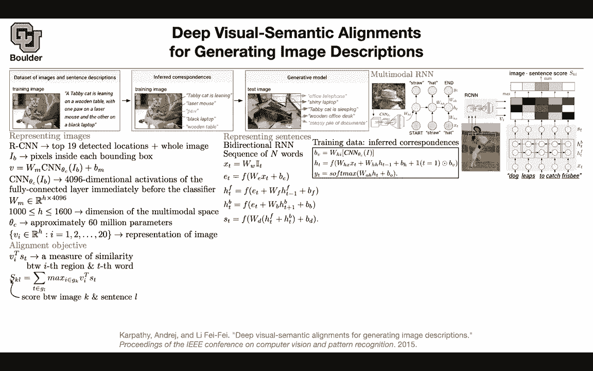

# 【双语字幕+资料下载】科罗拉多 APPLY-DL ｜ 应用深度学习-全知识点覆盖(2021最新·完整版） - P130：L62.1- 视觉语义对齐 - ShowMeAI - BV1Dg411F71G

Let's move to the next one problem with caption generation is as I mentioned for videos it's the same problem for images you're not gonna have enough data enough label data this paper is a sort of a data augmentation technique so you're gonna augment the data that you're machine learning framework is gonna to see what type of data sets you have you have pairs of this is your data set you have pairs of images a training image and a long sentence corresponding to it within it been nice if you could say you could focus on parts of your image you could have a bounding box here and say this bounding box is corresponding to tabbyca is learning or leaning you could have a bounding box around the mouse and say this is a laser mouse bounding box around the paw and say this is a paw like laptop etc this way you're augmenting your data set you start with the same data set but then now each one of these small。

Bounding boxes pairs of bounding boxes and the corresponding sentence is going be added your dataset now you're gonna to have a bigger dataset to work it and then you can use the framework from the previous paper on a bigger data and we know that neural networks like bigger dataset so that's the idea of this paper you want to augment your data make it bigger and then the rest of it is generating captions for not only your entire image but parts of your image this is an office telephone so this is now your test image that's a shiny laptop or you can have one description for the entire image the framework is exactly the same as before。

 but now rather than the entire image going in you have the option of putting fractions of your image like focus on the hat of that person push you through and a CNNn and get the corresponding vector and initialize the process of conditioning on the image and conditioning on the words and then you。

Always predicting an expert to start is going to predict straw straw is going to predict how hat is going to predict the end okay。

 that's our objective， we want to start with this data set and increase the size once you do that the rest of it is training as before and you can infer the correspondences between these two。

And this is exactly the same model as before so the first part takes an image。

 pushes pushes it through a CNN， corrects the dimension and then you put it as an input to yourSTM or recurrenural network and then in the end you're using yourmax to predict an x word mathematically this is a description of that image up there and then this identity is saying that you're putting your image at the input only but you don't have to as you mentioned in the last slide you don't have to put it at the input you can put it everywhere for each time step okay let's cut to the chase and the chase is how we're going to increase the size of your data first of all this we cover in part one of the course you have an RCNN it's an object detection system and its job is to put bounding boxes around objects in your image so it's going to put a bounding box around the dog and it's going to put a bound。

Blocks around that， I don't even know what that is， but I'm sure the CNN knows。So you have a dog。

 you have that and then you have your boxes， you can take these boxes and push them through CNNs and then you are going to take your image。

 push it through these CNNs and then you are going to get a set of vectors previously you are getting only one vector now you are going to get a set of vectors and this is a set of vectors we one up until how many objects that you found in your scene maybe to many of them and then the sentence you have dog leaps to catch frisbee so this is this sentence here and this image is this image here the training image。

You push them these are word embeddings， you push you make them word embeddings。

 you push them through bidirectional lesbs and you get your features in the end parish word you're gonna have a feature and then i'm going to tell you what these are so don't worry about them in the end whatever that you do your image is going to turn into a set of vectors your sentence is going to turn into a sequence of vectors let's focus on the image now and what is how you're going to represent your images we are going to use ourCNN for you if you took part one。

 you know what that is if you didn't take it and you're going to take it next semester you're going know what that is and some of you already know so that's fine this is an RRCN it's an object detection system and you could use any object detection system and it's going to detect 19 you're gonna to look for 19 object in any image plus the entire image and let's say IB is the image that is。

Inside that bounding box for instance， this is the entire person but now you're focusing on the hat that's your image these are the peak circles inside each pounding box and you have20 of them you take your image you push it through a CNN you multiply it by a vector by a matrix to correct this dimensions to the ones that you like and it's going to give you a vector so for each box you're done have a vector and let's say in the end your CNN is giving you 4096 dimensional vectors you can take that and correct the dimension by this matrix you are interested in dimension of H and H you can choose it to be a number between 100 or 1600 so it's a number that you choose it's a hyper parameter theta C are the 60 million parameters of a network that you're using the CNN but they are fixed so you don't have to train them。

Now what happened， you took an image and then you turned it into a set of vectors in RH and this is now the representation of your image cool。

 the representation of your sentences， these STs， you're going to use a bidirectional RNM and you're going to have a sequence of n words。

 you're going to use an RNN maybe with some fancy activations like an LSDN。

 but then it's bidirectional and whatever that you get is going to give you your STs in the end。

So per each word you're going to have a corresponding S and this is where this is sort of like an attention mechanism so now we are going after this part of the figure and this is an alignment objective you can take a vector from your set you can take a word from your sentence and then measure their distance this is the cosine similarity distance that's going to tell you how similar are these two is this region of the image to that particular word so now you're trying to align and it's exactly your objective here you are trying to align the bounding box for the cat and the tab cat is leaning and in the end per each sentence and image image K and sentence L in your data set so per each for each pair of image and sentence you're going to need a score you're going to need only one number whatever you're going to do you're going to look at this and then you're going to take a maximum over your。

s over your boxes。

And you take the maximum you put it here and let's say the bigger it is， the more white it is。

 so you take the maximum you put it there， you take the maximum here， you put it here， etc。

And then to turn that into a single number， you just sum them up。

 you're just doing a summation of the maximum of these Vt and S。 This is a set。 that's a sequence。

 You're representing images and text now you want to know how similar an image is to a text and that's going to give you a single score。

 that's the score。 and what is GK GK or the set of image fragments。

 So it's the set of these bounding boxes。 It's exactly this set here。 What is GL。

 it is a set of sentence fragments So it's these fragments here。

 these sentence vectors And in the end you want to assign each word to the best part of your image。

 So you want to assign tabbycas leaning to this part of your image What is a good objective function for that。

 This is your last function。 Okay it looks a little bit complicated。

 But once I explain it you're gonna understand it fully。

For this training data set。Some images and some sentences are going to correspond to each other in your data。

 some images and some other sentences， they are not going to correspond to each other okay if they correspond to each other it's going to become SKK so k is the entire set of images and L is the entire set of sentences so it's indexing that if k is equal to L your image and sentence are pairing together so they are matching so what are you going to do if a new image is going come in and it's score is bigger than the pair that are already matched then you need to penalize it because that's a mistake the model is making this sentence is paired I mean image K is paired with sentence K and image K cannot be paired with any other sentence if that happens if this is bigger than this for data is one for a second if this is bigger。

This the maximum is going to be this term maximum of zero and this is going to be this term and now you're going penalize and this one here is just to give you a margin。

 it's going to make the task a little bit harder you need to satisfy that property by a margin so here I was looking at an image you can take a sentence and then do the same exercise on all of the images if an image is violating this property it has to be penalized if the score between a sentence and an image is bigger than what it has what it needs to be penalize it and that's going to give you a loss function you can do your endicment training and this loss function is encouraging aligned image and sentences pairs to have a higher score than the misaligned ones by a margin and this is your margin。

I think I'm going stop here and continue next session for those of you who have questions you can stay unask I'll be around does this mean that every every image has exactly one sentence that corresponds in your data said yes so each image has only one sentence that it correspond to that's your training data and there's the sentences are unique so there's a there's a one to one correspondence between the number of images and the number of sentences Yes so in your training data there is a one to one correspondence between this image and the correspond label so this image doesn't correspond to two labels in your training data there is only one label yeah and the opposite true as well yes so for this sentence there is only one image in reality that might not be true but in your training data it is under your control the only part of this paper that is under your control is here it's your data。

Because in the other one you were dealing with earlier it was kind of like a given an image choose from among a bunch of different words that might work or try to try to construct a sentence that might work and this is a little bit different this is just like a selection process No that one was also the same thing for your training data it's the same type of training data you have an image you have the corresponding label but the task it's a generative task an image goes in and then multiple good sentences might come out because there's a probability distribution there each time that you run a language model it's going to give you a different sentence yeah。

Same same thing here're we're gonna to penalize it if it's far from the ground truth but it's going to be generated and it's not necessarily going be one of the sentences in the set of labels here what we are doing we are going after this alignment so for now I'm in this step and I want to increase the size of the data but once that is done then you can use that data in addition to your previous data to train the model from the previous paper because more data is going to help it more so this is just the data augmentation and the idea is that you are mapping images and words to the same manifold to the same hidden space and once you do that you can come up with this course。

The one last question I had was。The assigning certain words like in this in this training image with the arrows like tabbyca pointing back to the tabbyca and Paul and so on that's that's done using the maximum location I'm guessing right like if you know that that word。

Activated V1 or activated V7 most when that's you take that word and point back to the certain image。

 what do they call the sub image or the the。The bounding box that that maximized V1 or maximized V7 yes。

 so now you're talking about this is the training part of the alignment and then you need to infer your alignments and that part I haven't yet explained that's going to be next session。

And youre absolutely right among all of these given this sentence among all of these boxes。

 which one are you going to align to this yeah that' the inference part yeah that's cool。

And once that problem is solved， you have enough data to train this model and improve their performance Yeah cool thank you had a question read fast for me so I'm still trying to understand what's going on so the data set is an image in a paragraphgraph and then we're putting that image through a fast CNN to get the bounding boxes oh also RCN RCNN to get the bounding boxes and then we're taking in those bounding boxes as vectors and putting them through the LSTM again or just an RNN so first of all。

 what we are doing here is we are going to take an image and we are going turn it into a set of vectors an image goes in and a set of vectors is going to come out vector represent the bounding boxes and their vectors are representations of the bounding boxes your vector representations of the bounding box。

And then so previously previously what we had was a single image going in and a single vector coming out now here what's happening is a single image going in and a set of vectors coming out to any0 vectors rather than only one vector。

And then do we also insert these paragraph as a set of vectors with those set of image vectors exactly exactly there is no RN actually the RNN that you have is going to turn word vectors or words tokens into vectors basically you take a sentence in English and then you're going to turn it into a bunch of vectors so the same way that here you have an image and you are getting a set of vectors here you have a sentence that's going to give you a set of vectors so the first part is here you take an image and it's going to give you this image has three bounding boxes a bounding box for the dog for this and for the entire image that's going to give you three vectors one。

2 three here you have these words in English dog leap to catch frisbee and then you're going read off the location from your。

dictionary these are going to become integers， you take those integers。

 you turn them into word representations， you take your word representations and push them through a bidirectional RNA or a lessN that's happening here and then that's going to give you your vectors in the end a sentence goes in a set of vectors going to come out and image goes in a set of vectors is going to come out in the dark loops to catch a fri be similar to the paragraph we had beforeca is laying all this whole thing No so this data that you see here。

 this image and this sentence or your data set。It's like this cat and then a taby cat is leaning on the wooden table etc。

 all of the sentence I'm confused about is that a sentence pill bounding boxes is that like the whole thing and do we get bounding boxes and are we supposed to match them so the final aim is this is your data but that's not enough okay you want to augment it you want to augment it with these bounding boxes and the corresponding short sentences that's your final aim we haven't yet reached that but if you do that you are gonna call this multimodal R this is from the previous paper so please don't confuse these RN with these RN here they are different okay this is a different step once you do your data augmentation then you're going to use the algorithm from the previous paper which is here these two lines to do the captioning for you okay but this algorithm needs data you can either work with your original data。

Set which is small or you can first do some tricks and increase the size of your data in a smart way now that you have a bigger data set。

 you can train this more efficiently。Now the question is how are we going to solve that problem if I give you an image。

 if I give you a sentence， how are we going to increase the size of the data because now this training data you're splitting it into one。

2， three， four， five data and if you manage to do the same thing for every single image and sentence in your original data set your size of the dataset set is suddenly five times bigger now we are trying to solve that problem we want to increase the size of the data and one idea is that what if you look at the portion of your image and try to label them in an automatic fashion so let's take the face of the cat and then label it as tabbyca is leaning okay so how is that happening tablebitcat is leaning is that handmade like a person did it or is that automatic。

No， this is going to be automatic and that's exactly what we want to do。 first of all。

 if it needs to be automatic there is going be need to be。

 there is going to be a need for training and then inference Am I right like any other machine learning framework。

 you're going to do training and then you do inference。

For training the data that you have are this first。

 you're going to take an image and turn it into a set of vectorctors using a bunch of CNNs。

Then you're going to take this sentence and then turn it into a bunch of vectors， ST， okay。

 so it's going to give you a sequence of vectors， a set of images， a set of vectors for your image。

Now， if you can manage to solve this problem， if you manage to align a particular word， for instance。

 tabby to this portion of your image， then at least you solve some part of the problem now this portion of the image is being matched to tabby this portion of the image is gonna be matched to the mouse Okay so this is what you want to do so do we send each word in the sentence to the image and to see very it goes to pretty much exactly a sentence Yes create sentence So if we have three words matching to the same area in the vector we know that that's a sentence for that bounding box yes。

And that's exactly what you want to do you have a vector in this set。

 you have actually 20 of them you can pick one let's say you pick V you pick a word in your sentence this is a set that's a sentence so this is part of your image that is part of your sentence a word in your sentence because they are in the same space they have the same dimension now after these these operations after these representations they have the same dimension they are in the same space you can multiply them together and compute the distance little dot product Yes so this is just a dot product now that you have your dot product that's good now you know with what is core these part of the sentence is matching this part of the image but this is ontrained so there is no training going on we need to train it and come up with a loss function with a good loss function okay but for you。

To have a loss function。 You need a single number How good is your method doing or how bad it is doing because this is your loss。

 But what is the data that you have for that。 you have pairs of images。

 you knew that tabby cat is corresponding to this part of the face your problem would have been solved but unfortunately you don't have it So you have to train it whatever are we gonna do we have these pairs of images and sentences。

 if they match， they have the same index as Kk means that there is a match if they don't match。

 they have different indices and now K counting your images L is counting your sentences Okay now this is saying that if there is a mismatch penalize because I want this to be the bigger number and I want this to be the biggest number now K and L are not only for these images for the entire data set that you have。

 Now this is where you're learning from all of your images and sentences at the same time。

It's doing it's unsupervised if we don't have that， let't we know this doesn't match or not。See。

 we are using all of the information that we have at hand。

We built a model that's a distance between two vectors and we came up with a single score that's going to give you SKL and what information do you have whenever K is equal to L there is a match between this image and the sentence and whenever they are not equal there is a mismatch and if there is a mismatch that is not what you want you don't want this cat and the laptop to be misidentified as a doc okay and the laptop being I don't know this object here So that's all of the information that you have and you're using it but then this is the training part the problem is not yet solved in the end what you want or actually if I give you an image can you tell me which parts of the sentence correspond to this space and there is going to be another round of optimization for that okay for the inference there is going to be another catch sorry I'm still not understanding how the loss is attainable。

But the law supposed to be fixed and looks like SkL is attainable and you find understand same Skk is also obtainable so not to issue how do we get a loss that is untoable from that this is trainable What do you mean so。

I confusing maybe maybe you're overthinking it。 Let's see。

 So it's basically trying to match a word to a part of the image by multiplying them like the dot product and seeing how similar they are and that's SkL This is SkL Yes。

 and Skk is So maybe you're confusing the indices， maybe I ask a little bit question to understand what youre thinking What is K here。

 What is k indexing the words or is that all the world。

 I think it's all of the images in your data set So K， if you have a for loop。

 it's gonna be all of the images in your data。Okay。

 so you have a for for your entire images L is all of the sentences in your data。

 an example for K is this image an example for L is this sentence， so that's just an example。

 but then you could have many examples am I right。So that's your K and L and in deep learning you want to learn from examples so one example is going to teach you something another example is going to teach you something else and then in the end you're going to have a statistical model that learned something from your data so far so good yes。

 and the only thing that you know is that SKK is whenever you have a match。

Whenever you have an image matching a sentence am I right okay whenever they are equal there is a match between the description and the image and whenever they are not equal there is a mismatch there should be a mismatch because we label that this is our data okay so if there's a match Sk is one and if no it's not one it's whatever number that is and it's trainable it's trainable you can there is gradients going through all options going through VT and V and SDvi is coming out of your CN so probably you're learning this WM and perhaps fine tuning the CNNN a little bit but not too much and this ST is coming out of this word embedding the RNN and then this WD these are the parameters that are going to get optimized so yes SKk might change from one iteration to the next iteration。

of the optimization SkL might change， but in the end you want them to be ranked properly。

 you want Skk to have the highest rank so please don't confuse K and L with I and T they are different okay this summation is over the entire data set this IN T is perish image or peri each sentence。

Is it clear now， a little bit， I'm still a little confused。

 I don't know maybe I need to sit on it for longer。

So what is not making sense because I need to know So we're going through the training loop and then we're trying to match an image with the entire sentence So I'm still not following on how do we get this past sentence like these smaller sentences out of it Oh that's one I haven't yet explained you are not understanding it because I haven't yet explained because that's this part of the paper you have every single right not to understand it because I haven't told you Okay so what we're doing right now is just trying to match this entire sentence with this image exactly yes so we're just shuffle the data I guess yes so now what you want to do is to learn these representations so what you're doing is you have an objective to learn V and ST that's your last function。

Through your last function so through your last function you want to learn VI and ST but VI and ST are parameterized through a CNN and R Okay。

 so so far what we did was taking an image and taking a sentence and tying to see how similar they are exactly yes okay so we haven't okay so we just shuffle data set like do we shuffle the images with the random sentences and just see how similar they are Yes so this is exactly the sum here。

SoAnd you want the ones that match to have a higher score compared to the ones that don't match that's your objective so for now that's your training objective and I guess we're doing that because we don't have a pretrained CNN I'm a bit confused confused about like what do we have to train from scratch what is a cat in the image what you're training these CNNs you can do some transfer learning okay so don't worry about that。

These parameters could be fixed or they could be optimized over， okay？

But this parameter you're definitely learning this WM definitely learning it through this process and once you learn WM and given that you know your CNNn you're going to know your vectors Okay makes all of sense so instead of an image we're taking the vectors of the bounding boxes and instead of the wallstz we're taking that those vectors of。

Sentences that we had and we're trying to match them and see how similar they are exactly after shuffling the images and sentences exactly yes so the shening is happening here and the matching is happening here So you want the sentence the pair of sentence and image to have the higher score Okay makes a lot of sentence that of sense what is it part with the max on the top with the image sentence score which one on the right the sorry top bite where we have the dog leap to catchbe So how does that relate to that。

Yes so that's your image and that's going to give you your vectors this is Vs this is your set am I right and this sentence is going to give you these vectors that's happening here this is their representation of your sentence that's the representation of your image so now that you have these representations you can multiply them together to get these colors and that's exactly that's exactly this measure here and measure of the similarity but then it's a lot of numbers you cannot work with them you want to turn them into a single number。

You'll do a max pooling here。 The maximum of these three numbers is this white one。

 The maximum of these is this。Gray one， et cetera。And then you sum them up to give it a score between this image and this sentence。

Okay， makes a lot of sense。 So the bounding boxes if we have three it's going to be like five by three and then we multi it by by three by five sorry I'm mix I'm mixing the dimensions but。

Yeah， okay， that makes a lot of sense。 We're not multiplying like one bounding box per row。

 What is that what we're doing So there is gonna be one bounding box per each row here。 Yes。

 you're right， it's for instance， this dark here could be the first day this I don't know what that is that object is the second row and the entire image is the third row but here you have here you have too many of them Okay makes a all lot of sense Okay cool thanks a lot we really appreciate it and then the rest of it。

 I'm gonna explain next session because you actually need to solve this problem in the end。

 there is another step I'm not telling you if you are not understanding that part。

 it's okay because that's why it is Yeah I wasn't sure how we actually pass those Okay。

 that makes a lot of sense。 Okay cool thanks a lot awesome。

see you next time let's get us started so last session we started with the multimodal learning where you have at least two modes one is language and perhaps the other one is images and then one of the tasks that we were interested in was captioning images so an image goes in and we want to know the corresponding caption and we want to generate the corresponding caption and we learned that you can process images using CNL turn images into vectors give those vectors to LTMs and then the rest of it is just words coming in just a language task and the first entry is an image the problem here is that you don't have the luxury of having big data sets because somebody needs to look at this image and describe it look at the other image and describe it so that's the task of the labeling we went to the next paper and set。

What if there is a way to increase the size of the data automatically。

 let's say this is the data that you start with originally。

 there are pairs of images and their corresponding captions。

 what if there is a way to focus on the face of the cat to the bounding box around it and say this part of the image corresponds to the tabby cat is leaning？

So what if there is a way to put a bounding box around the mouse and say this part of the image corresponds to a laser mouse etc if you manage to do that in an automatic fashion。

 then what would happen to the size of your data the size of your data if you say is X and if you manage to break apart each data point in your original data set into I don't know five in this case it is5。

 one，2，3，45 then you manage to increase the size of your data by five so now your data is five times bigger and we know that neural networks like bigger data sets。

 they like being scaled up and once you have that then you can use your generative model from the previous paper and the model is the same as before if you have enough data you're going to be able to train this model now this time rather than having the big image going in you can focus on part of your image。

And that's going to be the input now you can have bigger data set to train this model now the question is unfortunately you don't have labels for each segment of your image each portion of your image so you don't have this and we have to generate it either you need to hire a human to do this task for us or maybe there' is another way to generate these labels automatically for each portion of the image and this paper is going after that automatic way of doing it okay without any label of this kind。

 the only data that you have are of this kind you have images and then you have the corresponding sentence you don't have this and as you can imagine you need to know the information that you're going need to know is this word corresponds to which part of the image this other word corresponds to which box and how strong is that correspondence as soon as you have that information you're going to be able to use。

And then you are going to be able to assign these words to that part that portion of the image The problem is you don't know that score。

 you don't know how strong is that relationship between these part of the image and that word and that's exactly what we want to achieve so we are going to use we are going to turn an image and input image we are going to put some bounding boxes in it corresponding to maybe 19 objects in that image in addition to the original image that's going to give us 2 images to work with so each image is going to turn into 20 images and then those images you can turn them into vectors using convolution and run networks you take that portion of the image and you convert it into vectors so here in these cave for illustration purposes you have only three boxes the entire image the do and that object and that's going to give you three vectors first vector second vector and third vector same thing for your sentence your words。

You can convert them into vectors that know something about the context using bidirectional elesians so using some model you're going to turn it into vectors per each word you're going to have a vector now that you have two vectors that live in the same space they have the same dimension you can measure their distance so you can look at the cosine similarity between the two so you can look at the cosine similarity between this object and this first word this other object and this second word and if you know if your networks are already trained then you can just use that you can say okay this word seems to having the biggest relationship with this part of the image so I'm going to assign it to that so then it's going to become a task of assignment。

But the problem is you don't know these vectors， so you have to train them basically you don't know the parameters of these bidirectional LsdM and you don't know the parameters of your CNN as well as some vectors that are correcting the dimension so there is a question how do you deal with the varying size of the boxes when you're using the c。

The CNNNs we go that we go through them in part one。

 so there is a way to work with variable sizes so that one is not a big deal usually you take your image the convolution operation is independent of the input size the number of pixels in your image the last layer you can usually use a max pullinging the same way that we are using global average pullinging or global max pullinging at the last layer of convolutions for sentences you can do the same thing and then that's going to give you a fixed size vector to work with does that answer your question so yeah convolutions don't depend on the pixel size it's the fully connected par portion of the network that depends on it but that one we don't need to worry about because we are going to use global max pullinging or global average pullinging okay what is the objective now you have an image and then you want to get a set of vectors so that's what we are going do here we are going to use an object detection system。

It's going to give us 19 objects plus the entire image that's going to give us 20 images of varying size to work with。

 you take those pixel cellss， you push them through a CNNnn。

 you correct the dimension using a matrix and H is some number that you choose Theta C are the parameters of your CNN you can either fix them or you can fine tune them and then in the end and image goes in and a set of vectors is going to come out 20 vectors each image we are representing it by20 vectors the same thing for your sentence。

 you take your words， you push them through you encode the words， you do word embedding。

 you push them through by directional Sms and then you get your vectors in the end so a sequence of vectors they have the same dimension so it's gonna to have the dimension H each one of them is going have dimension H Now the problem is how are we going train this we know that we can look at V。

S suppose and ST， and that's going to give us a measure of the similarity that's great。

 that's cosine similarity distance， that part we know。😊。

But how should we train this， how should we train these parameter here， the parameters here。

 the parameters in our bi-directional SdM etc you need to look at your data。

 What data do you have the only data that you have are these you don't have that as your data this is your data so you need to come up with a score for each pair of image and text。

 for instance， image one we know that it corresponds to text1 image2 it corresponds to text2 image 3 corresponds to text3 etc image K corresponds to text K that information we know What other information do we know we know that image one does not correspond to text2 image one does not correspond to text3 text4 etc so we are going to use that information to train these vectors these vector representations but then this is how many numbers I don't know in this case where you have three vector。

For your image and1，2，3，4，5 vectors for your sentence， you had 15 numbers。

 We need to take that 15 numbers and turn that into a single number。

 so the first operation that we are going to do is a max pooling and the second operation that we are going to do is a sum age and then for image K and sentence L you're going to have a score a single score and that's exactly this operation you multiply them you find a maximum max pooling and then use sum that's going to give you a single score and then in terms of your last function and as I mentioned image K is going to correspond to sentence K and image K is not going correspond to sentence L so if that happens if the score of image K and sentence L is bigger than the score of image K and sentence K。

 you need to penalize it。 This is a mistake that the model is make。

We need to correct a mistake that's a loss and you want this to happen by a margin that's for images。

 you can rank your sentences sentence K corresponds to image K sentence K does not correspond to image L if that happens if the score is bigger penalize it and then after the training these vectors are going to be in the correct location。

 these parameters and basically this last function is encouraging alignment between your image portions and sentence portions and it's discouraging the misaligned pairs by a margin and your margin is one okay so far so good now you know V you know S T perfect now you know a scores you know how to score these are the scores that you can read of you pick a word you compare it to every single box in your image and then you're gonna to choose the biggest one okay so that's how you're gonna to solve this infer。

Part of the problem。 That was the intuition， the mathematics of it。

 you want to decode your text segments and align them to your images so that's what you want to do let's say you have a sentence with n words So this is your sentence with five words you have an image with M boxes let's say this is your image with M boxes3 boxes you pick a word。

 let's say T is1 and your question is what should be the corresponding portion of the image should A Tb1 should A TB2 or should it be three Dog corresponds to each one of them。

 And then now because these are already trained， you know that the relationship between doc and this portion of the image。

 this core should be bigger basically this vector this dot product should be the biggest and we are going to use that we are going to use Markov random build to solve that problem。

 but what is that you are gonna write an objective function。

In terms of your A's now you want to find the locations and then this first term is coming out of looking at box I and word T and that's going to give you a score and then you' are optimizing over I and T these numbers you know V and S these two vectors you know and you're now optimizing over I and T okay that's this portion if you do that it's going to assign words to boxes words to boxes but now you want to assign portions of your text。

 you want to preserve some continuity that's why you're going add a little bit of extra cost and what is that you want to enforce continuity you want to say that I want to be continuous in time I want tabby and cat to be a strongly correlated and I want both of them to correspond to the face of the cat okay so this is trying to enforce the continuity this optimization problem if you approach it the correct way if you approach it using dynamic。

Programming is not hard to solve， so you can solve it really quick， okay？If you set beta to be zero。

 it means that you don't have this continuity assumption you're aligning your words to your portions of the image。

 you're aligning words to bounding boxes so it's going to be a single word alignment if you set B2 be infinity you're aligning the entire sentence this entire sentence to every single box in your image and that you don't want it's too continuous so some number between them is going to give you the breakdown of your sentences as you like them and in the end you're going to get assignments like this some of them are incorrect like I'm not sure if there is a person taking pictures on that part of the image but I'm sure there is a man in black shirt standing here okay so sometimes it's wrong sometimes it is correct it's a statistical framework now you have more data each portion of this image is going to give you your data this is additional data to train this。

GMmodal RN from the previous session you train it and then you can do your captioning and it's gonna improve the numbers that you had from the previous paper。

 for instance， this is a construction worker in R safety based who is working on the road any questions about this So this part of the paper I didn't tell you last session and I guess this portion was missing some of you are asking about it now here it is any questions is everything clear just one quick question regarding what we do we then once we've gone over the entire training data we have a bunch of image regions that now have phrases attached to them and then we train a separate model on this augmented data exactly so once you augment your data is this is a separate model So this RN is a different RN from the one that you're using for representing your sentences Okay that makes sense so this RN is from the previous paper So yeah this was a lot of trouble just to augment the size of your。

If you have bigger data than you're just fine。 just work with that。 Okay， any other questions。

 change that， case， let's move on to the。