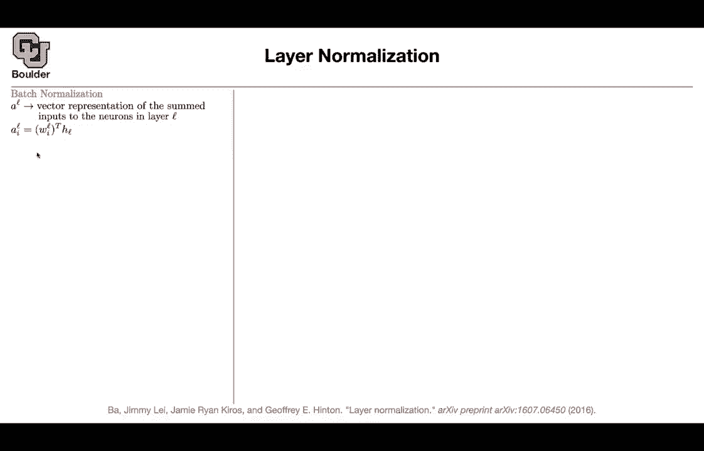
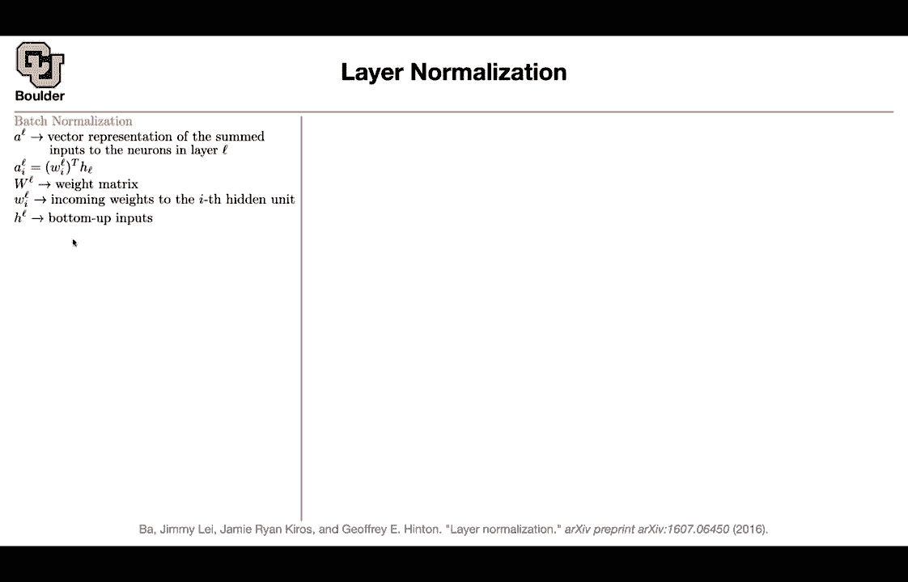
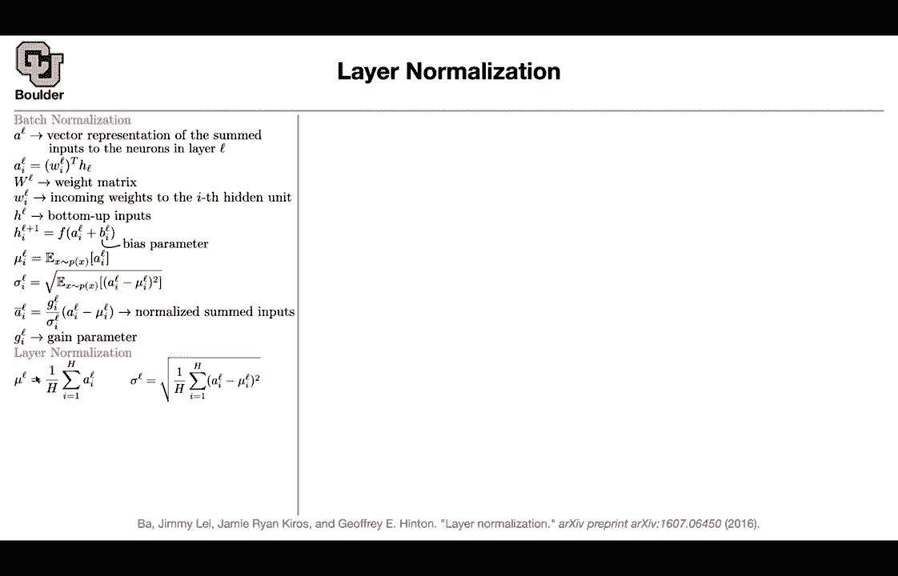
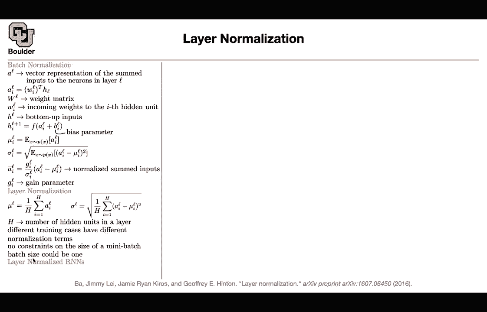
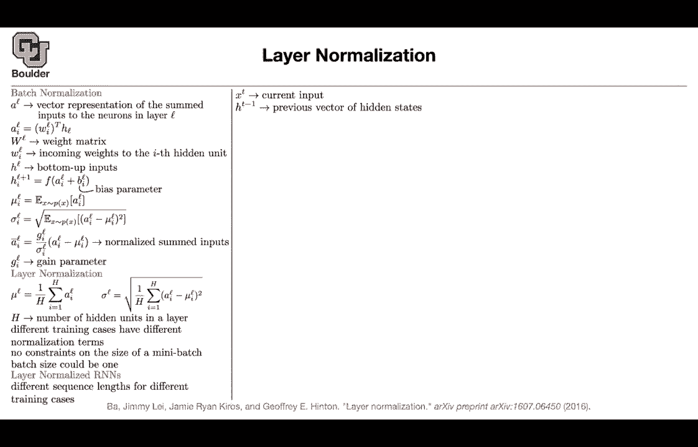
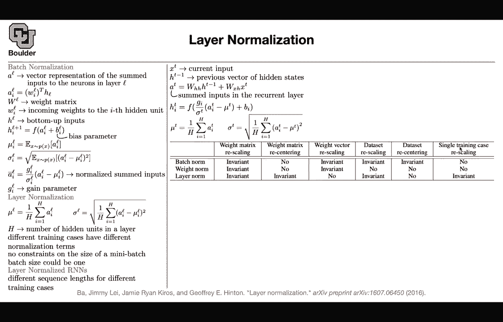
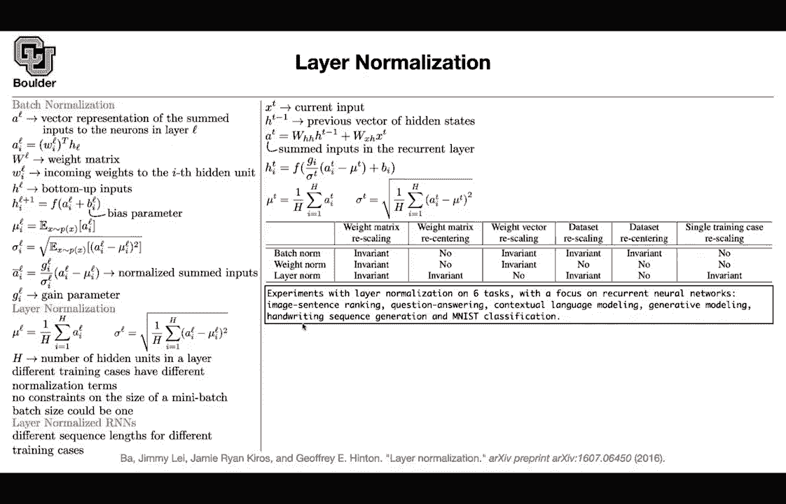

# P132：L63.2- 层标准化 - ShowMeAI - BV1Dg411F71G

The next paper that I want to go through is a technical one these are usually useful these normalizations when you go and sit behind your computer and we have a good idea it's a good mathematical idea you take it to the computer and it's not going to work and it's usually these types of details that are really important that are going to help your algorithm convert or the training process succeed we use layer normalization when we were doing the attention and transformer models but actually layer normalizations are introduced for recurrent neural networks and let's go through that and see why you cannot do batch normalization when you're doing recurt neural networks so let's start with batchsh normalization I'm going to go through a very simple neuron network it's actually a neuron of a neuro network and let's introduce some notations let's say AL is a。

Vctor representation， so AL is， first of all， a vector its a representation of some of。

Summed inputs to the neuron in layer L and I'm going to tell you what it is why we call it summed inputs so L is for the layer a is a vector Each entry of that vector is going be summed because there is gonna be some dot product here and that product is going to give you some summation of some weights times times the input to that layer so this is a vector this is a scalar HL is also a vector and these WIL are coming from your weight matrix I don't know these are rows of your weight matrix and these are basically the connections these are the incoming weights to the I hidden unit so I is going to be the I hidden unit L is going to be the layer that you're currently at W IL is a vector and it's going have the same size as your input so H is your bottom up input is a result of the previous layer。

And then not only you do some multiplications， some weight multiplications。

 you are going to add a polyester to each single hidden unit and then you push it through a linearity that's going to give you the output of your neural network so that's a very simple one it's fully connected and then that's going to give you L plus one now you're ready for the next layer so this is going to be your new L and then you keep doing the same thing and then we are going to do batch normalization without batch normalization many of these deep neural networks are not going to converge。

And the reason is internal covariate shift because once your parameters change the statistics of the inputs。

 the statistics of these guys are going to change once you optimize during your training as you optimize these guys as you update them the statistics of these sum inputs are going change their mean and standard deviation are going to change and then somehow and sometimes theyre going to fall in the regime where your activation function is going to saturate or kill those activities so normalization is very important to make your method stabilize。

 so whether you're going to do each one of these activities they are going to depend on the batch that are going in they're going to depend on your data so let's take a mini batch push you through your neural network and then that's going to give you a bunch of numbers you can take the average of those numbers so this averaging is with respect to your data。

It is not with respect to I， it is not with respect to L。

 so it is with respect to your patch and the bigger your batch。

 the more accurate this statistic is going to be。Okay that's going to give you a mean this is gonna to give you a standard deviation again this is a standard deviation we respect you the data not I and L so you compute those to a statistics and if you normalize your AI you normalize your sum inputs you subtract the mean divide by the standard deviation but then if you do that and if you forget about this coefficient here this term is always going to have a mean zero and a standard deviation of one so there is not going to be much learning going on because the scale of these these activities is always going to be one so not much learning is going go you're always normalizing to counter that effect you're going to introduce some new parameters so these parameters you're going to learn these are the scaling parameters these are learnable mu and sigma they are computing so you're computing them and these bias term is also learnable that passion normalization and。

G IL， you cant call it the gain parameter So what is layer normalization then first of all。

 what is the problem with this method if the batch size is very small and sometimes it has to be very small whenever you're working with videos or whenever you're working with large language models like transformers they are going to consume a lot of memory so you're bound to make your batch batch sizes small for your model to2 feet on your GPU otherwise you're gonna to get memory errors so your batch sometimes has to be small and if it is a small these statistics are really bad so it would be good to have a normalization framework that doesn't depend on the batch size that is capable of working with batch sizes of one So what is the difference now rather than computing your mean using your the statistics of or the distribution of your。

Data or your mini batch， you are going to compute your mean by averaging over the entries of your vector over the elements。

 So now your summation is over the elements is's not over the data and each one of these A's as I mentioned they are vectors and they are going have they're going to be in H dimensional they're going to be in RH you compute your statistic based on your elements based on the elements of your vector Sam thing for your standard deviation So you're doing it based on I and as I as you see these numbers they don't depend on I anymore previously they did me I sigmi and H is the number of hidden units in the layer。

 the dimension， what happens different training cases。

 different data is going to have its own independent normalization term So every single data So this is this statistic is going to be data dependent for instance。

 if an image goes in。

This is going to be dependent on that particular image if a text goes in that's going be the statistics of that text etc or that particular sentence and you have no constraint on the size of a mini batch now your mini batch could be as big as you want or as small as you want as small as one Why is this useful they're particularly useful for recurrent neural networks and can somebody think of a reason why recurrent neural networks Why do we do recurrent neural networks in the first place what happens to our data what type of data do we have sequential data Yes so you have sequence data and each sentence can have its own length okay and we know that recurrent neural networks the depth theyre going to be deep in time and the depth depends on the sequence length maybe the first few layers of your neural networks your recurrent neural network you are fine you can compute these statistics based on the data but then the last。

s sometimes they disappearappear because one sentence was shorter than the other sentence and so these statistics are going to be less and less accurate as you go deeper in your network why because they depend on the data and the data they have their own length and and a recurren neural neural network is as deep in time as the depth of your as the number of elements in your sequence So does that make sense perfect and that's the reason different sequence length is for different training cases。

 basically you have different depth for different training cases， even if you pat them with zeros。

 then your statistics are going to be not accurate it's just a bunch of zeros being pushed through your network okay these are statistics the deeper you go So L is now going be your data dependent so the deeper you go you have less of these data to work with most of them are going to be zero if you are doing zero padding。

they don't just exist so these statistics are not going to be accurate so how do we do layer normalization for a recurrent neural network then you have your current input at time T you have your previous input These are your hidden states these two are vectors for a recurrent neural network the simplest version without any fancy activation so no LSDM no GR you take the previous hidden state multiplied by a matrix you take the current input multiplied by a matrix now they are going have the same dimension after multiplication and then you add them up so now your summed input is going to be different from what you had before slightly different Whatever were going to do we are going compute the mean and the standard deviation and then subtracted element vice from these vectors the mean is going to be done over the dimension of these vectors。

 the standard deviation， the summation is over the dimension of these vectors and these are batch independent and each day。

is going to have its own mean and a standard deviation you can have batch size of one to work with and layer normalization is particularly useful for sequence models and it's much less useful when you're doing images so for images people still use batch normalization for reccart neuralural networks and language models。

 transformers you see layer normalization。

So let's see some invariances for batchsh norm weight norm and layer norm weight norm is another technique for normalization that one is also batch independent you can work with batches batch sizes of one what happens is that whenever you have a matrix or whenever you have a vector of weights you are going to divide it by the norm of that vector so if this is a vector you're going to divide it by the norm of that vector and that's going to normalize your weights so batchsh normalization weight normalization layer normalization they are all invari to recaling your matrix your weight matrix if you take this matrix actually this matrix here multiply by a scalar then what's going to happen is that these mean and standard deviation that yourre computing they are going to scale by the same number by the same scale and so they're going to just cancel out when you do your subtract subtraction。

D because this has the same scale this has the same scale There is a parameter curve， for instance。

 alpha coming out and then sigma is scale by some scale alpha alpha and alpha are going to cancel out so theyre going to be invariant to weights and you're going have somewhere invaris like if you reenter your weights these two are not invariant to weight reentering this is invariant reering is just your subtracting a bias from your weight So you're subtracting a scalar from your weights Each vector you can rescale each one of these guys you can rescale the previous one you are recaling the entire matrix now you can rescale each one。

 each one of your rows independently batch norm weight norm or invariant layer norm is not if you rescale your data multiply it by make your data bigger batch norm is invariant layer norm is invariant and weight norm is not and this is actually one of。

The reasons why normalization works， because now you can the scale of your data doesn't really matter。

If you recententer your data shift to the left or right batch norm is invariant。

 these two are not so you have to be careful you cannot shift your data and then single training case rescaling if you take a single training case and rescale it layer norm is going to be invariant those to are not going be why am I including this paper here because the main application that they have in the paper is for pairs of images and text so that's multimodel you can have image sentence ranking this is the retrieval task you can have question answering contextual language modeling generative modeling handwriting sequence generation and M classification so you get the worst performance on MIS because these are images so layer norm does't work that good for images for the retrieval task adding the layer norm this is a technique that we are not covering in this paper in this class but let's assume you。

That technique you can plug in layer norm and then that's gonna to make your network train much faster。

 same thing here。 we can have different measures。 recall that one recall that5 recall that 10 and these are coming from images and sentences this is a retrieval task these are coming from the Microsoft Coco data So if you want to explore this that's a good data set to explore you can apply it to another for reading comprehension so that's LsDM without any normalization that's how much time it's going to take it to train this is your validation error。

 if you add batch norm that's what's going to happen if you add batch norm everywhere not only to your LSDM。

 but if you have any fully connected network etc。 that's going to give you that result and layer norm is going to give you the best and you're doing it only on your LsDMs Okay any questions before I move on to the next topic。

