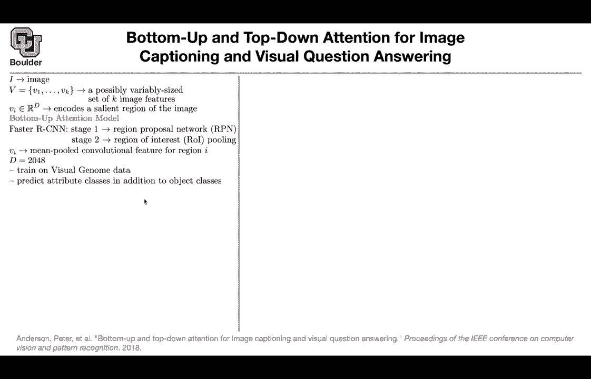
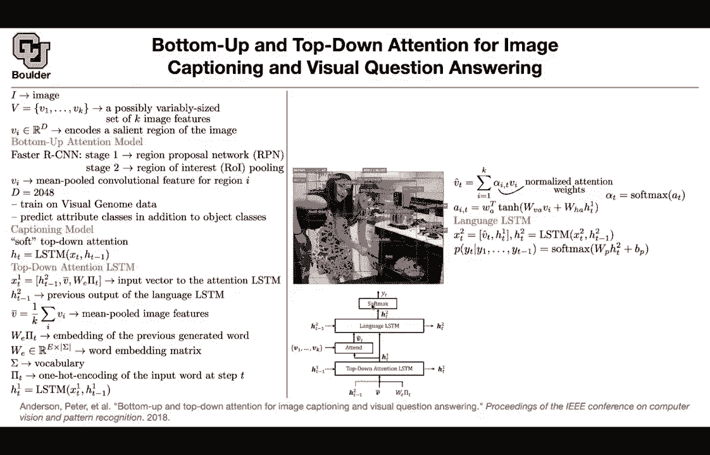
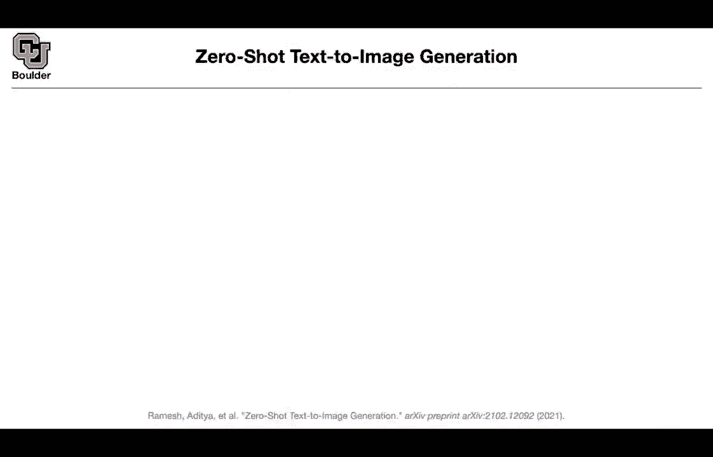

# 【双语字幕+资料下载】科罗拉多 APPLY-DL ｜ 应用深度学习-全知识点覆盖(2021最新·完整版） - P133：L63.3- 视觉问答 - ShowMeAI - BV1Dg411F71G

So I'm going to do another image captioning and actually visual question answering we learned about it when we were doing show until tell show at 10 until here's another attention and it's going to be both top down and button up and I'm going to tell you what is button up we take an image and previously we were taking that image it was 256 by 256 by3 we were pushing it through a convolutional neural network and let's say in the end you would end up with another image that is 14 by 14 by I don't know 512 so you increase the dimension of your pixel you made them from3 to 512 and then you reduced the resolution from 256 to 14 now you have 14 times 14 numbers to work with and that was your K now here we are going to find a different approach to giving us k and these。

So we want to turn an image into a set of vectors。 whatever we're going to do。

 we are going to call an object detection system。 So these we cover in part one of the course so let's say you call fast star CNN fast our CNN has two components One is a region proposed on network So it's going to propose what regions to work with and then as soon as you have your regions the next stage is that you are going to pull those regions into a vector because these regions could have different sizes and then you are just pulling them you are just taking the average of those vectors So it has two stages but don't worry about it we go through the details in part one here it's a black box that it's going give us bounding boxes。

We take those bounding boxes and then we average those vectors so let's say you have a bounding box around an object that's going to have a height and a width maybe in this time it's going to be 24 pixels long and 12 pixels white you take those pixels they're going have dimensions of their own they're going to be d dimensional and then you compute the average that's going to give you one vector for that particular box and then you are going to have multiple boxes per image that's how you're going to get your set of vectors and let's say these is 248 dimensions this is coming out of your neural network your c how do you train it you're going to train it on visual genome data that one I want you to explore。

And then not only you're gonna predict the object， but also you're gonna predict the attributes。

 What do I mean， let's take this image as an example。

 so not only you are predicting that this person is a woman you are predicting that this person has long hair not only you are predicting that that's a glass you are saying that that's a black glass that's a white outlet this is a green bottle this is food and these are your boxes so each image is going to give you many boxes and each box is going to give you a vector and then you are going to have K vectors perish image so what is going be our captioning model its going to be now that you have these vectors and they are coming from a bottom up framework so bottom up it means that you have your image and then you vectorize it you turn it into a set of vectors using using an object detection system now we want to come up with our captioning model in the end and image goes in and we want to know the corresponding cap。

We want to out the text。 We are gonna to use LSDMs。

 but the input to the LSTM is gonna to be different。 let's see what that is going be。

 So now I'm here there is gonna be two stages。 there is gonna be a language LsM and then there is going to be a top down attention LSDM and this is just to give you a big picture of the method I'm going keep referring to this figure as we go through the math so let's do these top down attention LsDM X is gonna to change now your language LsM has its own hidden states and let's say the hidden states we are gonna mark them with a two on top of it so that's how you index it that's the language LSDM it has its own hidden states and this are vectors you take that that's an input that's part of your x v bar is the average image so it's the average of all of these vectors and you already predicted one word and you want to predict the next word this is the1。

Encoding of the word that you just predicted and then you're doing a word embedding So this is the previous end state I just mentioned that v bar is the average of those vectors in your set that's the embedding of the word that you just generated and this is your word embedding matrix Sigma is going be your vocabulary the absolute value of the sigma is the size of your vocabulary is your embedding dimension that's a hyperparameter you choose and pi T are the one how the encoding of your inputs or input word and then you have your eestian It is the first eestian so that's the top down Eestian and basically these eesttian is paying at is paying attention to the average vector in your image then the attention mechanism is going to come in when you' are doing your language eestian You have an attention budget of one you're going spread it among your image among these boxes how much attention should I pay to the face to the food。

the outlet， etc。 And then we are gonna know that it's gonna to have a softmax And then whenever you're paying attention you take the hidden state of the LM at that particular location that you want to predict at that particular time and then that hidden state needs to pay attention to all of these vectors So there is gonna be V and H So I see that there are some of you following some tutorials online especially there is a pi or tutorial online and you're implementing their attention not correct So always for your attention。

 it's the hidden state of your LM and then the encoded part it's either an image or a text etc。

 so be careful don't follow those tutorials blindly so you have to be careful and then that's going to give you some scores that you can push through your softmax you turn them into numbers that add up to one and your language a Ln this guy is gonna。

hass input your V hatt， it is this term here and then it's going to take the previous hidden state of H1 from the LSDN below and then the output you want to predict the next word you have a softmax of the size of your entire vocabulary and then you can write down your likelihood this is the chain rule for the probabilities and then you're going to have an objective you're going to have some ground truth。

 this is your label this is your correct caption for one image and then you're going to have this last function per each image per each pair of image and caption and this is going to give you a crossantropy and basically you are taking the log of this term up there and what is the outcome you can say two men playing Frisbee in a dark field and then you want to focus on you want to say if I take the word Frisbee where in the image you are paying attention to or then。

Network is' paying attention to basically you are reading of the maximum alpha I T you know T T is your Frisbee I is gonna to be one of these boxes and then the biggest one is where you are attending the most it's going to be attending on the Frisbee and then you can also do question answering。

 What is a task and image and a question goes in you know the corresponding answer because now you want to visualize where you are attending So youre giving it the answer and then you are asking the network whatever you're thinking where are you attending to and the network is attending to the stove here and that's why the answer was a kitchen but how do we do visual question answering。

 It is different from captioning for captioning， you have an image。

 you push it through your neural networks and then that's going give you the corresponding caption here an image and a question are going to go in and an answer is going to come out a probability of the correct answer is going to come out So how do you model thiss let's say you have a question that is。

14 it's a sequence of 14 numbers， 14 integers because you are tokenizing this sentence so that's going to give you 14 integers the first stage is you do your word embedding you turn your sequence of 14 integers to a sequence of 14 vectors of 300 dimension you do the same thing for your image you take your image you push it through your faster or CNNn and then that's going to give you k vectors so it's going to give you k vectors and each one is going to have these dimension and then again let's go back to the word embedding you take those word embeddings the outcome of the word embeddings that's going to give you a sequence of vectors。

 you take the sequence of vectors， you push it through a GRU unit or GRU network and that's going to give you a sequence of another vectors of different dimension so it's going to be 14 by 300 that goes in and。

Perhaps 14 by 512 is going to come out。 But then we are going to take the last element or the average of those outcomes that's going to give you a single vector that is 512 dimensional So a vector that is 512 dimensional is here and that vector you're going concatenate this with these features the image features you are going to do some weight multiplication some non nonlinearity and then another weight multiplication and a softmax and that's going to give you how much attention after the softmax these numbers are from zero to one and they add up to one that's going to tell you how much attention to pay to each one of these boxes to each one of these k boxes you add them up so that's basically this operation here that's going to give you a single vector that is 2048 dimensional you first correct the dimension add a non nonlinearity on top of it now you have a vector coming out of your GRU that is。

512 dimensional after multiplying by a matrix applying a nonlinearity you get 512512 they have the same dimension now you can multiply this is elementwise product then you're gonna do one other matrix multiplication non nonlinearity matrix multiplication and a sigmoid to turn these numbers into probabilities and this is basically this core for each of these answers so your answer could be keyin etc and then you have multiple options that's going to give you the correct answers so that's another task it's different from image captioning Can I ask a question Sure so are there a fixed number of candidate answers is that what this is saying Yes so it's a multiple answer questions so it's multiple choice could you do something where you like something similar to the captioning where you just look for words。

In your vocabulary that you think answer the question， Yes， so you could do that also。

 you can treat that as a generative model， you can do that。

It's exactly what you are doing with language models or even the image captioning so you keep predicting the next word and other ways when you predict the start and end of the answer in a paragraph。

 that one is also question answering Okay， but this is the simplest one Okay any other questions Okay perfect。

