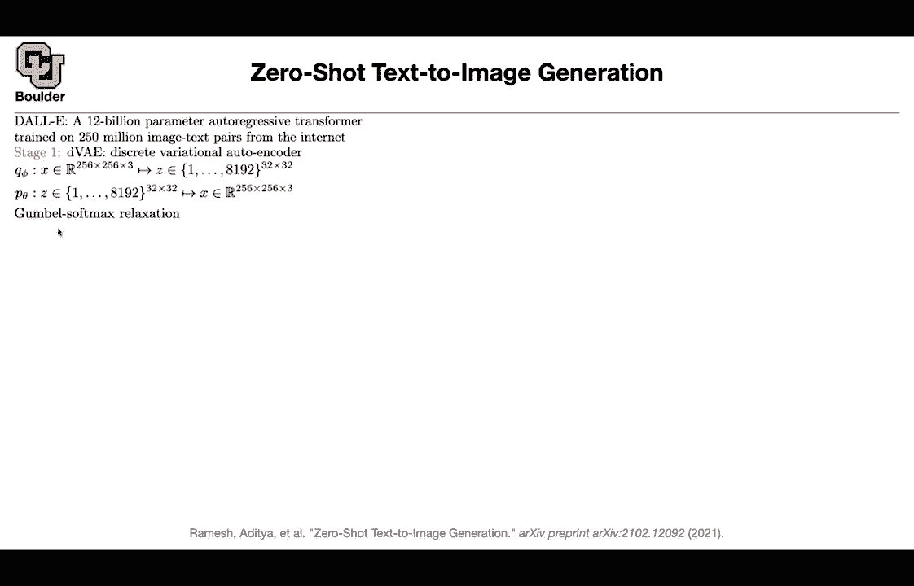
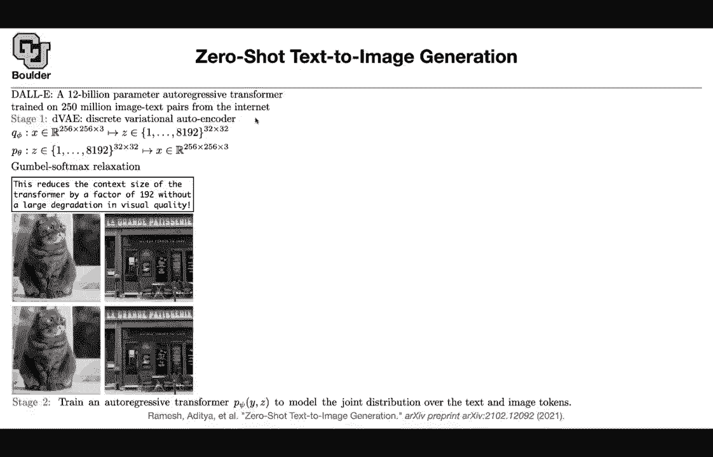
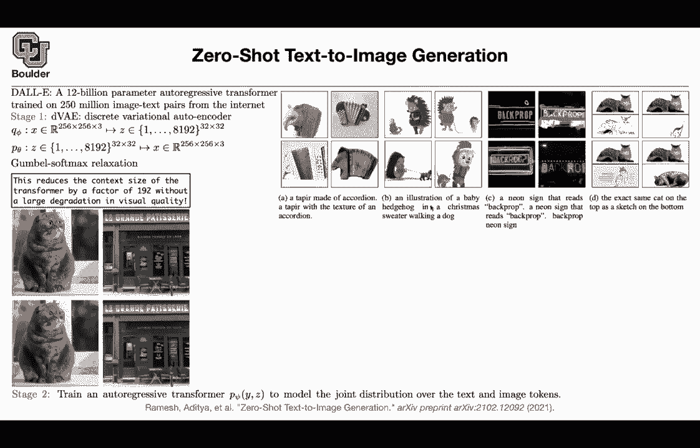
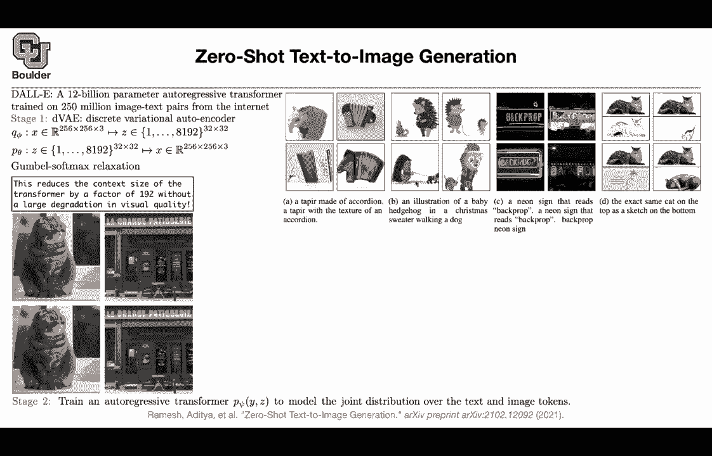
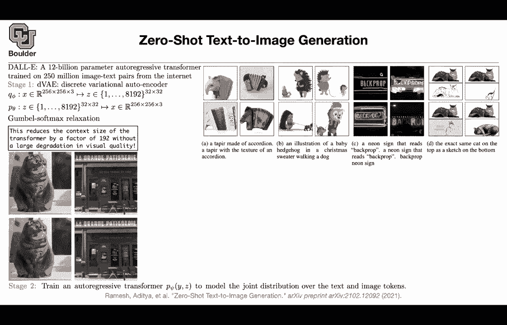

# 【双语字幕+资料下载】科罗拉多 APPLY-DL ｜ 应用深度学习-全知识点覆盖(2021最新·完整版） - P134：L63.4- DALL-E - ShowMeAI - BV1Dg411F71G

The next one is very recent， it's actually a paper that came out I guess this week or the previous week and this is for zero shot text to image generation it's from openaiI and you can see that this is an extension of GPT3 and the problem with GPT3 was that if it's talking about something it has never seen such a thing before for example if it is talking about an airplane it has never seen the image of an airplane so it's only learning it from text and as you can see the state of the art is moving towards combining text and images I'm sure you have heard of this or it's do the method what is that it's a 12 billion parameter autoregressive transformer so you are taking a transformer it's an autoregressive transformer it has a lot of parameters and because it has a lot of parameters。

 you are going train。A lot of images or pairs of images and text so basically are're scraping the web the entire internet that's going to give you your data it's a lot of data and it's a lot of parameters but the method is very simple it's an autoregressive transformer the only catch is that for text we knew how to tokenize it we are a dictionary and we would just look up the ideas of those words that's going to give you the integers how are we going to torkenize an image if you tokenize an image then your problem is going to be solved so our problem is to turn an image into a bunch of tokens basically treat an image as if it's a sentence and then once you have that you can apply the decoder part of your transformer predict the next word or predict the next token and we' going to start generating text and images how are we going to torkenize it we are going to use discrete variational autoencoder so don't worry about variational autoenderrs that's actually。

The next paper that I'm going to go through， it's going to be next week， actually next session。

The discrete part is because we want to turn an image into a bunch of integers and that's why it's discrete I'm not going to cover discrete in this course but the extension is very single once you learn variational auto encoders you're going to know how to discrete it how to make a discrete whether were going to have we are going we are going to have an encoder that's going to take an image that is 256 by 256 by3 and then we are going to tokenize it we are going to have 8192 tokens and rather than working with 256 by 256 by3 it's a lot of numbers to work with it's a lot of context because if you flatten that vector that's going to be a very long context and we know that transformers have limited context so that's a very big huge context we cannot work with that so we want to turn that into 32 by 32 tokens okay。

Actually this is your context this is the number of tokens that's your context and that's gonna to be a smaller context Now you can work with them that's the encoder the decoder is gonna be your prior it's going to take you from these integers to the power 32 by 32 to images and then the way we are gonna to learn about variation auto encodeder but so don't worry about it this is the variational distribution。

 this is your prior distribution and discrete because these numbers are discrete they are not continuous and because they are discrete we are going to use something called gamal softmax so it's going to make those numbers it's going give you probabilities it's a continuous approximation of discrete probabilities so that's you can read about it so that's not a big deal what did we just achieve our previous context was very big it was 256 by 256 by three now we turned it into 32 by 32 This is 900100。

92 times smaller in terms of your context so you reduce the context size and then if you have an image you can reconstruct that image using this framework and then yes you're losing some information the image is becoming blurry but then it is still looking good I mean you didn't take the foot of the cat and put it on top of the head of the cat so the image makes sense as a whole so that's how you summarize your tokenize your image now your image is a bunch of tokens is 32 by 32 tokens that's your context and these are your tokens now your image is a sentence and that's the vocabulary size for your images so now your image is a sentence perfect now that it's a sentence you can take a pair of an image and the corresponding sentence so now this one is also is actually a sentence because youre doing text and images why。

Is going to be your text Z is going to be your image you concatenate them that's your training data and then your task is predict the next word。

 predict the next token given the history given the context predict the next token that's your transformer and we were doing it all the time This was exactly GPT3 you train it and then some cool stuff is going to come out if you condition on a tap here made of accordion these are the images that are going to get generated so it's starting to imagine imagine imaginary images。

A baby hedgehog in a Christmas sweater walking a dog and these are the images that the network generates a neon sign that reads back prop so that's your sentence that you're gonna condition on and that's going to generate images like this or you can do image to image translation and if you want to generate images that look more realistic they're not imaginary you can say let's condition on a very cute cat lay by a big bike this is the actual ground truth this is one of the images in your training data and this is what the network is generated this one looks very good China Airs plane on the ground at an airport with baggage cars nearby so that's an image that is generated by this method and etc a very cute giraffe making a funny face I think I'm gonna stop here and for those of you who have questions you can ask and for those of you who want to leave we can leave I' be。

I had a question Sure so you take an image and you convert it into 32 by 32 not filters like 8192 of them every image yes。

 so every image is going turn into 32 by 32 integers from one up until 8192 so that's your vocabulary size for your images I didn't quite catch that so that's fine。

So let's say this is your image and each image is going to have a pixel。

 am I correct and each pixel is going to have three channels， red， green， blue。And those red， green。

 blue are usually a number from zero to 255， but these are real numbers， you can quantize that。

Maybe to integers or to whatever that you want then that's going to be a way that you are tokenizing your image okay that's fine yes each pixel and each color of your pixel we can represent it I don't know by 256 numbers integers but then that's good there is a problem if you do that you're going to have a very huge context because in the end whatever you're going to do you're going take your image and flatten it okay。

That's gonna to be a lot of numbers to work with it's a huge context and transformers cannot work with that huge of a context so it's better to reduce the context so it's better to reduce the pixels 256 by 256 to three to be 32 by 32 that's your context but then now you're allowing it to have a bigger span for the type of numbers that could happen Okay so so it doesn't have to be from  zero to 255 it could be from one up until 8000 so and these are convolutions so you do some convolution operations and this is also some convolution no sense and then we just use it variational autoencoder with the sentences Yes so this great variation of autoencoder was for you to turn your images and tokenize them that's the only purpose here okay once you're tokenized。

Each image you can treat that as a sentence and then it's just a task of sentence to sentence translation from that point on。

 is it a sentence I don't understand that？Oh， how is this a sentence， it's a sentence。Actually。

 what is a sentence it's a sequence of words so it's a sequence of integers am I right Yeah so you saying it's a sequence of pixels so yeah this is exactly a sequence of integers it's 32 by after you flatten it it's gonna be 32 by 32 that's the length of your sentence and these are the words that could appear these are the tokens in your sentence。

So does that answer your question yeah yeah I guess it just doesn't look very I know I mean it's impressive just we see the new things about it in comparison to GP other than just reducing the size So yeah in comparison to GT3 the only new thing that you're seeing is taking an image and turning it into a sequence of tokens as soon as you do that your images or sentences basically they are going to be equivalent you can treat your images as sentences and then your task is text to text translation rather than text to image that makes a lot of sense and then it's also a matter of scale like 12 billion parameters and 250 million images and text so collecting the data is a big task that they do in this paper yeah。

