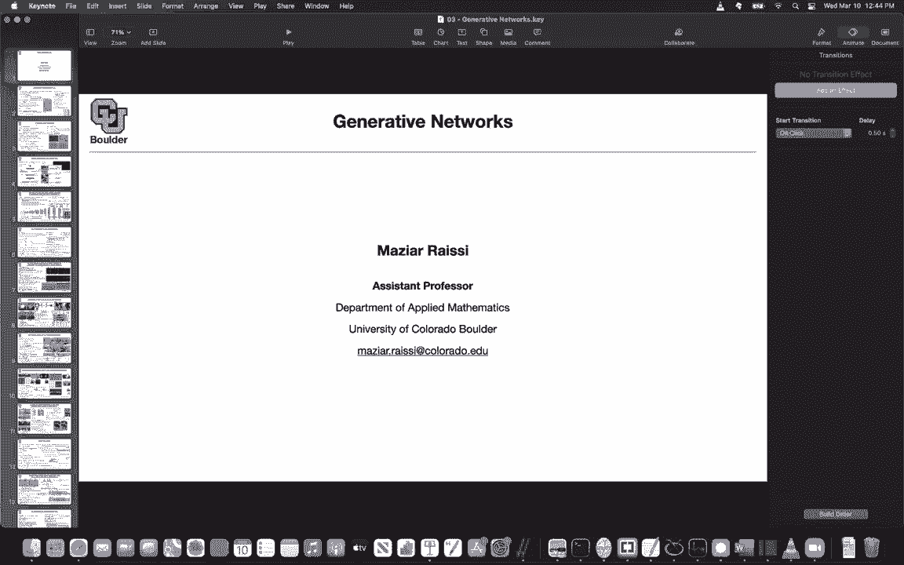
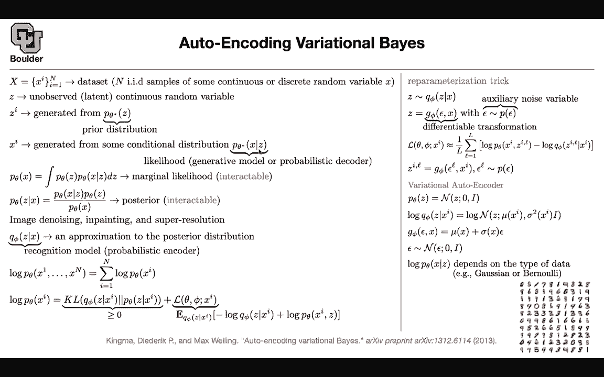

# 【双语字幕+资料下载】科罗拉多 APPLY-DL ｜ 应用深度学习-全知识点覆盖(2021最新·完整版） - P135：L64.1- 变分自动编码器 - ShowMeAI - BV1Dg411F71G

Last session we stopped here we actually finished this paper and the idea was that we wanted to translate text to images so previously we were captioning which was translating images to captions to text here it was if I give you a text can you give me the corresponding image and you were generating images and this was the first time that you were generating images and we introduced a couple of techniques。

 the technique that we used was that we wanted to turn our images and tokenize it the same way that we were tokenizing our text and if we managed to do that we can actually use an autoregressive transformer to generate images for us。

So the problem boiled down to taking an image and then turning into torkens。

 so basically torkenizing it and the method that we said we are going to use was variational auto encodecoder and in particular discrete variational auto encodecoder because we wanted Z to be discrete。

So today I'm going to continue with variational autoenrs and actually you can use variational autoenrs to generate images so you can one application is to take your images and tokenize them and another application is generate use it as a generative model to generate images so let's continue with that we are going to stick to generative networks for a while and i'm going to start with variational autoenrs so what do we want to do so i'm here we want to generate images that look like numbers that look like them these data so these are fake images and we want to generate images that look like。

Real data so what do we have we have a data set This is unlabeled so now we are in the regime of unsupervised machine learning。

 you have a bunch of data there is no labels for them these are IID samples from some distribution this distribution could be continuous or discrete so there is some distribution in the real world that is generating these images and we are sampling from that and that's the real distribution that's a distribution of the real data and our task is to learn that distribution or try to learn that and appd and once you do that it can generate samples that are going to look like real data and i'm going to tell you about the applications in a few lines but for now that's our objective somebody gives us unlabeled data these are IID samples from a continuous or discrete distribution and we want to generate samples that look like this or basically you want to learn the underlying。

bution of your data Okay， because we want to use neural networks。 neuro networks need an input。

 And that's why we are gonna to say， let's say there is some unobserved and latent continuous random variable Z because then this could be the input to our neural network。

 We don't know what that is。 but let's say there is some unobserved random variable in the previous paper that unobserved random variable was discrete because we were using it for tokenization purposes here is continuous So if I tell you the continuous version。

 it's gonna to be very easy for you guys to extend to to discrete cases。

 So let's say Z is some unobserved， you don't observe it。 You don't have any observations on that。

 You can generate samples from some prior distribution samples of Z from some prior distribution。

 So whenever I say a prior distribution， This is an assumption that you make So you have freedom to choose whatever。

You want here this could be normal distribution this could be uniform distribution or whatever distribution that that you like okay you can generate samples from that then there is also your likelihood this is where you're going to put your neuraln network Z is going to go in and X is going to come out for instance a vector is going to go in and an image is going to come out the image of a number and that's going to be your conditional distribution your likelihood and this is usually called your generative model because you're generating you're using it to sample。

And this is a decoder because it is decoding， maybe it this is your code and then you're decoding an image out of it。

 so there are various names for this。But in the end what you're interested in is this guy。

 your marginal likelihood， you don't care what z is。

 you want to learn the underlying distribution of your x。

 your data so Z was there just to help you out so we need to marginalize it out you need to integrate Z out and that's going to give you a marginal likelihood and this is the guy that you're going take a log and try to maximize okay so you're always looking after this guy you don't care about the likelihood you don't care about your prior distribution。

 you care about the marginal likelihood because this is the one that is going to give you the objective function to maximize but there' is a problem with that this is intractable if this guy has a is a neural network。

Then it's going to be a nightmare taking its integral with respect to some prior distribution and if this is normal distribution。

 this is going to be intractable to compute in a similar way your posterior is going to be intractable to compute because PR Theta is showing up here this is tractable guy the likelihood you can compute the prior distribution you can compute the marginal likelihood you cannot compute it's intractable and the posterior is also intractable so we need to somehow get rid of the posterior and what we are going to do before I go into the details of how we are going to solve that problem I promise that I'm going to give you the applications it could be image denoing in painting super resolution the super resolution one as applications in video games so it's going to help you transfer maybe low resolution images to your users and then perhaps on their computer turn those。

Mmages into high resolution and show them high quality images or high quality video。

 So this has real applications。 So our problem is this。 this is intractable。 this is intractable。

 So in painting， the question is what is in painting for in painting somehow do you remember these old images that somehow some part of the images is not showing is removed and you want to imagine what's going happen in that part。

 Okay that' that answer your question Yeah perfect。 So this is our problem。 We don't our posterior。

 whenever you don't know something you're gonna to approximate it So let's try to approximate that your posterior with a distribution。

 So it's gonna take your input， your images and it's gonna to encoded。

 So this is now going to be encoded version of X and this is your encoder and you can actually think of it as probabilistic encoder because this is a distribution and this is an。

Exximation to your posterior。Okay， so we need to somehow get rid of this P and replace it with Q and this guy has its own parameters。

 it has its own fees， and I'm sure you guessed it you're going to approximate this by and run network。

Okay so there is gonna be one neural network here， there is gonna be another neural network here one is the encodeder。

 the other one is the decoder we made an assumption here we made that these are IID samples from some distribution so these are independent and because they are independent the likelihood of your entire data is the product of its members so this is just a product of P of theta Xs you take a log you turn the product into a summation and that's going to give you your objective function that you want to optimize so we just took a log of this guy so now let's focus on one sample at a time this was the entire data set now you can focus on one sample at a time so let's focus on this term that term is gonna come out of the definition of your posterior distribution and this marginal likelihood definition basically what you're doing is。

You multiply and divide by Q of V and then rearrange the furniture so that your expectations are with respect to Q of V so this one i'm going to leave as an exercise it's very easy it's just rearranging the furniture and if you run into trouble there is a tutorial that I put online you can take a look at that so you arrange the furniture log of P of theta X I is now the KL divergence of Q of V P of theta。

And then a function of theta P and your data Okay， now the cool thing is that this is a divergence。

KL diversion so it's a measure of your distance distance between two distributions。

 so it's always not negative and this is the only term that your posterior is showing up in so this one is just a joint distribution。

 which is the product of your prior distribution and likelihood so this term you know this term is some assumptions that you made this is your encoder。

This I'm going to tell you how to sample from this distribution next because you need to turn this into Monte Carlo and not approximate it with Monte Carlo method。

 but this term is the only one that is having a posterior distribution because this is positive or non- negative you can get rid of that why because if you get rid of that this term is going to give you a lower bound for your log likelihood if you maximize this you're going to maximize the other term you're going to maximize your likelihood so this term you can get rid of and you're going work with this L the lower bound Okay now our problem is trying to sample from this guy because you need to estimate it using Monte Carlo method so you need to be able to sample from your variational distribution so this guy is called variational distribution and that's why you have the variational name in the name of the paper okay so now we need to sample from this how we're going to do it there is this reramal。

ization trick What is the idea You want to sample from Q of V Okay。

 this is a complicated distribution， probably you cannot sample from it。

 but you can sample from an easier distribution maybe some auxiliary distribution so you can sample from that that's your noise model you sample one sample from that you push it through a differentiable function differentiable transformation Why do we need it to be differentiable because you want to take you want to do back propagation when you're doing the maximum likelihood so it needs to be differentiable。

 you generate sample from a simple distribution push it through a function and it's gonna give you sample from your Q of fee so this is a very important technique and we are gonna build upon that to actually get rid of the likelihood in the next papers Okay so now you have this L of p L of theta p X this expectation。

You can have x it by Monte Carlo method so its going be one over L。

 These are the number of samples that you're generating from this epsilon there is going be a sum and then these are your terms Okay you just rearrange this is log of theta X I and Z log of P theta X I and Z and the other term is here okay and what is ZL you have epsilon L which is a sample from your auxiliary distribution you sample from that Why is it a function of I and L because you have your data here。

 this is your image and you have the sample that you just generated and you are pushing it through a function This is gonna be where you're gonna have your neuraln network Okay so far so good this method is very general and and as you can see I'm explaining it in the generic format but if you go specific。

 you put a functional form or you made some assumptions for your likelihood you make some assumptions for your。

variariational distribution then it's going to be called variational auto encodeder and we're going to see what those assumptions are The first assumption is this prior distribution let's assume you' are going to sample from normal we mean zero and a standard deviation one so that's your prior assumption The likelihood i'm going to deal with it later because that depends on the task that you have at hand Now let's try to model this log ofq of V of z given an X you can say this is normal we mean where mu is a neural network it takes an image and it's going to output it's going to encode it your variance you can also put a neural network there so there is also another neural network there。

And this is where the reparametricization trick is going to come in now you need to sample from this normal distribution okay you can actually go ahead and define your G of V which is a function of epsilon and x to be the mean plus the standard deviation times your epsilon and now you sample from a simple distribution your sample from a distribution with mean zero and identity if this is normal then the distribution of this G of p is going to be also normal the mean is going to be mu of x and the standard deviation is going to be sigma of x then now you get this reparametricization trick idea and in terms of the likelihood that depends on what you want to do if your data are in the form of text and we know that you're going to tokenize them then your distribution has to be a discrete distribution。

If your distribution， if your data are in the form of images like what you have in MN then you can make a Gaussian assumption for your distribution for your likelihood and basically this is going to have a mean and a standard deviation a code is going go in and then you're going encode it to an image and that's going to be the mean of your distribution is going to be a neural network okay now you have everything you know this lower bound you're going to maximize the lower bound first you're going approximate it by Monte Carlo method you're going sample from that you're going to maximize it with respect to phi to n p and then you are going to be able to generate samples because once you learn this distribution you can generate samples from your prior push them through your neural network to give you images going to give you fake images and there is another cool thing that's going to happen the Z that you're going learn the hidden state or the unobered or latent。

of your system is going to have meanings for instance you can do interpolation between images you can change the pose so now you're changing your Z or're interpoolating your Z and in the generated images you're going to have poses one of them is looking to the left right straight at the camera and then you can make somebody who is angry or sad to be happy Okay。

 any questions is everything clear would Z just be the digits example Z would be a scale that ranges from zero to9 or is it not necessarily interpretable like that Z is going to be a vector it's a low dimensional vector。

And let's say it is in R 256 so it's a vector that's why it has a mean zero。

 that's a vector and this is an identity matrix so you take an image that is in this case I guess it's 28 by 28 you first encoded using your variational distribution it's 28 by 28 by1 channel because this is only gray channel and then you encode it into a vector a low dimensional vector let's say R 100 and then here you take that r 100 and map it back to your original image so this is going to be a convolution going on this is a convolutional neural network this is going to be a deconvolution and don't worry about the structure of your neural networks because now we are in the regime that we care about the last function okay and this is our last function any other questions okay perfect。

