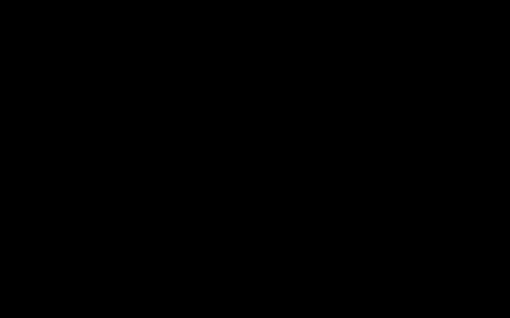

# 【双语字幕+资料下载】科罗拉多 APPLY-DL ｜ 应用深度学习-全知识点覆盖(2021最新·完整版） - P138：L65.1- DCGANs - ShowMeAI - BV1Dg411F71G

Do you have any questions about last session I was curious if we considered GNs a subset of reinforcement learning or vice versa or if they are just。

Distinct algorithms they are distinct algorithms so here you have unlabeled data but here you have data okay when we go to reinforcement learning you have environment that you interact with and then the type of data that you're going have is going to be different over there your data actually your decisions are going to have impact on the data that you're going to see and it's going to have a sequential nature and the data are not going to beI anymore okay because the things that you do give you different yes so you can think of GNs as the inverse that's actually a good idea to think about it this way is as the inverse of what we have been doing so far for instance if you are doing image classification you have an image and then you would put it through a classifier and that would give you the class now you can go there a reverse route you give it a class and you want to generate images。

So you can think of it as a one to many mapping or you can think of it as learning the underlying distribution it has many applications and you're going to see it we are going to do GANs for a while okay thank you any other questions okay perfect in that case let's get it started so last session we stop here with conditional GNs and we saw that it's a simple extension of a regular GNs not conditionitional or unconditional so throughout actually I had in mind to separate conditional GNs from unconditional GNs to have two separate topics。

Whether I thought it's a good idea to go back and forth between them because you're going to see the applications when you do conditional GNs and then we are going to do some improvements on the objective function on the neural networks that we use etc okay so it's a better idea to go back and forth between them now one application of GNs in general is that you can actually use them to learn representations。

So somebody gives you unlabeled data and then you want to summarize that data in a lower dimensional representation vector okay it's hard to work with images that are 256 by 256 by three channels that's high dimensional so it's a good idea to have a lower dimensional representation but we don't want to do it in a supervised fashion we want to do it in an unsupervised fashion we don't want to have any labels and let's see how far we can push that idea the idea is that you're going to use deep convolutional Gs Dg DcganNs so the idea is that you want to go deep okay the previous。

Papers that we covered they were shallower， they were not as deep and if you noticed the type of data that we were working with was MNist or C410 these are much easier data sets compared to INe so now we want to move towards INe slowly and learn our representations from that data but GNs are not stable if you have ever try to train them they are not stable and whenever something is unstable maybe you need to change your neural network basically maybe you need to change your prior maybe you need to change your loss function maybe you need to come up with better training strategies etc so these papers said I'm going try to change the architecture and do a lot of trial and error on the or the architecture and they are kind enough to share with us their findings for the architecture these are the guidelines there is no mathe。

ical reason for why they work or there is not much intuition is's just trial and error change your configuration。

 train yourganNs， See it converges or no change do one change at the time until you come up with a neural network that converges so what are the guidelines these are the final lessons if you have any pooling layers in your discriminator or the generator replace them with a strideed convolutions so pullinging layer is usually used to reduce the resolution of the image from one layer to the next it says that and pullinging layers are they don't have any parameters so they don't add parameters to your network but it tried it convolutions do if you set this stride of a convolution to be two youre reducing the resolution by two This is for the discriminator for the generator you need to go the other way around you want to increase the resolution until you reach the resolution of your of your images and thats that's going be called。

Fraional stride convolution I'm going explain this so don't worry about it。

 I'm going to give you the exact mathematical formula for it。

 We know that batch norm is useful when you are doing classification or discriminative tasks let it be languages let it before images they said okay go ahead and use batch norm in the generator and a discriminator so both of them use batch norm if you have any fully connected hidden layers just remove them from your architecture they add too many parameters and because they are fully connected they are much less efficient compared to convolutions so let's just remove them use value as your activation function for all of your layers except for the last one for the last one you're gonna to use a10h and the reason for that is your images are usually from zero to 255 these are the numbers that are going to show up as your pixel values if you normalize that to be in。

To be in the interval from negative one to one， then your neural network that's going to be bounded from negative one to one。

 you want your neural network to be bounded， the output of your neural network to be from negative one to one that's why you're going to use a10H and then use leak key value as your activation in the discriminator。

 so see some of them are for the generator some of them are for the discriminator。

Maybe for some of them we have intuition for some some of them we don't but this is coming out of a lot of experimentation。

 a lot of trial and error the question is why not real scale to zero1 and use sigmoid you could do that you could use from either negative one to one or from zero to one that part should be fine Does that answer your question yeah perfect the discriminator the architecture is very similar to the generator so the generator is going to go from left to right and the discriminator is going to go from right to left okay of this architecture but let's focus on the generator the discriminator we have plenty of experience with but the generator how are we going to go from a vector that is 100 dimensional to an image which in this case is 64 by 64 by three channels。

So how do you go？The first step is project and reshape and project in deep learning is just matrix vector multiplication so you're going to multiply a vector that is 100 dimensional by a matrix that is 100 dimensional by a multiplication of 4 by 4 by 10024 that's going to give you a vector it's a very long vector and then you're going to reshape it you're going to turn that into a tensor so a vector has dimension one a tensor is going to have dimension 31 to3 then you're going to do a bunch of convolutions so we said we are going to do fractionally stridede convolutions so you're going to do a bunch of convolutions and each fractionally stride convolution is going to increase the resolution so you're going to increase the resolution from 4 to 8 to 16 to 32 to 64 and this part changing the dimension from1 10024 to。

512， for instance， you can do that with matrix multiplication Okay the resolution。

 you take care of it using convolutions and this is just matrix vector multiplication but if you look at this figure from right to left you're gonna notice that this is just a simple convolution with a strip two if you go from right to left you take a window and then you and this is probably a window of three by3 or even two by2 and then you collapse that window into a window that is one by one into one pixel so there is gonna to be an addition over I don't know if this is a three by this is actually a 5 by5 convolution so you take a window that is5 by5 you do a summation over all of those vectors after multiplying by correct dimensions to change from dimension 512 to1024 and then you just add them up that convolution a deconvolution or fractionally。

T convolution is going to reverse route and we know that we needed to do reverse route all the time。

 Why is that even when we were doing usual convolutions。

 we needed to do the reverse route because we needed our gradients that was back propagation so the convolution actually fractionally triive convolution is the derivative of a usual convolution so it's a backward for pass we know about it but we have never seen the formula for it so what is the formula you want to know the pixelel value at this location at location X and y there is going to be some convolution going on there is some addition going on。

 you have some input vectors that are lying here these are because they are vectors this x here is now 1024 dimensional you multiplied by a matrix and the outcome is going to be 512 dimensional。

And then you need to add them up。 The problem is because you're dividing by yourstride。

 This is fractionally asstr it。 many of these values， actually some of these values。

 they are not going to be integers because you're dividing by I don't know maybe two because your astride is2 some of these values are not going to be integers you just ignore them they are not going to be part of your sum h you just ignore them because they don't exist There is no such a pixel at your input So you just ignore it that's fractionally astred convolution and how is it related to the backward pass how is it related to the derivative or the gradients let's take a look at a forward convolution So now you have a convolution you're going from right to left for forward convolution you want to know the pixel value at maybe this location that's basically a vector。

 Each pixel is a vector and this is gonna have a dimension of 1000 to 24 You take a window that is5 by5 or it could be three by3 you。

In this case， nine matrices and then you take your x and where this stride is going to come in。

 this stride is going to come in here because then you' are jumping from one portion of your image to the other portion you are jumping by step sizes of two Okay perfect So that's a forward convolution That's basically a convolution It's a three by three convolution now we want to take its derivative we want to know the derivative of loss with respect to x and how is it related to the derivative of loss with respect to y first of all。

 let's rename this to be x prime。So and let's compute x x is going to be x prime minus I divided by S plus2 and this is exactly what you had here by renaming x to be x prime so it's exactly the same thing for the backward pass the derivative of your loss function with respect to a pixel x is a pixel at location x prime and y prime and remember you are not taking derivative with respect to x prime or y prime they are just indices you are taking derivatives with respect to x you're taking derivatives with respect to pixels not pixel locations there is going be some transpo going on that's going to happen all the time and then there is going to be the derivative of your loss。

 we respect to the pixels in your y okay but this derivative you are computing the derivative of loss we respect to x at location x prime and y prime。

But that location can be impacted by multiple inputs and because this is your total gradient。

 you're adding those numbers up all of these pixels from your y or derivative of your loss with respect to y are impacting the location x prime and y prime So all of these are impacting it now you can see the relationship if you rename the derivative of L with respect to x prime with respect to x to be your new y and let's ignore the transpose if you ignore the transpose that is basically your wij here and this derivative is just your new x at these locations so you're renaming x prime to be x you're renaming the derivative of L with respect to y to be the capital x etc you're ignoring the transpose and this is basically your output derivative So is everything clear so far So there is a question why do you have。

These tools here these two are because you want to be a little bit careful on the boundaries and so don't worry too much about them this is just to make a math work and the boundaries you could pad you could not pad but this is just to make this math work out because if you put you want to know your pixel location your value your pixel values and let's say location two and two then this is going to work out pretty nice two minus two is going be zero。

 two minus two is going to be zero and then you have you're going to have three pixels pixel one and one one and two1 and three and these are going be a window around your pixel2 and two okay so this is just for convenience for the math to work out Any other questions so the idea is that fractionally a tradeed convolution is not a new concept we had to do it even when we were doing back propagation through a simple convolution operation we never saw it because。

tenenssorflower pytorch is doing it for us but it is basically the same operation and it's going to help you increase your resolution from one layer to the next one okay perfect but in the end I promise that I'm going to give you unsupervised representations for images what can you do you can look at your discriminator your discriminator is going to inverse route so it's going from right to left it takes an image and then it's going to downsize it you can take basically what you can do is you can take the last layer that could be your features in addition each one of these guys each one of these intermediate layers you can take them as features as well but if you do that it's going to be a huge vector representation and we don't like that the objective was to reduce the dimension not to increase it so what you're going do is you're going to pull these these windows so you're going to create a four by four window。

Basically you're going to say I'm going to put a bunch of these pixels in pockets or in patches and then pull them just average pull them or max pull them for instance if you have here an eight by eight you want to create a four by four spatial grid and I guess each spatial grid is going to be two by two and you're going to do a pooling on those two by two windows if you have 16 and you want to create a four by four grid each one of those grid is going to have a size of four by four and then you're going to pull that and turn out into a single vector now remember you're going from right to left an image goes in and then you can just read of the features that's going to give you a feature vector that you can now give it to a classifier a simple classifier maybe a logistic regression or a support vector machine if you do that and you compare the framework to other previous state of ya which are unsupervised is。

Actually giving you good features the features coming out of DCgans plus L2 normalized software vector machine is going to give you an accuracy of 82。

8 on CF4 10 images okay and DC G is trained on imagenet and imagenet is a big data set it has 1 million images and then it has 1000 classes C4 10 is much smaller 32 by 32 images and you have 10 labels okay so you can use your feature vectors to represent images and these feature vectors are coming out of the discriminator part of your generative adversarial run network but what can you say about zs that you end up with for the generator What can you say about them Can you play around with Z and then some cool stuff happens to your images let's see what is the objective what can you do。

We are doing addition subtraction and addition in the latent space For instance。

 if you have a man with glasses， you can subtract a man without glasses。

 you can add a woman without glasses and then you can look at the center image here So that's gonna be a woman with glasses。

 This was the final objective。 This is actually what you want to do but there is a catch you cannot do it on any pair of images。

 it has to be done on average， so maybe you sample a couple of images now youre in your hidden space on that hidden space you're gonna average you're gonna average。

 I don't know three vectors and now you take the average of the three vectors。

 you push them through your generator that's the image of the man with a glass with glasses you do the same thing for the other guys so you have to do it on the average and then you do your operations in the hidden space in the Z space you add on subtract and then you're gonna output your images Now the question is what are。

nine ones the center one we know that it's coming out of this operation the other ones are just you can add noise to your Z and then that's going to give you these other nine numbers nine phases because this is a generative process it's a probability Does that answer a question have we got a quick question Are we we doing the subtraction and addition in the space of images or are we embedding them all into the hidden dimension and doing the addition and subtraction in the hidden space and then passing that through the gene of images so no these adds and subtractions are done in the hidden space in the 100 dimension space that makes sense but then you take that and push it through your neural network that's going to give you an image。

Wush it through your generator and you know how to go from your 100 dimension space to the space of images using your generator so you take these images you go to 100 dimension average amount and then go back that's going to give you one image but then you keep the vector the average vector that you came up it and then you take that average vector subtracted add it and then generate images out of it that makes sense Okay perfect so you can do cool stuff using both the discriminator and the generator any questions so far。

