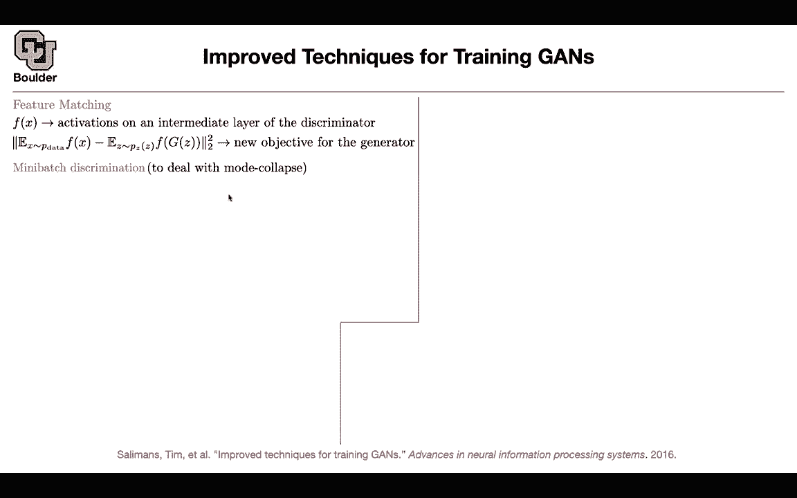
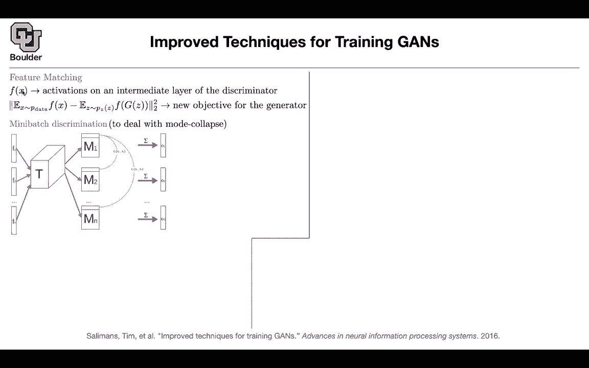
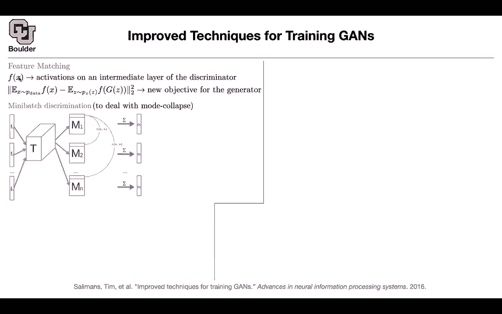
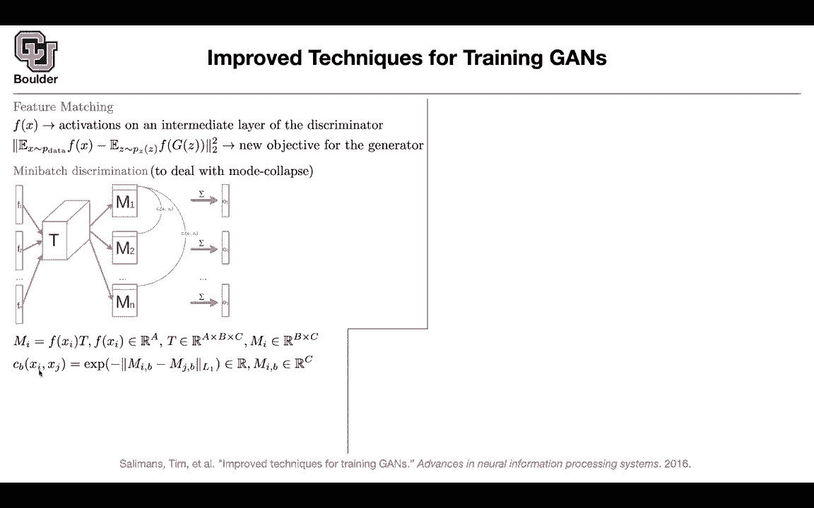
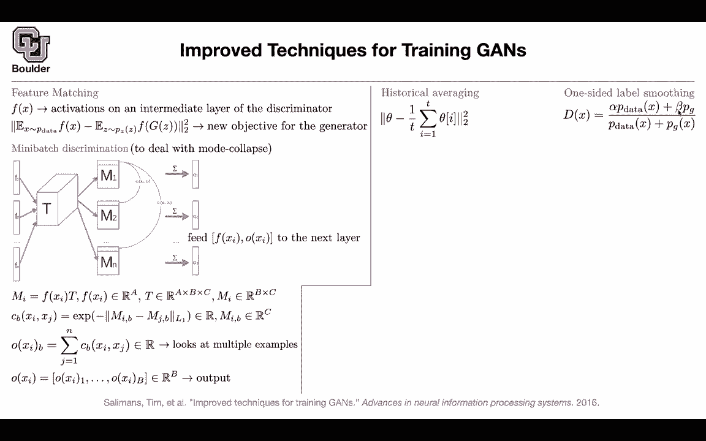
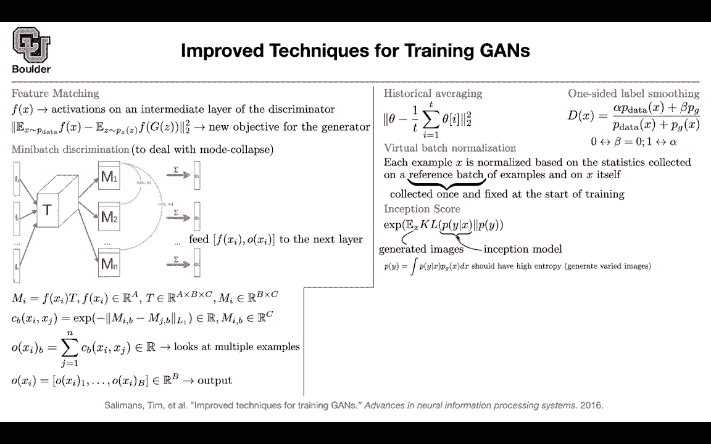

# 【双语字幕+资料下载】科罗拉多 APPLY-DL ｜ 应用深度学习-全知识点覆盖(2021最新·完整版） - P139：L65.2- Inception Score - ShowMeAI - BV1Dg411F71G

In that case let's move on the previous paper was about the architecture。

 so you were changing the architecture of your neural network for your generative adversarial neural network to converge let's see what other stuff you can do maybe you can change your loss function maybe you can do some other improvements so there is a problem with GNs and the problem is。

The mode collapse so your distribution is always going collapse to one mode of your distribution during training and let's see whether you can improve that the idea is that maybe something what's wrong with your discriminator how about you take the features of your discriminator don't treat it as a probability but stop at the feature layer maybe don't go the final mild or don't use the final layer to do discrimination to give you the probabilities stop at the feature layer so this is you take an image it's high dimensional and then your discriminator is featureizing it and it's going to give you a vector look at those vectors and then compare those vectors the ones that are coming out of your data so this is the average on your data and the ones that are being generated by the generator and then compare the features in L2or because these are vectors and then you can do so use these objective function rather than a discriminator okay thats。

One change and these are heuristics so these are ad hoc ideas so yes the L2 norm is just the summation of the entries of your two vectors。

 you're subtracting them from each other element wise squaring them and then taking the square root but actually you don't need to take the square root because this is already a squared okay does that answer a question perfect so to deal with the mode collapse maybe rather than looking at single data point in your training basically rather than each data point being treated as independent objects maybe it's a good idea to look at a batch of data and maybe the other data in the regime can help you help your network pull out of those modes if it's converging to a single mode maybe another data is saying that no go conver to the other mode okay so look at your data in mini batches but this is a nice technique so I don't want。

to get confused by this what's going happen You're gonna to have n data in your mini batch so you're gonna have n images you take those for mode collapse I cannot explain it in this paper。

 but we are gonna to see it over and over again okay I can now just give you the big picture that once you do the training it's gonna maybe the underlying distribution is by model but then Gs is gonna to converge to only one of those modes it's gonna to ignore the other mode but we are gonna to see that over and over again so don't worry about it if you don't get it from this paper you're going to get it from the other paper as that's hand okay perfect so you take your image image1。

 you push it through your neural network and that's gonna to give you F1 you take x2。

 you push it through your neural network that's gonna to give you f2 you take the n image you push it through your neural network that's going to give you fn then there is gonna be some tensor here these are parameterized and we are going to learn them and out of those tensors。

 we are going。

Do some computation and in the end you're gonna to get0102 up until0 N and each one of these is paying attention to all of the other entries in your batch But how do you get that What is the mathematical formula What are you talking about in this figure Okay what is the size of T the size of T is it's a tensor it's a by B by C。

 that's the size A B by c， the vectors that are coming out of your neural network， the discriminator。

 they're going to be in dimension A， let's say if you take a vector that is in dimension A and multiplied by T。

 you are doing a summation over this a entry， A dimension and that's going give you a matrix which is in dimension B by c and these are these M1 and2 up until M n okay perfect now you take entry C1 of x1 and x2 So now you' this is the time that you're looking。

2 data or more data。 So it's going to be x2 and x n or x3 in this case。

 We take the first row because this is x1， you're gonna to take the first row and that's going to give you a vector。

 there is one vector here。 There is another vector here。

 you can compute the L1 distance between the two， you take an exponential， you do a negative。

 So if the distance between two these two entries， these two vectors。

 these two rows of your matrices， they are big， these exponential and in addition to that negative sign is gonna make them go to zero。

 if the distance is big， they are not correlated。 So if two data points are really different from each other just ignore them。

 and let's see what these indices are counting I is counting your data。

 This is the first data being compared to the second data。 So I and J or your data。

And B is the entries of your m matrices so these are the rows okay so you take one row of that and another row here and then you compare them in the end what you get is that these MIBs are vectors they are not matrices these are the rows of these matrices and this is just a scalar per each data per each pair of data and per each row of the M matrix you're gonna to have a number but in the end you are interested in vectors and let's look at the B element of that vector where is that coming from it's coming out of doing a summation over all of the other data you are interested in data I you're interested in the first data but now this is where you are paying attention or youre comparing yourself to the rest of the observations in the data this is a single scalar because these guys very scalrs but this is an element of the output vector so to get the vector you're gonna concatenate those。

And that's going to give you a vector in RB and that's your output Now these guys are not independent anymore What comes up F1 F2 up until Fn are independent。

 but O102 and On are not independent they are looking at each other and then what you're going to do is you're going to take F the features from the previous layer before these operations and01 or O Xi as the input to the next layer so this is mini batch discrimination so another trait is looking at the average of the parameters so maybe keep a moving average of your parameters because once you're doing your gradient descent from one iteration to the next iteration So from one iteration to the next iteration you're going to get your parameters updated。

And because of the noise in your data those parameters could oscillate it's gonna to have a time series just take an average of those you can have a moving average of those the other trick is label smoothing okay previously our optimal discriminator was when it was when Al was one and beta was 0 and that was giving your optimal discriminator but sometimes label smoothing helps it's gonna to make your discriminator a little bit less sensitive basically you're replacing ones with alpha which is a number I don't know maybe 0。

9 and you're replacing beta rather than it being zero you're replacing you with 0。

1 so you're smoothing your label you're smoothing your discriminator but then there is a catch with that if you do that and if beta is nonze and if your generator is making some mistakes during the training。

You are pulling your discriminator towards the wrong predictions okay so whatever you're gonna to do this is gonna to be that's why it's one- sided label smoothing you just smooth the upside rather than it being one you're going to replace it by 0。

9 and you said beta to be zero so that your distribution is not getting pulled towards the mistakes of your generator during training and then you can do batch normalization but what is the problem with batch normalization it depends on the samples each batch that goes in it's gonna to have a different statistics maybe fixing those statistics is going to help your network converge what do I mean you're going to keep a reference batch of examples so you have a reference set of images and you keep them forever you pick them at the beginning of your training and you fix them forever so they are not going to change and this is small this has the size of your batch and then each image that is going。

Going is going to be added to this fixed training set or fixed reference batch that you picked and then your computer has statistics based on that so this is not going to asllate much and maybe this is going to help your network converge better their main reason i'm covering this paper is because of inception score these are all tricks and you're going to need them when you go behind your computer and try to train against because these are beasts when it comes to training them they're not easy to work with them they're not easy to make them converge。

But even if you make them converge how we're going to say that the image that it generated has a higher quality compared to an image that another generator generated one option is to show them to human and the human is going say okay this image looks more realistic than the other image so this is gonna be qualitative is there a quantitative score that you can use the answer is yes。

 let's try to use a neural network that is already trained maybe the inception neural network it's a neural network proposed by a team at Google let's load that。

 it has its own parameters trained on imagenet let's use that let's show our images to that it's inception network so our neural network is going generate some images and we're going show that to an inception network that is already trained and this is a score don't worry about it what you're gonna worry about don't worry about the。

What you need to worry about is the intuition behind the formula。

 What are we doing You keep generating images from your generator。

 you take that image and then push it through an inception architecture that's going to give you a probability of what class this belongs to This image should belong to the category of an airplane This fake image as you showed me should belong to the category of a cat a dog etc。

 and then what do you want out of that if you integrate all of those x is out。

 you're going to end up with some probabilitybabilities you're going to end up with a histogram and they generated images but these are labels you have 10 dogs being generated 10 cats15 airplanes etc。

 you want this distribution to be varied， you want to have a high antropy you want all of these classes to be generated okay now you are looking at the classes you are not looking at the images anymore and that's the job of this inception model。

It's a pretrained network that is good at classifying but now we are using that to classify fake images so you want that to have high antropy what else you want you want the images that are being generated and if they belong to a particular class you want them to have similar properties okay you want them to be meaningful you want all of them to represent a do if you're generating a doc if you' are generating a tag a cat you want all of them to look like a cat or to look like an airplane etc so these should have low antropy and as you add those two objective functions together this is one objective that you have this is another objective that you have that's going to give you a K versions between the marginalized distribution and a conditional distribution and in this exponential term is just there to make your numbers look a little bit bigger otherwise they're going to be too small of a number you cannot compare them efficiently。

I guess I'm going stop here and let you guys ask questions and for those of you who want to leave you can leave I had a quick question about this feature matching Sure is this just do we like choose an arbitrary sort of number of layers to perform this on or is it all layers or yeah that feature matching you can do it for multiple layers actually Okay so it's just sort of a hyperparameter for the user to decide Yes okay this could be the last layer or this could be multiple layers the internal layers okay。

Any other questions？