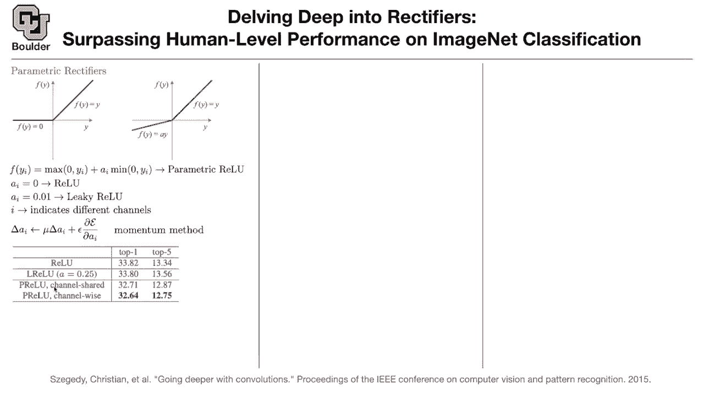
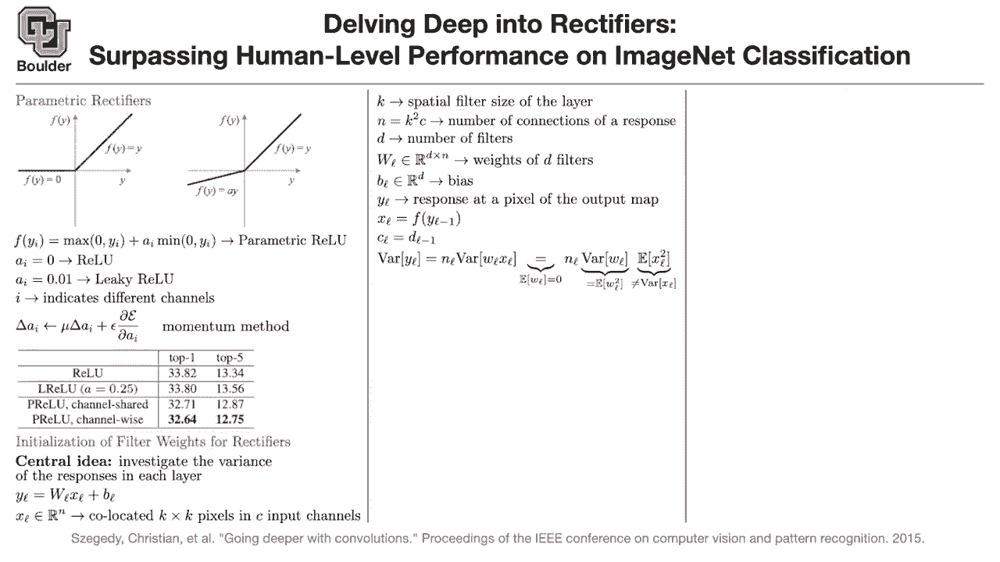
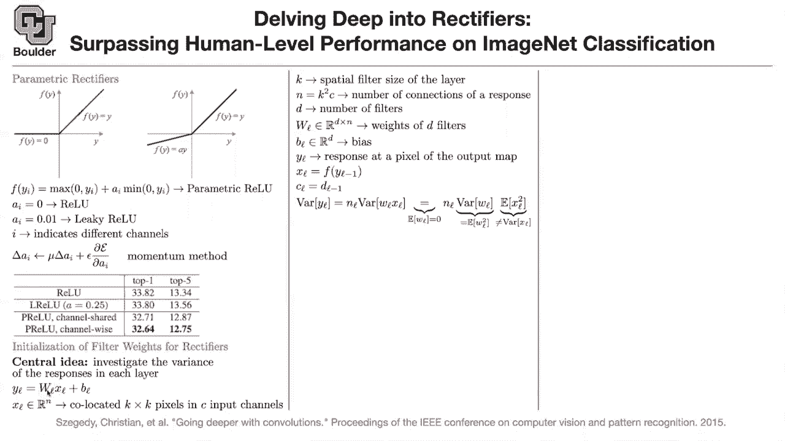
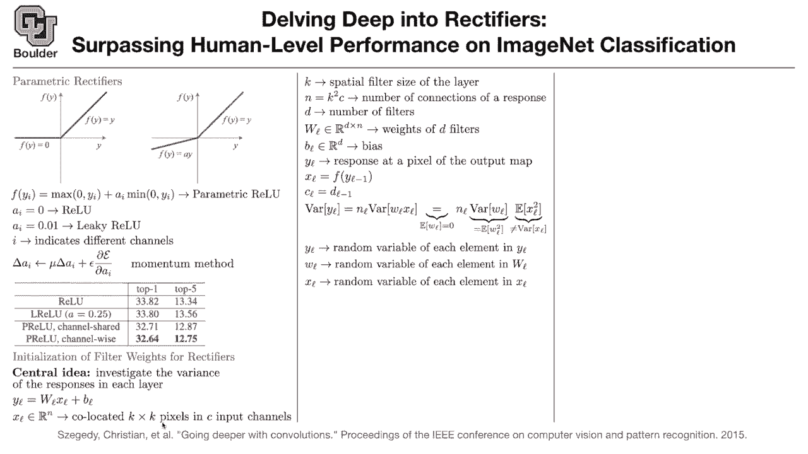

# 【双语字幕+资料下载】科罗拉多 APPLY-DL ｜ 应用深度学习-全知识点覆盖(2021最新·完整版） - P13：L6.2- Kaiming参数初始化 - ShowMeAI - BV1Dg411F71G

so this next paper assumes that you are。

going to use。

a rectifier a relu activation function，so they introduce a new activation。

function parametric value。

and this is parametric value，where a is a parameter that you're going。

and if you write it in a functional form，this is what you get。

this is the maximum of zero and y i。

ai you can learn it and that's called。

parametric value。

if it's a constant usually。

a small constant that's going to be，called leaky value if it's a constant。

and you are not training it。

and here i is different channels。

so per each channel you can have a，different ai。

how do you train it because these have，to be trained。

you take the gradient of your loss，function with respect to this parameter，and use momentum method。

to train this so what happens。

reduces your top five。

from 13。34。

to 12。75 when you are doing it channel，wise and you're。

training it channel wise，if you have a single a for all of your。

channels，this is the top five that you get now。

for leaky value with this particular，parameter。

that's what you get you have a better，top one but a worse。

and this paper is about this type of。

activation functions，so the initialization of your rates and。

biases depends on the activation。

so what should we take into。

a good indicator is gonna be the。

of the response in each layer。

that's the central idea of this paper。

basically if this is your xl。

l is your layer l could be。

all of your image not all of your image。

that particular，window of the image that you're sliding。

over your，this。

so what is going to be the size of this。

it's gonna have k by k pixels。

and then it's gonna have c channels。

and then n is going to be k。

and the rest of it is just matrix。

multiplication。

is that clear this is another way of。

k is your filter size and n is the，number of connections，of a response so it's basically k。

squared。

so you have this image let's say this，screen is our image。

we take a particular window，that is k by k of the image。

and each pixel we know it's c，dimensional it can have red green blue，or if you are。

in one of your layers it could be。

so you are taking a cube here，and putting everything inside one vector。

xl。

that are of the same size and you're。

just multiplying that particular window。

by that kernel that you have，and that's going to be the inner product。

of two vectors，now you have multiple inner products。

therefore it's just a matrix product，so this is the number of filters the。

and your wl。

is d by n now。

and yl is going to be the response at。

the pixel，of the output map so what did we just do。

we want to know what is the value of，this pixel。

in the output map and each pixel is，going to be a vector。

so what you do is just multiply。

this weight which is d by n by a vector，that's n by，one and that's going to give you a。

vector that's in rd，so this guy is in rd and bias is in rd。

that's going to give you the value of。

so please ask questions if it's not。

clear so when you're breaking，when you're breaking your like window。

down you just stack it sort of，by columns or by rows or some sort of，predetermined。

yes but it doesn't really matter yes，because in the end，you're going to compute the inner。

product and the inner product has a，summation。

okay so the order doesn't matter as long，as you're consistent。

it doesn't matter whether it's robust，column wiser。

but the idea is that you get a window。

by c and then you。

flatten the flatten it out。

in the end you're gonna get a single。

but then we know what its size is is k，squared by c。

so i want this to be as clear as，possible。

if you have any questions i want all of。

this is a nice way to think about，convolutions。

it's nothing but a vector。

what，slides over the entire window to give，you your spatial。

like representation so yl。

being outputted from your convolution，so the input to the convolution is x the。

the input to the convolution is x the。

output of convolution is y，and it's just one of the pixels in the。

output，which is going to be d dimension the，dimensions of y。

are then the dimensions of the number of，channels in your next input。

exactly ah right exactly and d，is basically the number of filters that，you have。

yes okay so you have every。

matrix vector multiplication。

is just d。

so sorry you said while becomes one by d。

so how are these layers related to each。

other this is very important，the outputs of the previous layer。

is going to go through a non-linearity，and that's going to give you the input。

to this layer，is that correct this is value。

so the output of the previous layer。

is going to go through a non-linearity，and that's going to give you。

the current input to your neural network。

same thing happens for yl it goes，through a non-linearity，and then it's become it's going to。

is that clear and how are the dimensions，related。

the number of output channels from the，previous layer。

is equal to the number of input channels。

now for this layer，so these are just a bunch of identities。

cl is equal to dl minus 1。xl is a non-linearity applied to yl。

minus 1。so i'm going to ask a question is it，clear and then i need you to write。

yes or no or answer yes or no。

is everything clear yep。

okay perfect i don't want you to get。

so what are we gonna do now as i said we，are going to take a look at the variance，of the response。

basically variance of yl what happens to。

you are doing matrix vector，multiplication。

over n basically of the size n，it means that you are going to have an l。

and the variance of the bias is just，that's what you assume and then you。

assume bl is independent from wl。

times x these are the assumptions that，you make，so you're going to have a summation of。

similar things，and that's why you get n l times。

variance of w，alexa and wl is just。

uh one of the rows of this big wl，capital wl okay perfect。

how do we make the assumption that the，weights are。

that's an assumption that you make，because。

this is under your control because what，is the final aim you want to initialize。

these weights so we are gonna initialize，it with a random number。

that has mean zero that's a great，question。

but then it's under your control，so you have full control over the mean。

of your，weights and it's a good assumption you。

have a normal with mean zero and some。

variance，and you sample from that to initialize，your rates。

so that assumption you make and this is，just an identity。

so i want you to this is an exercise the，variance of two random variables。

is equal to that。

and if you just google variance of the，product of two random variables this is。

gonna，show up as one of the formulas。

so what is the what is the spectra of，that matrix。

look like we are going to take a look at，that。

just，inner products and then you're just。

multiplying things，okay this is a particular entry of this。

which is going to be a random variable。

okay so what happens，the mean of these wls the entries of。

your，filters we assumed it to be zero。

value。

this is not true the。

second moment of xl is not equal to the，variance of xl。

because you are using this relu，non-linearities。

so this is your xl and there is no，guarantee that it has a mean zero。

it's coming out of a non-linearity，if it had mean zero this would be true。

this would be equality，but now it's inequality because。

zero。

so what are we doing what is yl it's a，random element of yl。

wl is a random element of this matrix，and xl is a random variable representing。

your inputs，so this is to explain the notation up。

i think i'm going to stop here we are，one minute over time。

if there are any questions please feel，free to ask，and for those of you who want to leave。

our is there anything um，i guess there's always square um filters。

has there ever been like non-square，filters so you have like a k by。

some other value。

you could but the convention is they，usually assume they are equal。

but that's perfectly fine，you can have different filter sizes。

because if you think about it things are，symmetric。

left or，right so if you rotate a。

an image whatever that's inside that。

image which could be a dark is it still，a dock。

okay so things are symmetric，around your pixel that's why they。

usually assume。

any other questions i had a quick，question about。

uh dropout so from a couple lectures ago，um and specifically so。

the sort of like last step。

um in dropout is after you've，trained you uh。

you update your weights by multiplying，by that like probability whatever drop。

dropout probability you had。

um and my question was just in most。

software for building neural networks is。

that just implicitly done，during training that at the last sort of。

step of training，they'll update the weights one last time，or is that an。

action that is usually carried out，every time when you're doing an。

inference。

for you mean there is a discrepancy，between training and，because。

we talked about for dropout that after。

you've that your weights for testing，weights。

like the average。

yes and i was just curious if that's a，like during training in most software's。

did they do that step for you no，so now during training things are fine。

because you just multiply by。

a random vector that's bernoulli，and then it's going to kill some of your。

outputs some of them，okay that's during training but during。

you have to shrink your weights，basically by the probability of those。

guys being absent or present。

and will that be done every time in an，inference，like each time in france what happens is。

that，you already have your rates and biases。

trained the rates of your neural network。

and then you can just give it to，somebody else，but yeah as you give it to somebody else。

you have to tell them what is your peak，the capability of dropping a neural，network okay so that。

there is，you can do it the same way that you did。

it okay。

