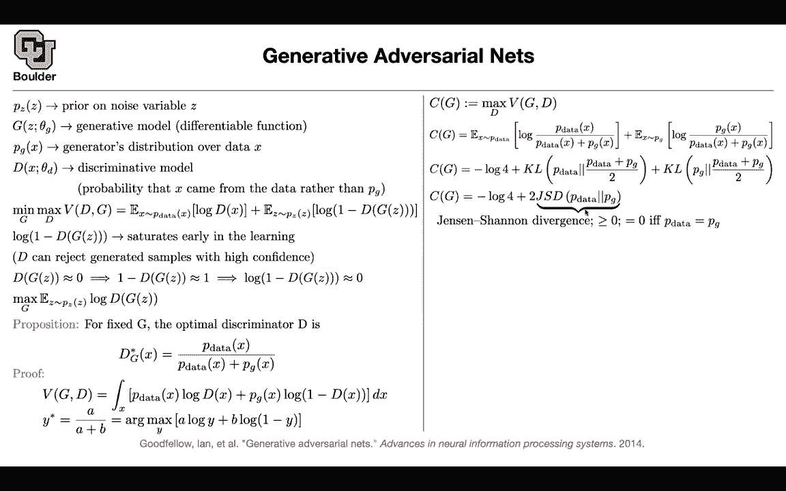

# P140：L65.3- Vaes Versus GANs - ShowMeAI - BV1Dg411F71G

I had a question in regards to， I guess it's a more general question。

 I'm having a hard time understanding the the probability aspect of these models。

 I guess starting from。which we did last time with the variational or encoders and then moving to GNS so I think we were talking about how the distribution of the data needs to be normal and I'm trying to understand what does it actually mean and why does it matter do we mean that the classes are normally distributed or the pixels in each image？

No， so there is a difference between variational auto encoders and Gs and what are they for variational lot encoders you still have a likelihood so you are working with a likelihood but then the problem was computing that likelihood is not easy it's not tractable because of these neural networks being nonlinear functions it's not easy to integrate amount okay by indicating we are basically trying to explore all the possible weights that will give the best likelihood no so you are changing the input to your network so youre putting youre putting a distribution on the input to a neural network so Z we also have it we had it in the previous slide you had a hidden or unobserved unobserved state that was Z that's a vector a lowdial vector you are putting a distribution on that in both cases for variational autoenrs and。

For Gs you are putting a distribution on your hidden state What does it mean putting a distribution on doing like pixel distribution No。

 there is no pixels at that layer sometimes it's just a distribution it's just it's just a vector maybe it's a 100 dimensional vector okay okay so you have a 100 dimensional vector you're putting a distribution on it and that's a simple distribution it's normal with mean zero and identity okay okay and both of them both Gs and variational auto encodederrs are going to take that distribution and push it through a non nonlinear function which is a run network。

The first framework variational auto encoder is trying to integrate out Z。

 you don't care about Z okay you care about your likelihood in the end because you're going to do maximum likelihood okay and when we say likelihood do we what are we looking for again we have these vector that is normal distributed like hard dimensional likelihood of what like it's the likelihood of your images basically there is a distribution there is an underlying distribution that only nature knows okay and the data that are being generated by the nature these are the real data there is a real distribution we don't know that we don't know the distribution are just we just see samples from that distribution what you want to do is you want to write a model that makes those images more likely and how do you make it more likely by tuning your parameters and do we compare？

to the that normally distributed hard dimensional vectors giving an image No those normal distributed distribution。

 it's an assumption that you made that's your prior assumption and you want to get rid of that you want to integrate it out。

And time to think it So X is a data which has some distribution by nature and then see you have a data this data set is being sampled from some real distribution okay that only nature knows we don't know about it okay we just see samples and we are seeing an examples and these are your examples maybe your examples are the Ms data there digits these are now we are in the space of pixels X is is an image okay each one of these is an image but then the problem is you don't want to work with a space of images because this is too high dimensional okay it is better to work in a lower dimensional space maybe in the space of some Z this is just unober and we are seeking help from it this is just there to help us okay okay this has no meaning this has no real meaning this is not images this is。

A vector in maybe dimension 100。And then you're putting a distribution on that and you're putting a simple distribution on it。

 you're making some assumptions that if I generate samples from this distribution。

 I want it to be a simple distribution so that I can generate samples from it okay so maybe you put a normal distribution here and you know how to sample from normal it's easy okay but then the idea is if I know Z I can push it through a neural network a deconvolution neural network and give me images okay that I know how to do and we just ci we just saw an example you took Z and we pushed it through a neural network and that gave us some images and these are parameterss initially if you generate from this likelihood from this distribution they are going to be very bad okay because these parameters are really bad so you're going to generate some very bad looking images。

The idea is in the end you want to maximize your likelihood。

 you want to maximize your likelihood actually it's a marginal likelihood and I'm going to tell you why it is marginal it is marginal because you're marginalizing the distribution that you put on Z out Okay so you're integrating it out so you're getting rid of that so you need to get rid of that and then that's going to give you a likelihood as soon as you have a likelihood because it is parameterized you can try to tweak the parameters of your model such that it is fitting the distribution of your data so that it makes your data look more likely according to this model Okay so by likely I mean if you take an image and put it here it has a high probability okay of happening so you want to make these images more probable more likely initially they are not going to be likely because the parameters are really bad。

But as you keep changing it。Your model is fitting the data， okay？And as soon as you fit the data。

 you're done， why， because these parameters are going to be in a good location。

And now you can generate samples from it， you take a sample from this simple distribution in our 100。

 you generate a vector， you take that， you push it through your decoder and that's going to give you an image and these are the images that are going to come out of it but what is the problem This is intractable so that's why you need to do some math the posterior is intractable and you're going to approximate the posterior using a variational distribution and that's going to be your variational distribution in the end rather than maximizing the likelihood you're going maximize the lower bound of your likelihood Okay so this is just mechanics the wall function Yes。

 so that's going to give you your objective function。

And then the rest of it is just technical you just want to generate samples and write down your objective function Okay so it's just manipulating the objective function to be easier to solve yes and actually doing Monte Carlo estimate because this is an integral you cannot work with the integrals but you can work with samples you do Monte Carlo estimate okay and then you can play around with your Z damage okay that's variational distributions you still have this likelihood framework you want to make your your data look more likely you want to make them have a higher probability of happening and when we compare the image like the produced image to the actual images what do we use to use cross entropy no that's exactly why you have to go through this pain actually cross entropy for classification is also a likelihood so this maximum。

Include framework。Most of statistics is just maximum likelihood and cross entropy is a special class of maximizing the likelihood。

Okay。But then people came along and said， do you really need to do maximum likelihood estimation can you solve this problem without likelihood and the idea was that you are really good at discriminating for neural networks you're really good at discriminating okay。

 you're really good at classification problems， can you turn your generative process to a classification process。

And the idea is very similar to before up until this point you have a simple distribution on some vector space These are 100 dimensional and then you are going to put an nonlinear function that take z and it's going generate images okay if I give you Z you push it through your neural network you're going give me G you're going to give me X sorry you take a vector you push it through your neural network that's going to give you an image this could be simple but the distribution that comes out of G could be very complicated am I right because this G is a nonlinear function and we want to train this we want to train the parameters of this generative process is neural network somehow and you don't want to use your likelihood you don't want to do you don't want to do variational inference because it is intractable this an approximation etc。

So the idea here was very simple okay you give me an image it is fake coming out of the generator and you're giving me some images that are generated from the real data distribution okay some images are fake some images are real so let's go ahead and use our discriminator to discriminate between the two okay so you're going have a discriminator saying this is a real image that's a fake image this is a real image that's a fake image and then they are going to try to compete with each other okay one is generating images to make your discriminator make mistakes and the other one is trying to discriminate between fake and real images that's the simple idea but there is actually math behind it once you write down the math and do some proofs etc you're going to end up with a divergence you are going to end up with a distance between two distributions the data distribution and the generator distribution so there is actually math。

s going on here it's not a game anymore it's not a mean max problem it's actually trying to make your generated distribution look like data distribution you want to minimize the distance between the two and that's a measure of the distance is the what's the reason we're not using KL a diveence or using genen which is a special case of a different variation of that actually that's the place where a lot of contributions are happening in the literature。

So you can play around with your last function it doesn't have to be this。

 but if you choose this that's going to give you your gens and divergence you can have different divergences here。

 you can have different distances okay so GNs is a different paradigm from maximum likelihood for maximum likelihood you are maximizing your likelihood as the name suggests for GNs you are minimizing the distance between the data distribution and the generated distribution aren we measuring the distance between the the Z initially and the well I guess we are measuring the distance between the images in or encodecor so so think of Z as something that is there to help you okay。

Yes， you don't want to work with images you don't want to work in the space of images because first of all that's in the space of pixels and the second of all it's high dimensional so how do we generate an image once we we train the model and we have a Z that gives us the likelihood do we take a word and move it to Z or no the way that you generate you know how to generate samples from Z okay you can generate easily from a normal distribution okay you can generate samples and you take those samples and you push them through your G and that's going to give you images Basically what's going to happen is what we just did here you generate Z this is simple to generate once you generate it given that the parameters of your neural network are already trained if you take Z push it through your neural network that's going to give you an image so how do you have any control over what you generate？

So so for example， if we wanted to。In this example when we had those three nine images of the people with glasses people without glasses oh so I guess we converted them。

 I guess we convolveed them to Z and then sent them back Yes exactly so that was one of the questions that's one of your friends asked let's say this is Z1 Z to Z3 you average them out that's going to give you a single Z you take that Z you push it through your generator and that's going to give you this image can think of your generator as the decoder。

Interesting， makes so much more sense now。And what is the difference again between the likelihood that we're using in GNs and autoencodeds you saying you said that in GNs we are measuring the distance between the I forgot yeah so that's for training for training you have two options so both of the frameworks are going to do this there is going to be a generative process like this okay both autoencodeders and GNs both GNs and variation autoinders yes okay a vector goes in and you're going to get an image out that's the generative process perfect but then the problem is the parameters of these neural networks they are not trained initially these convolution operations they have parameters am I right。

They're in the wrong location they're going to give you very bad images they're going to give you noise you have to train it you have two options to train it either write down the last function。

 either write down a likelihood function and the likelihood you can do maximum likelihood that's going to give you variational timer or you can compare the distance between the generated distribution and the real distribution basically compare real and fake Okay that makes sense do you take into account the。

The classifier so the class I know we have the classifier againsts that' supposed to detect if it's real or fake so where does that come into play that's for training so the classifier is just for helping you to visitorsors of your generator that makes sense yeah that makes a lot of sense Okay the discriminator is just there to discriminate between real and fake that's the job of the discriminator。

Oh that's a generated image Oh that's an image image that's a real image Yeah that makes a lot of sense so the classifier is just there to help the discriminator get the parameters right or the generator sorry yes so the discriminator is just to train the generator once the training is yeah that' that's brilliant so once the training is done then it' came over you generate samples in the Z push them through your deconvolution and that's gonna to give you images cool so yeah it's a good whenever you're doing deep learning okay ask yourself these four questions what is my data are they in the form of images are they in the form of text are they speech what are they what are my data are they labeled are they not labeled and that's why I ask you guys to do data exploration okay it's gonna to help you know what problem you're solving so ask some questions from the data。

Then say what type of model you want to write down for instance here you wrote this model down the generator Okay。

 then the next question is how are you gonna train these parameters what should be my loss function what should be my how do people actually guide loss function it feels really magical to me that they choose the right I guess the negative minus plus I don't know how to explain it but it just feels really magical how do people actually come up with those things No it's not magical I mean for the loss function you need to know your statistics a little bit and most of the time it's likelihood except for gas which is not the likelihood I see I'm wondering。

I haven't saw that， but I'm wondering， do people use GNs with natural language processing as well？

To take I guess a vector of words convert them to Z or I guess similar to Gs as what we just did to generate text for text things are much easier because for text。

 what is happening is that you have those1 hot vectors in the output again you want to predict an next word for instance。

And for that a good distribution is the distribution that is coming out of your softm so basically for text。

 you know your likelihood okay， because we have sentence because it's easy because because it's discrete what comes out of a language model is discrete they are words and you can count them it's a you have a you have these many words in your dictionary okay。

 so that discrete for images， if you want to generate them they are not discrete theyre continuous okay each pixel can have values from zero to one from0 to 255 etc so this is a continuous distribution text is discrete images are continuous Yeah in sense Yeah cool Thanks everything is much more clear awesome okay day yeah。

 see you next time。