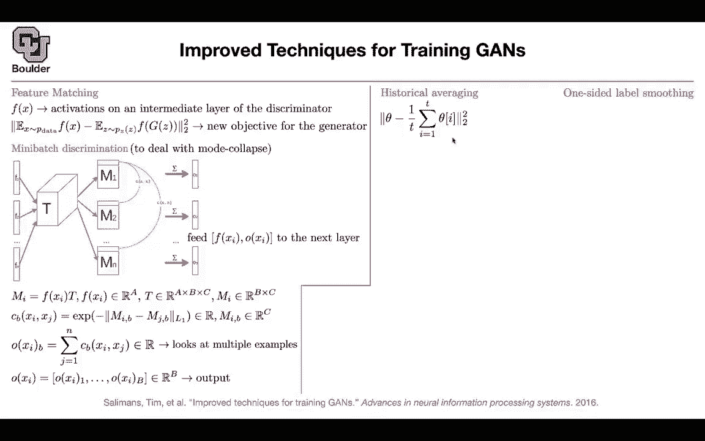
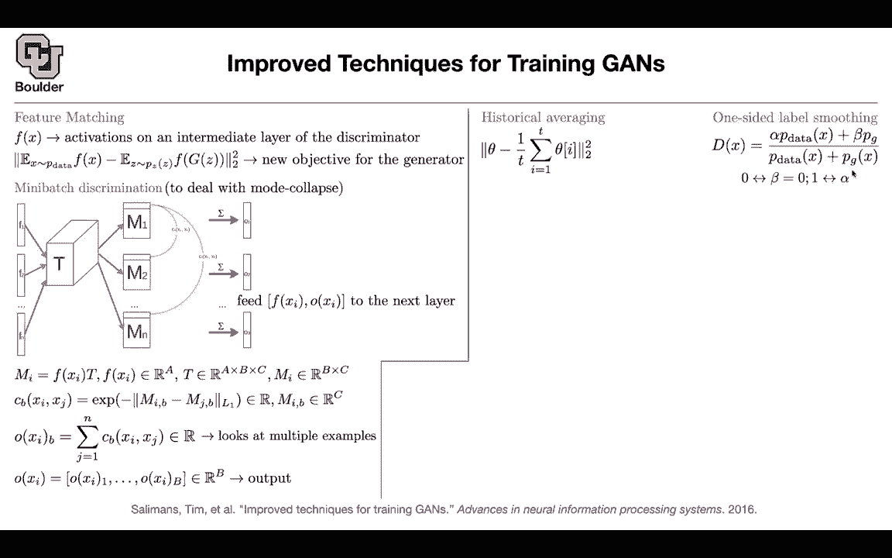
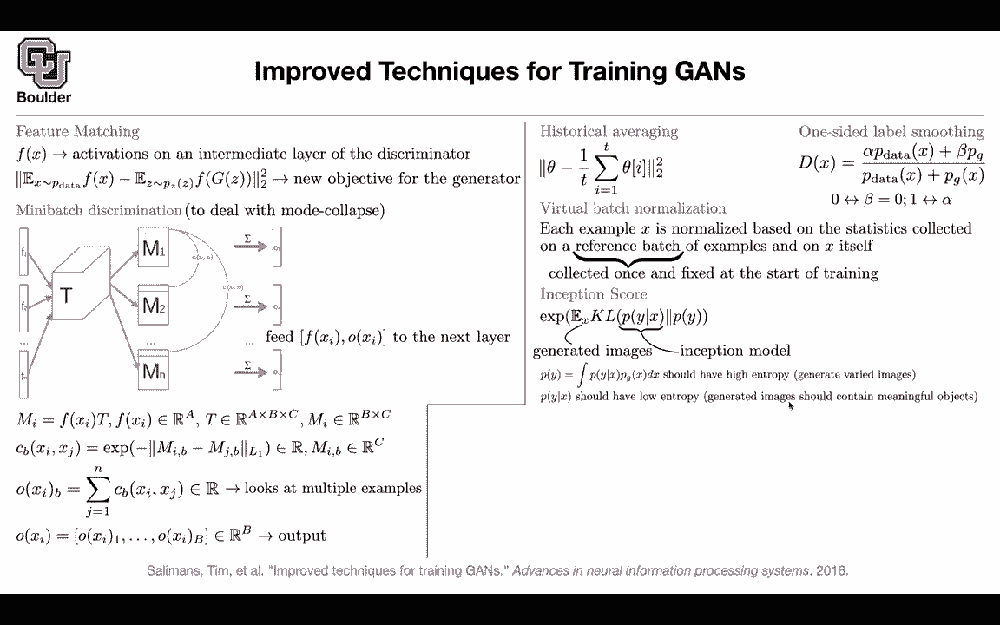

# 【双语字幕+资料下载】科罗拉多 APPLY-DL ｜ 应用深度学习-全知识点覆盖(2021最新·完整版） - P141：L66.1- Inception Score - ShowMeAI - BV1Dg411F71G

Let's get us started Last session we covered this paper we learned about fractionally astred convolution and the fact that there are not anything new。

 we were doing it， these are just when you are doing back propagation when you are back propagating your loss you are doing fractionally asstred convolutions but now you're going to use the same technology to increase the resolution what you're doing is these are generated images and for each generated image you know the corresponding Z so you're have a data set of generated images。

 you know what z is， you know what the image， now you're gonna to take a look at all of the images that have eyeglasses and then you're going to add up the Zs or do an average on disease you take that Z you push it through your theconvolutional neural network and then that's going to give you an average image of a face of a man with glasses。

Same thing for the other images you look in your data set of generated images of men without glasses you took there。

 you take their zs， you average them out， you push them through your generator to give you the average face of a man without a glass now you can do operations on their average Zs your subtract and then add a woman and then you're going to get faces with faces of women with glasses Okay is that clear。

That's where Okay perfect then we started this paper and this paper is a bunch of techniques that you're gonna to need to make your generative advers on neural run networks converge because it's very hard to train them it's not like a classifier there is a lot of hyperparameter that you need to tune the first one that we learn about was feature matching so rather than having your discriminator classifying between fake and real you can actually look at the features so you cut your you cut the head of your discriminator and these are the features of your discriminator this could be a layer that you pick or multiple layers that you pick this is feature matching there is a big problem with Gs and that is mod collapse if you have bymod distribution for your real images and once you sit behind your computer and you train these you are gonna to see that youre converging to only one of the modes and people don't really know。

Why that is happening maybe the problem is with with the loss function。

 maybe the problem is with the structure of your neural network but this phenomena exists。

 you' are going to pick only one of the mode and we're going to see examples of that throughout multiple papers trying to deal with that phenomena so one of them was this method rather than treating each image independently you're going to tell them to look at their neighbors in a mini batch that is being inputted to your network F1 F2 fN or independent but once you push them through this structure where t is your parameters it's a tensor you' are going to end up with O1 or to up until ON that are dependent they talk to each other they see each other they know how related they are to each other and this math we went through unless you have a question I can skip it you have any questions about this and then when you go from one layer to the next not only you look at the inV。

featuresature of your images in your batch you' are gonna to look at the features that are talking to each other in that mini batch of data okay another trick is that these parameters of your neural network are going oscillate a lot and you can get rid of those oscillations by treating them as time series and then doing a moving average on them you cannot keep the entire history but you can keep a moving average of these in the end it's the same thing so your parameters are going to be the moving average of your parameters from one iteration to the next iteration of your optimization the other trick is one sided label smoothing label is smoothing is for you to make your discriminator a little bit stupid maybe your discriminator is too smart and then initially during training or somehow in the middle of the training it's very easy for it to distinguish between real and fake。

And we know that if it is really easy for it， the derivatives of this guy are going to become zero and the generated images。

 the generator is actually inside the discriminator so if the gradient of gradient of d become zero then there is no learning happening for the generator so you want to make your d little stupid you do label is smoothing and label smoothing is that you associate rather than associating a one to your true data and a 0 for the class or the label of the generated data you're going to associate 0。

9 to the true data real data and another number to the fake data that is label smoothing。

But then there is a problem if beta is nonze and if you're generator because you're training that its distribution is not equal to the real data。

 you are getting pulled your discriminator is getting pushed towards the wrong predictions that's why you're going to make it one sided you said B to be zero and then you can play around with alpha it doesn't have to be one it can be 0。

9 and another trick is maybe the problem is because of batch normalization maybe batch normalization we learn that it's going to help but maybe because the statistics are going to change per each batch。

 per each mini batch the mean and standard deviation maybe that is causing your neural networks to not converge properly so what is the idea you're going to put aside a reference batch of examples。

 you collect them once and we fix them throughout the training and you compute your statistics。

Based on this reference patch by adding the current example that you're looking at so the current example that you're looking at in addition to your reference patch is going give you your mean and standard deviation that you need to do your batch normalization per each layer of your neural networks but the most important contribution of this paper is this inception score so generating images is a creative task So your neural network is generating images unlike classification that you know that you can look at your accuracy to evaluate your the quality of your method here everything before this paper was qualitative somebody would write a paper and say these images look real to me and they would probably show them to a bunch of human to say is this real is this fake and how real that is or the images coming out of my method more look more realistic or the images that are。

Out of another method which one do you prefer and a human would rate them and then that would be their score and this paper came along and said we are really good at discriminating let's begin network trained on imagenet and that network is fixed so you trained it on image it and now you're gonna use it and that model is a model from Google it inception and it doesn't have to be inception it could be any neural network that is good at discriminating between images now rather than looking at images you're gonna look at the labels associated by this model to those images youre going to generate fake images you push them through a neural network that is that is already trained and that's going to give you labels okay perfect what do you want out of those labels if you keep generating images and you push them through your classifier and you average out those images that you generated it you're gonna to end up with a probability distribution on the classes。

On the labels you want that to be varied， you want all of the classes to be covered。

 you want to have a lot of cats， a lot of dogs， you want to have a lot of airplanes you want to have a lot of tigers etc different breeds of dogs etc so you want your generated images to have varied labels it means that you want these distribution to have a high entropy。

 What else if you generate images， you want your images to be meaningful if you are generating dogs you want them to have a meaning of a dog if you're generating cats you want them to mean like a cat it means that you want these distribution to have a low entropy and as you add these two objectives together that's gonna to give you a score and then you need to average out they generated images so this is an integral over the kl divergence so it's not the kl divergence of the integral so the order matters but then these numbers are going to be very small。

You exponatiate them to make them bigger now you can compare them so any questions so far okay perfect so this is where we stopped last session let's do an application of of GANs another application of GNs we learn that you can use GANs for feature engineering can you actually seek help from a generative adversarial neural network to give you more information what do I mean let's say you have a data that is small and that is labeled but then you have a larger data set that is unlabeled so you don't have any labeled data for that can you use that information somehow to make your model smarter and that is the task of semisupervised so some part of your data is labeled a bigger portion of your data is unlabeled and you want to use that information you want to use all of your data efficiently how can you use GANs first of all you might have K classes maybe an image goes in。

AndThen you're going to end up with K logics so these are before the softmax you can put all of the unlabeled data to the bucket of K plus one so you have k classes already you're going add another class and that's the class of unlabeled data K perfect now you have K plus one classes what object what objective function are we going to write we are going to sample data from the real distribution some of them are labeled some of them have a y and some of them don't and you want to increase the probability of your model so you're putting a neural network here and this is going to give you your log likelihood you are maximizing your likelihood or minimizing in negative of the log of your likelihood This is what you do for classification all the time you're classifying between K plus one classes and remember the ones that don't have a label they belong to class K plus1 and then you also have a generator。

Anything that the generator generates is gonna to end up in the unlabeled bucket。

 Okay this is where the generator is coming in。 now we're gonna take that objective and divide it into a supervised part and an unsupervised part What is a supervised part all of the data where their label is less than k plus one it means that they are labeled data so these are the data that belong to either plus one or class K these are gonna to be the supervised part of your loss and the rest of them you're gonna to put here。

 this part you know this is from your generator this is exactly what you have up there and then because this is your P model。

 whatever that is not generated has to be real so it's gonna to be one minus P of your model and these are all of the data that are unlabeled this is the unsupervised part you don't have any labeled than these and then you have your supervised okay so far so good but we know that。

For GNs to be able to be trained for this neural network here G。

 you need to have a discriminator So what is your discriminator now so you're gonna to set your discriminator that's a probability between real and fake to be1 minus P model and then the rest of them to be1 minus whatever that you have here okay so what is the whatever are we trying to do our model that we are writing should be able to classify real images and put them in the correct class and you have k classes so that's one task that your model should be able to do and another task is that you should be able to distinguish between real and fake and remember this D is just equal to1 minus P model so D has the same parameters as P model so how do we set this you can set the label or the logicit。

For the last class to be zero， you don't have to， but if you set it to be zero。

 then it's going be much easier to explain stuff you have10 d of x is going to be Zx over zx plus1 this is your d of x and it's coming out of your model and remember where you are putting a neural network is here you have a neural network that takes you from the space of images to the space of logicits so it takes an image an input and it's going to out with a vector K dimensional and then if you are doing classification what are youre doing for each of these classes for class1 you have exponential of L1 divided by this Z of x。

 then you have exponential of L2 divided by this d of x etc so these are for your P model your D is going to be Zx divided by zx plus1 and the rest of your data is going to be1 minus d ofx which is。

1Divided by z x plus one and if you set the logicit of the last class the K plus one class to be0 exponential of0 is one and that's where this one is coming from Okay is everything clear so intuitively you want your p model it is basically coming out of these z to be able to distinguish between real and fake and at the same time be able to classify real data so it has two objectives one of them is to make the distinction between real and fake and the other one is to classify is everything clear so generally when we have classifiers we don't care about the absolute sizeizable logics just as long as one of them is bigger than the other then in this case it matters now that if the absolute sizeizable logics is small than that's probably the fake image and why do you say that because this this z of x would be small in that case but Z of x is the a。

Of all of the probabilities， all of the exponentials of the logics。

 so this actually might get big okay the only thing the only thing that we did was that we fixed the logic of the last class K plus one class。

 which is the bucket of unlabeled data。Am I answering a question or so then I guess the way the way that it'll make predictions that is？

Fake as if all the logicts are smaller than zero， if all of the logicts are smaller than zero then or much smaller than zero then than。

The fake bucket， the K+ one bucket would outweigh them Yes。

 okay that's correct Okay that makes sense Thank you And then the thing is how are you going train the generator the generator is being trained based on your discriminator okay and you can see that this probability is adding to one it's actually a probability the discriminator is what we have been doing before you generate a fake image and you show it to this particular discriminator that you have a definition for it okay and this is related to your initial classifier whatever that you start with for your label data So that's another application of generators you generate fake images you have a bunch of real images that are unlabeled and you ask your model to discriminate between the two in addition to classifying whatever that it has a class for and everything is going translate into the parameters of the model being smartly chosen okay so this is your last function。

If this is clear， let's move on to the next， so that was another application of Gs。

