# P142：L66.2- InfoGAN - ShowMeAI - BV1Dg411F71G

If you remember in the space of Z in the latent space you could do arithmetics like add and subtract etc。

 you could take one image， take another image look at their corresponding z's do an interpolation in other space and make somebody who is angry to be happy okay by interpoolating between the z's of those two images but the problem is if you pick a dimension in your z let's say z' is 100 dimensional and you pick the1 dimension the the tenth element and you change that you want to associate meaning to that entry of your latent vector you want to now associate meanings previously they didn't have any meaning only when you are interpoolating you would see some meaning okay now you want every element or every dimension of your latent space to have a meaning what do I mean let's say you have a categorical variable C1 so these are your latent variables。

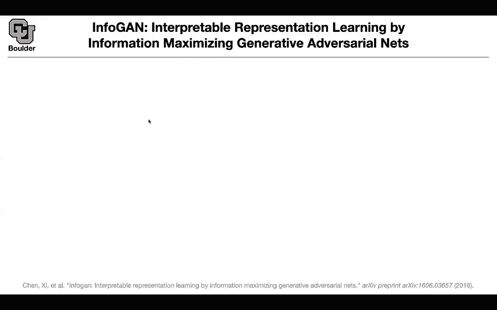

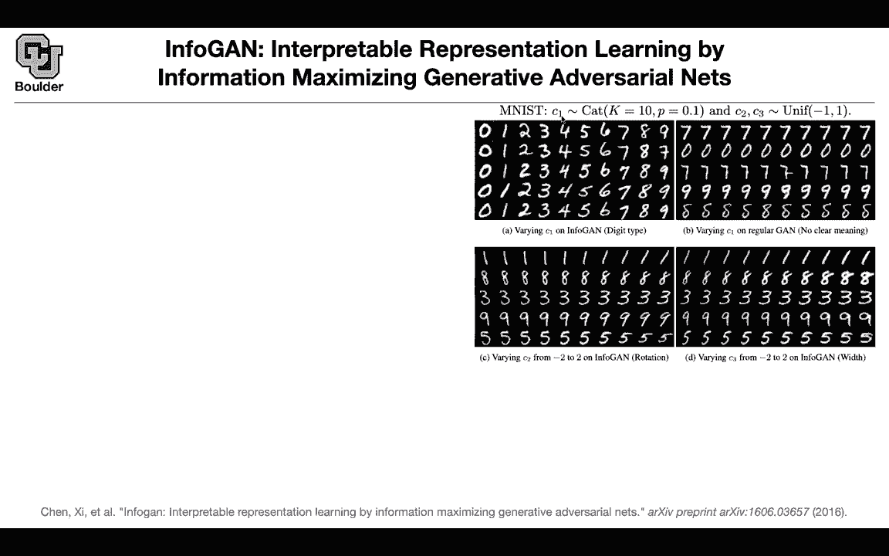

You have a categorical variable which is simply a uniform distribution it is uniformly distributed between 10 numbers from0 to 9 this is c1 and you have to uniform from negative one to1 and now you want these to have meanings what do I mean by meaning if you change C1 if you generate a sample from it and you push it through your neural network you want it to generate different numbers01 to so this is different from conditionalgans so please don't confuse abitta and now you are trying to associate meaning to these latent variables and the method that this paper is advocating it's called info ga if you use that and you keep generating samples from c1 you're going to see different numbers and these are just being sorted by the authors so don't worry about the sorting but as you keep generating samples you're going to see different numbers012345 so now C1 has a meaning associated to it。

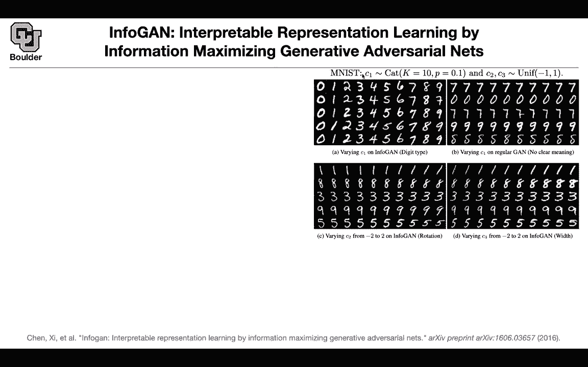

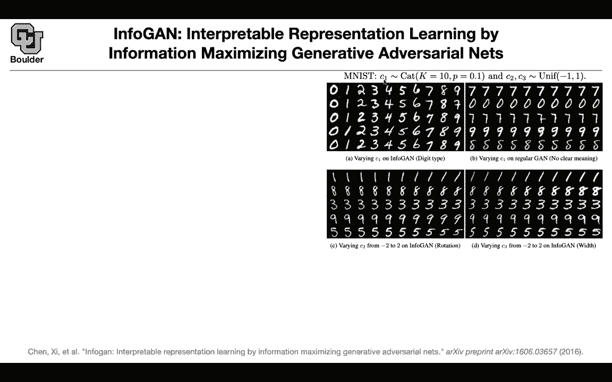

If you do the same thing on a regular ga you're not going to have any clear meaning。

 sometimes it's  seven， sometimes it's zero， etc， so the behavior is random if you look at C2 and you keep varying it from negative2 to2 so you're going beyond the boundaries of the uniform but that's a minor detail you can see that C2 is corresponding to the rotation of the digits if you vary C3 you can see that it corresponds to the width of your handwriting so it becomes wider but how do you do that how do you associate meaning to latent variables and this is what is called disentangled representation so each element or each dimension of your hidden variable is going to have a meaning it's going to have a meaning associated to it it's going to have semantics and these are disentangled so you don't have to look at a linear combination of your。

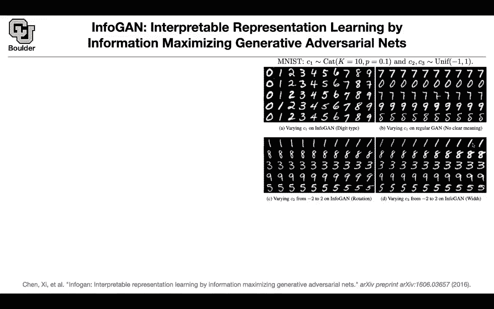

Lant space like what we were doing before with interpolation between two zs two vectors you can for instance change the disentangle the writing style from the digit shape you canangle disentangle pose from lighting of 3D rendered images you can disentangle background images background digits from the street view house number so this is the data set by Google you can explore it and these are images that are taken from house numbers and these are colored images unlike Emist and you can disentangle hair style from presence or absence of eyegla or emotions in ce a and ceb A is also a famous data for Gs or generative models and these are the faces of celebrities as the name suggests so let's take a look at regular G this is the objective。

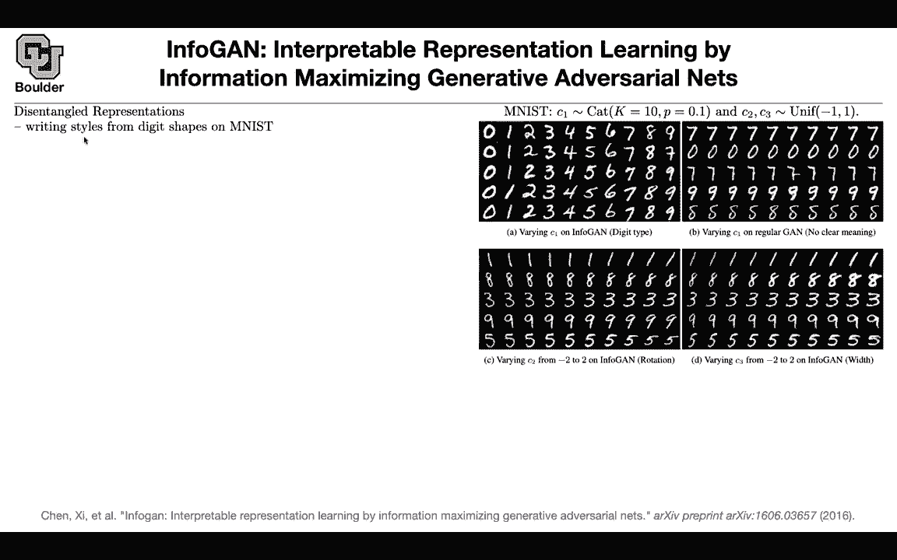

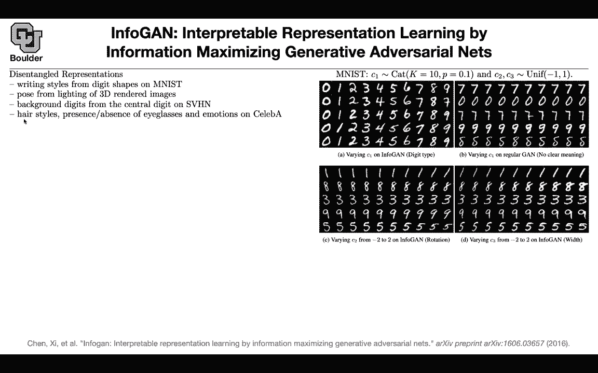

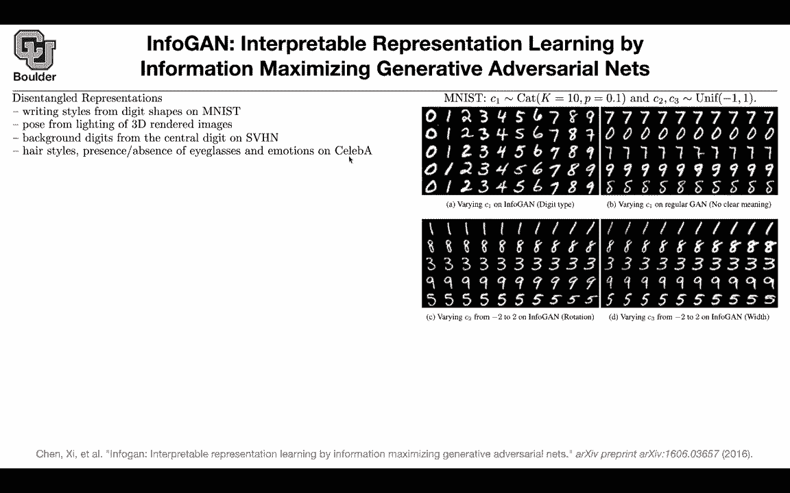

regulargular gap you have a discriminator discriminating between data and noise and noise is basically your generated images。

 If you take a noise， you push it through G， you're gonna get a generated image What is in forgan trying to do you have that objective still you have the objective of a regular G but now you want your latent variables these Cs that you just saw here C1 C to C3 if you put them in a vector you want them to have meaning it means that if you take C。

 you push it through your generator that should give you a lot of information about C so you don't want C to disappear you don't want the meaning of C to go away so you are minimizing G you're minimizing your respect to G it means that you are maximizing this I and because of this negative sign you are maximizing this I but what is that I and what is Z first Z is a source of incompressable noise so you are not gonna be able to control it so they are going be。

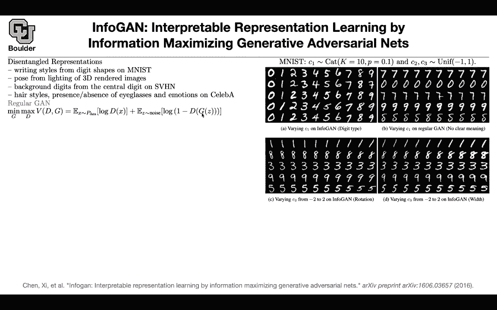

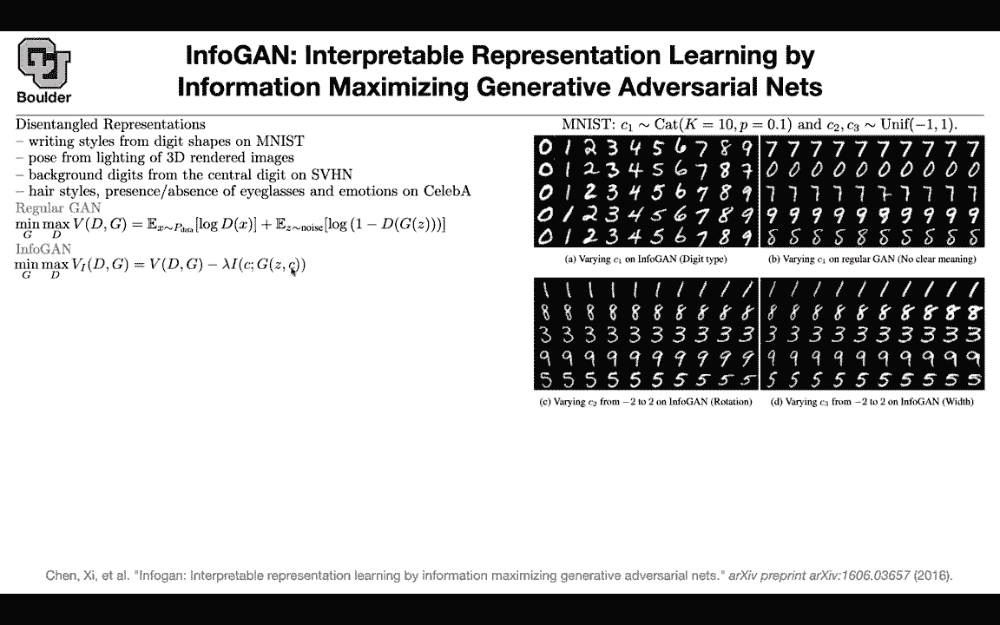

Entangled so some part of your latent space is going to be entangled and there is no way for you to associate meaning to it So this is for your model to be a little bit free and then for C's。

 you want to have this entangled meaning you want C1 to have a different meaning than C2 than C3 than C and these are your latent codes these have semantic meaning semantic features of your data and what is I this is the mutual information between two random variables this is one random variable is another random variable。

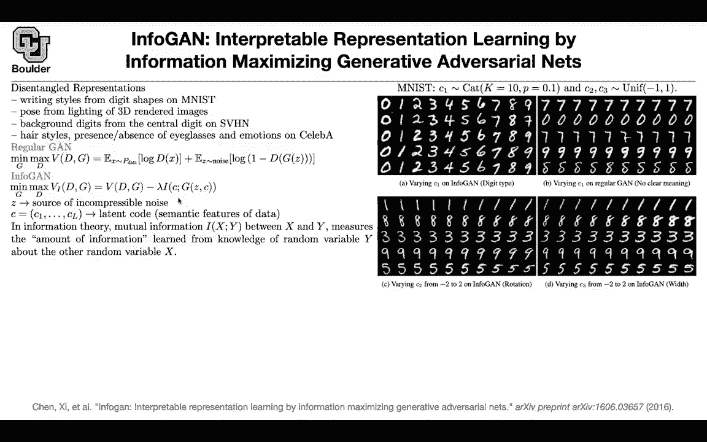

And you want the mutual information between C and G to be high What do I mean and what is the mutual information if the amount of information that you're going to learn from a random variable in this case y about the other random variable basically if y is independent from x。

 you're not going to learn anything out of knowing y if you know y it's not going to help you reduce the entropy of x okay so you want the mutual information between these two to be high。

 you don't want c to disappear the meaning of c， this is what is going to happen。

 the information or the mutual information between x and y is the entropy of x minus the entropy of x if you know y basically if y is independent from x it's not going to reduce the entropy in any fashion so this is going to be H of x H of x minus H of x is0 so the minimum information。

Mutual information is zero the minimum value for it and then it can go higher okay so you want to maximize that but there is a catch this is beautiful mathematically but there is a catch if you want to compute this guy you need to have access to the posterior because look at here your conditioning okay so you need to have access to the posterior distribution but this is not a big problem we saw it when we were doing variational autoenrs if you need to have access to a posterior distribution and your posterior is intractable just approximate it with a variational distribution so you're going to variation you are going to put a variational distribution that has the same format as your posterior it takes x as an input and it's going to give you C and this is some auxiliary distribution for you to help you approximate P okay perfect then you do some math and then you can write down the same way that you your wrote down。

lowerer bound to your log probability or log likelihood you can have a lower bound some simple arithmetic is going to give you that on the information and you remember you want to maximize I if you have a lower bound you can maximize a lower bound Now your lower bound depends on the prior distribution that you choose for C and these were the prior distributions that you were choosing we were choosing C1 to be categorical we were choosing C2 and C3 to be uniform this is an assumption that we are making okay and this is coming out of the generator you take Z this is from a normal distribution this is incomp perable noise you cancatenate it with this vector that you just sampled from your prior distribution you push them through your generator that's going to give you an image。

Once you have the image， you know key， you know Q， you parameterized it with a neuro network。

 and then you also have that entropy here of C。 Okay this is your variational lower bound now you're gonna to maximize this care perfect Now you're going replace I by this lower bound change your objective function Now not only you need to minimize with respect to G and maximize with respect to D。

 you are gonna minimize with respect to Q if you minimize with respect to Q。

 you are maximizing this lower bound and if you maximize the lower bound。

 you' are maximizing the information the mutual information care perfect。

 Now you can apply on different data sets， this is the 3D rendered images。

 you can play around with the rotation， you can play around with the width of the chair on another data set you can play around with the hair style or you are changing the hair style and you can change the emotion motion from SA to happy Now you're only changing。

One variable at a time so one entry of your C maybe you pick C5 and you're changing C5 to give you different herstys is everything clear can I ask a question Sure these C variables we choose the distribution beforehand but is it correcting thing in the network will decide which variables encode what information and then we have to go back and figure out what that was Yes so what your controlling is that you want this entangled information you want C2 and C3 to have different meanings but then you don't have any control over what meaning you are absolutely right Okay maybe suddenly if you do another round of training C2 and C3 are gonna to have the opposite behavior Okay but youre absolutely right Any other questions this Z only appears in the formulation of the problem right because we sample our C。

And then we see that into the network Yes， so you sample Z and you sample a C and you push it through your generate to give you fake images Oh so these are two separate what C specifically is a vector Yes you can think of it like Z the same thing as Z but now Z has no meaning if it is entangled the meaning between its entries but C it's a Z that has a meaning vector each entry has a meaning does that make sense well I guess my question is do you just feed C into the network right so you sample C and then you just feed C into the network because I see the Z if appearre in the formulation as well so no you sample both of them you sample a Z you sample a C you push them through your network to give you images Z is just like random noise Yes so Z is random noise C is also noise which has meaning this is meaning noise this is meaning less noise okay that makes sense。

Actually it hasn' a meaning Z also has meanings but we cannot interpret its entries Okay this reminds me a little bit of principal component analysis with images where you can then like or with any data set but is there similar decay on the amount of usefulness with in this case they did like two values for C and what if they had tried three or four or five or so on and like how how do the。

The increase in the number of C values decrease the amount of information or the amount of control that you get from each variable I think these are great questions actually what happens if you increase the size of C are you going to reduce the meaning that comes out of each element individually these are great questions and I don't think the paper is answering them okay maybe we can do a research on that but I don't know the answer but you are right maybe if you add increase the dimension of C basically increase L are you going to lose meaning or what's going to happen so no these are not studied in the paper Okay and the other critique or criticism is why are you putting a 10 here what happens if you put 11 okay these sorts of questions are important and they are not answered in the paper so the paper is brilliant this idea is brilliant but there is still room for improvement。

